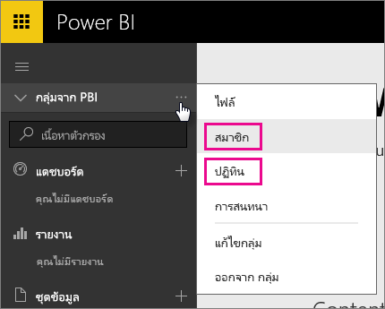
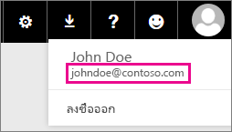

# ลูกค้า office 365 มุ่งเน้น - ปัญหาที่ทราบแล้ว
Power BI ในขณะนี้ได้รับการสนับสนุนแล้ว สำหรับลูกค้า Office 365 Dedicated  ถ้าคุณเป็นลูกค้า O365 Dedicated คุณสามารถลงชื่อเข้าใช้ ด้วยบัญชีจากผู้เช่านั้น และใช้ Power BI มีปัญหาสองข้อที่ทราบแล้วในขณะนี้

## กลุ่ม
เมื่อเลือก**สมาชิก**หรือ**ปฏิทิน**ในเมนูบริบทกลุ่ม คุณจะถูกนำทางไปยังแอปจดหมายแทน  **แฟ้ม**และ**การสนทนา**ทำงานตามที่คาดไว้

## แอป iPhone - ลงชื่อเข้าใช้โดเมนว่างเปล่านำไปสู่ข้อผิดพลาด
เมื่อคุณลงชื่อเข้าใช้ บนแอป iPhone ใช้เข้าสู่ระบบ ด้วยโดเมนว่างเปล่าคุณอาจพบข้อผิดพลาด

*การลงชื่อเข้าใช้ผิดพลาด*  
*มีข้อผิดพลาดภายในที่ไม่คาดคิดเกิดขึ้น โปรดลองใหม่อีกครั้ง*

เมื่อต้องแก้ปัญหานี้ ลงชื่อเข้าใช้ ด้วยที่อยู่อีเมลที่อยู่ในรายการเมื่อคุณคลิกที่ไอคอนผู้ใช้ภายในบริการ Power BI แทนที่ด้วยโดเมนว่างเปล่า

มีคำถามเพิ่มเติมหรือไม่? [ลองไปที่ชุมชน Power BI](https://community.powerbi.com/)

