# ดูแล Power BI ในพอร์ทัลผู้ดูแลระบบ

พอร์ทัลผู้ดูแลสามารถช่วยให้คุณจัดการ Power BI ของ*ผู้เช่า*สำหรับองค์กรของคุณ พอร์ทัลประกอบด้วยหน่วยข้อมูลต่างๆ เช่น เมตริกการใช้งาน การเข้าถึงศูนย์การจัดการ Microsoft 365 และการตั้งค่า

พอร์ทัลผู้ดูแลระบบจะสามารถเข้าถึงผู้ใช้ทั้งหมดที่เป็นผู้ดูแลระบบส่วนกลางใน Office 365 หรือผู้ใช้ที่ได้รับหน้าที่ให้เป็นผู้ดูแลระบบบริการ Power BI หากคุณไม่ได้รับหน้าที่ดังกล่าว คุณจะเห็นเพียง**การตั้งค่าความจุ** ในพอร์ทัลเท่านั้น โปรดดูที่[การทำความเข้าใจเกี่ยวกับบทบาทผู้ดูแลระบบ Power BI](service-admin-role.md)เพื่อศึกษาข้อมูลเพิ่มเติมเกี่ยวกับบทบาทผู้ดูแลระบบบริการ Power BI

## วิธีการเข้าถึงพอร์ทัลผู้ดูแลระบบ

บัญชีของคุณจำเป็นต้องได้รับการทำเครื่องหมายให้เป็น**ผู้ดูแลระบบส่วนกลาง**ภายใน Office 365 หรือ Azure Active Directory หรือต้องได้รับการกำหนดบทบาทผู้ดูแลระบบบริการ Power BI เพื่อเข้าถึงพอร์ทัลผู้ดูแลระบบ Power BI โปรดดูที่[การทำความเข้าใจเกี่ยวกับบทบาทผู้ดูแลระบบ Power BI](service-admin-role.md)เพื่อศึกษาข้อมูลเพิ่มเติมเกี่ยวกับบทบาทผู้ดูแลระบบบริการ Power BI เมื่อต้องการเข้าถึงพอร์ทัลผู้ดูแลระบบ Power BI โปรดทำตามขั้นตอนต่อไปนี้

1. เลือกรูปเฟืองการตั้งค่าที่อยู่ด้านบนขวาของบริการ Power BI

1. เลือก**พอร์ทัลผู้ดูแลระบบ**

    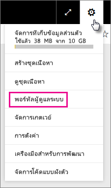

มีเก้าแท็บในพอร์ทัล รายละเอียดที่เหลือของบทความนี้เป็นข้อมูลเกี่ยวกับแต่ละแท็บ

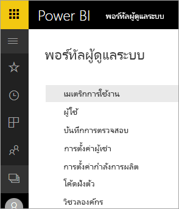

* [เมตริกการใช้งาน](#usage-metrics)
* [ผู้ใช้](#users)
* [บันทึกการตรวจสอบ](#audit-logs)
* [การตั้งค่าผู้เช่า](#tenant-settings)
* [การตั้งค่าความจุ](#capacity-settings)
* [โค้ดฝังตัว](#embed-codes)
* [วิชวลขององค์กร](#organizational-visuals)
* [ที่เก็บกระแสข้อมูล (ตัวอย่าง)](#dataflowStorage)
* [พื้นที่ทำงาน](#workspaces)
* [การกำหนดตราสินค้าแบบกำหนดเอง](#custom-branding)

## เมตริกการใช้งาน

**เมตริกการใช้งาน**จะช่วยให้คุณสามารถตรวจสอบการใช้งาน Power BI สำหรับองค์กรของคุณ และยังสามารถดไดู้ว่าผู้ใช้ และกลุ่มใดที่ใช้งานอยู่มากที่สุดใน Power BI สำหรับองค์กรของคุณ 

> [!NOTE]
> ในครั้งแรกที่คุณเข้าถึงแดชบอร์ด หรือหลังจากที่คุณเข้าไปที่แดชบอร์ดอีกครั้งหลังจากที่ไม่ได้เข้าไปดูแดชบอรืดเป็นเวลานาน คุณอาจจะเห็นหน้าจอการโหลดขณะที่เราโหลดแดชบอร์ด

เมื่อโหลดแดชบอร์ด คุณจะสามารถดูไทล์ทั้งสองส่วนได้ ในส่วนแรกประกอบด้วยข้อมูลการใช้งานสำหรับผู้ใช้รายบุคคล และส่วนที่สองจะมีข้อมูลที่คล้ายกันสำหรับกลุ่มในองค์กรของคุณ

นี่คือข้อมูลสรุปของสิ่งที่คุณสามารถดูได้ในแต่ละไทล์:

* นับจำนวนที่แตกต่างกันของแดชบอร์ด รายงาน และชุดข้อมูลทั้งหมดในพื้นที่ทำงานของผู้ใช้
  
    

* แดชบอร์ดที่มีการใช้งานมากที่สุดตามจำนวนผู้ใช้ที่สามารถเข้าถึงได้ ตัวอย่างเช่น ถ้าคุณมีแดชบอร์ดที่คุณแชร์กับผู้ใช้ 3 ราย และคุณเพิ่มแดชบอร์ดลงในชุดเนื้อหาที่มีผู้ใช้แตกต่างกันสองรายซึ่งเชื่อมต่ออยู่ การนับจะเป็น 6 (1 + 3 + 2)
  
    

* เนื้อหาที่ได้รับความนิยมมากที่สุดที่ผู้ใช้ที่เชื่อมต่อด้วย ซึ่งอาจจะเป็นสิ่งที่ผู้ใช้สามารถเข้าถึงได้ผ่านกระบวนการรับข้อมูล เช่นเดียวกับชุดเนื้อหา SaaS ชุดเนื้อหาขององค์กร ไฟล์ หรือฐานข้อมูล
  
    

* มุมมองของผู้ใช้ระดับสูงของคุณที่ยึดจำนวนตามแดชบอร์ดกี่พวกเขามี ทั้งแดชบอร์ดที่พวกเขาสร้างขึ้นด้วยตนเอง และแดชบอร์ดที่แชร์ให้กับพวกเขา
  
    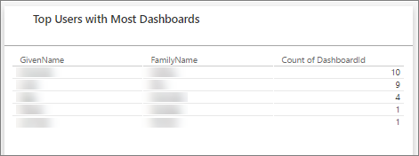

* มุมมองของผู้ใช้ระดับสูงของคุณที่ยึดตามจำนวนรายงานที่ผู้ใช้เหล่านั้นมี
  
    

ส่วนที่สองแสดงชนิดเดียวกันของข้อมูล แต่จะยึดตามกลุ่ม ซึ่งจะช่วยให้เห็นว่ากลุ่มใดในองค์กรของคุณมีการใช้งานมากที่สุดและข้อมูลชนิดใดที่พวกเขานิยมใช้

จากข้อมูลนี้คุณจะสามารถเห็นข้อมูลเชิงลึกจริง ๆ เกี่ยวกับวิธีที่บุคคลใช้ Power BI ทั่วทั้งองค์กรของคุณ และสามารถจดจำผู้ใช้ และกลุ่มที่มีการใช้งานมากในองค์กรของคุณได้

## ควบคุมเมตริกการใช้งาน

รายงานเมตริกการใช้งานเป็นคุณลักษณะที่ผู้ดูแลระบบ Power BI หรือ Office 365 สามารถเปิดหรือปิดได้ ผู้ดูแลระบบมีการควบคุมอย่างละเอียดว่าผู้ใช้รายใดมีสิทธิเข้าถึงเมตริกการใช้งาน ซึ่งจะ**เปิดอยู่**ตามค่าเริ่มต้นสำหรับผู้ใช้ทั้งหมดในองค์กร

ผู้ดูแลระบบยังสามารถตรวจสอบว่าผู้สร้างเนื้อหาสามารถดูข้อมูลต่อผู้ใช้ในเมตริกการใช้งานได้หรือไม่ 

ดู[ตรวจสอบเมตริกการใช้งานสำหรับแดชบอร์ด Power BI และรายงาน](service-usage-metrics.md)สำหรับรายละเอียดเกี่ยวกับรายงานด้วยตนเอง

### เมตริกการใช้งานสำหรับผู้สร้างเนื้อหา

1. ในพอร์ทัลผู้ดูแลระบบ เลือก**การตั้งค่าผู้เช่า** > **เมตริกการใช้งานสำหรับผู้สร้างเนื้อหา**

    

1. เปิดใช้งาน (หรือปิดใช้งาน) เมตริกการใช้งาน > **นำไปใช้**

    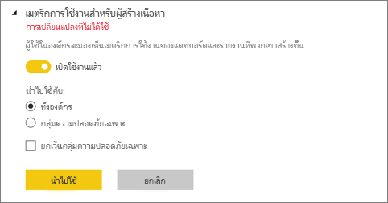

### ข้อมูลต่อผู้ใช้ในเมตริกการใช้งาน

ด้วยค่าเริ่มต้น ข้อมูลต่อผู้ใช้จะถูกเปิดใช้งานสำหรับเมตริกการใช้งาน และข้อมูลบัญชีผู้ใช้เนื้อหาจะถูกรวมอยู่ในรายงานเมตริก ถ้าคุณไม่ต้องการรวมข้อมูลนี้สำหรับผู้ใช้บางคนหรือทั้งหมด ปิดใช้งานคุณลักษณะสำหรับกลุ่มความปลอดภัยที่ระบุ หรือ คุณลักษณะสำหรับทั้งองค์กร จากนั้นข้อมูลบัญชีแสดงในรายงานว่า*ไม่มีชื่อ*

### ลบเนื้อหาเมตริกการใช้งานที่มีอยู่ทั้งหมด

เมื่อปิดใช้งานเมตริกการใช้งานสำหรับทั้งองค์กรของพวกเขา ผู้ดูแลระบบยังสามารถเลือกตัวเลือกหนึ่ง หรือทั้งสองเพื่อ:

- **ลบเนื้อหาเมตริกการใช้งานที่มีอยู่ทั้งหมด**เพื่อลบรายงานและไทล์แดชบอร์ดที่มีอยู่ทั้งหมดที่สร้างขึ้นโดยใช้รายงานเมตริกการใช้งานและชุดข้อมูล ตัวเลือกนี้จะลบการเข้าถึงข้อมูลเมตริกการใช้งานทั้งหมดสำหรับผู้ใช้ทั้งหมดในองค์กรที่อาจใช้งานอยู่แล้ว 
- **ลบข้อมูลต่อผู้ใช้ทั้งหมดที่มีอยู่ในเนื้อหาเมตริกการใช้งานปัจจุบัน** ตัวเลือกนี้จะลบการเข้าถึงข้อมูลเมตริกการใช้งานทั้งหมดสำหรับผู้ใช้ทั้งหมดในองค์กรที่อาจใช้งานอยู่แล้ว 

โปรดระวัง การลบเนื้อหาเมตริกการใช้งานที่มีอยู่และเมตริกต่อผู้ใช้เป็นการกระทำที่ไม่สามารถเรียกกลับคืนได้

## ผู้ใช้

คุณสามารถดูแลจัดการผู้ใช้ กลุ่ม และผู้ดูแลระบบของ Power BI ในศูนย์การจัดการ Microsoft 365 แท๊บ**ผู้ใช้**จะมีลิงก์นำไปยังแอ็ดมินเซ็นเตอร์ให้ผู้เช่าของคุณ

## บันทึกการตรวจสอบ

คุณสามารถจัดการข้อมูลบันทึกการตรวจสอบของ Power BI ในศูนย์ดูแลความปลอดภัยและศูนย์ดูแลการปฏิบัติตามนโยบายของ Office 365 แท็บ**บันทึกการตรวจสอบ**จะมีลิงก์ไปยังศูนย์ดูแลความปลอดภัยและศูนย์ดูแลการปฏิบัติตามนโยบายสำหรับผู้เช่าของคุณ [เรียนรู้เพิ่มเติม](service-admin-auditing.md)

หากต้องการใช้บันทึกการตรวจสอบ ให้ตรวจสอบให้แน่ใจว่าได้เปิดใช้งานการตั้งค่า [**สร้างบันทึกการตรวจสอบสำหรับกิจกรรมภายในการตรวจสอบและการปฏิบัติตามนโยบาย**](#create-audit-logs-for-internal-activity-auditing-and-compliance)

## การตั้งค่าผู้เช่า

แท็บ**การตั้งค่าผู้เช่า**จะช่วยให้ง่ายกับการควบคุมฟีเจอร์อยู่ในสภาพพร้อมใช้สำหรับองค์กรของคุณ ถ้าคุณมีข้อกังวลเกี่ยวกับข้อมูลที่ละเอียดอ่อน คุณลักษณะบางรายการของเราอาจไม่เหมาะสำหรับองค์กรของคุณ หรือคุณอาจต้องการคุณลักษณะที่เจาะจงพร้อมใช้งานสำหรับเฉพาะกลุ่มเท่านั้น

รูปภาพต่อไปนี้แสดงการตั้งค่าต่างๆ บนแท็บ **การตั้งค่าผู้เช่า**

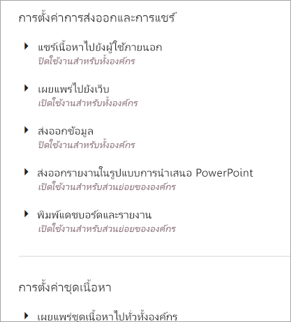

> [!NOTE]
> ระบบอาจจะใช้เวลาประมาณ 10 นาทีเพื่อให้การตั้งค่ามีผลบังคับใช้กับผู้เช่าทุกคนของคุณ

การตั้งค่าสามารถมีได้สามสถานะ:

* **ปิดใช้งานสำหรับทั้งองค์กร**: ไม่มีใครในองค์กรของคุณสามารถใช้ฟีเจอร์นี้ได้

    

* **เปิดใช้งานสำหรับทั้งองค์กร**: ทุกคนในองค์กรของคุณสามารถใช้ฟีเจอร์นี้ได้

    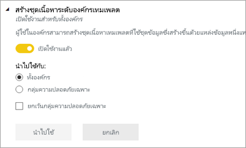

* **เปิดการใช้งานระบบกลุ่มย่อยในองค์กร**: กลุ่มย่อยหรือกลุ่มเฉพาะของผู้ใช้ในองค์กรของคุณสามารถใช้ฟีเจอร์นี้ได้

    คุณสามารถเปิดใช้งานฟีเจอร์สำหรับทั้งองค์กรของคุณ ยกเว้นสำหรับกลุ่มเฉพาะของผู้ใช้

    

    คุณยังสามารถเปิดใช้งานฟีเจอร์ดังกล่าวสำหรับกลุ่มเฉพาะของผู้ใช้ และนอกจากนี้ยังสามารถปิดใช้งานฟีเจอร์สำหรับกลุ่มของผู้ใช้ได้ด้วย การใช้ฟีเจอร์นี้สามารถทำให้มั่นใจได้ว่า ผู้ใช้บางรายไม่มีสิทธิ์การเข้าถึงฟีเจอร์ดังกล่าว แม้ว่าจะอยู่ในกลุ่มที่ได้รับอนุญาต

    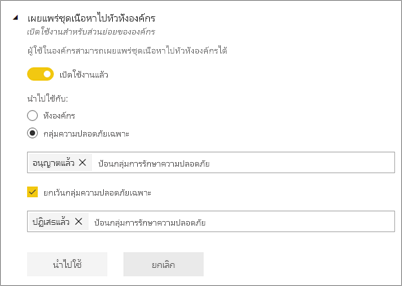

สองสามหัวข้อถัดไปให้ภาพรวมเรื่องชนิดต่าง ๆ ของการตั้งค่าผู้เช่า

## การตั้งค่าความช่วยเหลือและการสนับสนุน

### เผยแพร่ข้อมูล "รับความช่วยเหลือ"

ผู้ใช้ในองค์กรสามารถไปที่แหล่งข้อมูลความช่วยเหลือและการสนับสนุนภายในจากเมนูความช่วยเหลือ BI โดยเฉพาะอย่างยิ่ง พารามิเตอร์เหล่านี้จะเปลี่ยนลักษณะการทำงานของรายการเมนูการเรียนรู้ ชุมชน และรับความช่วยเหลือ

    

โดยการระบุ URL สำหรับการร้องขอสิทธิ์การใช้งาน คุณสามารถกำหนด URL เป้าหมายของปุ่ม **อัปเกรดบัญชี** ซึ่งผู้ใช้ที่ไม่มีสิทธิ์การใช้งาน Power BI Pro สามารถค้นหาได้ในกล่องโต้ตอบ **อัปเดตสำหรับ Power BI Pro** รวมถึงในหน้า **จัดการที่เก็บข้อมูลส่วนบุคคล** ยิ่งกว่านั้น Power BI ไม่มีปุ่ม **ทดลองใช้ Pro ฟรี** ในกล่องโต้ตอบหรือหน้าที่เก็บข้อมูลอีกต่อไปเพื่อให้แน่ใจว่า Power BI จะแนะนำผู้ใช้ของคุณอย่างเชื่อถือได้ผ่านกระบวนการที่กำหนดไว้ในองค์กรของคุณผ่านโซลูชันการจัดการสิทธิ์การใช้งานของคุณ

### รับการแจ้งเตือนทางอีเมลสำหรับการหยุดทำงานหรือเหตุขัดข้องของการบริการ

กลุ่มความปลอดภัยที่เปิดใช้งานจดหมายจะได้รับการแจ้งเตือนทางอีเมลถ้าผู้เช่ารายนี้ได้รับผลกระทบจากการหยุดทำงานหรือเหตุการณ์ที่เกิดขึ้น เรียนรู้เพิ่มเติมเกี่ยวกับ [การแจ้งเตือนการหยุดชะงักของบริการ](service-interruption-notifications.md)

## ตั้งค่าพื้นที่ทำงาน

### สร้างพื้นที่ทำงาน

ผู้ดูแลระบบใช้การตั้งค่า **การสร้างพื้นที่ทำงาน** เพื่อระบุว่าผู้ใช้คนใดในองค์กรที่สามารถสร้างพื้นที่ทำงานเพื่อทำงานร่วมกันบนแดชบอร์ด รายงาน และเนื้อหาอื่นๆ เรียนรู้เพิ่มเติมเกี่ยวกับ [พื้นที่ทำงาน](service-create-the-new-workspaces.md)

พอร์ทัลผู้ดูแลมีการตั้งค่าอีกส่วนหนึ่งซึ่งเกี่ยวกับพื้นที่ทำงานในผู้เช่าของคุณ ในส่วนดังกล่าว คุณสามารถเรียงลำดับและกรองรายการของพื้นที่ทำงานและแสดงรายละเอียดสำหรับแต่ละพื้นที่ทำงานได้ ดู [พื้นที่ทำงาน](#workspaces) สำหรับรายละเอียด

ในพอร์ทัลผู้ดูแล คุณยังสามารถควบคุมได้ว่าผู้ใช้คนใดมีสิทธิ์ในการแจกจ่ายแอปให้กับองค์กร โปรดดู [การเผยแพร่ชุดเนื้อหาและแอปให้กับทั้งองค์กร](#publish-content-packs-and-apps-to-the-entire-organization) ในบทความนี้สำหรับรายละเอียด

## การตั้งค่าการส่งออกและการแชร์

### แชร์เนื้อหาไปยังผู้ใช้ภายนอก

ผู้ใช้ในองค์กรสามารถแชร์แดชบอร์ดกับผู้ใช้ภายนอกองค์กรได้ เรียนรู้เพิ่มเติมเกี่ยวกับ [การแชร์กับภายนอก](service-share-dashboards.md#share-a-dashboard-or-report-outside-your-organization)

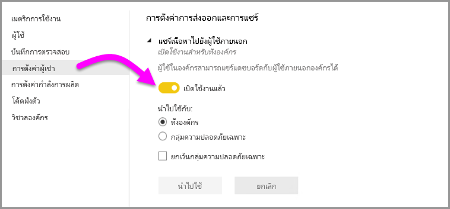

รูปต่อไปนี้แสดงให้คุณเห็นข้อความที่จะปรากฏขึ้นเมื่อคุณแชร์กับผู้ใช้ภายนอก

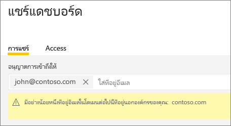  

### เผยแพร่ไปยังเว็บ

ผู้ใช้ในองค์กรสามารถเผยแพร่รายงานไปยังเว็บได้ [เรียนรู้เพิ่มเติม](service-publish-to-web.md)

รูปต่อไปนี้แสดงให้เห็น **ไฟล์** เมนูสำหรับการรายงานเมื่อเปิดการตั้งค่า **เผยแพร่ไปยังเว็บ**

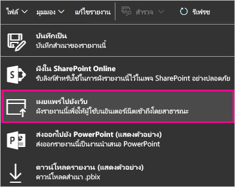

ผู้ใช้สามารถดูตัวเลือกต่าง ๆ ใน UI โดยอ้างอิงตามการตั้งค่าในสิ่งที่ถูก**เผยแพร่ไปยังเว็บ**

|ฟีเจอร์ |เปิดใช้งานทั้งองค์กร |เปิดใช้งานสำหรับทั้งองค์กร |กลุ่มความปลอดภัยเฉพาะ   |
|---------|---------|---------|---------|
|**เผยแพร่ไปยังเว็บ**ภายใต้เมนู**ไฟล์**ของรายงาน|เปิดใช้งานสำหรับทั้งหมด|ไม่สามารถมองเห็นได้สำหรับทั้งหมด|มองเห็นได้เฉพาะผู้ใช้หรือกลุ่มที่ได้รับอนุญาตเท่านั้น|
|**จัดการโค้ดฝังตัว**ภายใต้**การตั้งค่า**|เปิดใช้งานสำหรับทั้งหมด|เปิดใช้งานสำหรับทั้งหมด|เปิดใช้งานสำหรับทั้งหมด  * **ลบ**ตัวเลือกสำหรับผู้ใช้หรือกลุ่มที่ได้รับอนุญาตเท่านั้น * **รับรหัส**เปิดใช้งานสำหรับทั้งหมด|
|**โค้ดฝังตัว**ในพอร์ทัลของผู้ดูแลระบบ|สถานะแสดงหนึ่งในต่อไปนี้: * ใช้งานอยู่ * ไม่ได้รับการสนับสนุน * ถูกบล็อก|สถานะแสดง**ถูกปิดใช้งาน**|สถานะแสดงหนึ่งในต่อไปนี้: * ใช้งานอยู่ * ไม่ได้รับการสนับสนุน * ถูกบล็อก  ถ้าผู้ใช้ไม่ได้รับอนุญาตโดยยึดตามการตั้งค่าผู้เช่า สถานะจะแสดงเป็น**ถูกละเมิด**|
|รายงานที่เผยแพร่แล้วที่มีอยู่|เปิดใช้งานทั้งหมด|ปิดใช้งานทั้งหมด|รายงานยังคงแสดงสำหรับทั้งหมด|

### ส่งออกข้อมูล

ผู้ใช้ในองค์กรสามารถส่งออกข้อมูลจากไทล์หรือการแสดงวิชวล [เรียนรู้เพิ่มเติม](visuals/power-bi-visualization-export-data.md)

รูปต่อไปนี้แสดงให้เห็นตัวเลือกในการส่งข้อมูลออกจากไทล์

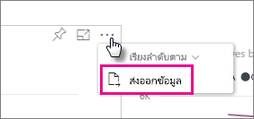

> [!NOTE]
> ปิดใช้งาน**ส่งออกข้อมูล**ยัง ช่วยป้องกันผู้ใช้จากการใช้ฟีเจอร์การ**วิเคราะห์ใน Excel**ตลอดจนการใช้เชื่อมต่อสดของบริการ Power BI ฃ

### ส่งออกรายงานในรูปแบบงานนำเสนอ PowerPoint หรือเอกสาร PDF

ผู้ใช้งานในองค์กรสามารถส่งออกรายงาน Power BI ในรูปแบบไฟล์ PowerPoint หรือเอกสาร PDF ได้ [เรียนรู้เพิ่มเติม](consumer/end-user-powerpoint.md)

รูปต่อไปนี้แสดงเมนู**แฟ้ม**สำหรับรายงานเมื่อ**การตั้งค่าส่งออกรายงานในรูปแบบงานนำเสนอ PowerPoint หรือเอกสาร PDF**ถูกเปิดใช้งาน

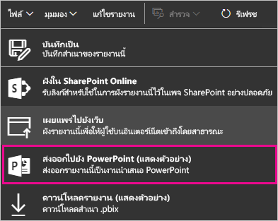

### พิมพ์แดชบอร์ดและรายงาน

ผู้ใช้ในองค์กรสามารถพิมพ์แดชบอร์ดและรายงานได้ [เรียนรู้เพิ่มเติม](consumer/end-user-print.md)

รูปต่อไปนี้แสดงตัวเลือกในการพิมพ์แดชบอร์ด

รูปต่อไปนี้แสดงเมนู **ไฟล์** สำหรับรายงานเมื่อเปิดการตั้งค่า **พิมพ์แดชบอร์ดและรายงาน**

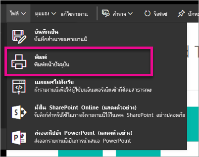

### อนุญาตให้ผู้ใช้ที่เป็นผู้เยี่ยมชมภายนอกแก้ไขและจัดการเนื้อหาในองค์กร
ผู้ใช้ที่เป็นผู้เยี่ยมชมของ Azure B2B สามารถแก้ไขและจัดการเนื้อหาในองค์กร [เรียนรู้เพิ่มเติม](service-admin-azure-ad-b2b.md)

รูปภาพต่อไปนี้แสดงตัวเลือกเพื่ออนุญาตให้ผู้ใช้ที่เป็นผู้เยี่ยมชมภายนอกแก้ไขและจัดการเนื้อหาในองค์กร

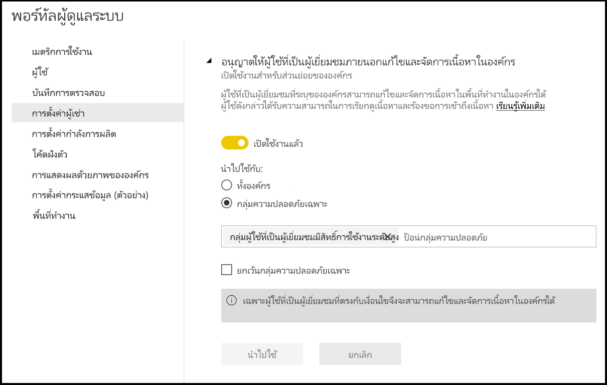

### การสมัครใช้งานอีเมล
ผู้ใช้ในองค์กรสามารถสร้างการสมัครใช้งานอีเมลได้ เรียนรู้เพิ่มเติมเกี่ยวกับ [การสมัครใช้งาน](service-report-subscribe.md)

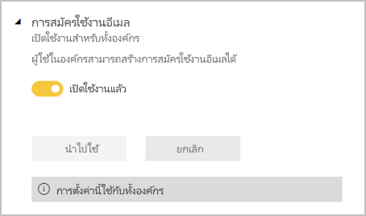

## การตั้งค่าชุดเนื้อหาและแอป

### เผยแพร่ชุดเนื้อหาและแอปไปทั่วทั้งองค์กร

ผู้ดูแลจะใช้การตั้งค่านี้เพื่อตัดสินใจว่าผู้ใช้คนใดในองค์กรสามารถเผยแพร่ชุดเนื้อหาและแอปในทั่วทั้งองค์กร แทนที่จะเผยแพร่ไปยังกลุ่มใดกลุ่มหนึ่งโดยเฉพาะ อ่านเพิ่มเติมเกี่ยวกับ [การเผยแพร่แอป](service-create-distribute-apps.md)

รูปภาพต่อไปนี้แสดงตัวเลือก **ทั้งองค์กรของฉัน** เมื่อสร้างชุดเนื้อหา

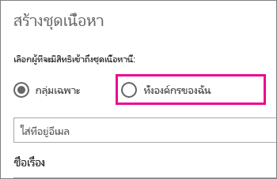

### สร้างแอปเทมเพลตและชุดเนื้อหาองค์กร

ผู้ใช้ในองค์กรสามารถสร้างแอปเทมเพลตและชุดเนื้อหาองค์กรที่ใช้ชุดข้อมูลซึ่งสร้างขึ้นด้วยแหล่งข้อมูลหนึ่งแหล่งใน Power BI Desktop ได้ เรียนรู้เพิ่มเติมเกี่ยวกับ [แอปเทมเพลต](template-content-pack-authoring.md)

### ส่งแอปให้กับผู้ใช้ปลายทาง

ตัวสร้างรายงานสามารถแชร์แอปกับผู้ใช้ปลายทางโดยตรงได้โดยไม่จำเป็นต้องติดตั้งจาก [AppSource](https://appsource.microsoft.com) เรียนรู้เพิ่มเติมเกี่ยวกับ[การติดตั้งแอปโดยอัตโนมัติสำหรับผู้ใช้ปลายทาง](service-create-distribute-apps.md#automatically-install-apps-for-end-users)

## การตั้งค่าการรวม

### ถามคำถามเกี่ยวกับข้อมูลโดยใช้ Cortana

ผู้ใช้ในองค์กรสามารถถามคำถามเกี่ยวกับข้อมูลของตนเองได้โดยใช้ Cortana [เรียนรู้เพิ่มเติม](service-cortana-enable.md)

> [!NOTE]
> การตั้งค่านี้จะนำไปใช้กับทั้งองค์กร และไม่สามารถจำกัดให้กับเฉพาะกลุ่มได้

### ใช้การวิเคราะห์ใน Excel กับชุดข้อมูลภายในองค์กร

ผู้ใช้ในองค์กรสามารถใช้ Excel เพื่อดู และโต้ตอบกับชุดข้อมูล Power BI ภายในองค์กร [เรียนรู้เพิ่มเติม](service-analyze-in-excel.md)

> [!NOTE]
> ปิดใช้งาน**ส่งออกข้อมูล**ยัง ช่วยป้องกันผู้ใช้จากการใช้งานฟีเจอร์**วิเคราะห์ใน Excel**

### ใช้ ArcGIS Maps for Power BI

ผู้ใช้ในองค์กรสามารถใช้การแสดงภาพ ArcGIS Maps for Power BI ที่ให้บริการโดย Esri ได้ [เรียนรู้เพิ่มเติม](visuals/power-bi-visualization-arcgis.md)

### ใช้การค้นหาทั้งหมดสำหรับ Power BI (ตัวอย่าง)

ผู้ใช้ในองค์กรสามารถใช้คุณลักษณะการค้นหาภายนอกที่อาศัยการค้นหา Azure ตัวอย่างเช่น ผู้ใช้สามารถใช้ Cortana เพื่อเรียกข้อมูลสำคัญได้โดยตรงจากแดชบอร์ดและรายงาน Power BI [เรียนรู้เพิ่มเติม](service-cortana-intro.md)

## การตั้งค่าวิชวลแบบกำหนดเอง

### เพิ่มและใช้วิชวลแบบกำหนดเอง

ผู้ใช้ในองค์กรสามารถโต้ตอบ และแชร์วิชวลแบบกำหนดเองได้ [เรียนรู้เพิ่มเติม](developer/power-bi-custom-visuals.md)

> [!NOTE]
> การตั้งค่านี้สามารถนำไปใช้กับทั้งองค์กร หรือสามารถจำกัดให้กับเฉพาะกลุ่มได้

Power BI Desktop (เริ่มต้นเผยแพร่จากเดือนมีนาคม '19) สนับสนุนการใช้ **นโยบายกลุ่ม** เพื่อปิดใช้งานวิชวลแบบกำหนดเองทั่วทั้งคอมพิวเตอร์ที่ปรับใช้ขององค์กร

<table>
<tr><th>แอตทริบิวต์</th><th>ค่า</th>
</tr>
<td>คีย์</td>
    <td>Software\Policies\Microsoft\Power BI Desktop\</td>
<tr>
<td>valueName</td>
<td>EnableCustomVisuals</td>
</tr>
</table>

ค่า 1 (เลขฐานสิบ) เปิดใช้งานการใช้วิชวลแบบกำหนดเองใน Power BI (ซึ่งเป็นค่าเริ่มต้น)

ค่า 0 (เลขฐานสิบ) ปิดใช้งานการใช้วิชวลแบบกำหนดเองใน Power BI

### อนุญาตให้วิชวลที่ผ่านการรับรองแล้วเท่านั้น

ผู้ใช้ในองค์กรที่ได้รับสิทธิ์ในการเพิ่ม และใช้วิชวลแบบกำหนดเอง ซึ่งแสดงตามการตั้งค่า "เพิ่มและใช้วิชวลแบบกำหนดเอง" เท่านั้นที่สามารถใช้[วิชวลแบบกำหนดเองที่ได้รับการรับรองแล้ว](https://go.microsoft.com/fwlink/?linkid=2002010)(วิชวลที่ไม่ได้รับการรับรองจะถูกปิดกั้น และจะแสดงข้อผิดพลาดเมื่อถูกใช้) 

Power BI Desktop (เริ่มต้นเผยแพร่จากเดือนมีนาคม '19) สนับสนุนการใช้ **นโยบายกลุ่ม** เพื่อปิดใช้งานวิชวลแบบกำหนดเองที่ไม่ผ่านการรับรองทั่วทั้งคอมพิวเตอร์ที่ปรับใช้ขององค์กร

<table>
<tr><th>แอตทริบิวต์</th><th>ค่า</th>
</tr>
<td>คีย์</td>
    <td>Software\Policies\Microsoft\Power BI Desktop\</td>
<tr>
<td>valueName</td>
<td>EnableUncertifiedVisuals</td>
</tr>
</table>

ค่า 1 (เลขฐานสิบ) เปิดใช้งานการใช้วิชวลแบบกำหนดเองที่ไม่ผ่านการรับรองใน Power BI (ซึ่งเป็นค่าเริ่มต้น)

ค่า 0 (ฐานสิบ) ปิดใช้งานการใช้วิชวลแบบกำหนดเองที่ไม่ผ่านการรับรองใน Power BI (ตัวเลือกนี้ช่วยให้สามารถใช้ [วิชวลแบบกำหนดเองที่ได้รับการรับรอง](https://go.microsoft.com/fwlink/?linkid=2002010) เท่านั้น)

## การตั้งค่าวิชวล R

### โต้ตอบและแชร์การแสดงผลด้วยภาพ R

ผู้ใช้ในองค์กรสามารถโต้ตอบ และแชร์วิชวลที่สร้างขึ้นด้วย R สคริปต์ได้ [เรียนรู้เพิ่มเติม](visuals/service-r-visuals.md)

> [!NOTE]
> การตั้งค่านี้จะนำไปใช้กับทั้งองค์กร และไม่สามารถจำกัดให้กับเฉพาะกลุ่มได้

## การตั้งค่าการตรวจสอบและการใช้งาน

### สร้างบันทึกการตรวจสอบสำหรับการตรวจสอบกิจกรรมภายในและการปฏิบัติตามกฎระเบียบ

ผู้ใช้ในองค์กรสามารถใช้การตรวจสอบเพื่อตรวจสอบการดำเนินการใน Power BI โดยผู้ใช้อื่นในองค์กร [เรียนรู้เพิ่มเติม](service-admin-auditing.md)

การตั้งค่านี้จำเป็นต้องเปิดใช้งานเพื่อบันทึกรายการบันทึกการตรวจสอบ สามารถมีการหน่วงเวลาสูงสุด 48 ชั่วโมง ตั้งแต่การเปิดใช้งานการตรวจสอบ จนสามารถดูข้อมูลการตรวจสอบได้ ถ้าคุณยังไม่เห็นข้อมูลในทันที ดูบันทึกการตรวจสอบในภายหลัง อาจมีความล่าช้าแบบเดียวกันระหว่าง เวลาที่ได้รับสิทธิ์ในการดูบันทึกการตรวจสอบ จนถึงเวลาที่สามารถเข้าถึงแฟ้มบันทึก

> [!NOTE]
> การตั้งค่านี้จะนำไปใช้กับทั้งองค์กร และไม่สามารถจำกัดให้กับเฉพาะกลุ่มได้

### เมตริกการใช้งานสำหรับผู้สร้างเนื้อหา

ผู้ใช้ในองค์กรจะมองเห็นการวัดการใช้งานของแดชบอร์ดและรายงานที่พวกเขาสร้างขึ้น [เรียนรู้เพิ่มเติม](service-usage-metrics.md)

### ข้อมูลต่อผู้ใช้ในการวัดการใช้งานเพื่อผู้สร้างเนื้อหา

การวัดการใช้งานเพื่อผู้สร้างเนื้อหาจะแสดงชื่อที่ใช้และที่อยู่อีเมลของผู้ใช้ที่กำลังเข้าถึงเนื้อหา [เรียนรู้เพิ่มเติม](service-usage-metrics.md)

ข้อมูลต่อผู้ใช้จะเปิดใช้งานให้กับการวัดการใช้งานด้วยค่าเริ่มต้น และข้อมูลบัญชีผู้สร้างเนื้อหาจะถูกรวมอยู่ในรายงานการวัดการใช้งาน ถ้าคุณไม่ต้องการรวมข้อมูลนี้สำหรับผู้ใช้ทั้งหมด คุณสามารถปิดใช้งานคุณลักษณะสำหรับกลุ่มความปลอดภัยที่ระบุ หรือ คุณลักษณะสำหรับทั้งองค์กร ข้อมูลบัญชีสำหรับผู้ใช้ที่ถูกแยกออกนั้นจะแสดงในรายงานว่า*ไม่มีชื่อ*

## การตั้งค่าแดชบอร์ด

### การจัดประเภทข้อมูลสำหรับแดชบอร์ด

ผู้ใช้ในองค์กรสามารถแท็กแดชบอร์ดกับการจัดประเภทที่ระบุระดับการรักษาความปลอดภัยของแดชบอร์ดได้ [เรียนรู้เพิ่มเติม](service-data-classification.md)

> [!NOTE]
> การตั้งค่านี้จะนำไปใช้กับทั้งองค์กร และไม่สามารถจำกัดให้กับเฉพาะกลุ่มได้

## การตั้งค่าผู้พัฒนา

### ฝังเนื้อหาในแอป

ผู้ใช้ในองค์กรสามารถฝังแดชบอร์ดและรายงาน Power BI ในแอปพลิเคชัน Software as a Service (SaaS) ได้ ปิดใช้งานการตั้งค่านี้ป้องกันไม่ให้ผู้ใช้ใช้ REST Api ฝังเนื้อหา Power BI ภายในแอปพลิเคชันของพวกเขา [เรียนรู้เพิ่มเติม](developer/embedding.md)

### อนุญาตให้โครงร่างสำคัญของบริการใช้ API ของ Power BI

เว็บแอปที่ลงทะเบียนใน Azure Active Directory (Azure AD) จะใช้โครงร่างสำคัญของบริการที่กำหนดไว้เพื่อเข้าถึง API ของ Power BI โดยไม่ต้องมีผู้ใช้ที่ลงชื่อเข้าใช้ เพื่ออนุญาตให้แอปใช้การรับรองความถูกต้องกับโครงร่างสำคัญของบริการของผู้ใช้ โครงร่างสำคัญของบริการของแอปจะต้องรวมอยู่ในกลุ่มความปลอดภัยที่ได้รับอนุญาต [เรียนรู้เพิ่มเติม](developer/embed-service-principal.md)

> [!NOTE]
> บริการหลักได้รับสิทธิ์สำหรับการตั้งค่าผู้เช่า Power BI ทั้งหมดจากกลุ่มความปลอดภัยของพวกเขา เมื่อต้องการจำกัดสิทธิ์ ให้สร้างกลุ่มความปลอดภัยเฉพาะสำหรับบริการหลัก และเพิ่มลงในรายการ 'ยกเว้นกลุ่มความปลอดภัยเฉพาะ' สำหรับการตั้งค่า Power BI ที่เกี่ยวข้องที่เปิดใช้งาน

## การตั้งค่ากระแสข้อมูล

### สร้างและใช้กระแสข้อมูล

ผู้ใช้ในองค์กรสามารถสร้างและใช้กระแสข้อมูลได้ สำหรับภาพรวมของกระแสข้อมูล โปรดดู [การเตรียมข้อมูลด้วยตนเองใน Power BI](service-dataflows-overview.md) เมื่อต้องการเปิดใช้งานกระแสข้อมูลในความจุแบบ Premium ให้ดู[การกำหนดค่าปริมาณงาน](service-admin-premium-workloads.md)

> [!NOTE]
> การตั้งค่านี้จะนำไปใช้กับทั้งองค์กร และไม่สามารถจำกัดให้กับเฉพาะกลุ่มได้

## การตั้งค่าแอปเทมเพลต

การตั้งค่าทั้งสามแบบจะควบคุมความสามารถของแอปเทมเพลตในการเผยแพร่หรือติดตั้งแอปเทมเพลต

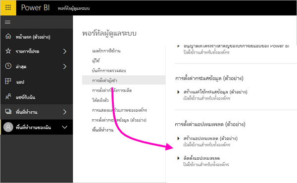

### เผยแพร่แอปเทมเพลต

ผู้ใช้ในองค์กรสามารถสร้างพื้นที่ทำงานแอปเทมเพลต ควบคุมว่าผู้ใช้คนใดบ้างที่สามารถเผยแพร่แอปเทมเพลตหรือแจกจ่ายแอปเทมเพลตให้กับลูกค้าภายนอกองค์กรของคุณผ่าน [AppSource](https://appsource.microsoft.com) หรือวิธีการแจกจ่ายอื่นๆ

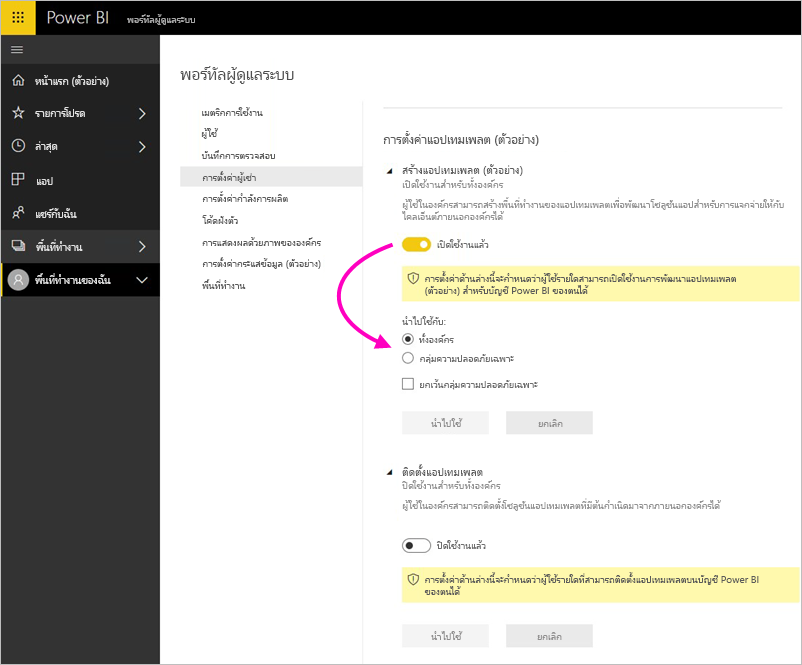

### ติดตั้งแอปเทมเพลตที่แสดงบน AppSource

ผู้ใช้ในองค์กรสามารถดาวน์โหลดและติดตั้งแอปเทมเพลต **จาก** [AppSource](https://appsource.microsoft.com) เท่านั้น ควบคุมว่าผู้ใช้คนใดหรือกลุ่มรักษาความปลอดภัยกลุ่มใดที่สามารถติดตั้งแอปเทมเพลตจาก AppSource

### ติดตั้งแอปเทมเพลตที่ไม่มีอยู่ใน AppSource

ควบคุมว่าผู้ใช้คนใดในองค์กรที่สามารถดาวน์โหลดและติดตั้งแอปเทมเพลต **ที่ไม่มีอยู่ใน[ AppSource](https://appsource.microsoft.com)**

## การตั้งค่าความจุ

### Power BI Premium

แท็บ **Power BI Premium** ช่วยให้คุณสามารถจัดการความจุ Power BI Premium (Em หรือ P SKU) ใด ๆ ที่ซื้อให้องค์กรของคุณ ผู้ใช้ทั้งหมดภายในองค์กรของคุณสามารถดูแท็บ *Power BI Premium* แต่จะเห็นเฉพาะเนื้อหาภายในได้ หากผู้ใช้ถูกกำหนดให้เป็น **ผู้ดูแลความจุ** หรือผู้ใช้ที่ได้รับสิทธิ์ให้กำหนดความจุ อย่างใดอย่างหนึ่งเท่านั้น ถ้าผู้ใช้มีสิทธิ์ใดๆ ข้อความต่อไปนี้ปรากฏขึ้น

### Power BI Embedded

แท็บ **Power BI Embedded** ช่วยให้คุณสามารถดูความจุ Power BI Embedded (A SKU) ของคุณที่ซื้อให้ลูกค้าของคุณ เนื่องจากคุณสามารถซื้อ A Skus ได้จาก Azure เท่านั้น คุณสามารถ [จัดการความจุแบบฝังตัวใน Azure](developer/azure-pbie-create-capacity.md) จาก **พอร์ทัล Azure** ได้

สำหรับข้อมูลเพิ่มเติมเกี่ยวกับวิธีจัดการการตั้งค่า Power BI Embedded (A SKU) ดู[อะไร คือ Power BI Embedded](developer/azure-pbie-what-is-power-bi-embedded.md)

## โค้ดฝังตัว

ในฐานะผู้ดูแลระบบ คุณสามารถดูโค้ดฝังตัวที่สร้างขึ้นสำหรับผู้เช่าของคุณ นอกจากนี้ยังสามารถเพิกถอนหรือลบโค้ดได้เช่นกัน [เรียนรู้เพิ่มเติม](service-publish-to-web.md)

 ## <a name="organizational-visuals">วิชวลขององค์กร</a> 

แท็บ **วิชวลองค์กร** ช่วยให้คุณสามารถปรับใช้ และจัดการวิชวลแบบกำหนดเองภายในองค์กรของคุณ ด้วยวิชวลด้านองค์กร คุณสามารถปรับใช้วิชวลที่เป็นกรรมสิทธิ์ในองค์กรของคุณ ซึ่งผู้เขียนรายงานสามารถค้นพบ และนำเข้าลงในรายงานของพวกเขาจาก Power BI Desktop [เรียนรู้เพิ่มเติม](developer/power-bi-custom-visuals-organization.md)

> [!WARNING]
> วิชวลแบบกำหนดเองอาจประกอบด้วยโค้ดที่มีความเสี่ยงด้านความปลอดภัยหรือความเป็นส่วนตัว ดังนั้นผู้เขียนและแหล่งที่มาของวิชวลแบบกำหนดเองจะต้องมีความน่าเชื่อถือก่อนที่จะปรับใช้กับที่เก็บข้อมูลขององค์กร

รูปต่อไปนี้แสดงวิชวลแบบกำหนดเองทั้งหมดที่ถูกปรับใช้ในที่เก็บข้อมูลขององค์กรในขณะนี้

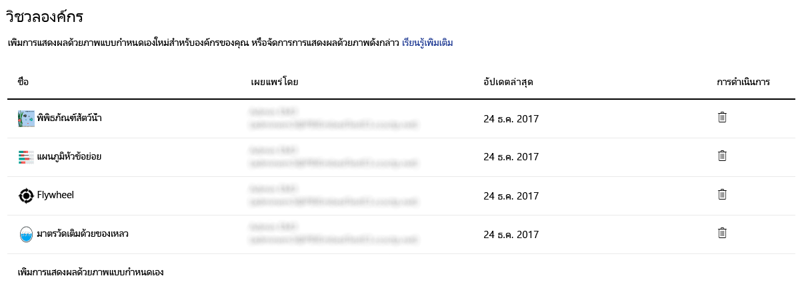

### เพิ่มวิชวลแบบกำหนดเองที่สร้างขึ้นใหม่

หากต้องการเพิ่มวิชวลแบบกำหนดเองใหม่ไปยังรายการ ให้ปฏิบัติตามขั้นตอนเหล่านี้ 

1. ในบานหน้าต่างด้านขวา เลือก **เพิ่มวิชวลแบบกำหนดเอง**

    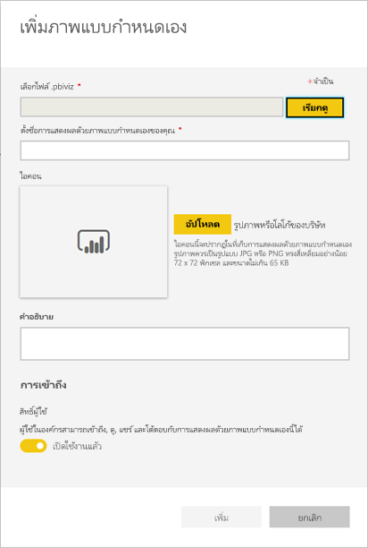

1. กรอกข้อมูลในแบบฟอร์ม **เพิ่มวิชวลแบบกำหนดเอง**:

    * **เลือกไฟล์ .pbiviz** (จำเป็น): เลือกไฟล์วิชวลแบบกำหนดเองเพื่ออัปโหลด เฉพาะวิชวลแบบกำหนดเองเวอร์ชัน API ที่ได้รับการสนับสนุน (อ่านที่นี่เพื่อทำความเข้าใจ)

    ก่อนที่คุณจะอัปโหลดวิชวลแบบกำหนดเอง คุณควรตรวจสอบให้แน่ใจว่า วิชวลสำหรับการรักษาความปลอดภัยและความเป็นส่วนตัวเหมาะสำหรับมาตรฐานขององค์กรของคุณ

    * **ตั้งชื่อให้วิชวลแบบกำหนดเองของคุณ** (จำเป็น): ตั้งชื่อเรื่องสั้น ๆ เพื่อช่วยให้ผู้ใช้ Power BI Desktop สามารถทำความเข้าใจได้ง่าย ๆ

    * **ไอคอน**: ไฟล์ไอคอนที่แสดงใน UI ของ Power BI Desktop

    * **คำอธิบาย**: คำอธิบายสั้น ๆ ของวิชวลเพื่อให้บริบทและการศึกษาแก่ผู้ใช้เพิ่มเติม

1. เลือก **เพิ่ม** เพื่อเริ่มคำขอการอัปโหลด ถ้าสำเร็จ คุณสามารถดูข้อมูลใหม่ในรายการ ถ้าล้มเหลว คุณจะได้รับข้อความผิดพลาดที่เหมาะสม

### ลบวิชวลแบบกำหนดเองจากรายการ

หากต้องการลบวิชวลโดยถาวร ให้เลือกไอคอนถังขยะสำหรับวิชวลในที่เก็บข้อมูล

> [!IMPORTANT]
> การลบจะไม่สามารถแก้ไขย้อนกลับได้ เมื่อถูกลบ ภาพจะหยุดแสดงผลในรายงานที่มีอยู่ทันที แม้ว่าคุณจะอัปโหลดวิชวลเดิมอีกครั้ง ก็จะไม่สามารถแทนที่วิชวลก่อนหน้านี้ที่ถูกลบได้ อย่างไรก็ตาม ผู้ใช้สามารถนำเข้าวิชวลใหม่อีกครั้ง และแทนที่อินสแตนซ์ที่มีในรายงาน

### ปิดใช้งานภาพแบบกำหนดเองในรายการ

เมื่อต้องการปิดใช้งานภาพจากร้านขององค์กร เลือกไอคอนรูปเฟือง ในส่วน**เข้าถึง** ปิดใช้งานภาพแบบกำหนดเอง

หลังจากที่คุณปิดใช้งานภาพ ภาพจะไม่แสดงในรายงานที่มีอยู่ และจะแสดงข้อผิดพลาดด้านล่าง

*ภาพแบบกำหนดเองนี้จะไม่พร้อมใช้งานอีกต่อไป โปรดติดต่อผู้ดูแลระบบของคุณสำหรับรายละเอียด*

อย่างไรก็ตาม ภาพที่ถูกคั่นหน้าจะยังคงใช้งานได้

หลังจากอับเดตหรือเปลี่ยนแปลงโดยผู้ดูแลระบบ ผู้ใช้ Power BI Desktop ควรรีสตาร์ตแอปพลิเคชัน หรือรีเฟรชเบราว์เซอร์ในบริการ Power BI เพื่อดูการอัปเดต

### อัปเดตวิชวล

หากต้องการอัปเดตวิชวลจากที่เก็บขององค์กร ให้เลือกไอคอนรูปเฟือง เรียกดูและอัปโหลดเวอร์ชันใหม่ของวิชวล

ตรวจสอบให้แน่ใจว่า ID ของวิชวลไม่มีการเปลี่ยนแปลง ไฟล์ใหม่จะแทนไฟล์ก่อนหน้าสำหรับรายงานทั้งหมดทั่วทั้งองค์กร อย่างไรก็ตาม เวอร์ชันใหม่ของวิชวลอาจทำลายการใช้งานหรือโครงสร้างข้อมูลของเวอร์ชันก่อนหน้าของวิชวล ดังนั้นจึงไม่ควรแทนที่เวอร์ชันก่อนหน้า แต่ควรสร้างรายการใหม่สำหรับเวอร์ชันใหม่ของวิชวล ตัวอย่างเช่น เพิ่มหมายเลขเวอร์ชันใหม่ (เวอร์ชัน X.X) ไปยังชื่อของวิชวลรายการใหม่ ด้วยวิธีนี้ จะเห็นได้ชัดว่าวิชวลเดิมจะยังคงอยู่ในหมายเลยเวอร์ชันที่อัปเดตแล้ว ดังนั้นรายงานที่มีอยู่จะไม่ทำลายฟังก์ชันการทำงานดังกล่าว และตรวจสอบให้แน่ใจว่า ID ของวิชวลไม่มีการเปลี่ยนแปลง จากนั้น ในครั้งถัดไปที่ผู้ใช้ใช้งานที่เก็บข้อมูลขององค์กรจาก Power BI Desktop พวกเขาสามารถนำเข้าเวอร์ชันใหม่ ซึ่งจะพร้อมท์ให้ผู้ใช้เปลี่ยนเวอร์ชันปัจจุบันที่พวกเขามีในรายงาน

สำหรับข้อมูลเพิ่มเติม โปรดเยี่ยมชม[คำถามที่ถามบ่อยเกี่ยวกับวิชวลแบบกำหนดเองขององค์กร](https://docs.microsoft.com/power-bi/power-bi-custom-visuals-faq#organizational-visuals)

## <a name="dataflowStorage">ที่เก็บกระแสข้อมูล (ตัวอย่าง)</a>

ตามค่าเริ่มต้น ข้อมูลที่ใช้กับ Power BI จะถูกเก็บไว้ในที่เก็บข้อมูลภายในโดย Power BI ด้วยการรวมกันของกระแสข้อมูลและ Azure Data Lake Storage Gen2 (ADLS Gen2) คุณสามารถจัดเก็บกระแสข้อมูลของคุณในบัญชี Azure Data Lake Storage Gen2 ภายในองค์กรของคุณได้ สำหรับข้อมูลเพิ่มเติม ดู[การรวมกระแสข้อมูลและ Azure Data Lake (ตัวอย่าง)](service-dataflows-azure-data-lake-integration.md)

## พื้นที่ทำงาน

ในฐานะที่เป็นผู้ดูแลระบบ คุณสามารถดูพื้นที่ทำงานที่มีอยู่ในผู้เช่าของคุณได้ คุณสามารถเรียงลำดับและกรองรายการของพื้นที่ทำงานและแสดงรายละเอียดสำหรับแต่ละพื้นที่ทำงานได้ คอลัมน์ตารางจะสอดคล้องกับคุณสมบัติที่ส่งคืนโดย [Power BI admin Rest API](/rest/api/power-bi/admin) สำหรับพื้นที่ทำงาน พื้นที่ทำงานส่วนบุคคลเป็น **PersonalGroup** ประเภทหนึ่ง พื้นที่ทำงานแบบคลาสสิกเป็น **Group** ประเภทหนึ่ง และพื้นที่ทำงานประสบการณ์พื้นที่ทำงานแบบใหม่เป็น **Workspace** ประเภทหนึ่ง สำหรับข้อมูลเพิ่มเติม ดู [สร้างพื้นที่ทำงานใหม่ใน Power BI](service-create-the-new-workspaces.md)

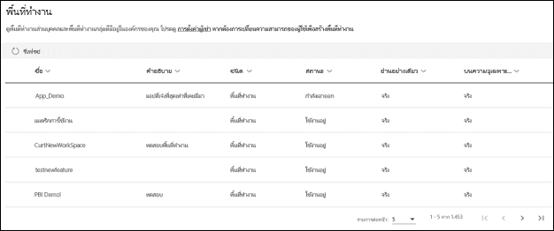

จากแท็บ **พื้นที่ทำงาน** คุณจะเห็น*สถานะ*สำหรับพื้นที่ทำงานแต่ละส่วน ตารางต่อไปนี้ระบุรายละเอียดเพิ่มเติมเกี่ยวกับความหมายของสถานะเหล่านี้

|รัฐ/จังหวัด  |คำอธิบาย  |
|---------|---------|
| ใช้งานอยู่ | พื้นที่ทำงานปกติ ไม่ได้เป็นการระบุเกี่ยวกับการใช้หรือข้อมูลภายใน ระบุเฉพาะว่าพื้นที่ทำงานเป็นสถานะ “ปกติ” |
| ถูกละเลย | พื้นที่ทำงานที่ไม่มีผู้ใช้ที่เป็นผู้ดูแลระบบ |
| ลบแล้ว | พื้นที่ทำงานที่ถูกลบ เรามีการดูแลให้มีเมต้าดาต้าเพียงพอสำหรับกู้คืนพื้นที่ทำงานหากต้องการ |
| กำลังเอาออก | พื้นที่ทำงานในกระบวนการกำลังถูกลบทิ้ง แต่ยังไม่หายไป ผู้ใช้สามารถลบพื้นที่ทำงานของตนเองเพื่อปรับสถานะเป็น กำลังลบ สู่ ลบทิ้งแล้ว |

## การกำหนดตราสินค้าแบบกำหนดเอง

ในฐานะผู้ดูแลระบบคุณสามารถกำหนดลักษณะของ Power BI สำหรับองค์กรทั้งหมดของคุณได้ ในขณะนี้มีสามตัวเลือกหลัก:

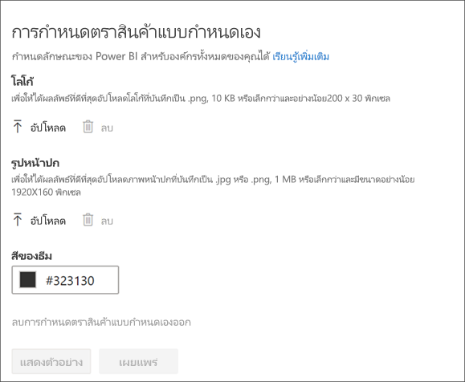

* **อัปโหลดโลโก้**: เพื่อให้ได้ผลลัพธ์ที่ดีที่สุดอัปโหลดโลโก้ที่บันทึกเป็น .png, 10 KB หรือเล็กกว่าและอย่างน้อย200 x 30 พิกเซล

* **อัปโหลดรูปหน้าปก**: เพื่อให้ได้ผลลัพธ์ที่ดีที่สุดอัปโหลดภาพหน้าปกที่บันทึกเป็น .jpg หรือ .png, 1 MB หรือเล็กกว่าและมีขนาดอย่างน้อย 1920X160 พิกเซล

* **เลือกสีธีม**: คุณสามารถเลือกธีมของคุณโดยยึดตามตัวเลขฐานสิบหก, RGB, value หรือจากแท่นวางสินค้าที่ให้มาได้

สำหรับข้อมูลเพิ่มเติม ให้ดูการ[กำหนดแบรนด์เองสำหรับองค์กรของคุณ](https://aka.ms/orgBranding)

## ขั้นตอนถัดไป

[การดูแล Power BI ในองค์กรของคุณ](service-admin-administering-power-bi-in-your-organization.md)  
[ทำความเข้าใจเกี่ยวกับบทบาทผู้ดูแลระบบ Power BI](service-admin-role.md)  
[ตรวจสอบ Power BI ในองค์กรของคุณ](service-admin-auditing.md)  

มีคำถามเพิ่มเติมหรือไม่? [ลองถามชุมชน Power BI](https://community.powerbi.com/)
