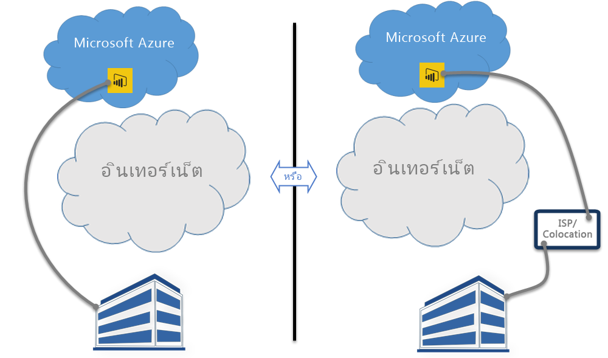

# Power BI และ ExpressRoute
ด้วย**Power BI**และ**ExpressRoute** คุณสามารถสร้างการเชื่อมต่อเครือข่ายส่วนตัวจากองค์กรของคุณไปยัง Power BI ได้ (หรือใช้สิ่งอำนวยความสะดวกโคโลเคชั่นของ ISP) เบี่ยงอินเทอร์เน็ตเพื่อเพิ่มความปลอดภัยกับข้อมูล Power BI และการเชื่อมต่อที่อ่อนไหว

**ExpressRoute**เป็นบริการของ Azure ที่ช่วยให้คุณสร้างการเชื่อมต่อแบบส่วนตัวระหว่างศูนย์ข้อมูล Azure (ที่ Power BI อยู่) และโครงสร้างพื้นฐานภายในองค์กรของคุณ หรือสร้างการเชื่อมต่อแบบส่วนตัวระหว่างศูนย์ข้อมูล Azure และสภาพแวดล้อมโคโลเคชั่นของคุณ

คุณสามารถรับ[ข้อมูลเพิ่มเติมเกี่ยวกับ ExpressRoute](https://azure.microsoft.com/services/expressroute/)หรือเรียนรู้[วิธีการลงทะเบียน](https://azure.microsoft.com/pricing/details/expressroute/)ได้

> [!NOTE]
> Power BI ได้รับการสนับสนุนในโหมดเพียร์ริ่งสาธารณะตามที่อธิบายไว้ใน[ถามที่ถามบ่อยนี้](https://docs.microsoft.com/azure/expressroute/expressroute-faqs)
> 
> 

## ข้อยกเว้นของ Power BI ExpressRoute
Power BI สอดคล้องกับ ExpressRoute โดยมีข้อยกเว้นบางอย่างที่ Power BI จะรับหรือส่งข้อมูลผ่านอินเทอร์เน็ตสาธารณะ ข้อยกเว้นเฉพาะเหล่านี้มักจะรวมข้อมูลคงที่ เช่นไฟล์การกำหนดค่าเบราว์เซอร์ที่ดาวน์โหลดจากสถานีเชื่อมโยง**เครือข่ายจัดส่งเนื้อหา (Content Delivery Networ: CDN)** ที่ใกล้ที่สุด มีหลายข้อยกเว้นที่นำไปใช้กับ Power BI ทั้งหมด และมีข้อจำกัดสำหรับบริการหรือสำหรับลักษณะเฉพาะ ซึ่งแต่ละข้อยกเว้นจะบันทึกอยู่ในส่วนต่อไปนี้

### ข้อยกเว้นโดยรวมสำหรับ Power BI และ ExpressRoute
ข้อยกเว้นหนึ่งสำหรับ**Power BI**และ**ExpressRoute** หมายความว่า ข้อมูลถูกส่งไปยังหรือจาก Power BI จะผ่านอินเทอร์เน็ตสาธารณะ แทนที่ถูกส่งผ่านการเชื่อมโยง ExpressRoute ส่วนตัว

ข้อยกเว้นโดยรวมสองข้อสำหรับ Power BI ที่ใช้ ExpressRoute คือ:

* ไฟล์แบบคงที่ที่ดาวน์โหลดจาก**เครือข่ายจัดส่งเนื้อหา (CDN)** และเว็บไซต์
* **การส่งข้อมูลระยะไกล**ที่ส่งผ่านอินเทอร์เน็ตสาธารณะ

Power BI ใช้หลาย**เครือข่ายจัดส่งเนื้อหา (Cdn)** หรือเว็บไซต์เพื่อให้กระจายเนื้อหาและไฟล์คงที่ที่จำเป็นไปยังผู้ใช้ตามตำแหน่งที่ตั้งทางภูมิศาสตร์ผ่านอินเทอร์เน็ตสาธารณะได้อย่างมีประสิทธิภาพ ไฟล์คงที่เหล่านี้รวมถึงไฟล์ดาวน์โหลดผลิตภัณฑ์ (เช่น**Power BI Desktop** **เกตเวย์ข้อมูลภายในองค์กร**หรือ**ชุดเนื้อหา BI Power**จากผู้ให้บริการอิสระต่าง ๆ) ไฟล์การกำหนดค่าเบราว์เซอร์ที่ใช้เพื่อเริ่มต้นและสร้างการเชื่อมต่อใด ๆ ในเวลาต่อมาด้วย Power BI ตลอดจนการรักษาความปลอดภัยเริ่มต้นสำหรับหน้าเข้าสู่ระบบของ Power BI – ข้อมูลประจำตัวแท้จริงจะส่งผ่าน ExpressRoute   

บาง**ข้อมูลที่ส่งระยะไกล**จะถูกส่งผ่านอินเทอร์เน็ตสาธารณะและบน ExpressRoute การส่งข้อมูลระยะไกลรวมถึงสถิติการใช้งานและข้อมูลที่คล้ายกัน ซึ่งจะมีการถ่ายโอนไปยังบริการที่ใช้เพื่อตรวจสอบการใช้งานและกิจกรรมต่าง ๆ

### แอปพลิเคชัน Power BI SaaS และ ExpressRoute
เมื่อผู้ใช้เริ่มต้นการเชื่อมต่อกับบริการ Power BI (powerbi.com หรือผ่าน Cortana), หน้าเริ่มต้นของ Power BI หน้าเข้าสู่ระบบ และไฟล์แบบคงที่ที่เตรียมพร้อมเบราว์เซอร์เพื่อเชื่อมต่อและโต้ตอบกับ Power BI จะถูกดึงมาจาก CDN หรือเว็บไซต์ ซึ่งเชื่อมต่อ ผ่านอินเทอร์เน็ตสาธารณะ

เมื่อเข้าสู่ระบบสำเร็จ การโต้ตอบกับข้อมูล Power BI ที่ตามมาเกิดขึ้นบน ExpressRoute ยกเว้นบางคุณลักษณะและบริการที่จะขึ้นอยู่กับข้อมูลอินเทอร์เน็ตสาธารณะ:

* **ภาพแผนที่**จำเป็นต้องเชื่อมต่อและข้อมูลที่ส่งไปยังบริการ Bing Virtual Earth หรือบริการกำหนดพิกัดทางภูมิศาสตร์ Bing แต่ละรายการจะสร้างขึ้นผ่านอินเทอร์เน็ตสาธารณะ
* การรวม Power BI กับ**Cortana**จำเป็นต้องเข้าถึงไปยัง Bing ผ่านอินเทอร์เน็ตสาธารณะ
* เมื่อ**ลิงก์แบบกำหนดเอง**ถูกเพิ่มเข้าโดยผู้ใช้ เช่น วิดเจ็ตรูปภาพหรือวิดีโอ Power BI จะร้องขอข้อมูลโดยยึดตามลิงก์ที่ีผู้ใช้ให้มา ซึ่งอาจใช้หรืออาจไม่ใช้ ExpressRoute
* ผู้ใช้สามารถส่ง**คำติชมไปยัง Power BI**ในรูปแบบข้อความได้ (หรือส่งเป็นรูปภาพได้) เหนือกลไกคำติชม User Voice ซึ่งใช้อินเทอร์เน็ตสาธารณะสำหรับการส่ง
* **ผู้ให้บริการเนื้อหาข่าวสาร Bing**ดาวน์โหลดเนื้อหาจาก Bing โดยใช้อินเทอร์เน็ตสาธารณะ
* เมื่อเชื่อมต่อกับ**แอปฯ** (ตัวอย่างเช่น ชุดเนื้อหา) ผู้ใช้มักจำเป็นต้องใส่ข้อมูลประจำตัวและการตั้งค่าโดยใช้หน้าที่ผู้ให้บริการ SaaS จัดให้ หน้าดังกล่าวอาจใช้หรืออาจไม่ใช้ ExpressRoute

| กิจกรรมของผู้ใช้ | ปลายทาง |
| --- | --- |
| หน้าเริ่มต้น (ก่อนที่จะเข้าสู่ระบบ) |`maxcdn.bootstrapcdn.com ; ajax.aspnetcdn.com ; netdna.bootstrapcdn.com ; cdn.optimizely.com; google-analytics.com ` |
| ลงชื่อเข้าใช้ |`*.mktoresp.com ; *.aadcdn.microsoftonline-p.com ; *.msecnd.com ; *.localytics.com ; ajax.aspnetcdn.com` |
| แดชบอร์ด รายงาน การจัดการชุดข้อมูล (รวมถึงแผนที่และกำหนดพิกัดทางภูมิศาสตร์) |`*.localytics.com ; *.virtualearth.net ; platform.bing.com; powerbi.microsoft.com; c.microsoft.com; app.powerbi.com; *.powerbi.com; dc.services.visualstudio.com ` |
| การสนับสนุน |`support.powerbi.com ; powerbi.uservoice.com ; go.microsoft.com ` |

### Power BI และ ExpressRoute
นอกจากนี้ Power BI Desktop ยังสอดคล้องกับ ExpressRoute โดยมีข้อยกเว้นบางอย่างที่อธิบายไว้ในรายการต่อไปนี้:

* **อัปเดตการแจ้งเตือน**ใช้เพื่อตรวจสอบว่าผู้ใช้มีเวอร์ชันล่าสุดของ Power BI Desktop หรือไม่ ผ่านอินเทอร์เน็ตสาธารณะ
* **การส่งข้อมูลระยะไกล**ที่ส่งผ่านอินเทอร์เน็ตสาธารณะ
* **ภาพแผนที่**จำเป็นต้องเชื่อมต่อและข้อมูลที่ส่งไปยังบริการ **Bing Virtual Earth** หรือบริการ**กำหนดพิกัดทางภูมิศาสตร์ Bing** แต่ละรายการจะสร้างขึ้นผ่านอินเทอร์เน็ตสาธารณะ
* **รับข้อมูล**จากหลายแหล่งข้อมูล เช่น **เว็บ**หรือผู้ให้บริการ SaaS ของบริษัทอื่นผ่านอินเทอร์เน็ตสาธารณะ

### Power BI PaaS และ ExpressRoute
Power BI มี API และคุณลักษณะอื่น ๆ ตามแพลตฟอร์มที่ช่วยนักพัฒนาในการสร้างโซลูชันแบบกำหนดเองและแอปฯต่าง ๆ ของ Power BI บริการต่อไปนี้ นอกเหนือจากการส่งข้อมูลระยะไกลและข้อมูล CDN ดังที่กล่าวถึงก่อนหน้านี้ในหัวข้อนี้ จะมีการใช้งานเมื่อส่งผ่านข้อมูล Power BI PaaS ผ่านอินเทอร์เน็ตสาธารณะ:

| กิจกรรม PaaS | ปลายทางเพิ่มเติมที่ใช้ |
| --- | --- |
| สาธารณะที่ฝัง (ส่งข้อมูลระยะไกล) |`c1.microsoft.com` |
| ภาพแบบกำหนดเอง (CDN) |`*.azureedge.net` |

บาง**ภาพแบบกำหนดเอง**จะถูกสร้างขึ้นโดยบริษัทอื่น บางส่วนถูกสร้างขึ้นโดย Microsoft หน้าเหล่านี้อาจใช้หรืออาจไม่ใช้ ExpressRoute

### Power BI Mobile และ ExpressRoute
เอกสารนี้ไม่ครอบคลุมการใช้แอปฯ Power BI Mobile  

### เกตเวย์ข้อมูลภายในองค์กรและ ExpressRoute
เมื่อมีการใช้งาน**เกตเวย์ข้อมูลภายในองค์กร**กับ Power BI การส่งจะเป็นไปตาม ExpressRoute ยกเว้นกิจกรรมของผู้ใช้ที่บันทึกไว้ในส่วน**แอปพลิเคชัน SaaS ของ Power BI และ ExpressRoute**ที่พบก่อนหน้าในหัวข้อนี้  

