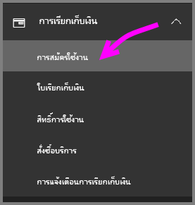
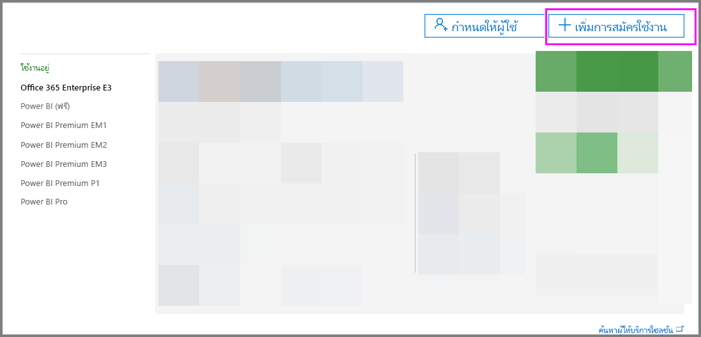
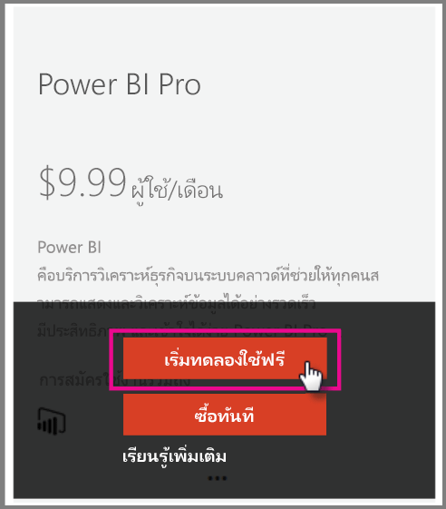

# Power BI Pro ในองค์กรของคุณ

Power BI Pro คือสิทธิ์ใช้งานแบบชำระเงินซึ่งจะมีการเปิดใช้งานคุณลักษณะเพิ่มเติม สิทธื์ใช้งาน Power BI Pro มีไว้สำหรับทีมงานที่ต้องการแชร์และทำงานร่วมกับผู้อื่นเพื่อทำการตัดสินใจบนพื้นฐานของข้อมูล  สมาชิกแต่ละรายในทีมที่ต้องการสร้าง หรือดูเนื้อหา Power BI ที่ใช้ร่วมกันจำเป็นต้องมีสิทธิ์การใช้งาน Pro เว้นแต่ว่าเนื้อหาเกี่ยวข้องกับความจุเฉพาะโดยใช้ Power BI Premium

คุณลักษณะเหล่านี้จำเป็นต้องใช้สิทธิ์การใช้งาน Power BI Pro

* **วิเคราะห์ข้อมูลใน Excel หรือ Power BI Desktop** ใช้ Excel หรือ Power BI Desktop เพื่อดู และโต้ตอบกับชุดข้อมูลที่เผยแพร่ใน Power BI โปรดดูที่[วิเคราะห์ใน Excel](service-analyze-in-excel.md)เพื่อศึกษาข้อมูลเพิ่มเติม

* **แชร์แดชบอร์ดและทำงานร่วมกันกับพื้นที่ทำงาน** พื้นที่ทำงาน Power BI ช่วยอำนวยความสะดวกในการทำงานร่วมกันกับเพื่อนร่วมงานบนแดชบอร์ด รายงาน และชุดข้อมูล โปรดดูที่[ทำงานร่วมกันในพื้นที่ทำงานของแอป Power BI ของคุณ](service-collaborate-power-bi-workspace.md)เพื่อศึกษาข้อมูลเพิ่มเติม

* **ดูเนื้อหาที่แชร์** ผู้ใช้แบบ Pro สามารถดูแดชบอร์ด และรายงานที่แชร์กับพวกเขา โต้ตอบกับแดชบอร์ดและรายงานที่ มีถูกแชร์กับพวกเขา และการแชร์แดชบอร์ด และรายงานที่ถูกแชร์กับพวกเขา(ถ้าได้รับอนุญาต) อย่างไรก็ตามผู้ใช้ Pro ไม่สามารถแก้ไขแดชบอร์ดหรือรายงานเหล่านี้ได้ โปรดดูที่[แชร์แดชบอร์ด Power BI และรายงานของคุณกับเพื่อนร่วมงานและผู้อื่น](service-share-dashboards.md)เพื่อศึกษาข้อมูลเพิ่มเติม

* **รวมเนื้อหาด้วย Microsoft Teams**คุณสามารถเพิ่มแท็บ Power BI ในแชนเนล Microsoft (MS) Teams ได้ MS Teams จะตรวจหารายงานทั้งหมดในพื้นที่ทำงานโดยอัตโนมัติ โปรดดูที่[สร้างทีม Power BI ด้วย Microsoft Teams](https://powerbi.microsoft.com/en-us/blog/power-bi-teams-up-with-microsoft-teams/)เพื่อศึกษาข้อมูลเพิ่มเติม 

## Power BI Pro เวอร์ชันทดลองใช้ 60 วันสำหรับบุคคล

หลังจากที่คุณลงทะเบียนบัญชีฟรีของคุณ คุณสามารถเลือกเพื่อทดลองใช้งาน Pro ฟรี 60 วัน คุณจะสามารถเข้าถึงคุณลักษณะ Pro ทั้งหมดในระยะเวลาการทดลองใช้ Power BI Pro มีคุณลักษณะทั้งหมดของ Power BI เวอร์ชันทดลองใช้ฟรี และการใช้งานร่วมกันเพิ่มเติมและคุณลักษณะการทำงานร่วมกัน โปรดดูที่ [ข้อมูลราคา Power BI](https://powerbi.microsoft.com/en-us/pricing/)สำหรับข้อมูลเพิ่มเติม หากต้องการทดลองใช้งาน Power BI Pro ฟรี 60 วันให้ลงชื่อเข้าใช้ Power BI และลองใช้คุณลักษณะ Power BI Pro เหล่านี้

* [สร้างพื้นที่ทำงาน](service-create-distribute-apps.md)
* [แชร์แดชบอร์ด](service-share-dashboards.md)

เมื่อคุณลองใช้งานคุณลักษณะเหล่านี้ คุณจะได้รับพร้อมท์เพื่อเริ่มการทดลองใช้งานฟรี คุณยังสามารถเลือกที่ใช้งานโดยไปที่ไอคอนรูปเฟือง และเลือก “จัดการพื้นที่เก็บข้อมูลส่วนบุคคล” จากนั้นเลือก “ทดลองใช้งาน Pro ฟรี” ทางด้านขวา

   
    
   

จากนั้นคุณสามารถเลือก “เริ่มทดลองใช้” ได้

   

> [!NOTE]
> ผู้ใช้ที่ใช้ประโยชน์จากการทดลองใช้ Power BI Pro ในผลิตภัณฑ์นี้จะไม่ปรากฏในพอร์ทัลผู้ดูแลระบบ Office 365 ว่าเป็นผู้ใช้ Power BI Pro รุ่นทดลองใช้ (ปรากฏเป็นผู้ใช้งาน Power BI ฟรี) แต่จะแสดงเป็นผู้ใช้ Power BI Pro รุ่นทดลองใช้ในหน้าจัดการพื้นที่เก็บข้อมูลใน Power BI
>

> [!NOTE]
> ถ้าคุณเป็นผู้ดูแลระบบ IT ที่มีความประสงค์จะขอรับและปรับใช้งานสิทธิ์การใช้งานเวอร์ชันทดลองใช้ Power BI ให้กับผู้ใช้หลายรายในองค์กรของคุณโดยไม่ต้องหารให้ผู้ใช้แต่ละรายยอมรับเงื่อนไขการทดลองใช้งาน คุณสามารถลงทะเบียนสมัครใช้งานเวอร์ชันทดลองใช้ Power BI Pro คุณจะต้องเป็นผู้ดูแลระบบส่วนกลางของ Office 365 หรือการเรียกเก็บเงิน หรือจะต้องสร้างผู้เช่าใหม่เพื่อลงทะเบียนเวอร์ชันทดลองใช้สำหรับผู้ดูแลระบบ โปรดดูที่[การซื้อ Power BI Pro](service-admin-purchasing-power-bi-pro.md)สำหรับข้อมูลเพิ่มเติม
>

เมื่อคุณอยู่ในการบริการ คุณสามารถตรวจสอบได้ว่าคุณมีบัญชีผู้ทดลองใช้ Pro ฟรีได้โดยไปที่ไอคอนรูปเฟือง และเลือก “จัดการพื้นที่เก็บข้อมูลส่วนบุคคล”

   

## การสมัครใช้งานเวอร์ชันทดลองใช้ใน Office 365

คุณสามารถขอรับ Power BI Pro แบบทดลองใช้สำหรับองค์กรของคุณได้ เมื่อคุณสมัครใช้งานแล้ว คุณสามารถกำหนดสิทธิ์การใช้งาน Power BI Pro ให้กับผู้ใช้ของคุณ โปรดดูที่ [กำหนดสิทธิ์การใช้งานให้กับผู้ใช้ใน Office 365 ](https://support.office.com/en-us/article/assign-licenses-to-users-in-office-365-for-business-997596b5-4173-4627-b915-36abac6786dc?ui=en-US&rs=en-US&ad=US)เพื่อศึกษาข้อมูลเพิ่มเติมเกี่ยวกับวิธีกำหนดสิทธิ์การใช้งาน

> [!NOTE]
> มีขีดจำกัดของเวอร์ชันทดลองใช้ขององค์กรหนึ่งเวอร์ชันสำหรับแต่ละผู้เช่า ซึ่งหมายความว่า ถ้าหากมีผู้สมัครใช้งาน Power BI Pro รุ่นทดลองใช้กับผู้เช่าของคุณแล้ว คุณจะไม่สามารถสมัครได้อีก หากคุณต้องการความช่วยเหลือเกี่ยวกับเรื่องนี้ คุณสามารถติดต่อ[ฝ่ายสนับสนุนการเรียกเก็บเงินของ Office 365](https://support.office.microsoft.com/en-us/article/contact-support-for-business-products-admin-help-32a17ca7-6fa0-4870-8a8d-e25ba4ccfd4b?CorrelationId=552bbf37-214f-4202-80cb-b94240dcd671&ui=en-US&rs=en-US&ad=US)
>

ทำตามขั้นตอนเหล่านี้เพื่อสมัครใช้งานเวอร์ชันทดลองใช้ใน Offiec 365

1. ไปยัง [ศูนย์การจัดการ Office 365](https://portal.office.com/adminportal/home#/homepage)
2. ในบานหน้าต่างนำทางด้านซ้าย ให้เลือกการออกใบแจ้งหนี้ แล้วคลิกที่การสมัครใช้งาน

   

3. เลือก “เพิ่มการสมัครใช้งาน” ที่อยู่ทางด้านขวา

   

4. ภายใต้แผนอื่นๆ ให้เลื่อนเม้าส์วางไปบนจุดไข่ปลา (...) สำหรับ Power BI Pro แล้วเลือก “เริ่มใช้งานรุ่นทดลองใช้”

    

5. เลือก “ลองทันที” ในหน้าจอยืนยันการสั่งซื้อของคุณ
6. เลือก “ดำเนินการต่อ” ในใบเสร็จการสั่งซื้อ

## การซื้อ Power BI Pro

คุณสามารถซื้อ Power BI Pro ผ่าน Microsoft Office 365 หรือผ่านคู่ค้า Microsoft ที่ผ่านการรับรอง โปรดดูที่[การซื้อ Power BI Pro](service-admin-purchasing-power-bi-pro.md)เพื่อศึกษาข้อมูลเพิ่มเติมเกี่ยวกับวิธีการซื้อ Power BI Pro

## ขั้นตอนถัดไป
[ลงทะเบียนสำหรับ Power BI ดด้วยตนเอง](service-admin-signing-up-for-power-bi-with-a-new-office-365-trial.md)
 
[Power BI (ฟรี) ในองค์กรของคุณ](service-admin-service-free-in-your-organization.md)
 
[ซื้อ Power BI Pro](service-admin-purchasing-power-bi-pro.md)
 
[ขยายเวลาการเปิดใช้งาน Pro เวอร์ชันทดลองใช้](service-extended-pro-trial.md)
 
[การกำหนดสิทธิ์การใช้งาน Power BI Pro](service-admin-assigning-power-bi-pro-licenses.md)
 
[Power BI Premium คืออะไร](service-admin-premium-manage.md)
 
[วิธีการซื้อ Power BI Premium](service-admin-premium-purchase.md)
 
[เอกสารทางเทคนิคของ Power BI Premium](https://aka.ms/pbipremiumwhitepaper)

มีคำถามเพิ่มเติมหรือไม่ [ลองถามชุมชน Power BI](https://community.powerbi.com/)