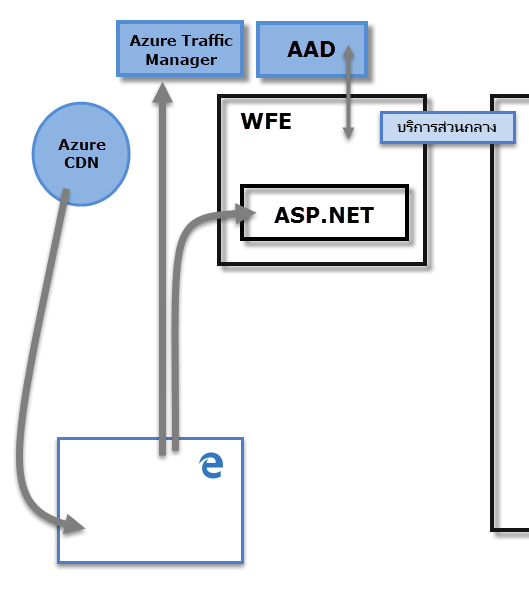
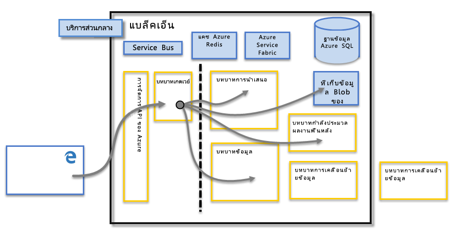

# Power BI Security
สำหรับคำอธิบายโดยละเอียดของการรักษาความปลอดภัยของ Power BI security กรุณา[ดาวน์โหลดเอกสารทางเทคนิคของ Power BI Security](http://go.microsoft.com/fwlink/?LinkId=829185)

Power BI service ถูกสร้างบน**Azure**ซึ่งเป็นโครงสร้างพื้นฐานและแพลตฟอร์มการประมวลผล ชอง Microsoft cloud สถาปัตยกรรม Power BI service นั้นยึดตามคลัสเตอร์สองตัวคลัสเตอร์ Web Front End (**WFE**) และคลัสเตอร์**Back End** คลัสเตอร์ WFE รับผิดชอบการเชื่อมต่อเริ่มต้นและการรับรองตัวตนเพื่อไปยัง Power BI service และเมื่อการรับรองตัวตนเสร็จ Back End จะจัดการผู้ใช้อื่น ๆ ที่ตามมาทั้งหมด Power BI ใช้ Azure Active Directory (AAD) เพื่อจัดเก็บและจัดการข้อมูลประจำตัวผู้ใช้ และจัดการเก็บข้อมูลของข้อมูลและเมตาดาต้าโดยใช้ Azure BLOB และฐานข้อมูล SQL Azure ตามลำดับ

## สถาปัตยกรรมของ Power BI
การใช้งาน Power BI แต่ละรายการประกอบด้วยคลัสเตอร์สองตัว คลัสเตอร์ Web Front End (**WFE**) และคลัสเตอร์**Back End**

คลัสเตอร์**WFE**จัดการกระบวนการเชื่อมต่อและรับรองตัวตนเริ่มต้นสำหรับ Power BI โดยใช้ AAD ในการรับรองตัวตนของไคลเอ็นต์ และใส่โทเค็นสำหรับไคลเอ็นต์ถัดๆไป ซึ่งเชื่อมต่อ Power BI service. Power BI ยังใช้**Azure Traffic Manager** (ATM) โดยตรงกับปริมาณการใช้งานของผู้ใช้ที่ใกล้ที่สุดกับศูนย์ข้อมูล โดยขึ้นอยู่กับการบันทึก DNS ของไคลเอ็นต์ที่พยายามเชื่อมต่อกับกระบวนการรับรองตัวตนและเมื่อต้องดาวน์โหลดเนื้อหาแบบคงที่หรือไฟล์ Power BI ใช้**Azure Content Delivery Network** (CDN) เพื่อแจกจ่ายเนื้อหาแบบคงที่ที่จำเป็นได้อย่างมีประสิทธิภาพ และบันทึกเป็นไฟล์ในตัวผู้ใช้โดยยึดตามตำแหน่งที่ตั้งทางภูมิศาสตร์

คลัสเตอร์**Back End**คือวิธีการที่ไคลเอนต์การรับรองตัวตนแล้วโต้ตอบกับ Power BI service คลัสเตอร์**Back End**จัดการการแสดงภาพ แดชบอร์ดผู้ใช้ ชุดข้อมูล รายงาน ที่เก็บข้อมูล การเชื่อมต่อข้อมูล การรีเฟรชข้อมูล และลักษณะอื่น ๆ ของโต้ตอบกับ Power BI service **บทบาทเกตเวย์**ทำหน้าที่เป็นเกตเวย์ระหว่างผู้ใช้ที่ร้องขอและ Power BI service ผู้ใช้ไม่ได้ทำงานโดยตรงกับบทบาทใด ๆ นอกเหนือจาก**บทบาทเกตเวย์** **Azure API Management** จะจัดการ**บทบาทเกตเวย์**ในท้ายที่สุด

> [!IMPORTANT]
> ต้องบันทึกว่า**Azure API Management** (APIM) และบทบาท**เกตเวย์** (GW) จะสามารถเข้าถึงผ่านอินเทอร์เน็ตสาธารณะ พวกเขาให้รับรองตัวตน การอนุญาต DDoS protection Throttling ปรับสมดุลการโหลด กำหนดเส้นทาง และความสามารถอื่น ๆ
> 
> 

## ความปลอดภัยของพื้นที่จัดเก็บข้อมูล
Power BI ใช้เก็บข้อมูลหลักที่สองตัว สำหรับจัดเก็บและจัดการข้อมูล ข้อมูลที่อัปโหลดจากผู้ใช้โดยทั่วไปจะถูกส่งไปยังตัวเก็บ**Azure BLOB** และเมตาดาต้าทั้งหมดเช่นเดียวกับวัตถุของระบบเองจะถูกจัดเก็บใน **ฐานข้อมูล azure SQL**

เส้นไข่ปลาในรูปภาพคลัสเตอร์**Back End** ข้างต้น ชี้ให้เห็นขอบระหว่างสองส่วนที่สามารถเข้าถึงได้โดยผู้ใช้ (ทางด้านซ้ายของเส้นไข่ปลา) และบทบาทจะสามารถเข้าถึงได้โดยระบบเท่านั้น เมื่อผู้ใช้ที่รับตัวตนแล้วเชื่อมต่อไปยัง Power BI Service การเชื่อมต่อและคำขอใดๆ โดยไคลเอ็นต์จะถูกยอมรับและจัดการโดย**บทบาทเกตเวย์** (ในท้ายที่สุดจะจัดการโดย**Azure API Management**) ซึ่งโต้ตอบในนามของผู้ใช้กับส่วนเหลือของ Power BI Service ตัวอย่างเช่น เมื่อไคลเอ็นต์พยายามดูแดชบอร์ด **บทบาทเกตเวย์**จะยอมรับการร้องขอดังกล่าวจาก นั้นส่งการร้องขอแบบเพื่อแยกกันไปยัง**บทบาทงานนำเสนอ** เพื่อดึงข้อมูลจำเป็นที่เบราว์เซอร์ต้องใช้เพื่อแสดงแดชบอร์ด

## การรับตัวตนผู้ใช้
Power BI ใช้ Azure Active Directory ([AAD](http://azure.microsoft.com/services/active-directory/)) เมื่อต้องการรับรองตัวตอนผู้ใช้ที่เข้าสู่ระบบ ไปยังบริการ Power BI และในทางกลับกลับ ก็ใช้ข้อมูลประจำตัว Power BI เมื่อใดก็ตามที่ผู้ใช้พยายามเข้าแหล่งข้อมูลที่จำเป็นต้องรับรองตัวตน ผู้ใช้เข้าสู่ระบบไปยัง Power BI service ที่ใช้ที่อยู่อีเมลที่ใช้ในการสร้างบัญชี Power BI ของพวกเขา Power BI ใช้สิ่งนั้นเข้าสู่ระบบอีเมลในฐานะ*ชื่อผู้ใช้ที่มีผลบังคับใช้*ซึ่งจะถูกส่งผ่านไปยังแหล่งข้อมูล เมื่อใดก็ตามที่ผู้ใช้พยายามเชื่อมต่อกับข้อมูล *ชื่อผู้ใช้ที่มีผลบังคับใช้*นั้นถูกแมปไปยัง*ชื่อหลักผู้ใช้* ([UPN](https://msdn.microsoft.com/library/windows/desktop/aa380525\(v=vs.85\).aspx)และตกลงใช้โดเมนบัญชีผู้ใช้ Windows ที่เชื่อมโยงอยู่ เพื่อทำการรับรองตัวตน

สำหรับองค์กรที่ใช้อีเมลที่ทำงานสำหรับการเข้าสู่ระบบ Power BI (เช่น*david@contoso.com*), *ชื่อผู้ใช้ที่มีผลบังคับใช้*กับ UPN การแมปนั้นตรงไปตรงมา สำหรับองค์กรที่ไม่ได้ใช้อีเมลที่ทำงานเพื่อเข้าสู่ระบบ Power BI (เช่น*david@contoso.onmicrosoft.com*) การแมประหว่าง AAD และข้อมูลประจำตัวภายในองค์กรจะต้องใช้[directory synchronization](https://technet.microsoft.com/library/jj573653.aspx)ให้เพื่อทำงานอย่างถูกต้อง

แพลตฟอร์มความปลอดภัยสำหรับ Power BI ยังรวมถึงความปลอดภัยของสภาพแวดล้อมแบบหลายผู้เช่า การรักษาความปลอดภัยเครือข่าย และความสามารถในการเพิ่มมาตรการด้านความปลอดภัยตาม AAD เพิ่มเติม

## ข้อมูลและความปลอดภัยของบริการ
สำหรับข้อมูลเพิ่มเติม โปรดไปที่[ศูนย์ความเชื่อถือ Microsoft](https://www.microsoft.com/trustcenter)

ตามที่อธิบายไว้ก่อนหน้าในบทความนี้ การเข้าสู่ระบบ Power BI ของผู้ใช้ถูกใช้ โดยเซิร์ฟเวอร์ Active Directory ในองค์กรจะจับคู่ UPN สำหรับข้อมูลประจำตัว อย่างไรก็ตาม เป็นเรื่อง**สำคัญ**ที่ควรทราบว่า ผู้ใช้เป็นผู้รับผิดชอบข้อมูลที่พวกเขาแชร์ ถ้าผู้ใช้เชื่อมต่อกับแหล่งข้อมูลโดยใช้ข้อมูลประจำตัวของเขา จากนั้นการรายงาน (หรือแดชบอร์ด หรือชุดข้อมูล) จะยึดตามข้อมูลทีผู้ใช้ใช้ร่วมกับบุคคลที่แชร์แดชบอร์ด ซึ่งเขาจะไม่ได้รับการรับรองตัวตนกับแหล่งข้อมูลต้นฉบับ และจะสามารถเข้าถึงรายงานได้

มีข้อยกเว้นคือการเชื่อมต่อไปยัง**SQL Server Analysis Services**โดยใช้**เกตเวย์ข้อมูลภายในองค์กร** แดชบอร์ดจะถูกเก็บไว้ใน Power BI แต่เข้าถึงรายงานพื้นฐานหรือชุดข้อมูลเริ่มต้นการรับรองตัวตนสำหรับผู้ใช้ที่พยายามที่จะเข้าถึงรายงาน(หรือชุดข้อมูล) และการเข้าถึงจะอนุมัติ ถ้าผู้ใช้มีข้อมูลประจำตัวเพียงพอในการเข้าถึงข้อมูลเท่านั้น สำหรับข้อมูลเพิ่มเติม ให้ดู[เจาะลึกเกตเวย์ข้อมูลขององค์กร](service-gateway-onprem-indepth.md)

