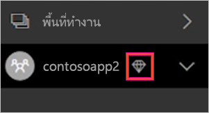

# จัดการความจุภายใน Power BI Premium และ Power BI Embedded
เรียนรู้วิธีที่คุณสามารถจัดการ Power BI Premium และความจุ Power BI Embedded ซึ่งมีแหล่งข้อมูลเฉพาะสำหรับเนื้อหาของคุณ

ความจุคือหัวใจสำคัญของข้อเสนอ Power BI Premium และ Power BI Embedded

## ความจุคืออะไร
ความจุคือชุดของทรัพยากรที่สงวนไว้สำหรับการใช้เฉพาะคุณ โดยการมีความจุนี้ช่วยให้คุณสามารถเผยแพร่แดชบอร์ด รายงาน และชุดข้อมูลไปยังผู้ใช้ทั่วทั้งองค์กรของคุณ โดยไม่ต้องซื้อสิทธิ์การใช้งานสำหรับพวกเขา นอกจากนียังรับรองความเชื่อถือได้ ความสอดคล้องของประสิทธิภาพการทำงานสำหรับเนื้อหาที่โฮสต์ในความจุ

ความจุจะโปร่งใสสำหรับผู้ใช้ทั้งหมด พวกเขาจะยังคงใช้ Power BI หรือแอปพลิเคชันของคุณตามปกติ พวกเขาไม่จำเป็นต้องระวังว่า บางส่วน (หรือทั้งหมด) ของเนื้อหาจะถูกโฮสต์ในความจุเฉพาะของคุณ สำหรับผู้ใช้ของคุณ ทุกอย่างทำงานตามเดิม

[!INCLUDE [powerbi-premium-illustration](./includes/powerbi-premium-illustration.md)]

สำหรับข้อมูลเพิ่มเติม ให้ดู [อะไรคือ Power BI Premium](service-premium.md)

### ผู้ดูแลกำลังการผลิต
> [!NOTE]
> ความสามารถของผู้ดูแลระบบ สำหรับความจุ Power BI Embedded ถูกกำหนดไว้ภายในพอร์ทัล Microsoft Azure

เมื่อคุณกำหนดความสามารถให้กับผู้ดูแลความสามารถ คุณมีการควบคุมทั้งหมดของความสามารถและการจัดการฟีเจอร์ จากพอร์ทัลผู้ดูแล Power BI คุณสามารถเพิ่มผู้ดูแลความสามารถเพิ่มเติม (Power BI Premium เท่านั้น) หรือมอบหมายสิทธิ์ความสามารถให้ผู้ใช้ คุณสามารถกำหนดพื้นที่ทำงานเมื่อต้องการความสามารถแบบกลุ่ม และดูเมตริกการใช้งานบนความจุ

ความสามารถแต่ละรายการมีผู้ดูแลระบบของตนเอง กำหนดเป็นผู้ดูแลความจุเมื่อต้องการกำลังการผลิตหนึ่งที่ไม่สามารถเข้าถึงความจุทั้งหมดภายในองค์กรของคุณ ผู้ดูแลความจุไม่สามารถเข้าถึงพื้นที่ทั้งหมดของผู้ดูแลระบบ Power BI ตามค่าเริ่มต้น เช่นเมตริกการใช้งาน บันทึกการตรวจสอบ หรือการตั้งค่าผู้เช่า ผู้ดูแลความจุยังมีสิทธิ์ในการตั้งค่าความจุใหม่ หรือเปลี่ยน SKU ของความจุที่มีอยู่ เฉพาะผู้ดูแลระบบส่วนกลางหรือผู้ดูแลการบริการ Power BI เท่านั้นที่สามารถเข้าถึงรายการเหล่านั้น

ผู้ดูแลระบบส่วนกลางของ Office 365 และผู้ดูแล Power BI ทั้งหมดเป็น ผู้ดูแลความจุของ Power BI Premium และ Power BI Embedded โดยอัตโนมัติ

## ซื้อความจุ
เมื่อต้องใช้ประโยชน์จากความจุเฉพาะ คุณจะจำเป็นต้องซื้อการสมัครใช้งานสำหรับ Power BI Premium ภายในศูนย์การจัดการ Office 365 หรือสร้างทรัพยากร Power BI Embedded ภายในพอร์ทัล Microsoft Azure สำหรับข้อมูลเพิ่มเติม โปรดดูบทความต่อไปนี้

* **Power BI Premium:** [วิธีซื้อ Power BI Premium](service-admin-premium-purchase.md)
* **Power BI Embedded** [ความจุสร้าง Power BI Embedded ในพอร์ทัล Azure](https://docs.microsoft.com/en-us/azure/power-bi-embedded/create-capacity)

เมื่อคุณซื้อ Power BI Premium SKU ผู้เช่าของคุณจะได้รับหมายเลขที่สอดคล้องกันของ v-cores สำหรับใช้ในการทำงานความจุ ตัวอย่างเช่น การซื้อ Power BI Premium P3 SKU มีผู้เช่าที่มี 32 v-cores

> [!NOTE]
> คุณจะมีเวลา 30 วันสำหรับการเข้าถึงแบบเต็ม หลังจากสิ้นสุดการสมัครใช้งานได้จบลง แต่หลังจากที่เนื้อหาของคุณเปลี่ยนกลับเป็นความจุที่ใช้ร่วมกัน แบบจำลองซึง > 1 กิกะไบต์จะไม่ได้รองรับกับสิทธิ์การใช้งานแบบแชร์

## จัดการความจุ
หลังจากที่คุณซื้อโหนดความจุภายใน Office 365 คุณจะต้องตั้งค่าความจุใหม่ ทำสิ่งนี้ได้ผ่าน [พอร์ทัลผู้ดูแลระบบของ Power BI](service-admin-portal.md) ภายในพอร์ทัลผู้ดูแล คุณจะเห็นส่วนเรียกว่า**ตั้งค่าความจุ** นี่คือที่ที่คุณจะจัดการความจุ Power BI Premium สำหรับองค์กรของคุณ

โดยเลือก**ตั้งค่าความจุ**จะนำคุณไปยังหน้าจอการจัดการความจุที่กำหนดค่าเริ่มต้น Power BI Premium

### การตั้งค่าความจุใหม่ (Power BI Premium)
จำนวน v-cores จะแสดงปริมาณการใช้และยอดเงินที่มีเพื่อสร้างความจุ จำนวน v-cores ที่มีให้องค์กรของคุณนั้นเป็นไปตามการ Premium SKU ที่คุณซื้อ ตัวอย่างเช่น ซื้อแบบ P3 และ P2 จะส่งผลให้มี 48 core ที่ใช้ได้ 32 cores จาก P3 และ 16 cores จาก P2

ถ้าคุณมี v-cores ให้ตั้งความจุใหม่ของคุณ โดยทำดังนี้

1. เลือก**ตั้งค่าความจุใหม่**
2. มอบ**ชื่อ**ความจุของคุณ
3. กำหนดว่าใครจะเป็นผู้ดูแลระบบความจุนี้

    ผู้ดูแลความจุไม่จำเป็นต้องเป็นผู้ดูแล Power BI หรือผู้ดูแลระบบส่วนกลางของ Office 365 สำหรับข้อมูลเพิ่มเติม ให้ดู [ผู้ดูแลความจ Power BI Premium](#capacity-admins)
4. เลือกขนาดของความจุ ตัวเลือกที่พร้อมใช้งานจะขึ้นอยู่กับจำนวน v-cores ที่คุณมี คุณไม่สามารถเลือกตัวเลือกที่มีขนาดใหญ่กว่าสิ่งที่คุณมีพร้อมใช้งานได้

    
5. เลือก**ตั้งค่า**

    

ผู้ดูแลรความจุ ตลอดจนผู้ดูแลระบบ Power BI และ ผู้ดูแลระบบ Office 365 ส่วนกลาง จะดูความจุที่แสดงอยู่ภายในพอร์ทัลผู้ดูแล

### การตั้งค่ากำลังการผลิต
ภายในหน้าจอการจัดการความจุ Premium คุณสามารถเลือก**ไอคอนรูปเฟือง (การตั้งค่า)** ภายใต้การดำเนินการได้ ซึ่งจะอนุญาตให้คุณสามารถเปลี่ยนชื่อ หรือลบความจุ ซึ่งจะระบุว่า เป็นผู้ดูแลระบบบริการ SKU/ขนาด ความจุของใคร ความจุของภูมิภาคใดที่อยู่ในนั้น

> [!NOTE]
> ความสามารถของผู้ดูแลความจุ ของ Power BI Embedded ถูกกำหนดไว้ภายในพอร์ทัล Microsoft Azure

### เปลี่ยนขนาดความจุ (Power BI Premium)
ผู้ดูแลระบบ Power BI และผู้ดูแลส่วนกลางของ Office 365 เปลี่ยนขนาดความจุ Power BI Premium โดยการเลือก**เปลี่ยนขนาดความจุ** ผู้ดูแลระบบความจุที่ไม่ใช่ผู้ดูแลระบบ Power BI หรือผู้ดูแลระบบส่วนกลางของ Office 365 จะไม่มีตัวเลือกนี้

การ**เปลี่ยนขนาความจุ**หน้าจอช่วยให้คุณอัปเกรด หรือการดาวน์เกรดขนาดความจุของคุณ ถ้าคุณมีทรัพยากรพร้อมใช้งาน ผู้ดูแลมีอิสระที่จะสร้าง การปรับขนาด และลบโหนด ดังนั้นตราบใดที่พวกเขามีจำนวน v-cores

P SKU ไม่สามารถลงให้เป็น EM SKUs ได้ คุณสามารถวางเมาส์ไว้เหนือตัวเลือกถูกปิดใช้งานซึ่งมีคำอธิบายอยู่

### มอบหมายความจุ
คุณสามารถจัดการความจุ โดยการเลือกชื่อของความจุ ซึ่งจะนำคุณไปยังหน้าจอการจัดการกำลังการความจุ

ถ้าพื้นที่ทำงานไม่ได้ถูกกำหนดให้กับความใด คุณจะเห็นข้อความเพื่อให้คุณสามารถ**กำหนดพื้นที่ทำงาน**

#### สิทธิ์ผู้ใช้
คุณสามารถกำหนด**ผู้ดูแลความจุ**สำหรับความจุ Power BI Premium ได้ เช่นเดียวกัน ให้ฐานะใช้จะมี**สิทธิ์ในการกำหนดความจุ** ผู้ใช้ที่มีสิทธี่การมอบหมายสามารถกำหนดพื้นที่ทำงานของแอปให้ความจุ ถ้าพวกเขาเป็นผู้ดูแลระบบของพื้นที่ทำงานนั้น พวกเขายังสามารถกำหนด*My Workspace*ส่วนบุคคลของพวกเขาให้ความจุได้ ผู้ใช้ที่มีสิทธิ์ที่มอบหมายจะไม่เข้าถึงพอร์ทัลผู้ดูแล

> [!NOTE]
> สำหรับความจุ Power BI Embedded ผู้ดูแลความจุจะถูกกำหนดให้อยู่ภายในพอร์ทัล Microsoft Azure
>
>

## กำหนดพื้นที่ทำงานของแอปไปยังความจุ
มีสองสามวิธีที่พื้นที่ทำงานสามารถถูกกำหนดความจุ

### จัดการความจุในพอร์ทัลของผู้ดูแลระบบ
ผู้ดูแลความจุ พร้อมกับผู้ดูแลระบบ Power BI และผู้ดูแลระบบส่วนกลางของ Office 365 กำหนดพื้นที่ทำงานที่ละหลายๆตัว ภายในส่วนการจัดการความจุพรีเมียมของพอร์ทัลผู้ดูแล เมื่อคุณจัดการความจุ คุณจะเห็นส่วน**พื้นที่ทำงาน**ที่ช่วยให้คุณสามารถกำหนดพื้นที่ทำงานได้

1. เลือก**กำหนดพื้นที่ทำงาน** ซึ่งจะแสดงอยู่ในหลายตำแหน่ง และทั้งหมดจะทำงานเดียวกัน
2. เลือกอย่างใดอย่างหนึ่ง **พื้นที่ทำงานของทั้งองค์กร**หรือ**พื้นที่ทำงานเฉพาะตามผู้ใช้**

   | การเลือก | คำอธิบาย |
   | --- | --- |
   | **พื้นที่ทำงานของทั้งองค์กร** |การกำหนดพื้นที่ทำงานของทั้งองค์กรให้กับความจุพรีเมียมจะกำหนดพื้นที่ทำงานของแอปและพื้นที่ทำงานของฉัน ทั้งหมดในองค์กรของคุณ ให้ความจุพรีเมียมนี้ นอกจากนี้ ผู้ใช้ปัจจุบันและในอนาคตทั้งหมดจะมีสิทธิ์ในการกำหนดพื้นที่ทำงานของแต่ละคนให้ความจุนี้ |
   | **พื้นที่ทำงานเฉพาะตามผู้ใช้** |เมื่อคุณกำหนดพื้นที่ทำงาน ตามผู้ใช้หรือตามกลุ่ม พื้นที่ทำงานทั้งหมดที่ผู้ใช้เหล่านั้นเป็นเจ้าของ จะถูกกำหนดให้กับความจุพรีเมียม รวมถึงพื้นที่ทำงานส่วนบุคคลของผู้ใช้ด้วย ลูกค้าที่ถูกบอกจะถูกำหนดการอนุญาตของพื้นที่ทำงาน ซึ่งรวมถึงพื้นที่ทำงานที่ถูกกำหนดให้กับความจุอื่น |
3. เลือก**นำไปใช้**

ตัวเลือกนี้อนุญาตให้คุณสามารถกำหนดพื้นที่ทำงานที่เฉพาะเจาะจงให้ความจุ

### การตั้งค่าพื้นที่ทำงานของแอป
คุณยังสามารถกำหนดพื้นที่ทำงานของแอปเป็นความจุพรีเมียม จากการตั้งค่าของพื้นที่การทำงานนั้น เพื่อกำหนดพื้นที่ทำงานเป็นแอปเมื่อต้องการกความจุแบบพรีเมียม ให้ทำสิ่งต่อไปนี้

เพื่อย้ายไปยังพื้นที่ทำงานในความจุ คุณต้องมีสิทธิ์ระดับผู้ดูแลระบบไปที่พื้นที่ทำงาน และยังมีสทธิ์ที่จะมอบความจุให้แก่ความจุนั้นได้ โปรดสังเกตว่า ผู้ดูแลระบบพื้นที่ทำงานสามารถลบพื้นที่ทำงานออกจากความจุพรีเมียมได้เสมอ

1. แก้ไขพื้นที่ทำงานของแอป โดยการเลือก**จุดไข่ปลา (...)** และเลือก**แก้ไขพื้นที่ทำงาน**

    
2. ภายใน**แก้ไขพื้นที่ทำงาน**ขยาย**ขั้นสูง**
3. ถ้าคุณได้รับสิทธิ์ในการกำหนดความจแก่ความจุใด ๆ คุณจะมีตัวเลือกในการเปิดใช้งาน**Premium**บนพื้นการที่ทำงานนี้
4. เลือกความจุที่คุณต้องการกำหนดให้พื้นที่ทำงานของแอปนี้

    
5. เลือก**บันทึก**

เมื่อบันทึก พื้นที่ทำงาน และเนื้อหาทั้งหมด จะถูกย้ายไปยังความจุพรีเมียมโดยไม่มีหยุดประสบการณ์การใช้งานสำหรับผู้ใช้ปลายทาง

## การใช้งานความจุของจอภาพ

Power BI มีแอปสำหรับการตรวจสอบการใช้งานความจุ สำหรับข้อมูลเพิ่มเติม ให้ดู [ตัวตรวจสอบความสามารถของ Power BI Premium ในองค์กรของคุณ](service-admin-premium-monitor-capacity.md)

## Premium ลักษณะสำหรับที่ผู้ใช้เห็น
สำหรับส่วนใหญ่ ผู้ใช้จะไม่จำเป็นต้องทราบว่า พวกเขาอยู่ในความจุพรีเมียม แดชบอร์ดและรายงานของพวกเขาจะแค่เพียงทำงานได้ เป็นคำแนะนำแบบเป็นภาพ คุณจะเห็นไอคอนรูปข้าวหลามตัดอยู่ถัดจากพื้นที่ทำงานที่อยู่ในความจุพรีเมียม

## คีย์ผลิตภัณฑ์เซิร์ฟเวอร์รายงาน Power BI
ภายในแท็บการ**ตั้งค่าความจุ**ของพอร์ทัลผู้ดูแลระบบ Power BI คุณจะสามารถเข้าถึงคีย์ผลิตภัณฑ์เซิร์ฟเวอร์รายงาน Power BI ของคุณ ซึ่งจะพร้อมใช้งานสำหรับผู้ดูแลระบบสากล หรือผู้ใช้ที่ได้รับการกำหนดบทบาทเป็นผู้ดูแลระบบ Power BI Premium SKU

โดยเลือก**คีย์เซิร์ฟเวอร์รายงาน Power BI**จะแสดงกล่องโต้ตอบที่มีคีย์ผลิตภัณฑ์ของคุณ คุณสามารถคัดลอกและใช้กับการติดตั้ง

สำหรับข้อมูลเพิ่มเติม ให้ดู[ติดตั้งเซิร์ฟเวอร์รายงาน Power BI](report-server/install-report-server.md)

## ขั้นตอนถัดไป
แชร์แอปที่เผยแพร่กับผู้ใช้ สำหรับข้อมูลเพิ่มเติม ให้ดู[สร้างและกระจายแอปใน Power BI](service-create-distribute-apps.md)

มีคำถามเพิ่มเติมหรือไม่ [ลองถามชุมชน Power BI](http://community.powerbi.com/)
