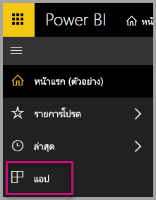
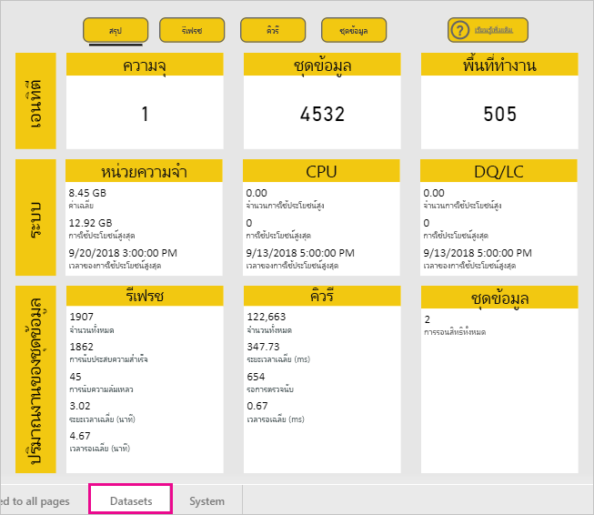
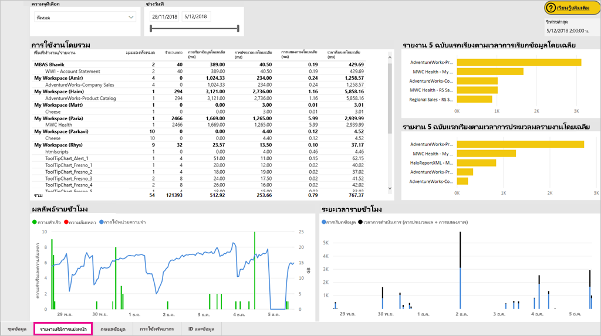
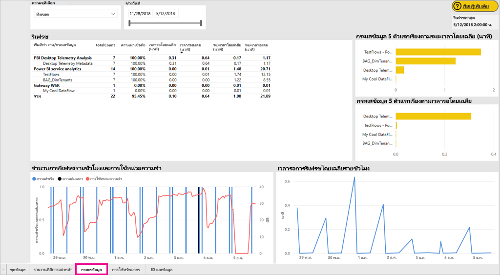
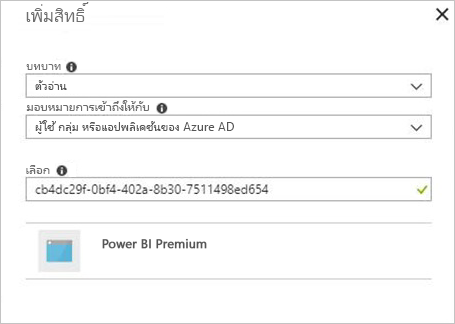
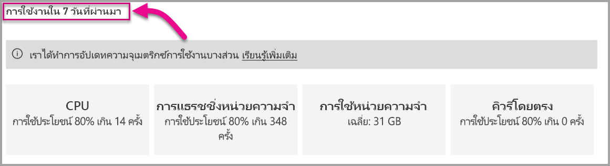

# ตรวจสอบความจุของ Power BI Premium และ Power BI Embedded

บทความนี้แสดงภาพรวมของการตรวจสอบตัววัดความจุ Power BI Premium ของคุณ การตรวจสอบการใช้งานความจจะุช่วยให้คุณสามารถใช้วิธีจัดการความจุได้อย่างมีข้อมูล

คุณสามารถตรวจสอบความจุด้วยแอปการวัดความจุ Power BI Premium หรือในพอร์ทัลผู้ดูแลระบบ เราขอแนะนำให้ใช้แอป เนื่องจากจะมีรายละเอียดมาก แต่บทความนี้ครอบคลุมทั้งสองตัวเลือก **เวอร์ชันปัจจุบันของแอปคือ 1.8 (เผยแพร่เมื่อ 7 พฤศจิกายน 2018)**

<iframe width="560" height="315" src="https://www.youtube.com/embed/UgsjMbhi_Bk?rel=0&amp;showinfo=0" frameborder="0" allowfullscreen></iframe>

## ติดตั้ง แอปวัดความจุ Premium

คุณสามารถไปยัง[แอปวัดความจุ Premium ](https://app.powerbi.com/groups/me/getapps/services/capacitymetrics)ได้โดยตรงหรือติดตั้งแอปเหมือนที่คุณทำกับแอปอื่นๆ ใน Power BI

1. ใน Power BI คลิ๊ก**แอป**

    

1. ทางด้านขวา คลิ๊ก**รับแอป**

1. ในประเภท**แอป** ค้นหา**แอปวัดความจุ Power BI Premium**

1. สมัครใช้งานเพื่อติดตั้งแอป

หลังจากที่คุณติดตั้งแอป คุณสามารถดูตัววัดในเรื่องความจุในองค์กรของคุณ ลองมาดูการวัดสำคัญบางอย่างที่พร้อมใช้งาน

## ใช้แอปการวัด

เมื่อคุณเปิดแอป จะพบแดชบอร์ดก่อนพร้อมข้อมูลสรุปของความจุทั้งหมดที่คุณมีสิทธิ์ผู้ดูแลระบบ

คลิกแดชบอร์ดเพื่อไปยังรายงานพื้นฐาน รายงานมีหกแท็บ ดังจะอธิบายรายละเอียดเพิ่มเติมในส่วนด้านล่าง

* **ตัวกรอง**: ช่วยให้คุณกรองหน้าอื่นๆ ในรายงานไปยังความจุเฉพาะได้

* **ชุดข้อมูล**: เมตริกโดยละเอียดของสถานภาพของชุดข้อมูล Power BI ภายในความจุของคุณ

* **รายงานแบบแบ่งหน้า**: เมตริกโดยละเอียดของสถานภาพของรายงานแบบแบ่งหน้าภายในความจุของคุณ

* **กระแสข้อมูล**: เมตริกโดยละเอียดของการรีเฟรชสำหรับกระแสข้อมูลในความจุของคุณ

* **ระบบ**: เมตริกความจุโดยรวม รวมทั้งหน่วยความจำและการใข้งาน CPU แบบสูง

* **แสดงชื่อและรหัส**: ชื่อ รหัส และเจ้าของของความจุ พื้นที่ทำงาน และปริมาณงาน

### แท็บตัวกรอง

แท็บ**ตัวกรอง** จะให้คุณได้เลือกความจุ ช่วงวันที่ และตัวเลือกอื่นๆ ได้ จากนั้นตัวกรองจะถูกนำไปใช้กับหน้าและไทล์ที่เกี่ยวข้องในรายงาน หากไม่ได้เลือกตัวกรอง รายงานเริ่มต้นจะแสดงผลการวัดของสัปดาห์ที่ผ่านมาบนความจุทุกอันที่คุณเป็นเจ้าของ

* **(A)** เลือก**ชุดข้อมูล**, **รายงานแบบแบ่งหน้า** หรือ **กระแสข้อมูล** เพื่อตั้งค่าตัวกรองสำหรับปริมาณงานแต่ละตัว

* **(B)** ชื่อ และข้อมูล **(C)** จะได้รับการอัปเดตตามการเลือกของคุณใน **(A)** เพื่อให้คุณสามารถกรองปริมาณงานด้วยชื่อได้ ตัวอย่างเช่น ในรูปภาพด้านบน มีการเลือก**กระแสข้อมูล** ซึ่งแสดง**ชื่อกระแสข้อมูล**และ**ข้อมูลกระแสข้อมูล**

* **(D)** ข้อมูลความจุ ซึ่งจะแสดงให้เห็นว่าชุดข้อมูล รายงานแบบแบ่งหน้า หรือกระแสข้อมูลเปิดใช้สำหรับความจุนั้นอยู่หรือไม่

### แท็บชุดข้อมูล

ใช้ปุ่มที่ด้านบนของแท็บ**ชุดข้อมูล**เพื่อนำทางไปยังส่วนต่างๆ: **สรุป**, **รีเฟรช**, **ระยะเวลาคิวรี**, **การรอคิวรี** และ **ชุดข้อมูล**

#### ส่วนสรุป

ส่วน **สรุป** จะแสดงมุมมองความจุของคุณโดยยึดตามเอนทิตี, ทรัพยากรระบบ และปริมาณงานชุดข้อมูล โดยจะแสดงเมตริกต่อไปนี้

| **ส่วนรายงาน** | **การวัด** |
| --- | --- |
| **เอนทิตี** | * จำนวนของความจุที่คุณเป็นเจ้าของ  * เฉพาะจำนวนชุดข้อมูลในความจุของคุณ  * เฉพาะจำนวนพื้นที่ทำงานในความจุของคุณ |
| **ระบบ** | * การใช้หน่วยความจำโดยเฉลี่ยในปริมาณ GB ในช่วงเจ็ดวันที่ผ่านมา  * การใช้หน่วยความจำสูงสุดในปริมาณกิกะไบต์ในช่วง 7 วันและเวลาท้องถิ่นที่เกิดขึ้น  * จำนวนครั้งที่ CPU เกิน 80% ของค่าเกณฑ์ใน 7 วันที่ผ่านมา แยกเป็นบักเก็ตสามนาที  * เวลาส่วนใหญ่ที่ CPU เกิน 80% ในช่วง 7 วัน แยกเป็นบักเก็ตหนึ่งชั่วโมง และเวลาท้องถิ่นที่เกิดขึ้น  * จำนวนครั้งที่เชื่อมต่อคิวรีโดยตรง/สด เกิน 80% ของค่าเกณฑ์ใน 7 วันที่ผ่านมา แยกเป็นบักเก็ตสามนาที  * เวลาส่วนใหญ่ที่เชื่อมต่อคิวรีโดยตรง/สดเกิน 80% ในช่วง 7 วันที่ผ่านมา แยกเป็นบักเก็ตหนึ่งชั่วโมง และเวลาท้องถิ่นที่เกิดขึ้น |
| **ปริมาณงานชุดข้อมูล** | * จำนวนทั้งหมดของการรีเฟรชใน 7 วันที่ผ่านมา  * จำนวนทั้งหมดของการรีเฟรชสำเร็จใน 7 วันที่ผ่านมา  * จำนวนทั้งหมดของการรีเฟรชล้มเหลวใน 7 วันที่ผ่านมา  * จำนวนทั้งหมดของการรีเฟรชล้มเหลวเนื่องจากหน่วยความจำไม่พอ  * ระยะเวลาการรีเฟรชเฉลี่ยคือเวลาที่ใช้เพื่อเสร็จสิ้นการดำเนินการเป็นนาที  * เวลารอรีเฟรชเฉลี่ยจะคือการหน่วงเวลาเฉลี่ยระหว่างเวลาที่กำหนดไว้และเวลาเริ่มต้นของการดำเนินการเป็นนาที  * จำนวนรวมของคิวรีทั้งหมดที่เรียกใช้ใน 7 วันที่ผ่านมา  * จำนวนรวมของคิวรีที่ประสบความสำเร็จใน 7 วันที่ผ่านมา  * จำนวนรวมของคิวรีที่ล้มเหลวใน 7 วันที่ผ่านมา  * ระยะเวลาคิวรีเฉลี่ยคือเวลาที่ใช้เพื่อจบการดำเนินการ เป็นนาที  * จำนวนรวมของแบบจำลองที่ลดลงเนื่องจากหน่วยความจำไม่เพียงพอ |
|  |  |

#### ส่วนรีเฟรช

พื้นที่**รีเฟรช**ประกอบไปด้วยเมตริกต่อไปนี้

| **ส่วนรายงาน** | **การวัด** |
| --- | --- |
| **ความน่าเชื่อถือของการรีเฟรช** | * จำนวนรวม: การรีเฟรชทั้งหมดสำหรับแต่ละชุดข้อมูล  * ความน่าเชื่อถือ: เปอร์เซ็นต์ของการรีเฟรชที่เสร็จสมบูรณ์สำหรับแต่ละชุดข้อมูล  * เวลารอเฉลี่ย: การหน่วงเวลาเฉลี่ยระหว่างเวลาที่กำหนดไว้และเวลาเริ่มต้นของการดำเนินการเป็นนาที  * เวลารอสูงสุด: เวลารอสูงสุดสำหรับชุดข้อมูล เป็นนาที   * ระยะเวลาเฉลี่ย: ระยะเวลาเฉลี่ยของการรีเฟรชสำหรับชุดข้อมูล เป็นนาที  * ระยะเวลาสูงสุด: ระยะเวลาของการรีเฟรชที่ทำงานนานที่สุดสำหรับชุดข้อมูล เป็นนาที |
| **ชุดข้อมูล 5 ชุดแรกเรียงตามระยะเวลาการรีเฟรชเฉลี่ย** | * ชุดข้อมูลห้าชุดที่มีระยะเวลารีเฟรชเฉลี่ยนานที่สุด เป็นนาที |
| **ชุดข้อมูล 5 ชุดแรกเรียงตามเวลารอเฉลี่ย** | * ชุดข้อมูลห้าชุดที่มีเวลารอเฉลี่ยนานที่สุด เป็นนาที |
| **เวลารอการรีเฟรชเฉลี่ยต่อชั่วโมง** | * เวลารอการรีเฟรชเฉลี่ย แยกเป็นกลุ่มหนึ่งชั่วโมง รายงานตามเวลาท้องถิ่น เวลารอการรีเฟรชสูงหลายๆ ครั้งแสดงว่าความจุกำลังทำงานอย่างหนัก |
| **จำนวนการรีเฟรชต่อชั่วโมงและปริมาณการใช้หน่วยความจำ** | * ความสำเร็จ ความล้มเหลว และปริมาณการใช้หน่วยความจำ แยกเป็นกลุ่มหนึ่งชั่วโมง รายงานตามเวลาท้องถิ่น |
|  |  |

#### ส่วนระยะเวลาคิวรี่

พื้นที่**ระยะเวลาคิวรี**ประกอบไปด้วยเมตริกต่อไปนี้

| **ส่วนรายงาน** | **การวัด** |
| --- | --- |
| **ระยะเวลาคิวรี** | * ข้อมูลในส่วนนี้ถูกแบ่งออกด้วยชุดข้อมูล พื้นที่ทำงาน และกลุ่มชั่วโมง ในช่วงเจ็ดวันที่ผ่านมา  * ผลรวม: จำนวนรวมของคิวรีที่เรียกใช้สำหรับชุดข้อมูล  * ค่าเฉลี่ย: ระยะเวลาคิวรีเฉลี่ยสำหรับชุดข้อมูล เป็นมิลลิวินาที  * สูงสุด: ระยะเวลาคิวรีที่ทำงานนานที่สุดในชุดข้อมูล เป็นมิลลิวินาที|
| **การกระจายระยะเวลาคิวรี** | * ฮิสโตแกรมระยะเวลาคิวรีได้รับการจัดกลุ่มด้วยระยะเวลาคิวรี (เป็นมิลลิวินาที) ออกเป็นประเภทต่อไปนี้: <= ช่วง 30ms, 30-100ms, 100-300ms, 300ms-1sec, 1sec-3sec, 3sec-10sec, 10sec-30sec, และ > 30 วินาที ระยะเวลาคิวรีและเวลารอที่ยาวนานบ่งชี้ความจุที่ถูกเรียกใช้อย่างมาก ซึ่งอาจหมายความถึงชุดข้อมูลเดียว กำลังก่อปัญหาและต้องได้รับการตรวจสอบ |
| **ชุดข้อมูล 5 ชุดแรกเรียงตามระยะเวลาเฉลี่ย** | * ชุดข้อมูลห้าชุดที่มีระยะเวลาคิวรีเฉลี่ยนานที่สุด เป็นมิลลิวินาที |
| **คิวรีตรง / การเชื่อมต่อสด (การใช้งาน > 80%)** | * เวลาที่คิวรีตรงหรือการเชื่อมต่อสดใช้เกิน 80% ของการใช้งาน CPU แยกเป็นกลุ่มชั่วโมง รายงานตามเวลาท้องถิ่น |
| **การกระจายระยะเวลาคิวรีต่อชั่วโมง** | * จำนวนคิวรีและระยะเวลาเฉลี่ย (เป็นมิลลิวินาที) กับปริมาณการใช้หน่วยความจำในหน่วย GB แยกเป็นกลุ่มชั่วโมง รายงานตามเวลาท้องถิ่น |
|  |  |

#### ส่วนการรอคิวรี่

พื้นที่**การรอคิวรี**ประกอบไปด้วยเมตริกต่อไปนี้

| **ส่วนรายงาน** | **การวัด** |
| --- | --- |
| **เวลารอคิวรี** | * ข้อมูลในส่วนนี้ถูกแบ่งออกด้วยชุดข้อมูล พื้นที่ทำงาน และกลุ่มชั่วโมง ในช่วงเจ็ดวันที่ผ่านมา  * ผลรวม: จำนวนรวมของคิวรีที่เรียกใช้สำหรับชุดข้อมูล  * จำนวนการรอ: จำนวนของคิวรีในชุดข้อมูลที่รออยู่บนทรัพยากรของระบบก่อนการเริ่มดำเนินการ   * เฉลี่ย: ระยะเวลารอคิวรีเฉลี่ยสำหรับชุดข้อมูล เป็นมิลลิวินาที  * สูงสุด: ระยะเวลาคิวรีที่รอนานที่สุดในชุดข้อมูล เป็นมิลลิวินาที|
| **การกระจายเวลารอ** | * ฮิสโตแกรมของระยะเวลาคิวรีได้รับการจัดกลุ่มโดยระยะเวลาคิวรี (เป็นมิลลิวินาที) ออกเป็นประเภทต่อไปนี้: ช่วง<= 50ms , 50-100ms , 100-200ms , 200-400ms, 400ms-1sec , 1 sec-5 sec และ > 5 วินาที |
| **ชุดข้อมูล 5 ชุดแรกเรียงตามเวลารอเฉลี่ย** | * ชุดข้อมูลห้าชุดที่มีเวลารอเฉลี่ยนานที่สุดในการเริ่มดำเนินการคิวรี เป็นมิลลิวินาที |
| **เวลาและจำนวนการรอคิวรีต่อชั่วโมง** | * จำนวนการรอคิวรีและเวลารอเฉลี่ย (เป็นมิลลิวินาที) ต่อปริมาณการใช้หน่วยความจำในหน่วย GB แยกเป็นกลุ่มหนึ่งชั่วโมง รายงานตามเวลาท้องถิ่น |
|  |  |

#### ส่วนชุดข้อมูล

พื้นที่**ชุดข้อมูล**ประกอบไปด้วยเมตริกต่อไปนี้

| **ส่วนรายงาน** | **การวัด** |
| --- | --- |
| **จำนวนการลดชุดข้อมูล** | * ผลรวม: จำนวนรวมของ*การลด*ชุดข้อมูลสำหรับแต่ละความจุ เมื่อความจุเผชิญกับความกดดันที่มีต่อหน่วยความจำ โหนดจะลดชุดข้อมูลอย่างน้อยหนึ่งชุดออกจากหน่วยความจำ ชุดข้อมูลที่ไม่ได้ใช้งาน (ที่ไม่มีการสคิวรี่/ รีเฟรชกำลังดำเนินการอยู่) จะถูกขับออกก่อน จากนั้นคำสั่งการขับไล่จะขึ้นอยู่กับการวัด 'การใช้น้อยที่สุด' (LRU)|
| **การลดชุดข้อมูลต่อชั่วโมงและปริมาณการใช้หน่วยความจำ** | * การลดชุดข้อมูลกับปริมาณการใช้หน่วยความจำในหน่วย GB แยกเป็นกลุ่มหนึ่งชั่วโมง รายงานตามเวลาท้องถิ่น |
|  |  |

### แท็บรายงานการแบ่งหน้า

แท็บ**รายงานแบบแบ่งหน้า**จะแสดงเมตริกโดยละเอียดของสถานภาพของรายงานแบบแบ่งหน้าในความจุของคุณ

แท็บ**รายงานแบบแบ่งหน้า**ประกอบไปด้วยเมตริกต่อไปนี้

| **ส่วนรายงาน** | **การวัด** |
| --- | --- |
| **การใช้งานโดยรวม** | * มุมมองรวม: จำนวนครั้งที่มีผู้ใช้ดูรายงาน  * จำนวนแถว: จำนวนแถวของข้อมูลในรายงาน  * การค้นคืน (เฉลี่ย): ปริมาณเวลาเฉลี่ยที่ใช้ในการดึงข้อมูลสำหรับรายงาน เป็นมิลลิวินาที ระยะเวลาที่ยาวนานอาจเป็นการบ่งชี้ถึงคิวรีที่ช้าหรือปัญหาแหล่งข้อมูลอื่นๆ   * การประมวลผล (เฉลี่ย): ปริมาณเวลาเฉลี่ยที่ใช้ในการประมวลผลข้อมูลสำหรับรายงาน เป็นมิลลิวินาที * การแสดง (เฉลี่ย): ปริมาณเวลาเฉลี่ยที่ใช้ในการแสดงรายงานในเบราเซอร์ เป็นมิลลิวินาที  * เวลารวม: เวลาที่ใช้สำหรับขั้นตอนทั้งหมดของรายงาน เป็นมิลลิวินาที|
| **รายงาน 5 ฉบับแรกเรียงตามเวลาการค้นคืนข้อมูลเฉลี่ย** | * รายงานห้าฉบับที่ใช้เวลาค้นคืนข้อมูลเฉลี่ยนานที่สุด เป็นมิลลิวินาที |
| **รายงาน 5 ฉบับแรกเรียงตามเวลาการประมวลผลรายงายเฉลี่ย** | * รายงานห้าฉบับที่ใช้เวลาประมวลผลรายงานเฉลี่ยนานที่สุด เป็นมิลลิวินาที |
| **ระยะต่อชั่วโมง** | * การค้นคืนข้อมูลกับเวลาการประมวลผลและการแสดง แยกเป็นกลุ่มหนึ่งชั่วโมง รายงานตามเวลาท้องถิ่น |
| **ผลลัพธ์รายชั่วโมง** | * ความสำเร็จ ความล้มเหลว และปริมาณการใช้หน่วยความจำ แยกเป็นกลุ่มหนึ่งชั่วโมง รายงานตามเวลาท้องถิ่น |
|  |  |

### แท็บกระแสข้อมูล

แท็บ**กระแสข้อมูล**จะแสดงเมตริกการรีเฟรชโดยละเอียดสำหรับกระแสข้อมูลในความจุของคุณ

แท็บ**กระแสข้อมูล**ประกอบไปด้วยเมตริกต่อไปนี้

| **ส่วนรายงาน** | **การวัด** |
| --- | --- |
| **รีเฟรช** | * จำนวนรวม: การรีเฟรชทั้งหมดสำหรับแต่ละกระแสข้อมูล  * ความน่าเชื่อถือ: เปอร์เซ็นต์ของการรีเฟรชที่เสร็จสมบูรณ์สำหรับแต่ละกระแสข้อมูล  * เวลารอเฉลี่ย: การหน่วงเวลาเฉลี่ยระหว่างเวลาที่กำหนดไว้และเวลาเริ่มต้นของการรีเฟรชสำหรับกระแสข้อมูล เป็นนาที  * เวลารอสูงสุด: เวลารอสูงสุดสำหรับกระแสข้อมูล เป็นนาที   * ระยะเวลาเฉลี่ย: ระยะเวลาเฉลี่ยของการรีเฟรชสำหรับกระแสข้อมูล เป็นนาที  * ระยะเวลาสูงสุด: ระยะเวลาของการรีเฟรชที่ทำงานนานที่สุดสำหรับกระแสข้อมูล เป็นนาที |
| **กระแสข้อมูล 5 ตัวแรกเรียงตามระยะเวลาการรีเฟรชเฉลี่ย** | * ชุดข้อมูลห้าชุดที่มีระยะเวลารีเฟรชเฉลี่ยนานที่สุด เป็นนาที |
| **กระแสข้อมูล 5 ตัวแรกเรียงตามเวลารอเฉลี่ย** | * กระแสข้อมูลห้าตัวที่มีเวลารอการรีเฟรชเฉลี่ยนานที่สุด เป็นนาที |
| **เวลารอการรีเฟรชเฉลี่ยต่อชั่วโมง** | * เวลารอการรีเฟรชเฉลี่ย แยกเป็นกลุ่มหนึ่งชั่วโมง รายงานตามเวลาท้องถิ่น เวลารอการรีเฟรชสูงหลายๆ ครั้งแสดงว่าความจุกำลังทำงานอย่างหนัก |
| **จำนวนการรีเฟรชต่อชั่วโมงและปริมาณการใช้หน่วยความจำ** | * ความสำเร็จ ความล้มเหลว และปริมาณการใช้หน่วยความจำ แยกเป็นกลุ่มหนึ่งชั่วโมง รายงานตามเวลาท้องถิ่น |
|  |  |

### แท็บระบบ

แท็บ**ระบบ**จะแสดงปริมาณการใช้ CPU และหน่วยความจำของความจุและปริมาณงานทั้งหมด

แท็บ**ระบบ**ประกอบไปด้วยเมตริกต่อไปนี้

| **ส่วนรายงาน** | **การวัด** |
| --- | --- |
| **เมตริก CPU (การใช้งาน > 80%)** | * จำนวนครั้งที่ CPU เกิน 80% ของค่าเกณฑ์ใน 7 วันที่ผ่านมา แยกเป็นบักเก็ตสามนาที |
| **ปริมาณการใช้หน่วยความจำ** | * ปริมาณการใช้หน่วยความจำในเจ็ดวันที่ผ่านมา แยกเป็นกลุ่มสามนาที |
|  |  |

### แท็บแสดงชื่อและรหัส

แท็บ**แสดงชื่อและรหัส**ประกอบไปด้วยชื่อ รหัส และเจ้าของของความจุ พื้นที่ทำงาน และปริมาณงาน

## ตรวจสอบความจุ Power BI Embedded

คุณยังสามารถใช้แอปวัดความจุ Power BI Premium เพื่อตรวจสอบความจุ*A SKU*ใน Power BI Embedded ได้ ความจุเหล่านั้นจะแสดงในรายงานตราบใดที่คุณเป็นผู้ดูแลระบบของความจุ อย่างไรก็ตาม การรีเฟรชรายงานล้มเหลวเว้นแต่ว่าคุณให้สิทธิ์บางอย่างไปยัง Power BI ในเรื่อง A SKU ของคุณ:

1. เปิดความจุของคุณในพอร์ทัล Azure

1. คลิก**ควบคุมการเข้าถึง (IAM)** และเพิ่มแอป "Power BI Premium" ให้กับบทบาทผู้อ่าน ถ้าคุณไม่สามารถค้นพบแอปด้วยชื่อ คุณยังสามารถเพิ่มแอปได้ด้วย Id ของไคลเอ็นต์: cb4dc29f-0bf4-402a-8b30-7511498ed654 ได้

    

> [!NOTE]
> คุณสามารถตรวจสอบการใช้ความจุ Power BI Embedded ในแอปหรือพอร์ทัล Azure แต่ไม่ใช่ใน ในพอร์ทัลผู้ดูแลระบบ Power BI

## การตรวจสอบพื้นฐานในพอร์ทัลผู้ดูแลระบบ

การ**ตั้งค่าความจุ**ของพอร์ทัลผู้ดูแลมีสี่ตัววัดที่ระบุว่า ความจุของคุณมีภาระโหลดและใช้ทรัพยากรในช่วง 7 วันที่ผ่านมา ไทล์สี่ตัวเหล่านี้ทำงานบนกรอบเวลาชั่วโมงที่ระบุจำนวนชั่วโมงในช่วงเจ็ดวันที่ผ่านมาที่การวัดที่สอดคล้องกันเกิน 80% การวัดนี้ระบุการใช้งานที่เสื่อมถอยของผู้ใช้ปลายทาง

| **การวัด** | **คำอธิบาย** |
| --- | --- |
| CPU |จำนวนครั้งที่ CPU ใช้งานเกิน 80% |
| การแธรชชิ่งหน่วยความจำ |แทนความต้องการใช้งานหน่วยความจำของแกนประมวลผล backend ของคุณ เฉพาะเจาะจงมากขึ้น นี่คือเมตริกจำนวนครั้งที่ชุดข้อมูลถูกขับจากหน่วยความจำ เนื่องจากความต้องการหน่วยความจำจากการใช้หลายชุดข้อมูล |
| การใช้หน่วยความจำ |การใช้หน่วยความจำโดยเฉลี่ย แสดงในหน่วยกิกะไบต์ (GB) |
| DQ/s | จำนวนครั้งที่จำนวน Direct Query และการเชื่อมต่อสดเกิน 80% ของขีดจำกัด   * เราจำกัดจำนวนรวมของ DirectQuery และคิวรีการเชื่อมต่อสดต่อวินาที.* ขีดจำกัดคือ 30/s สำหรับ P1, 60/s สำหรับ P2 และ 120/s สำหรับ P3 * จำนวนคิวรีของ DirectQuery และการเชื่อมต่อสด นับรวมอยู่ในข้อจำกัดด้านบน ตัวอย่าง ถ้าคุณมี 15 DirectQueries และ 15 เชื่อมต่อแบบสด ในหนึ่งวินาที คุณกำลังทำงานเกินเกณฑ์ * นี่ใช้กับการเชื่อมต่อภายในองค์กรและ cloud อย่างเท้าเทียมกัน |
|  |  |

เมตริกสะท้อนการใช้งานสัปดาห์ที่ผ่านมา  ถ้าคุณต้องการดูเมตริกที่ละเอียดขึ้น คุณสามารถทำได้โดยคลิกที่ไทล์สรุป  ซึ่งจะนำคุณไปยังแผนภูมิรายละเอียดสำหรับแต่ละของเมตริกของความจุพรีเมียมของคุณ แผนภูมิต่อไปนี้แสดงรายละเอียดสำหรับการวัด CPU

แผนภูมิเหล่านี้จะสรุปสำหรับสัปดาห์ที่ผ่านมาเป็นรายชั่วโมง ซึ่งสามารถช่วยแยกแยะหาสาเหตุ เมื่อคุณพบเหตุการณ์ที่เกี่ยวข้องกับประสิทธิภาพในความจุพรีเมียมของคุณได้

คุณยังสามารถส่งออกข้อมูลเบื้องต้นสำหรับเมทริกใด ๆ ไปยังไฟล์ csv ได้  การส่งออกนี้จะให้รายละเอียดข้อมูลกับคุณ ในรายสามนาที สำหรับแต่ละวันของสัปดาห์ที่ผ่านมา

## ขั้นตอนถัดไป

หลังจากที่คุณทำความเข้าใจวิธีการตรวจสอบความจุของ Power BI Premium ลองเรียนรู้เพิ่มเติมเกี่ยวกับการปรับความจุให้เหมาะสม

> [!div class="nextstepaction"]
> [การจัดการและการปรับทรัพยากรของความจุ Power BI Premium ให้เหมาะสม](service-premium-understand-how-it-works.md)
