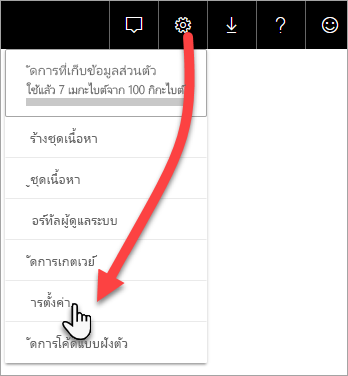
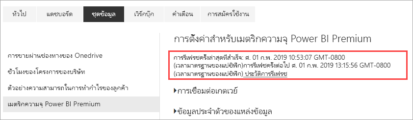

# ตรวจสอบความจุ Premium ด้วยแอป

การตรวจสอบความจุของคุณเป็นสิ่งสำคัญในการตัดสินใจอย่างชาญฉลาดว่าจะใช้ทรัพยากรความจุ Premium ของคุณให้ดีที่สุดได้อย่างไร คุณสามารถตรวจสอบความจุในพอร์ทัลผู้ดูแลระบบหรือด้วยแอป **การวัดความจ ุPower BI Premium**  บทความนี้อธิบายโดยใช้แอปการวัดความจุ Premium แอปมีข้อมูลเชิงลึกมากที่สุดเป็นวิธีการใช้งานความจุของคุณ สำหรับภาพรวมระดับสูงขึ้นของการวัดการใช้งานเฉลี่ยช่วงเจ็ดวันที่ผ่านมา คุณสามารถใช้พอร์ทัลผู้ดูแลระบบ หากต้องการเรียนรู้เพิ่มเติมเกี่ยวกับการตรวจสอบในพอร์ทัล ดู[ตรวจสอบความจุ Premium ในพอร์ทัลผู้ดูแลระบบ](service-admin-premium-monitor-portal.md)

แอปถูกอัปเดตตามปกติด้วยคุณสมบัติและฟังก์ชันการทำงานใหม่ ๆ ตรวจสอบให้แน่ใจว่าคุณกำลังใช้เวอร์ชันล่าสุด ถ้าคุณได้ติดตั้งแอปเวอร์ชันก่อนหน้าแล้ว แนะนำให้ลบออกจากแอปของคุณแล้ว กด CTRL + F5 เพื่อรีเฟรช

## ติดตั้งแอป

คุณสามารถไปยัง[แอปการวัดความจุ Premium ](https://app.powerbi.com/groups/me/getapps/services/capacitymetrics)ได้โดยตรงหรือติดตั้งแอปเหมือนที่คุณทำกับแอปอื่น ๆ ใน Power BI

1. ใน Power BI คลิ๊ก**แอป**

    

2. ทางด้านขวา คลิ๊ก**รับแอป**
3. ในประเภท**แอป** ค้นหา**แอปวัดความจุ Power BI Premium**
4. สมัครใช้งานเพื่อติดตั้งแอป

รอสักครู่ จะใช้เวลาสักครู่เพื่อติดตั้ง และรีเฟรชการวัด ถ้าแอปแสดงผลการวัดว่าง กด F5 เพื่อรีเฟรชเบราว์เซอร์ของคุณ

## รับข้อมูลประวัติการรีเฟรชแอป

เมื่อต้องการตรวจสอบเวลาล่าสุดที่แอปการวัดความจุ Premium ของคุณรีเฟรช คลิก**การตั้งค่า** > **ชุดข้อมูล** > **การวัดความจุ Power BI Premium**  > **ประวัติการรีเฟรช** 

การรีเฟรชครั้งล่าสุดจะแสดง หรือคลิก**ประวัติการรีเฟรช**เพื่อดูการรีเฟรชที่กำหนดไว้ และการรีเฟรชตามความต้องการ

## ตรวจสอบความจุด้วยแอป

หลังจากที่คุณติดตั้งแอป คุณสามารถดูการวัดความจุในองค์กรของคุณ แอปมีแดชบอร์ดพร้อมข้อมูลสรุปเมตริก และรายงานเมตริกโดยละเอียด

### แดชบอร์ด

เมื่อต้องดูแดชบอร์ดที่สรุปเป็นหลักเมตริกสำหรับความจุที่คุณเป็นผู้ดูแล ระบบ ใน**แดชบอร์ด**คลิก**Power BI Premium ความจุเมตริก** แดชบอร์ดปรากฏขึ้น

แดชบอร์ดประกอบรวมด้วยการวัดดังต่อไปนี้

#### ด้านบน

| เมตริก | คำอธิบาย |
| --- | --- |
| เวอร์ชัน | แอปเวอร์ชัน | 
| ความจุ | จำนวนของความจุที่คุณเป็นผู้ดูแลระบบ | 
| พื้นที่ทำงาน | จำนวนของพื้นที่ทำงานในความจุของคุณที่เป็นรายงานการวัด|
|||

#### ข้อมูลสรุปของระบบ

| เมตริก | คำอธิบาย |
| --- | --- |
| CPU ที่มีความจุเพื่อใช้ให้เกิดประโยชน์สูงสุด | ความจุของจำนวนครั้งที่ CPU กำหนดสูงสุดเกิน 80% ของค่าเกณฑ์ใน 7 วันที่ผ่านมา |
| จำนวนครั้งของความจุใน CPU ที่สามารถใช้ให้เกิดประโยชน์สูงสุด | จำนวนครั้งที่ CPU ถูกตั้งชื่อความจุเกิน 80% ของค่าเกณฑ์ใน 7 วันที่ผ่านมา | 
| ความจุของหน่วยความจำมากสุดที่สามารถใช้งานได้สูงสุด | ถึงขีดจำกัดของจำนวนครั้งความจุในหน่วยความจำสูงสุดในช่วง 7 วันที่ผ่านมา แบ่งออกเป็นกลุ่มสามนาที  |
| จำนวนครั้งของหน่วยความจำสูงสุดที่สามารถใช้งานได้| จำนวนครั้งของความจุที่ถูกตั้งชื่อในหน่วยความจำสูงสุดถึงขีดจำกัดในช่วง7 วันที่ผ่านมา แบ่งออกเป็นกลุ่มสามนาที |
|||

#### ข้อมูลสรุปของชุดข้อมูล

| เมตริก | คำอธิบาย |
| --- | --- |
| ชุดข้อมูล | จำนวนรวมของชุดข้อมูลในพื้นที่ทำงานทั้งหมดในความจุของคุณ|
| ขนาดเฉลี่ยของชุดข้อมูล (MB) | ขนาดเฉลี่ยของชุดข้อมูลของพื้นที่ทำงานทั้งหมดในความจุของคุณ|  
| จำนวนครั้งของชุดข้อมูลเฉลี่ยที่ถูกโหลด | จำนวนเฉลี่ยของชุดข้อมูลที่โหลดลงในหน่วยความจำ |  
| ชุดข้อมูล - ชุดข้อมูลที่ใช้งานโดยเฉลี่ย (%)| ชุดข้อมูลที่ใช้งานโดยเฉลี่ยใน 7 วันที่ผ่านมา ชุดข้อมูลถูกกำหนดเป็นใช้งานอยู่ถ้าผู้ใช้มีการโต้ตอบบนวิชวลภายในสามนาทีที่ผ่านมา |
| CPU - ชุดข้อมูลสูงสุด (%)| ปริมาณการใช้ CPU สูงสุดตามปริมาณงานชุดข้อมูลใน 7 วันที่ผ่านมา |
| CPU - ชุดข้อมูลโดยเฉลี่ย (%)| ปริมาณการใช้ CPU โดยเฉลี่ยตามปริมาณงานชุดข้อมูลใน 7 วันที่ผ่านมา |
| หน่วยความจำ - ชุดข้อมูลโดยเฉลี่ย (GB) | ปริมาณการใช้หน่วยความจำโดยเฉลี่ยตามปริมาณงานชุดข้อมูลใน 7 วันที่ผ่านมา |
| หน่วยความจำ - ชุดข้อมูลสูงสุด (GB) | ปริมาณการใช้หน่วยความจำสูงสุดตามปริมาณงานชุดข้อมูลใน 7 วันที่ผ่านมา|
| การจัดชุดข้อมูล | จำนวนรวมของชุดข้อมูลที่มีการจัดเรียงเนื่องจากหน่วยความจำไม่เพียงพอ |
| คิวรีโดยตรง/จำนวนครั้งที่ใช้งานได้สูงสุดแบบไลฟ์สด| จำนวนครั้งที่มีคิวรีโดยตรง/การเชื่อมต่อแบบไลฟ์สดเกิน 80% ของค่าเกณฑ์ใน 7 วันที่ผ่านมา แยกเป็นกลุ่มสามนาที |
| คิวรีโดยตรง/จำนวนครั้งที่ใช้งานได้มากที่สุดแบบไลฟ์สด| เวลาส่วนใหญ่ที่มีคิวรีโดยตรง/การเชื่อมต่อแบบไลฟ์สดเกิน 80% ในช่วง 7 วันที่ผ่านมา แยกเป็นกลุ่มหนึ่งชั่วโมง |
| คิวรีโดยตรง/การใช้งานได้สูงสุดและมากสุดแบบสด | จำนวนครั้งสูงสุดที่มีคิวรีโดยตรง/การเชื่อมต่อแบบไลฟ์สดเกิน 80% ของค่าเกณฑ์ใน 7 วันที่ผ่านมา แยกเป็นกลุ่มสามนาที|
| คิวรีโดยตรง/เวลาที่เกิดขึ้นสูงสุดแบบไลฟ์สด | เวลา UTC ที่มีการเชื่อมต่อ DirectQuery/แบบสดเกิน 80% มากที่สุดในหนึ่งชั่วโมง |
| การรีเฟรชทั้งหมด | จำนวนทั้งหมดของการรีเฟรชในช่วง 7 วันที่ผ่านมา |
| ความน่าเชื่อถือของการรีเฟรช (%) | จำนวนครั้งที่รีเฟรชสำเร็จหารด้วยจำนวนทั้งหมดของการรีเฟรชใน 7 วันที่ผ่านมา |
| รีเฟรชระยะเวลาเฉลี่ย (นาที) | ระยะเวลาการรีเฟรชเสร็จสมบูรณ์โดยเฉลี่ย |
| รีเฟรชเวลารอเฉลี่ย (นาที)| ระยะเวลาก่อนที่เริ่มการรีเฟรชโดยเฉลี่ย |
| ผลรวมคิวรี |  จำนวนรวมของคิวรีทั้งหมดที่เรียกใช้ในช่วง 7 วันที่ผ่านมา |
| จำนวนรวมรอคิวรี | จำนวนคิวรีที่มีการรอก่อนที่เริ่มดำเนินการทั้งหมด |
| ระยะเวลาคิวรีเฉลี่ย (มิลลิวินาที) | เวลาในการทำคิวรีให้สมบูรณ์โดยเฉลี่ย |
| เวลารอคิวรีเฉลี่ย (มิลลิวินาที) | ระยะเวลารอคิวรีในระบบแหล่งข้อมูลเฉลี่ยก่อนที่เริ่มดำเนินการ |
|||

#### ข้อมูลสรุปของกระแสข้อมูล

| เมตริก | คำอธิบาย |
| --- | --- |
| กระแสข้อมูล |  จำนวนรวมของกระแสข้อมูลในพื้นที่ทำงานทั้งหมดในความจุของคุณ|
| การรีเฟรชทั้งหมด | จำนวนทั้งหมดของการรีเฟรชในช่วง 7 วันที่ผ่านมา|  
| รีเฟรชระยะเวลาเฉลี่ย (นาที) | ระยะเวลาเฉลี่ยที่ใช้ในการรีเฟรชให้สมบูรณ์ |
| รีเฟรชเวลารอเฉลี่ย (นาที) | ช่วงห่างระหว่างเวลาที่กำหนดไว้และเริ่มต้นจริงของการรีเฟรช|
| CPU - กระแสข้อมูลสูงสุด (%) | ปริมาณการใช้ CPU สูงสุดตามกระแสข้อมูลของปริมาณงานในชุดข้อมูลใน 7 วันที่ผ่านมา |
| CPU - กระแสข้อมูลโดยเฉลี่ย (%) | ปริมาณการใช้ CPU โดยตามกระแสข้อมูลของปริมาณงานในชุดข้อมูลใน 7 วันที่ผ่านมา |
| หน่วยความจำ - กระแสข้อมูลสูงสุด (GB) | ปริมาณหน่วยความจำสูงสุดตามกระแสข้อมูลของปริมาณงานในชุดข้อมูลใน 7 วันที่ผ่านมา |
| หน่วยความจำ - กระแสข้อมูลโดยเฉลี่ย (GB) | ปริมาณหน่วยความจำโดยเฉลี่ยตามกระแสข้อมูลของปริมาณงานในชุดข้อมูลใน 7 วันที่ผ่านมา |
|||

#### สรุปรายงานแบบแบ่งหน้า

| เมตริก | คำอธิบาย |
| --- | --- |
| รายงานที่มีการแบ่งหน้า |  จำนวนรวมของรายงานแบบแบ่งหน้าในพื้นที่ทำงานทั้งหมดในความจุของคุณ |
| มุมมองทั้งหมด | จำนวนครั้งที่มีผู้ใช้ดูรายงานทั้งหมด | 
| แถวทั้งหมด | จำนวนแถวทั้งหมดของข้อมูลในรายงานทั้งหมด|
| เวลารวม | เวลาทั้งหมดที่ใช้สำหรับทุกขั้นตอน (เรียกข้อมูล ประมวลผล และแสดงผล) ของรายงานทั้งหมด หน่วยเป็นมิลลิวินาที |
| CPU - รายงานที่มีการแบ่งหน้าสูงสุด (%) | ปริมาณการใช้ CPU สูงสุดตามชุดข้อมูลรายงานการแบ่งหน้าใน 7 วันที่ผ่านมา |
| CPU - รายงานที่มีการแบ่งหน้าโดยเฉลี่ย (%) | ปริมาณการใช้ CPU โดยเฉลี่ยตามชุดข้อมูลรายงานการแบ่งหน้าใน 7 วันที่ผ่านมา |
| หน่วยความจำ - รายงานที่มีการแบ่งหน้าสูงสุด (GB) | ปริมาณการใช้หน่วยความจำสูงสุดตามชุดข้อมูลรายงานการแบ่งหน้าใน 7 วันที่ผ่านมา |
| หน่วยความจำ - รายงานที่มีการแบ่งหน้าโดยเฉลี่ย (GB) | ปริมาณการใช้หน่วยความจำโดยเฉลี่ยตามชุดข้อมูลรายงานการแบ่งหน้าใน 7 วันที่ผ่านมา |
|||

#### ข้อมูลสรุป AI

| เมตริก | คำอธิบาย |
| --- | --- |
| การดำเนินการของฟังก์ชัน AI | จำนวนทั้งหมดที่มีการดำเนินการในเจ็ดวันที่ผ่านมา |
| ความน่าเชื่อถือของการดำเนินการของฟังก์ชัน AI (%) | จำนวนครั้งที่ดำเนินการรีเฟรชสำเร็จหารด้วยจำนวนทั้งหมดของการรีเฟรชในเจ็ดวันที่ผ่านมา |
| CPU สูงสุด (%)| ปริมาณการใช้ CPU สูงสุดตามปริมาณงานของ AI ในเจ็ดวันที่ผ่านมา |
| หน่วยความจำสูงสุด (GB) | ปริมาณการใช้หน่วยความจำสูงสุดตามปริมาณงานของ AI ในเจ็ดวันที่ผ่านมา|
| เวลารอสูงสุดสำหรับการดำเนินการของฟังก์ชัน AI (MS) | รระยะเวลาสูงสุดก่อนที่เริ่มการดำเนินการ |
| เวลารอเฉลี่ยสำหรับการดำเนินการของฟังก์ชัน AI (MS)| รระยะเวลาเฉลี่ยก่อนที่เริ่มการดำเนินการ |
| ระยะเวลาสูงสุดสำหรับการดำเนินการของฟังก์ชัน AI (MS) | ระยะเวลาสูงสุดในการดำเนินการให้แล้วเสร็จ |
| ระยะเวลาเฉลี่ยสำหรับการดำเนินการของฟังก์ชัน AI (MS)| ระยะเวลาเฉลี่ยในการดำเนินการให้แล้วเสร็จ |
| | |

### รายงาน

รายงานเพิ่มเติมเกี่ยวกับรายละเอียดเมตริก เมื่อต้องดูรายงานสำหรับความจุที่คุณเป็นผู้ดูแลระบบ ใน**รายงาน**คลิก**Power BI Premium ความจุเมตริก** หรือจากแดชบอร์ดให้คลิกเซลล์เมตริกไปรายงานพื้นฐาน 

ที่ด้านล่างของรายงาน มีห้า*แท็บ*ได้แก่:

[**ชุดข้อมูล**](#datasets)- ให้การวัดสถานภาพของชุดข้อมูล Power BI ภายในความจุของคุณโดยละเอียด
[**รายงานแบบแบ่งหน้า**](#paginated-reports) - ให้การวัดสถานภาพของรายงานแบบแบ่งหน้าภายในความจุของคุณโดยละเอียด
[**กระแสข้อมูล**](#dataflows): ให้่การวัดการรีเฟรชสำหรับกระแสข้อมูลในความจุของคุณโดยละเอียด
[**AI**](#ai) - แสดงเมตริกโดยละเอียดเกี่ยวกับสถานภาพของฟังก์ชัน AI ที่ใช้ในความจุของคุณ
[**การใช้ทรัพยากร**](#resource-consumption)- ให้การวัดความจุโดยรวม รวมทั้งหน่วยความจำและการใช้งาน CPU แบบสูงโดยละเอียด
[**รหัสและข้อมูล**](#ids-and-info): ชื่อ รหัส และเจ้าของของความจุ พื้นที่ทำงาน และปริมาณงาน

แต่ละแท็บสามารถเปิดหน้ากรองเมทริกซ์ตามความจุและช่วงวันได้ หากไม่ได้เลือกตัวกรอง รายงานตามค่าเริ่มต้นจะแสดงผลเมทริกซ์ของสัปดาห์ที่ผ่านมาสำหรับความจุทั้งหมดที่เป็นเมทริกซ์การรายงาน 

### ชุดข้อมูล

หน้าชุดข้อมูลมี*พื้นที่*อื่นซึ่งรวมถึง**รีเฟรช**, **ระยะเวลาคิวรี**, **รอคิวรี**และ **ชุดข้อมูล** ใช้ปุ่มที่ด้านบนของแท็บหน้าเพื่อนำทางไปยังพื้นที่ต่าง ๆ

#### ส่วนรีเฟรช

| ส่วนรายงาน | เมตริก |
| --- | --- |
| รีเฟรช |  จำนวนทั้งหมด: การรีเฟรชทั้งหมดสำหรับแต่ละชุดข้อมูล   ความน่าเชื่อถือ: เปอร์เซ็นต์ของการรีเฟรชที่เสร็จสมบูรณ์สำหรับแต่ละชุดข้อมูล   เวลารอเฉลี่ย: การหน่วงเวลาเฉลี่ยระหว่างเวลาที่กำหนดไว้และเวลาเริ่มต้นของการดำเนินการ หน่วยเป็นนาที   เวลารอสูงสุด: เวลารอสูงสุดสำหรับชุดข้อมูล หน่วยเป็นนาที   ระยะเวลาเฉลี่ย: ระยะเวลาเฉลี่ยของการรีเฟรชสำหรับชุดข้อมูล เป็นนาที   ระยะเวลาสูงสุด: ระยะเวลาของการรีเฟรชที่ทำงานนานที่สุดสำหรับชุดข้อมูล หน่วยเป็นนาที |
| ชุดข้อมูล 5 ชุดแรกเรียงตามระยะเวลาโดยเฉลี่ย (นาที) |  ชุดข้อมูลห้าชุดที่มีระยะเวลารีเฟรชเฉลี่ยนานที่สุด หน่วยเป็นนาที |
| ชุดข้อมูล 5 ชุดแรกเรียงตามระยะการรอโดยเฉลี่ย (นาที) |  ชุดข้อมูลห้าชุดที่มีเวลารอเฉลี่ยนานที่สุด หน่วยเป็นนาที |
| จำนวนการรีเฟรชรายชั่วโมงและปริมาณการใช้หน่วยความจำ (GB) |  ความสำเร็จ ความล้มเหลว และปริมาณการใช้หน่วยความจำ ซึ่งแยกเป็นบักเก็ตหนึ่งชั่วโมงรายงานตามเวลา UTC |
| เวลารอการรีเฟรชเฉลี่ยรายชั่วโมง (นาที) |  เวลารอการรีเฟรชเฉลี่ยซึ่งแยกเป็นบักเก็ตหนึ่งชั่วโมงรายงานตามเวลา UTC เวลารอการรีเฟรชสูงหลายๆ ครั้งแสดงว่าความจุกำลังทำงานอย่างหนัก |
|  |  |

#### ส่วนระยะเวลาคิวรี่

| ส่วนรายงาน | เมตริก |
| --- | --- |
| ระยะเวลาคิวรี |  ข้อมูลในส่วนนี้ถูกแบ่งออกตามชุดข้อมูล พื้นที่ทำงาน และกลุ่มรายชั่วโมงในช่วง 7 วันที่ผ่านมา   ผลรวม: จำนวนรวมของคิวรีที่เรียกใช้สำหรับชุดข้อมูล   เฉลี่ย: ระยะเวลาคิวรีเฉลี่ยสำหรับชุดข้อมูล หน่วยเป็นมิลลิวินาที   สูงสุด: ระยะเวลาคิวรีที่ทำงานนานที่สุดในชุดข้อมูล หน่วยเป็นมิลลิวินาที|
| การกระจายระยะเวลาคิวรี |  ฮิสโตแกรมระยะเวลาคิวรีได้รับการจัดกลุ่มด้วยระยะเวลาคิวรี (เป็นมิลลิวินาที) ออกเป็นประเภทต่อไปนี้: <= ช่วง 30ms, 30-100ms, 100-300ms, 300ms-1sec, 1sec-3sec, 3sec-10sec, 10sec-30sec, และ > 30 วินาที ระยะเวลาคิวรีและเวลารอที่ยาวนานบ่งชี้ความจุที่ถูกเรียกใช้อย่างมาก ซึ่งอาจหมายความถึงชุดข้อมูลเดียว กำลังก่อปัญหาและต้องได้รับการตรวจสอบ |
| ชุดข้อมูล 5 ชุดแรกเรียงตามระยะเวลาโดยเฉลี่ย |  ชุดข้อมูลห้าชุดที่มีระยะเวลาคิวรีเฉลี่ยนานที่สุด หน่วยเป็นมิลลิวินาที |
| การกระจายระยะเวลาคิวรีต่อชั่วโมง |  จำนวนคิวรีและระยะเวลาเฉลี่ย (หน่วยเป็นมิลลิวินาที) เทียบกับปริมาณการใช้หน่วยความจำในหน่วย GB ซึ่งแยกเป็นบักเก็ตหนึ่งชั่วโมงรายงานตามเวลา UTC |
| คิวรีตรง / การเชื่อมต่อแบบไลฟ์สด (การใช้งาน > 80%) |  เวลาที่การเชื่อมต่อ DirectQuery หรือแบบสดใช้เกิน 80% ของการใช้งาน CPU ซึ่งแยกเป็นบักเก็ตหนึ่งชั่วโมงรายงานตามเวลา UTC |
|  |  |

#### ส่วนการรอคิวรี่

| ส่วนรายงาน | เมตริก |
| --- | --- |
| เวลารอคิวรี |  ข้อมูลในส่วนนี้ถูกแบ่งออกตามชุดข้อมูล พื้นที่ทำงาน และกลุ่มรายชั่วโมงในช่วง 7 วันที่ผ่านมา   ผลรวม: จำนวนรวมของคิวรีที่เรียกใช้สำหรับชุดข้อมูล   จำนวนการรอ: จำนวนของคิวรีในชุดข้อมูลที่รออยู่บนทรัพยากรของระบบก่อนการเริ่มดำเนินการ   เฉลี่ย: ระยะเวลารอคิวรีเฉลี่ยสำหรับชุดข้อมูล หน่วยเป็นมิลลิวินาที   สูงสุด: ระยะเวลาคิวรีที่รอนานที่สุดในชุดข้อมูล หน่วยเป็นมิลลิวินาที|
| ชุดข้อมูล 5 ชุดแรกเรียงตามเวลารอโดยเฉลี่ย |  ชุดข้อมูลห้าชุดที่มีเวลารอเฉลี่ยนานที่สุดในการเริ่มดำเนินการคิวรี หน่วยเป็นมิลลิวินาที |
| การกระจายเวลารอ |  ฮิสโตแกรมของระยะเวลาคิวรีได้รับการจัดกลุ่มโดยระยะเวลาคิวรี (หน่วยเป็นมิลลิวินาที) ออกเป็นประเภทต่อไปนี้: ช่วง<= 50ms , 50-100ms , 100-200ms , 200-400ms, 400ms-1sec , 1 sec-5 sec และ > 5 วินาที |
| การกระจายเวลารอคิวรีรายชั่วโมง |  จำนวนการรอคิวรีและเวลารอเฉลี่ย (หน่วยเป็นมิลลิวินาที) เทียบกับปริมาณการใช้หน่วยความจำในหน่วย GB แยกเป็นบักเก็ตหนึ่งชั่วโมงรายงานตามเวลา UTC |
|  |  |

#### ส่วนชุดข้อมูล

| **ส่วนรายงาน** | **การวัด** |
| --- | --- |
| ขนาดชุดข้อมูล  |  ขนาดสูงสุด: ขนาดสูงสุดของชุดข้อมูลในหน่วย MB สำหรับช่วงเวลาที่แสดง |
| จำนวนการลดชุดข้อมูล |  ผลรวม: จำนวนรวมของ*การลด*ชุดข้อมูลสำหรับแต่ละความจุ เมื่อความจุเผชิญกับความกดดันที่มีต่อหน่วยความจำ โหนดจะลดชุดข้อมูลอย่างน้อยหนึ่งชุดออกจากหน่วยความจำ ชุดข้อมูลที่ไม่ได้ใช้งาน (ที่ไม่มีการสคิวรี่/ รีเฟรชกำลังดำเนินการอยู่) จะถูกขับออกก่อน จากนั้นคำสั่งการขับไล่จะขึ้นอยู่กับการวัด 'การใช้น้อยที่สุด' (LRU)|
| จำนวนชุดข้อมูลที่โหลดรายชั่วโมง |  จำนวนของชุดข้อมูลที่โหลดลงในหน่วยความจำเทียบกับปริมาณการใช้หน่วยความจำในหน่วย GB ซึ่งแยกเป็นบักเก็ตหนึ่งชั่วโมงรายงานตามเวลา UTC |
| การลดชุดข้อมูลต่อชั่วโมงและปริมาณการใช้หน่วยความจำ |  การจำกัดชุดข้อมูลเทียบกับปริมาณการใช้หน่วยความจำในหน่วย GB ซึ่งแยกเป็นบักเก็ตหนึ่งชั่วโมงรายงานตามเวลา UTC |
| เปอร์เซ็นต์การใช้หน่วยความจำ |  ชุดข้อมูลที่ใช้งานอยู่ทั้งหมดในหน่วยความจำเป็นเปอร์เซ็นต์ของผลรวมหน่วยความจำ ผลต่างระหว่างชุดข้อมูลที่ใช้งานอยู่และชุดข้อมูลที่กำหนดทั้งหมดที่สามารถลดลงได้ แสดงเป็นรายชั่วโมงสำหรับช่วงเจ็ดวันก่อนหน้า |
|  |  |

### รายงานที่มีการแบ่งหน้า

| **ส่วนรายงาน** | **การวัด** |
| --- | --- |
| การใช้งานโดยรวม |  ผลรวมยอดดู: จำนวนครั้งที่มีผู้ใช้ดูรายงาน   จำนวนแถว: จำนวนแถวของข้อมูลในรายงาน   การค้นคืน (เฉลี่ย): ปริมาณเวลาเฉลี่ยที่ใช้ในการดึงข้อมูลสำหรับรายงาน หน่วยเป็นมิลลิวินาที ระยะเวลาที่ยาวนานอาจเป็นการบ่งชี้ถึงคิวรีที่ช้าหรือปัญหาแหล่งข้อมูลอื่นๆ    การประมวลผล (เฉลี่ย): ปริมาณเวลาเฉลี่ยที่ใช้ในการประมวลผลข้อมูลสำหรับรายงาน หน่วยเป็นมิลลิวินาที  การแสดง (เฉลี่ย): ปริมาณเวลาเฉลี่ยที่ใช้ในการแสดงรายงานในเบราเซอร์ หน่วยเป็นมิลลิวินาที   เวลารวม: เวลาที่ใช้สำหรับขั้นตอนทั้งหมดของรายงาน หน่วยเป็นมิลลิวินาที |
| รายงาน 5 ฉบับแรกเรียงตามเวลาการเรียกข้อมูลโดยเฉลี่ย |  รายงานห้าฉบับที่ใช้เวลาค้นคืนข้อมูลเฉลี่ยนานที่สุด หน่วยเป็นมิลลิวินาที |
| รายงาน 5 ฉบับแรกเรียงตามเวลาการประมวลผลรายงานโดยเฉลี่ย |  รายงานห้าฉบับที่ใช้เวลาประมวลผลรายงานเฉลี่ยนานที่สุด หน่วยเป็นมิลลิวินาที |
| ผลลัพธ์รายชั่วโมง |  ความสำเร็จ ความล้มเหลว และปริมาณการใช้หน่วยความจำ ซึ่งแยกเป็นบักเก็ตหนึ่งชั่วโมงรายงานตามเวลา UTC |
| ระยะเวลารายชั่วโมง |  การค้นคืนข้อมูลเทียบกับเวลาการประมวลผลและการแสดงภาพ ซึ่งแยกเป็นบักเก็ตหนึ่งชั่วโมงรายงานตามเวลา UTC |
|  |  |

### กระแสข้อมูล

| **ส่วนรายงาน** | **การวัด** |
| --- | --- |
| รีเฟรช |  ผลรวม: การรีเฟรชทั้งหมดสำหรับแต่ละกระแสข้อมูล   ความน่าเชื่อถือ: เปอร์เซ็นต์ของการรีเฟรชที่เสร็จสมบูรณ์สำหรับแต่ละกระแสข้อมูล   เวลารอเฉลี่ย: การหน่วงเวลาเฉลี่ยระหว่างเวลาที่กำหนดไว้และเวลาเริ่มต้นของการรีเฟรชกระแสข้อมูล หน่วยเป็นนาที   เวลารอสูงสุด: เวลารอสูงสุดสำหรับกระแสข้อมูล หน่วยเป็นนาที   ระยะเวลาเฉลี่ย: ระยะเวลาเฉลี่ยของการรีเฟรชสำหรับกระแสข้อมูล หน่วยเป็นนาที   ระยะเวลาสูงสุด: ระยะเวลาของการรีเฟรชที่ทำงานนานที่สุดสำหรับกระแสข้อมูล เป็นนาที |
| กระแสข้อมูล 5 ตัวแรกเรียงตามระยะเวลาการรีเฟรชเฉลี่ย |  ชุดข้อมูลห้าชุดที่มีระยะเวลารีเฟรชเฉลี่ยนานที่สุด หน่วยเป็นนาที |
| กระแสข้อมูล 5 ตัวแรกเรียงตามเวลารอโดยเฉลี่ย |  กระแสข้อมูลห้าตัวที่มีเวลารอการรีเฟรชเฉลี่ยนานที่สุด หน่วยเป็นนาที |
| เวลารอการรีเฟรชโดยเฉลี่ยรายชั่วโมง |  เวลารอการรีเฟรชเฉลี่ยซึ่งแยกเป็นบักเก็ตหนึ่งชั่วโมงรายงานตามเวลา UTC เวลารอการรีเฟรชสูงหลายๆ ครั้งแสดงว่าความจุกำลังทำงานอย่างหนัก |
| จำนวนการรีเฟรชรายชั่วโมงและการใช้หน่วยความจำ |  ความสำเร็จ ความล้มเหลว และปริมาณการใช้หน่วยความจำ ซึ่งแยกเป็นบักเก็ตหนึ่งชั่วโมงรายงานตามเวลา UTC |
|  |  |

### AI

| **ส่วนรายงาน** | **การวัด** |
| --- | --- |
| การใช้หน่วยความจำของ AI | การใช้หน่วยความจำในหน่วย GB ซึ่งแยกเป็นบักเก็ตหนึ่งชั่วโมงรายงานตามเวลา UTC |
| เวลารอเฉลี่ยและการดำเนินการของฟังก์ชัน AI เป็นรายชั่วโมง | การดำเนินการของ AI และเวลารอเฉลี่ย (หน่วยเป็นมิลลิวินาที) แยกเป็นบักเก็ตหนึ่งชั่วโมงรายงานตามเวลา UTC |
| การใช้งานโดยรวม | จำนวนทั้งหมด: จำนวนของฟังก์ชัน AI ในพื้นที่ทำงานหรือกระแสข้อมูล   ความน่าเชื่อถือของระบบ: เปอร์เซ็นต์ของการดำเนินการที่เสร็จสมบูรณ์  ค่าเฉลี่ย เวลารอ: การหน่วงเวลาเฉลี่ยระหว่างเวลาที่กำหนดไว้และการเริ่มต้นของการดำเนินการ หน่วยเป็นมิลลิวินาที  เวลารอสูงสุด: เวลารอสูงสุด หน่วยเป็นมิลลิวินาที  ค่าเฉลี่ย ระยะเวลา: ระยะเวลาเฉลี่ยของการดำเนินการ หน่วยเป็นมิลลิวินาที  ระยะเวลาสูงสุด: ระยะเวลาการดำเนินการที่ใช้เวลานานที่สุด หน่วยเป็นมิลลิวินาที  ขนาดทั้งหมดโดยเฉลี่ย: ขนาดโดยเฉลี่ย หน่วยเป็นไบต์ ของข้อมูลอินพุตและเอาท์พุตสำหรับฟังก์ชัน AI |
| | |

### การใช้ทรัพยากร

| **ส่วนรายงาน** | **การวัด** |
| --- | --- |
| การใช้ CPU |  ปริมาณการใช้ CPU สูงสุดในระหว่างชั่วโมงโดยปริมาณงานเป็นเปอร์เซ็นต์ของความจุ CPU ทั้งหมด แสดงเป็นรายชั่วโมงสำหรับช่วงเจ็ดวันก่อนหน้า |
| การใช้หน่วยความจำ |  ปริมาณการใช้หน่วยความจำสูงสุดระหว่างเวลาทำงานในหน่วย GB ตามปริมาณงาน (เส้นทึบ) ซ้อนทับกับขีดจำกัดปริมาณงาน (เส้นประ) แสดงเป็นรายชั่วโมงสำหรับช่วงเจ็ดวันก่อนหน้า |
|  |  |

### ID และข้อมูล

แท็บ**ID และข้อมูล**ประกอบด้วยพื้นที่สำหรับ**ความจุ**, **พื้นที่ทำงาน**, **ชุดข้อมูล**,**รายงานมีการแบ่งหน้า**และ**กระแสข้อมูล**

#### พื้นที่ความจุ

| ส่วนรายงาน | เมตริก |
| --- | --- |
| SKU และข้อมูลปริมาณงาน | SKU และการตั้งค่าปริมาณงานสำหรับความจุ |
| ผู้ดูแลระบบ | ชื่อของผู้ดูแลระบบสำหรับความจุ |
|||

#### พื้นที่ทำงาน

| ส่วนรายงาน | เมตริก |
| --- | --- |
| พื้นที่ทำงาน | ชื่อและ ID สำหรับพื้นที่ทำงานทั้งหมด |
|||

#### ส่วนชุดข้อมูล

| ส่วนรายงาน | เมตริก |
| --- | --- |
| ชุดข้อมูล | ชื่อพื้นที่ทำงานและ ID สำหรับชุดข้อมูลทั้งหมด |
|||

#### พื้นที่รายงานการแบ่งหน้า

| ส่วนรายงาน | เมตริก |
| --- | --- |
| รายงานที่มีการแบ่งหน้า | ชื่อ ชื่อพื้นที่ทำงาน และ ID สำหรับรายงานแบบแบ่งหน้าทั้งหมด |
|||

#### พื้นที่กระแสข้อมูล

| ส่วนรายงาน | เมตริก |
| --- | --- |
| กระแสข้อมูล | กระแสข้อมูล ชื่อ ชื่อพื้นที่ทำงาน และ ID สำหรับกระแสข้อมูลทั้งหมด |
|||

## ตรวจสอบความจุ Power BI Embedded

คุณสามารถใช้แอปวัดความจุ Power BI Premium เพื่อตรวจสอบความจุ*A SKU*ใน Power BI Embedded ได้ ความจุเหล่านั้นจะแสดงในรายงานตราบใดที่คุณเป็นผู้ดูแลระบบของความจุ อย่างไรก็ตาม การรีเฟรชรายงานล้มเหลวเว้นแต่ว่าคุณให้สิทธิ์บางอย่างไปยัง Power BI ในเรื่อง A SKU ของคุณ:

1. เปิดความจุของคุณในพอร์ทัล Azure

1. คลิก**ควบคุมการเข้าถึง (IAM)** และจากนั้นเพิ่มแอป **"Power BI Premium"** ให้กับบทบาทผู้อ่าน ถ้าคุณไม่สามารถค้นพบแอปด้วยชื่อ คุณยังสามารถเพิ่มแอปได้ด้วยตัวระบุของไคลเอ็นต์:`cb4dc29f-0bf4-402a-8b30-7511498ed654`

    

> [!NOTE]
> คุณสามารถตรวจสอบการใช้ความจุ Power BI Embedded ในแอปหรือพอร์ทัล Azure แต่ไม่ใช่ใน ในพอร์ทัลผู้ดูแลระบบ Power BI

## ขั้นตอนถัดไป

> [!div class="nextstepaction"]
> [การปรับ Power BI Premium ให้เหมาะสม](service-premium-capacity-optimize.md)
