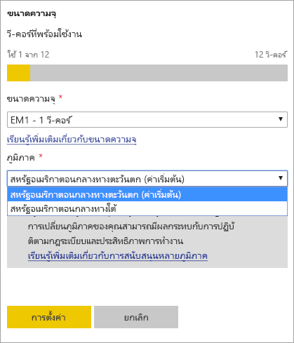
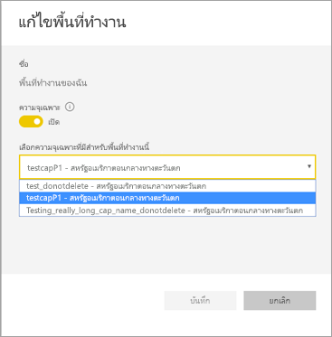

# กำหนดค่าการสนับสนุน Multi-Geo สำหรับ Power BI Premium

Multi-Geo เป็นคุณลักษณะของ Power BI Premium ที่ช่วยให้ลูกค้าข้ามชาติจัดการกับความต้องการด้านถิ่นที่อยู่ของข้อมูลในระดับภูมิภาค เฉพาะธุรกิจ หรือองค์กร ในฐานะลูกค้า Power BI Premium คุณสามารถปรับใช้เนื้อหาไปยังศูนย์ข้อมูลในภูมิภาคนอกเหนือจากภูมิภาคเดิมของผู้เช่า Power BI พิกัด (ภูมิศาสตร์) สามารถมีได้มากกว่าหนึ่งภูมิภาค ตัวอย่างเช่น สหรัฐอเมริกาเป็นพิกัด และสหรัฐอเมริกากลางทางตะวันตกและสหรัฐอเมริกากลางทางใต้เป็นภูมิภาคในสหรัฐอเมริกา คุณอาจเลือกปรับใช้เนื้อหาไปยังพิกัดใดต่อไปนี้:

- สหรัฐอเมริกา
- แคนาดา
- สหราชอาณาจักร
- บราซิล
- ยุโรป
- ญี่ปุ่น
- อินเดีย
- เอเชียแปซิฟิก
- ออสเตรเลีย

Multi-Geo ไม่พร้อมให้บริการใน Power BI Germany, Power BI China ที่ดำเนินการโดย 21Vianet หรือ Power BI สำหรับรัฐบาลสหรัฐอเมริกา

Multi-Geo ในขณะนี้พร้อมใช้งานใน Power BI Embedded อ่านเพิ่มเติมที่[การสนับสนุน Multi-Geo ใน Power BI Embedded](developer/embedded-multi-geo.md)

## เปิดใช้งานและกำหนดค่า

เพื่อความจุใหม่ ๆ ให้เปิดใช้งาน Multi-Geo ด้วยการเลือกภูมิภาคนอกเหนือจากภูมิภาคเริ่มต้นจากเมนูแบบหล่นลง  ความจุที่ใช้ได้จะแสดงภูมิภาคที่พิกัดอยู่ อย่างเช่น **สหรัฐอเมริกากลางทางตะวันตก**

หลังจากสร้างความจุแล้ว ความจุนั้นจะอยู่ในภูมิภาคนั้น และพื้นที่ทำงานใด ๆ ที่สร้างขึ้นจะเก็บเนื้อหาไว้ในภูมิภาคนั้น คุณสามารถย้ายพื้นที่ทำงานจากภูมิภาคหนึ่งไปยังอีกภูมิภาคผ่านเมนูแบบหล่นลงบนหน้าจอการตั้งค่าพื้นที่ทำงาน

คุณเห็นข้อความนี้เพื่อยืนยันการเปลี่ยนแปลง

คุณไม่จำเป็นต้องรีเซ็ตข้อมูลประจำตัวเกตเวย์ในระหว่างการย้ายในเวลานี้  หลังจากที่ได้จัดเก็บไว้ในภูมิภาคความจุแบบ Premium แล้วคุณจะต้องทำการรีเซ็ตเมื่อทำการย้าย

ในระหว่างการย้าย การดำเนินการบางอย่างอาจล้มเหลว อย่างเช่นการเผยแพร่ชุดข้อมูลใหม่หรือการกำหนดเวลารีเฟรชข้อมูล  

รายการต่อไปนี้จัดเก็บไว้ในภูมิภาค Premium เมื่อเปิดใช้งาน Multi-Geo:

- โมเดล (ไฟล์ .ABF) สำหรับชุดข้อมูลนำเข้าหรือ DirectQuery
- แคชคิวรี
- ภาพ R

รายการเหล่านั้นจะยังคงอยู่ในภูมิภาคเดิมของผู้เช่า:

- ส่งชุดข้อมูล
- เวิร์กบุ๊ก Excel
- Metadata ของแดชบอร์ด/รายงาน: ตัวอย่างเช่น ชื่อไทล์ คิวรีไทล์
- บัสบริการสำหรับคิวรีเกตเวย์หรืองานรีเฟรชที่กำหนดเวลาไว้
- สิทธิ์
- ข้อมูลประจำตัวชุดข้อมูล

## ดูตำแหน่งที่ตั้งความจุ

ในพอร์ทัลผู้ดูแล คุณสามารถดูความจุทั้งหมดสำหรับผู้เช่า Power BI และภูมิภาคที่พวกเขาอาศัยอยู่ในปัจจุบัน

 

## เปลี่ยนภูมิภาคสำหรับเนื้อหาที่มีอยู่

หากคุณต้องการเปลี่ยนภูมิภาคสำหรับเนื้อหาที่มีอยู่ คุณมีสองทางเลือก

- สร้างความจุที่สองและย้ายพื้นที่ทำงาน ผู้ใช้ฟรีจะไม่พบระยะเวลาหยุดทำงานใด ๆ ตราบเท่าที่ผู้เช่ามี v-core สำรอง
- หากการสร้างความจุที่สองไม่ใช่ทางเลือกที่มี คุณสามารถย้ายเนื้อหากลับไปยังความจุที่แชร์กันจาก Premium ได้ชั่วคราว คุณไม่จำเป็นต้องมี v-core เพิ่ม แต่ผู้ใช้ฟรีจพบระยะเวลาหยุดทำงานบ้าง

## ย้ายเนื้อหาออกจาก Multi-Geo  

คุณสามารถนำพื้นที่ทำงานออกจากความจุ Multi-Geo ได้หนึ่งในสองวิธี:

- ลบความจุปัจจุบันที่พื้นที่ทำงานอยู่  การทำเช่นนี้จะย้ายพื้นที่ทำงานกลับไปยังความจุที่แชร์กันในภูมิภาคเดิม
- ย้ายพื้นที่ทำงานเดี่ยวกลับไปยังความจุแบบ Premium ที่อยู่ผู้เช่าเดิม

## ข้อจำกัดและข้อควรพิจารณา

- ยืนยันว่าการเคลื่อนย้ายใด ๆ ที่คุณทำระหว่างภูมิภาคได้ปฏิบัติตามข้อกำหนดของรัฐบาลและบริษัทก่อนที่จะทำการโอนย้ายข้อมูล
- คิวรีที่ได้รับการแคชที่เก็บอยู่ในภูมิภาคระยะไกลจะพักอยู่ในภูมิภาคนั้น อย่างไรก็ตาม ข้อมูลอื่นที่อยู่ในระหว่างการส่งต่ออาจเดินทางกลับไปกลับมาระหว่างเขตภูมิศาสตร์หลายเขต
- เมื่อทำการย้ายข้อมูลจากภูมิภาคหนึ่งไปยังอีกภูมิภาคหนึ่งในสภาพแวดล้อม Multi-Geo ข้อมูลต้นทางอาจยังอยู่ในภูมิภาคที่ย้ายออกมานานถึง 30 วัน ในระหว่างนั้นผู้ใช้ปลายทางจะไม่มีสิทธิ์เข้าถึงข้อมูล ข้อมูลจะถูกลบออกจากภูมิภาคและทำลายในระยะเวลา 30 วันนั้น
- Multi-Geo ไม่ได้ส่งผลให้เกิดประสิทธิภาพที่ดีขึ้นโดยทั่วไป การโหลดรายงานและแดชบอร์ดจะยังคงเกี่ยวข้องกับการส่งคำร้องขอไปยังภูมิภาคเดิมของ Metadata
- คุณลักษณะ[กระแสข้อมูล](service-dataflows-overview.md) ไม่ได้รับการสนับสนุนบน Multi-GEO ในขณะนี้

## ขั้นตอนถัดไป

- [Power BI Premium คืออะไร?](service-premium-what-is.md)
- [Multi-Geo สำหรับความจุ Power BI Embedded](developer/embedded-multi-geo.md)

มีคำถามเพิ่มเติมหรือไม่? [ลองถามชุมชน Power BI](http://community.powerbi.com/)
