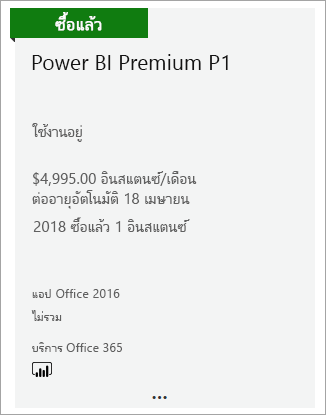
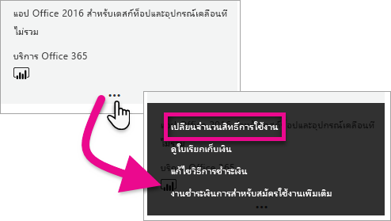
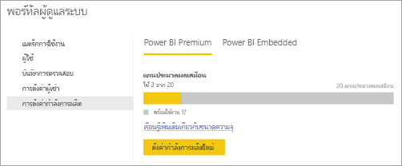

# วิธีการซื้อ Power BI Premium

บทความนี้อธิบายวิธีการซื้อความจุของ Power BI Premium สำหรับองค์กรของคุณ บทความครอบคลุมสองสถานการณ์:

- การใช้ P SKU สำหรับสถานการณ์การผลิตทั่วไป P SKU กำหนดให้มีข้อผูกมัดรายเดือนหรือรายปี และจะเรียกเก็บเงินเป็นรายเดือน คุณซื้อ P SKU ใน [ศูนย์การจัดการ Microsoft 365](https://admmin.microsoft.com)

- การใช้ A SKU สำหรับสถานการณ์ทดสอบ และกรณีที่คุณไม่มีสิทธิ์ที่จำเป็นในการซื้อ P SKU (บทบาทผู้ดูแลระบบส่วนกลาง Microsoft 365 หรือบทบาทผู้ดูแลระบบการเรียกเก็บเงิน) A SKU ไม่จำเป็นต้องมีข้อผูกมัดเวลา และเรียกเก็บเงินเป็นรายชั่วโมง คุณซื้อ A SKU ใน [พอร์ทัล Azure](https://portal.azure.com)

สำหรับข้อมูลเพิ่มเติมเกี่ยวกับ Power BI Premium ดูที่ [Power BI Premium คืออะไร](service-premium-what-is.md) สำหรับข้อมูลการกำหนดราคาและการวางแผนในปัจจุบัน ดู [หน้าการกำหนดราคา Power BI](https://powerbi.microsoft.com/pricing/) และ [เครื่องคิดเลข Power BI Premium](https://powerbi.microsoft.com/calculator/) ผู้เขียนเนื้อหาจะยังคงจำเป็นต้องมี [สิทธิ์การใช้งาน Power BI Pro](service-admin-purchasing-power-bi-pro.md) แม้ว่าองค์กรของคุณจะใช้ Power BI Premium ก็ตาม ตรวจสอบให้แน่ใจว่าคุณซื้อสิทธิ์การใช้งาน Power BI Pro อย่างน้อยหนึ่งใบสำหรับองค์กรของคุณ เมื่อใช้ A SKU _ผู้ใช้ทั้งหมด_ ที่ใช้เนื้อหายังจำเป็นต้องมีสิทธิการใช้งาน Pro

> [!NOTE]
> ถ้าการสมัครใช้งานระดับ Premium หมดอายุ คุณมีเวลา 30 วันของการเข้าถึงความจุแบบเต็มของคุณ หลังจากนั้น เนื้อหาของคุณจะเปลี่ยนเป็นความจุที่ใช้ร่วมกัน แบบจำลองที่มีความจุมากกว่า 1 GB ไม่ได้รับการรับรองในความจุที่ใช้ร่วมกัน

## ซื้อ P SKU สำหรับสถานการณ์การผลิตทั่วไป

คุณสามารถสร้างผู้เช่าใหม่ด้วย Power BI Premium ที่กำหนดค่า SKU หรือคุณสามารถซื้อความจุ Power BI Premium สำหรับองค์กรที่มีอยู่ได้ ในทั้งสองกรณี คุณสามารถเพิ่มความจุได้หากคุณต้องการ

### สร้างลูกค้าใหม่ด้วย Power BI Premium P1

ถ้าคุณไม่มีผู้เช่าและต้องการสร้างหนึ่งรายการ คุณสามารถซื้อ Power BI Premium ได้ในเวลาเดียวกัน ลิงก์ต่อไปนี้จะนำคุณไปสู่กระบวนการสร้างผู้เช่ารายใหม่และช่วยให้คุณสามารถซื้อ Power BI Premium: [ข้อเสนอ Power BI Premium P1](https://signup.microsoft.com/Signup?OfferId=b3ec5615-cc11-48de-967d-8d79f7cb0af1) เมื่อคุณสร้างผู้เช่า คุณจะได้รับมอบหมายให้ทำหน้าที่เป็นผู้ดูแลระบบส่วนกลางของ Microsoft 365 โดยอัตโนมัติสำหรับผู้เช่ารายนั้น

หลังจากที่คุณซื้อความจุ ให้เรียนรู้วิธีการ [จัดการความจุ](service-admin-premium-manage.md#manage-capacity) และ [มอบหมายพื้นที่ทำงาน](service-admin-premium-manage.md#assign-a-workspace-to-a-capacity) ให้กับความจุ

### ซื้อความจุ Power BI Premium สำหรับองค์กรที่มีอยู่

ถ้าคุณมีองค์กรที่มีอยู่แล้ว (ผู้เช่า) คุณต้องอยู่ในบทบาทผู้ดูแลระบบส่วนกลางของ Microsoft 365 หรือบทบาทของผู้ดูแลระบบการเรียกเก็บเงินเพื่อซื้อการสมัครรับข้อมูลและสิทธิ์การใช้งาน สำหรับข้อมูลเพิ่มเติม ให้ดู[เกี่ยวกับบทบาทผู้ดูแลระบบ Microsoft 365](https://support.office.com/article/About-Office-365-admin-roles-da585eea-f576-4f55-a1e0-87090b6aaa9d)

เมื่อต้องการซื้อความจุระดับพรีเมี่ยม ให้ทำตามขั้นตอนต่อไปนี้

1. จากภายใน Power BI service เลือกตัวเลือกแอป Microsoft 365 จากนั้นเลือก **ผู้ดูแลระบบ**

    

    อีกวิธีหนึ่งคือ คุณสามารถเรียกดูศูนย์การจัดการ Microsoft 365

1. เลือก**การเรียกเก็บเงิน** > **ซื้อบริการ**

1. ภายใต้**แผนอื่น ๆ**ค้นหาข้อเสนอของ Power BI Premium ซึ่งจะแสดงรายการเป็น P1 ผ่าน P3, EM3 และ P1 (แบบรายเดือน)

1. วางเคอร์เซอร์เหนือ จุดไข่ปลา ( **. . .** )แล้ว เลือก**ซื้อทันที**

    

1. ทำตามขั้นตอนเพื่อทำการซื้อให้เสร็จสมบูรณ์

หลังจากที่คุณเสร็จสิ้นการซื้อ **หน้าจอบริการการซื้อ**จะแสดงว่ารายการนั้นถูกซื้อและใช้งานได้

หลังจากที่คุณซื้อความจุ ให้เรียนรู้วิธีการ [จัดการความจุ](service-admin-premium-manage.md#manage-capacity) และ [มอบหมายพื้นที่ทำงาน](service-admin-premium-manage.md#assign-a-workspace-to-a-capacity) ให้กับความจุ

### ซื้อความจุเพิ่มเติม

ขณะนี้คุณมีความจุแล้ว คุณสามารถเพิ่มความจุได้ตามที่คุณต้องการ คุณสามารถผสม Premium capacity SKUs (P1 ผ่าน P3) ภายในองค์กรของคุณได้ SKU ที่ต่างกันมีความสามารถด้านทรัพยากรที่แตกต่างกัน

1. ในศูนย์การจัดการ Microsoft 365 เลือก **การเรียกเก็บเงิน** > **ซื้อบริการ**

1. ค้นหารายการ Power BI Premium ที่คุณต้องการซื้อหนึ่งภายใต้**แผนอื่นๆ**

1. วางเมาส์เหนือ**ตัวเลือกเพิ่มเติม** (...) แล้วเลือก**เปลี่ยนจำนวนสิทธิ์การใช้งาน**

    

1. เปลี่ยนจำนวนของอินสแตนซ์ที่คุณต้องการสำหรับรายการนี้ แล้ว เลือก**ส่ง**เมื่อทำเสร็จแล้ว

   > [!IMPORTANT]
   > การเลือก **ส่ง** จะเรียกเก็บเงินจากบัตรเครดิตในไฟล์

หน้า**ซื้อบริการ**จะบ่งชี้ถึงจำนวนของอินสแตนซ์ที่คุณมี ภายในพอร์ทัลผู้ดูแล Power BI ภายใต้**ตั้งค่าความจุ** แกน v ที่พร้อมใช้งานสะท้อนถึงความจุที่ซื้อใหม่

### ยกเลิกการสมัครใช้งาน

คุณสามารถยกเลิกการสมัครใช้งานจากภายในศูนย์การจัดการ Microsoft 365 เพื่อยกเลิกการสมัครใช้งาน Premium ให้ทำสิ่งต่อไปนี้

1. ค้นหาศูนย์การจัดการ Microsoft 365

1. เลือก**การเรียกเก็บเงิน** > **การสมัครใช้งาน**

1. เลือกการสมัครใช้งาน Power BI Premium จากรายการ

1. เลือก**การดำเนินการเพิ่มเติม** > **ยกเลิกการสมัครใช้งาน**

1. หน้า**ยกเลิกการสมัครใช้งาน**จะระบุว่าที่คุณเป็นผู้รับผิดชอบสำหรับ[ค่าธรรมเนียมการหยุดใช้งานก่อน](https://support.office.com/article/early-termination-fees-6487d4de-401a-466f-8bc3-c0beb5cc40d3)หรือไม่ เพจนี้จะยังแจ้งให้คุณทราบเมื่อข้อมูลจะถูกลบเพื่อสมัครใช้งาน

1. อ่านผ่านข้อมูล และถ้าคุณต้องการดำเนินการ ให้เลือก**ยกเลิกการสมัครใช้งาน**

#### เมื่อยกเลิกหรือสิทธิ์การใช้งานของคุณหมดอายุ

เมื่อยกเลิกการสมัครใช้งานแบบพรีเมียม หรือสิทธิ์การใช้งานความจุของคุณหมดอายุ คุณยังสามารถเข้าถึงความจุพรีเมียมของคุณได้เป็นระยะเวลา 30 วันนับจากวันที่ยกเลิกหรือหมดอายุสิทธิ์การใช้งาน หลังจาก 30 วัน คุณจะไม่สามารถเข้าถึงความจุพรีเมียมหรือพื้นที่ทำงานภายในความจุดังกล่าวได้อีกต่อไป

## ซื้อ A SKU สำหรับการทดสอบและสถานการณ์อื่นๆ

มีการทำให้ A SKU พร้อมใช้งานผ่านทางบริการ Azure Power BI Embedded คุณสามารถใช้ A SKU ในวิธีการต่อไปนี้:

- เปิดใช้งานการฝังของ Power BI ในแอปพลิเคชันของบุคคลที่สาม สำหรับข้อมูลเพิ่มเติม ให้ดู [Power BI Embedded](developer/azure-pbie-what-is-power-bi-embedded.md)

- ทดสอบฟังก์ชัน Premium ก่อนที่คุณจะซื้อ P SKU

- สร้างสภาพแวดล้อมการพัฒนาและการทดสอบควบคู่ไปกับสภาพแวดล้อมการผลิตที่ใช้ P SKU

- ซื้อ Power BI Premium แม้ว่าคุณจะไม่ใช่บทบาทผู้ดูแลระบบส่วนกลาง Microsoft 365 หรือบทบาทผู้ดูแลระบบการเรียกเก็บเงิน

> [!NOTE]
> ถ้าคุณซื้อ SKU ขนาด A4 หรือสูงกว่าคุณสามารถใช้ประโยชน์จากคุณลักษณะ Premium ทั้งหมด ยกเว้นการแชร์เนื้อหาได้ไม่จำกัด เมื่อใช้ A SKU _ผู้ใช้ทั้งหมด_ ที่ใช้เนื้อหาจำเป็นต้องมีสิทธิการใช้งาน Pro

ให้ปฏิบัติตามขั้นตอนเหล่านี้เพื่อซื้อ A SKU ในพอร์ทัล Azure

1. ลงชื่อเข้าใช้ [พอร์ทัล Azure](https://portal.azure.com) ด้วยบัญชีที่มีสิทธิ์ระดับผู้ดูแลระบบความจุเป็นอย่างน้อยใน Power BI

1. ค้นหา _Power BI Embedded_ และเลือกบริการในผลลัพธ์การค้นหา

    

1. เลือก **สร้าง Power BI Embedded**

    

1. บนหน้าจอการสร้าง **Power BI Embedded** ให้ระบุข้อมูลต่อไปนี้:

    - **การสมัครรับข่าวสาร** ในการสร้างบริการ Power BI Embedded

    - **ตำแหน่งที่ตั้ง** ทางกายภาพ ในการสร้างกลุ่มทรัพยากรที่ประกอบด้วยบริการ เพื่อประสิทธิภาพที่ดีกว่า ตำแหน่งที่ตั้งนี้ควรอยู่ใกล้เคียงกับตำแหน่งที่ตั้งของผู้เช่า Azure Active Directory ของคุณสำหรับ Power BI

    - **กลุ่มทรัพยากร** ที่มีอยู่ ในการใช้หรือสร้างใหม่ตามที่แสดงในตัวอย่าง

    - **ผู้ดูแลระบบความจุ Power BI** ผู้ดูแลระบบความจุต้องเป็นผู้ใช้ที่เป็นสมาชิกหรือโครงร่างสำคัญของบริการในผู้เช่า Azure AD ของคุณ

    

1. ถ้าคุณต้องการใช้คุณลักษณะทั้งหมดของ Power BI Premium (ยกเว้นการแชร์ที่ไม่จำกัด) คุณจำเป็นต้องมี A4 SKU เป็นอย่างน้อย เลือก **เปลี่ยนขนาด**

    

1. เลือกขนาดความจุ A4, A5 หรือ A6 ซึ่งสอดคล้องกับ P1, P2 และ P3

    

1. เลือก **รีวิว + สร้าง** ตรวจทานตัวเลือกที่คุณเลืกอ จากนั้นเลือก **สร้าง**

    

1. อาจใช้เวลาสองถึงสามนาทีเพื่อให้การปรับใช้เสร็จสมบูรณ์ เมื่อพร้อมแล้วให้เลือก **ไปที่ทรัพยากร**

    

1. บนหน้าจอการจัดการ ตรวจทานตัวเลือกที่คุณมีสำหรับการจัดการบริการ รวมถึงการหยุดบริการเมื่อคุณไม่ได้ใช้งาน

    

หลังจากที่คุณซื้อความจุ ให้เรียนรู้วิธีการ [จัดการความจุ](service-admin-premium-manage.md#manage-capacity) และ [มอบหมายพื้นที่ทำงาน](service-admin-premium-manage.md#assign-a-workspace-to-a-capacity) ให้กับความจุ

## ขั้นตอนถัดไป

[กำหนดค่าและจัดการความจุใน Power BI Premium](service-admin-premium-manage.md)\
[หน้าการกำหนดราคา Power BI](https://powerbi.microsoft.com/pricing/)\
[เครื่องคิดเลข Power BI Premium](https://powerbi.microsoft.com/calculator/)\
[คำถามที่ถามบ่อยสำหรับ Power BI Premium](service-premium-faq.md)\
[เอกสารทางเทคนิคเรื่องการวางแผนการใช้ Power BI สำหรับองค์กร](https://aka.ms/pbienterprisedeploy)

มีคำถามเพิ่มเติมหรือไม่ [ลองถามชุมชน Power BI](https://community.powerbi.com/)
