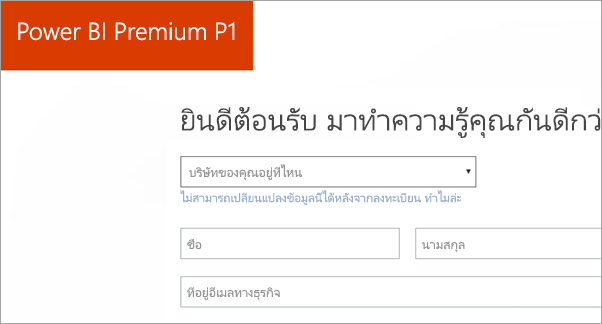
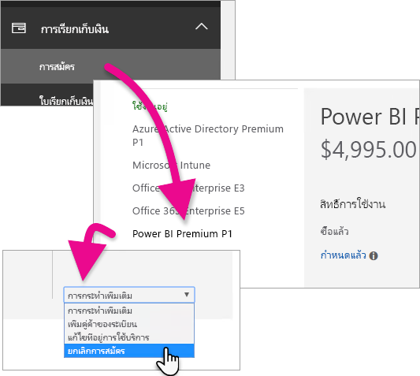
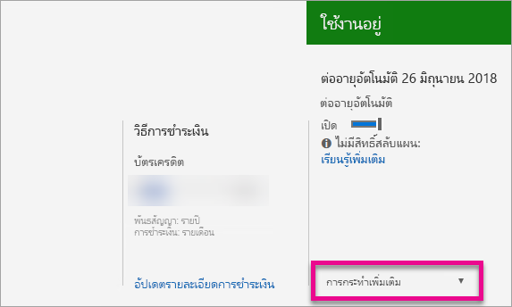

# วิธีการซื้อ Power BI Premium
เรียนรู้วิธีการซื้อ Power BI Premium สำหรับองค์กรของคุณ

<iframe width="640" height="360" src="https://www.youtube.com/embed/NkvYs5Qp4iA?rel=0&amp;showinfo=0" frameborder="0" allowfullscreen></iframe>

คุณสามารถซื้อโหนดความจุ Power BI Premium ผ่านศูนย์การจัดการ Office 365 คุณยังสามารถผสม Premium capacity SKUs (P1 ผ่าน P3) ภายในองค์กรของคุณได้ พวกเขานำเสนอสามารถของทรัพยากรที่แตกต่างกัน

สำหรับข้อมูลเพิ่มเติมเกี่ยวกับอะไรคือ Power BI Premium ให้ดู[Power BI Premium คืออะไร](service-premium.md) เพื่อดูการกำหนดราคาปัจจุบันสำหรับ Power BI ให้ดู[หน้าราคา Power BI ](https://powerbi.microsoft.com/pricing/) นอกจากนี้คุณสามารถวางแผนค่าใช้จ่ายสำหรับ Power BI Premium ของคุณได้โดยใช้[ตัวคำนวน Power BI Premium](https://powerbi.microsoft.com/calculator/)

> [!IMPORTANT]
> ผู้เขียนเนื้อหาจะยังคงต้องมีสิทธิ์ใช้ Power BI Pro แม้ว่าคุณซื้อ Power BI Premium
> 
> 

## สร้างลูกค้าใหม่ด้วย Power BI Premium P1
ถ้าคุณไม่มีผู้เช่าและต้องการสร้างหนึ่งรายการ คุณสามารถซื้อ Power BI Premium ได้ในเวลาเดียวกัน การเชื่อมโยงต่อไปนี้จะแนะนำกระบวนการสร้างผู้เช่าใหม่สำหรับการใช้งาน Office 365 แก่คุณ และช่วยให้คุณสามารถซื้อ Power BI Premium คุณจะต้องซื้อสิทธิ์การใช้งาน Power BI Pro สำหรับผู้ใช้หลังจากสร้างผู้เช่า เมื่อคุณสร้างผู้เช่าของคุณ คุณจะเป็นผู้ดูแลระบบส่วนกลางสำหรับผู้เช่านั้นโดยอัตโนมัติ

เมื่อต้องการทำการซื้อนี้ ดู[ข้อเสนอ Power BI Premium P1](https://signup.microsoft.com/Signup?OfferId=b3ec5615-cc11-48de-967d-8d79f7cb0af1)

## ซื้อความจุ Power BI Premium สำหรับองค์กรที่มีอยู่
ถ้าคุณมีองค์กร คุณจำเป็นต้องเป็นผู้ดูแลระบบส่วนกลางหรือผู้ดูแลการเรียกเก็บเงิน เพื่อซื้อการสมัครใช้งานและสิทธิ์การใช้งาน สำหรับข้อมูลเพิ่มเติม ให้ดู[เกี่ยวกับบทบาทผู้ดูแลระบบ Office 365](https://support.office.com/article/About-Office-365-admin-roles-da585eea-f576-4f55-a1e0-87090b6aaa9d)

เพื่อซื้อความจุพรีเมียม คุณจะต้องทำสิ่งต่อไปนี้

1. จากภายใน Power BI service เลือก**ตัวเลือกแอป Office 365** > **ผู้ดูแลระบบ** อีกวิธีหนึ่งคือ คุณสามารถเรียกดูศูนย์การจัดการ Office 365 คุณสามารถไปที่นั่นได้ โดยไปที่https://portal.office.comและเลือก**ผู้ดูแลระบบ**
   
    
2. เลือก**การเรียกเก็บเงิน** > **ซื้อบริการ**
3. ภายใต้**แผนอื่น ๆ**ค้นหาข้อเสนอของ Power BI Premium ซึ่งจะแสดงรายการเป็น P1 ผ่าน P3, EM3 และ P1 (แบบรายเดือน)
4. วางเคอร์เซอร์เหนือ**จุดไข่ปลา (...)** แล้ว เลือก**ซื้อทันที**
   
    
5. ทำตามขั้นตอนเพื่อทำการซื้อให้เสร็จสมบูรณ์

คุณยังสามารถเลือกการเชื่อมโยงต่อไปนี้เพื่อนำคุณไปยังหน้าซื้อของรายการเหล่านั้นโดยตรง สำหรับข้อมูลเพิ่มเติมเกี่ยวกับ SKU เหล่าน้ ให้ดู[Power BI Premium คืออะไร](service-premium.md#premiumskus)

ในการสั่งซื้อเพื่อ BI Premium SKU ***คุณต้องเป็นผู้ดูแลส่วนกลางหรือผู้ดูแลการเรียกเก็บเงิน***ภายในผู้เช่าของคุณ โดยเลือกลิงก์ด้านล่างจะสร้างข้อผิดพลาดถ้าคุณไม่ใช่ผู้ดูแลระบบ

| ลิงก์การซื้อโดยตรง |
| --- |
| [EM3 (month-to-month) SKU](https://portal.office.com/commerce/completeorder.aspx?OfferId=4004702D-749C-4F74-BF47-3048F1833780&adminportal=1) |
| [P1 SKU](https://portal.office.com/commerce/completeorder.aspx?OfferId=b3ec5615-cc11-48de-967d-8d79f7cb0af1&adminportal=1) |
| [P1 (month-to-month) SKU](https://portal.office.com/commerce/completeorder.aspx?OfferId=E4C8EDD3-74A1-4D42-A738-C647972FBE81&adminportal=1) |
| [P2 SKU](https://portal.office.com/commerce/completeorder.aspx?OfferId=062F2AA7-B4BC-4B0E-980F-2072102D8605&adminportal=1) |
| [P3 SKU](https://portal.office.com/commerce/completeorder.aspx?OfferId=40c7d673-375c-42a1-84ca-f993a524fed0&adminportal=1) |

หลังจากที่คุณเสร็จสิ้นการซื้อ หน้าจอบริการการซื้อจะแสดงว่ารายการนั้นถูกซื้อและใช้งานได้

ในตอนนี้คุณสามารถจัดการกำลังการผลิตนี้ภายในศูนย์การจัดการ Power BI สำหรับข้อมูลเพิ่มเติม ให้ดู [จัดการ Power BI Premium](service-admin-premium-manage.md)

## ซื้อความจุเพิ่มเติม
เมื่อคุณอยู่ในส่วนของการ**ตั้งค่า Premium** ของพอร์ทัลการจัดการ Power BI ถ้าคุณเป็นผู้ดูแลระบบ คุณจะเห็นปุ่ม**ซื้อเพิ่มเติม** ปุ่มนี้จะนำคุณไปยังพอร์ทัล Office 365 เมื่อคุณอยู่ในศูนย์การจัดการ Office 365 คุณสามารถทำดังต่อไปนี้ได้

1. เลือก**การเรียกเก็บเงิน** > **ซื้อบริการ**
2. ค้นหารายการ Power BI Premium ที่คุณต้องการซื้อหนึ่งภายใต้**แผนอื่นๆ**
3. วางเคอร์เซอร์เหนือ**จุดไข่ปลา (...)** แล้วเลือก**เปลี่ยนจำนวนสิทธิ์การใช้งาน**
   
    
4. เปลี่ยนจำนวนของอินสแตนซ์ที่คุณต้องการสำหรับรายการนี้ แล้ว เลือก**ส่ง**เมื่อทำเสร็จแล้ว
   
   > [!IMPORTANT]
   > เลือก**ส่ง**จะทำให้มีการคิดค่าบริการผ่านใช้บัตรเครดิตในไฟล์
   > 
   > 

หน้า**ซื้อบริการ**จะบ่งชี้ถึงจำนวนของอินสแตนซ์ที่คุณมี ภายในพอร์ทัลผู้ดูแล Power BI ภายใต้**ตั้งค่าความจุ** แกน v ที่พร้อมใช้งานสะท้อนถึงความจุที่ซื้อใหม่

ในตอนนี้คุณสามารถจัดการกำลังการผลิตนี้ภายในศูนย์การจัดการ Power BI สำหรับข้อมูลเพิ่มเติม ให้ดู [จัดการ Power BI Premium](service-admin-premium-manage.md)

## ยกเลิกการสมัครใช้งาน
คุณสามารถยกเลิกการสมัครใช้งานจากภายในศูนย์การจัดการ Office 365 เพื่อยกเลิกการสมัครใช้งาน Premium ให้ทำสิ่งต่อไปนี้

1. เรียกดูศูนย์การจัดการ Office 365
2. เลือก**การเรียกเก็บเงิน** > **การสมัครใช้งาน**
3. เลือกการสมัครใช้งาน Power BI Premium จากรายการ
4. ในดรอปดาวน์**การกระทำเพิ่มเติม** ให้เลือก**ยกเลิกการสมัครใช้งาน**
   
    
5. หน้า**ยกเลิกการสมัครใช้งาน**จะระบุว่าที่คุณเป็นผู้รับผิดชอบสำหรับ[ค่าธรรมเนียมการหยุดใช้งานก่อน](https://support.office.com/article/early-termination-fees-6487d4de-401a-466f-8bc3-c0beb5cc40d3)หรือไม่ เพจนี้จะยังแจ้งให้คุณทราบเมื่อข้อมูลจะถูกลบเพื่อสมัครใช้งาน
6. อ่านผ่านข้อมูล และถ้าคุณต้องการดำเนินการ ให้เลือก**ยกเลิกการสมัครใช้งาน**

## ขั้นตอนถัดไป
[หน้าราคาของ power BI](https://powerbi.microsoft.com/pricing/)  
[ตัวคำนวณ Power BI Premium ](https://powerbi.microsoft.com/calculator/)  
[Power BI Premium คืออะไร](service-premium.md)  
[จัดการ Power BI Premium](service-admin-premium-manage.md)  
[Power BI Premium คำถามที่พบบ่อย](service-premium-faq.md)  
[บันทึกย่อประจำรุ่นของ Power BI Premium](service-premium-release-notes.md)  
[เอกสารทางเทคนิคเรื่อง Microsoft Power BI Premium](https://aka.ms/pbipremiumwhitepaper)  
[เอกสารทางเทคนิคเรื่องการวางแผนการใช้ Power BI สำหรับองค์กร](https://aka.ms/pbienterprisedeploy)  
[พอร์ทัลผู้ดูแล Power BI](service-admin-portal.md)  
[การดูแล Power BI ในองค์กรของคุณ](service-admin-administering-power-bi-in-your-organization.md)  

มีคำถามเพิ่มเติมหรือไม่ [ลองถามชุมชน Power BI](http://community.powerbi.com/)

