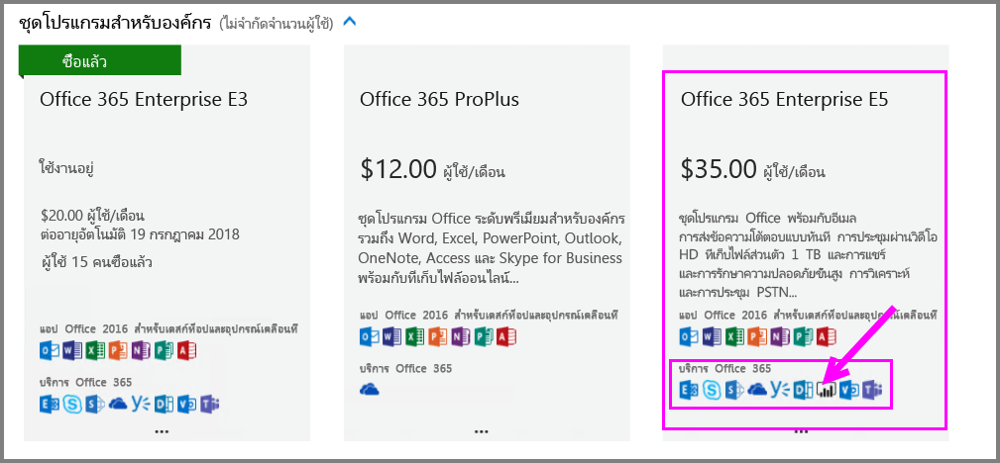
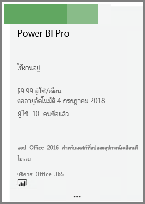
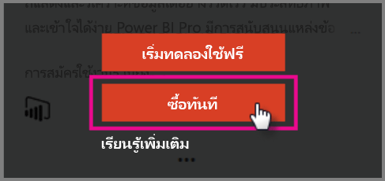
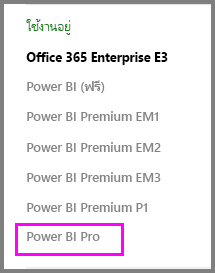

# การเริ่มต้นใช้งานด่วน: ซื้อสิทธิ์การใช้งาน Power BI Pro

Power BI Pro เป็นสิทธิ์การใช้งานสำหรับแต่ละบุคคลที่ช่วยให้สามารถเข้าถึงเนื้อหาและความสามารถทั้งหมดในบริการ Power BI ได้ รวมถึงความสามารถในการแชร์เนื้อหาและทำงานร่วมกับผู้ใช้อื่นที่มีสิทธิ์การใช้งานแบบ Pro ได้ เฉพาะผู้ใช้แบบ Pro เท่านั้นที่สามารถเผยแพร่เนื้อหาไปยังหรือใช้งานพื้นที่ทำงานจากแอป แชร์แดชบอร์ด และสมัครใช้งานแดชบอร์ดและรายงานได้ บทความนี้อธิบายวิธีการสั่งซื้อสิทธิ์การใช้งาน Power BI Pro ใน Office 365

## ข้อกำหนดเบื้องต้น

คุณต้องเป็นสมาชิกของบทบาท[ **ผู้ดูแลระบบส่วนกลาง**หรือ**ผู้ดูแลการเรียกเก็บเงิน** ](https://support.office.com/article/about-office-365-admin-roles-da585eea-f576-4f55-a1e0-87090b6aaa9d?ui=en-US&rs=en-US&ad=US)ใน Office 365 

## ซื้อสิทธิ์การใช้งาน Power BI Pro ผ่าน Office 365

ทำตามขั้นตอนเหล่านี้เพื่อซื้อสิทธิ์การใช้งาน Power BI Pro:

1. เรียกดู [ศูนย์การจัดการ Office 365](https://portal.office.com/adminportal/home#/homepage)

2. ในบานหน้าต่างนำทางด้านซ้าย เลือก **การเรียกเก็บเงิน** > **การสมัครใช้งาน**

    

3. ที่มุมบนขวาของหน้า**สมัครใช้งาน** เลือก**เพิ่มการสมัครใช้งาน**

    

4. ค้นหาข้อเสนอการสมัครใช้งานที่ต้องการ:

    ภายใต้**ชุดโปรแกรม Enterprise** เลือก **Office 365 Enterprise E5**

    

    ใต้**แผนอื่น ๆ**เลือก **Power BI Pro**

    

5. โฮเวอร์เหนือจุดไข่ปลา (...) สำหรับการสมัครใช้งานที่ต้องการ แล้วเลือก **ซื้อตอนนี้**

    

6. เลือก**ชำระเงินรายเดือน** หรือ**ชำระเงินสำหรับทั้งป** ีตามการกำหนดลักษณะการเรียกเก็บเงินของคุณ

7. ภายใต้**คุณต้องการผู้ใช้กี่คน?** ใส่จำนวนสิทธิ์การใช้งานที่ต้องการ แล้วเลือก**ซื้อสินค้าตอนนี้** เพื่อจบการทำธุรกรรม

8. ตรวจสอบว่าการสมัครใช้งานที่ได้มานั้นแสดงรายการอยู่บนหน้า**การสมัครใช้งาน**ตอนนี้หรือไม่

   

9. เมื่อต้องการเพิ่มสิทธิ์การใช้งานเพิ่มเติมหลังจากการซื้อครั้งแรก เลือก**Power BI Pro** จากหน้า**สมัครใช้งาน** จากนั้น**เพิ่ม/ลบสิทธิ์การใช้งาน**

## ขั้นตอนถัดไป

หลังจากที่คุณได้ซื้อสิทธิ์การใช้งานแล้ว มอบหมายสิทธิ์เหล่านั้นให้กับผู้ใช้ในผู้เช่าของคุณ

[มอบหมายสิทธิ์การใช้งานให้ผู้ใช้ใน Office 365](service-admin-assigning-power-bi-pro-licenses.md)

[มอบหมายสิทธิ์การใช้งานให้ผู้ใช้ใน Azure](service-admin-assigning-power-bi-pro-licenses-azure.md)

[ราคาของ power BI](https://powerbi.microsoft.com/en-us/pricing/)
