# ซื้อและมอบใบอนุญาตการใช้งาน Power BI Pro

Power BI Pro เป็นสิทธิ์การใช้งานสำหรับแต่ละบุคคล ที่ให้การเข้าถึงเนื้อหาและความสามารถทั้งหมดในบริการของ Power BI รวมถึงความสามารถในการแชร์เนื้อหาและทำงานร่วมกับผู้ใช้อื่นที่มีสิทธิ์การใช้งานแบบ Pro ได้ เฉพาะผู้ใช้แบบ Pro เท่านั้นที่สามารถเผยแพร่เนื้อหา หรือใช้เนื้อหาจากพื้นที่ทำงานจากแอป, แชร์แดชบอร์ด และสมัครสมาชิกแดชบอร์ดและรายงานได้ ดูข้อมูลเพิ่มเติมได้ที่ [คุณลักษณะของ Power BI ตามประเภทใบอนุญาตการใช้งาน](service-features-license-type.md)

บทความนี้อธิบายวิธีการซื้อใบอนุญาตการใช้งาน Power BI Pro ใน Office 365 ในตอนแรก จากนั้นบทความนี้จะอธิบายถึงตัวเลือกสองประการที่คุณสามารถใช้ในการกำหนดสิทธิการใช้งานเหล่านี้แก่ผู้ใช้แต่ละราย: Office 365 และ Azure (เลือกหนึ่งตัวเลือก)

## ข้อกำหนดเบื้องต้น

คุณต้องเป็นสมาชิกของบทบาท[ **ผู้ดูแลระบบส่วนกลาง**หรือ**ผู้ดูแลการเรียกเก็บเงิน** ](https://support.office.com/article/about-office-365-admin-roles-da585eea-f576-4f55-a1e0-87090b6aaa9d)ใน Office 365

ในการกำหนดสิทธิการใช้งานใน Azure คุณต้องเป็นเจ้าของที่สมัครสมาชิกของ Azure ที่ Power BI ใช้สำหรับการค้นหา Active Directory

## ซื้อใบอนุญาตการใช้งานใน Office 365

ทำตามขั้นตอนเหล่านี้เพื่อซื้อสิทธิ์การใช้งาน Power BI Pro:

1. เปิด [ศูนย์การจัดการ Microsoft 365](https://portal.office.com/adminportal/home#/homepage)

2. ในบานหน้าต่างนำทางด้านซ้าย เลือก **การเรียกเก็บเงิน** > **การสมัครใช้งาน**

    

3. ที่มุมบนขวาของหน้า**สมัครใช้งาน** เลือก**เพิ่มการสมัครใช้งาน**

    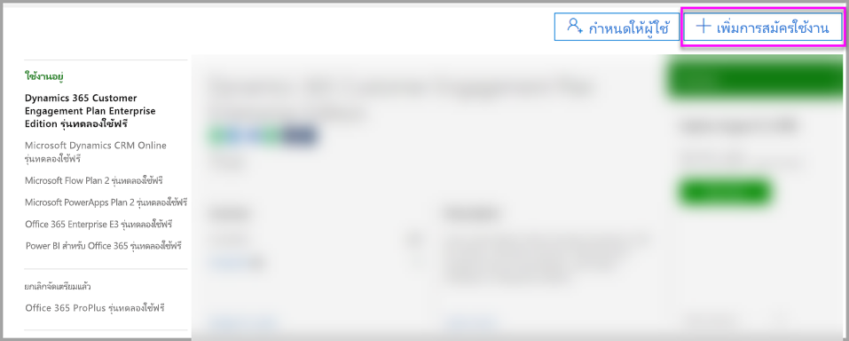

4. ค้นหาข้อเสนอการสมัครใช้งานที่ต้องการ:

    ภายใต้**ชุดโปรแกรม Enterprise** เลือก **Office 365 Enterprise E5**

    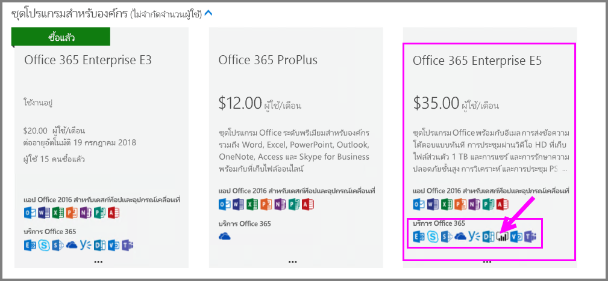

    ใต้**แผนอื่น ๆ**เลือก **Power BI Pro**

    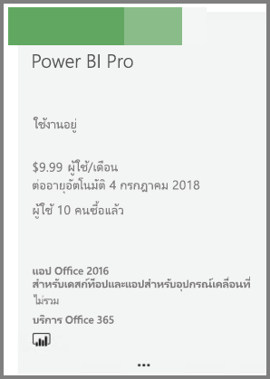

5. วางเมาส์เหนือจุดไข่ปลา (**... .**) สำหรับการสมัครรับข้อมูลที่ต้องการและเลือก **ซื้อเลย**

    

6. เลือก**ชำระเงินรายเดือน** หรือ**ชำระเงินสำหรับทั้งป** ีตามการกำหนดลักษณะการเรียกเก็บเงินของคุณ

7. ภายใต้**คุณต้องการผู้ใช้กี่คน?** ใส่จำนวนสิทธิ์การใช้งานที่ต้องการ แล้วเลือก**ซื้อสินค้าตอนนี้** เพื่อจบการทำธุรกรรม

8. ตรวจสอบว่าการสมัครใช้งานที่ได้มานั้นแสดงรายการอยู่บนหน้า**การสมัครใช้งาน**ตอนนี้หรือไม่

   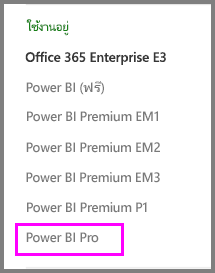

9. เมื่อต้องการเพิ่มสิทธิ์การใช้งานเพิ่มเติมหลังจากการซื้อครั้งแรก เลือก**Power BI Pro** จากหน้า**สมัครใช้งาน** จากนั้น**เพิ่ม/ลบสิทธิ์การใช้งาน**

## มอบใบอนุญาตการใช้งานใน Office 365

ทำตามขั้นตอนต่อไปนี้เพื่อกำหนดสิทธิ์การใช้งาน Power BI Pro ให้กับบัญชีผู้ใช้แต่ละราย:

1. เปิด [ศูนย์การจัดการ Microsoft 365](https://portal.office.com/adminportal/home#/homepage)

2. ในบานหน้าต่างด้านซ้าย ขยาย**ผู้ใช้** แล้วเลือก**ผู้ใช้ที่ใช้งานอยู่**

    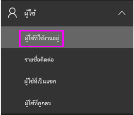

3. เลือกผู้ใช้ จากนั้นภายใต้**สิทธิ์การใช้งานผลิตภัณฑ์**เลือก**แก้ไข**

    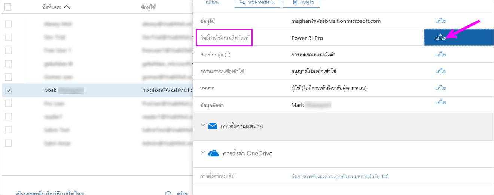

4. ภายใต้ **Power BI Pro** สลับการตั้งค่าเป็น**เปิด** แล้วเลือก**บันทึก**

    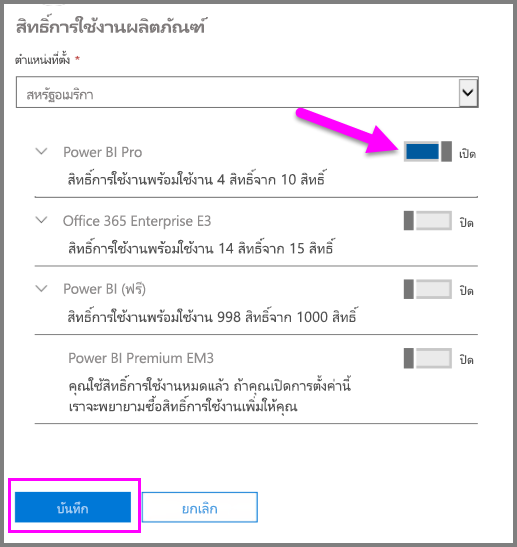

5. ภายใต้**สถานะ**ของบัญชีที่เลือก ตรวจสอบว่าที่มีการกำหนดสิทธิ์การใช้งาน Power BI Pro เรียบร้อยแล้ว

    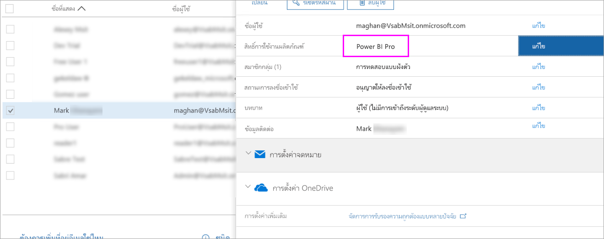

## มอบใบอนุญาตการใช้งานใน Azure

ทำตามขั้นตอนต่อไปนี้เพื่อกำหนดสิทธิ์การใช้งาน Power BI Pro ให้กับบัญชีผู้ใช้แต่ละราย:

1. เปิด[พอร์ทัล Azure](https://ms.portal.azure.com/#@microsoft.onmicrosoft.com/dashboard/private/39bc3cf7-31a4-43f6-954c-f2d69ca2f0)

2. ในแถบนำทางด้านซ้าย คลิกที่ **Azure Active Directory**

    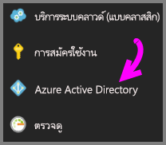

3. ภายใต้ **Azure Active Directory** เลือก**สิทธิ์การใช้งาน**

    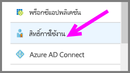

4. ภายใต้**สิทธิ์การใช้งาน** เลือก**ผลิตภัณฑ์ทั้งหมด** จากนั้นเลือก **Power BI Pro** เพื่อแสดงรายการของผู้ใช้ที่มีสิทธิ์ใช้งาน

    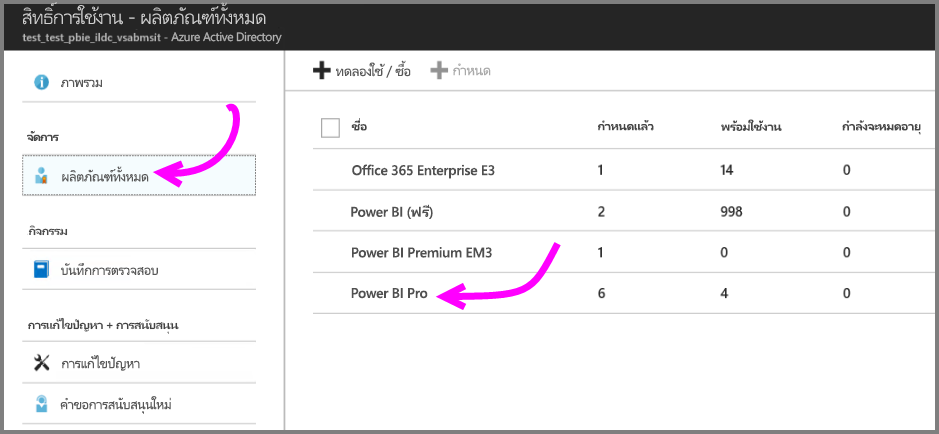

5. เลือก**กำหนด**เพื่อเพิ่มสิทธิ์การใช้งาน Power BI Pro ให้กับบัญชีผู้ใช้เพิ่มเติม

    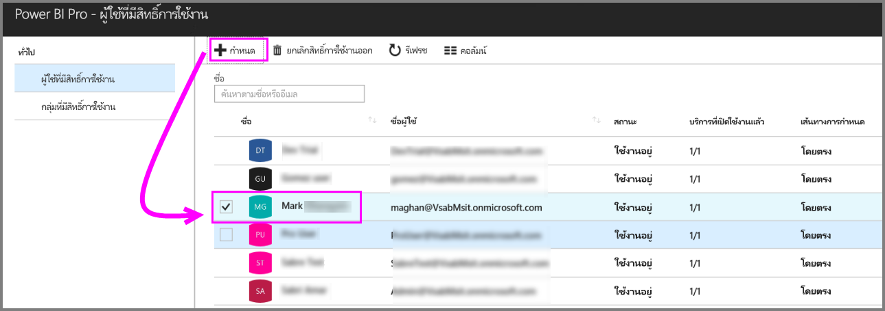

## ขั้นตอนถัดไป

ตอนนี้ คุณได้กำหนดสิทธิ์การใช้งานแล้ว เรียนรู้เพิ่มเติมเกี่ยวกับ Power BI Pro

[สิทธิ์การใช้งาน Power BI สำหรับองค์กรของคุณ](service-admin-licensing-organization.md)

[หาผู้ใช้ Power BI ที่ได้ลงชื่อเข้าใช้](service-admin-access-usage.md)

มีคำถามเพิ่มเติมหรือไม่? [ลองถามชุมชน Power BI](https://community.powerbi.com/)
