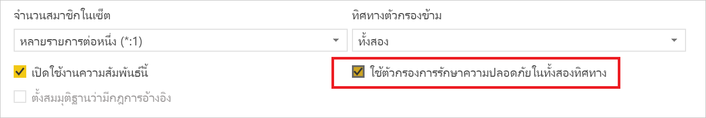
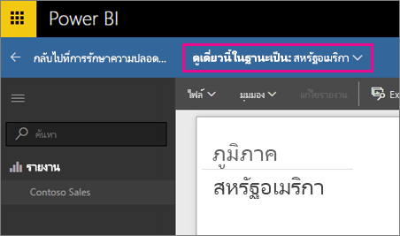
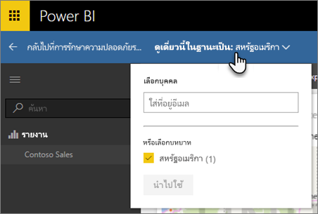

# Row-level security (RLS) กับ Power BI
<iframe width="560" height="315" src="https://www.youtube.com/embed/67fK0GoVQ80?showinfo=0" frameborder="0" allowfullscreen></iframe>

Row-level security (RLS) ด้วย Power BI สามารถใช้เพื่อจำกัดการเข้าถึงข้อมูลสำหรับผู้ใช้ที่กำหนด ตัวกรองจะจำกัดข้อมูลในระดับแถว คุณสามารถกำหนดตัวกรองภายในบทบาท

คุณสามารถกำหนดค่า RLS สำหรับแบบจำลองข้อมูลที่นำเข้าไปยัง Power BI ด้วย Power BI Desktop และคุณยังสามารถกำหนดค่า RLS บนชุดข้อมูลที่กำลังใช้ DirectQuery เช่น SQL Server ก่อนหน้านี้ คุณสามารถใช้ RLS ภายในแบบจำลองภายในองค์กรของ Analysis Services ภายนอก Power BI ได้เท่านั้น สำหรับข้อมูล Analysis Services แบบ live connection คุณกำหนดค่า Row-level security บนแบบจำลองภายในองค์กร ตัวเลือกความปลอดภัยจะไม่แสดงสำหรับชุดข้อมูลแบบ live connection

[!INCLUDE [include-short-name](./includes/rls-desktop-define-roles.md)]

ตามค่าเริ่มต้น การกรอง row-level security จะใช้ตัวกรองทิศทางเดียว โดยไม่คำนึงว่าการตั้งค่าความสัมพันธ์เป็นแบบทิศทางเดียวหรือสองทิศทาง คุณสามารถเปิดใช้ตัวกรองไขว้แบบสองทิศทางด้วย row-level security ได้ด้วยตนเองโดยการเลือกความสัมพันธ์ และทำเครื่องหมายในกล่อง**ใช้ตัวกรองความปลอดภัยในทั้งสองทิศทาง** คุณควรทำเครื่องหมายที่กล่องนี้เมื่อมีการใช้[row-level security แบบไดนามิก](https://docs.microsoft.com/en-us/sql/analysis-services/supplemental-lesson-implement-dynamic-security-by-using-row-filters)ที่คุณระบุ row-level security ตามชื่อผู้ใช้หรือรหัสเข้าสู่ระบบ 

สำหรับข้อมูลเพิ่มเติม ดูที่[ตัวกรองไขว้แบบสองทิศทางที่ใช้ DirectQuery ใน Power BI Desktop](desktop-bidirectional-filtering.md)และบทความเชิงเทคนิคของ[การรักษาความปลอดภัยแบบลำจองภาษา BI แบบตาราง](http://download.microsoft.com/download/D/2/0/D20E1C5F-72EA-4505-9F26-FEF9550EFD44/Securing the Tabular BI Semantic Model.docx)

[!INCLUDE [include-short-name](./includes/rls-desktop-view-as-roles.md)]

## จัดการความปลอดภัยบนแบบจำลองของคุณ
เมื่อต้องจัดการความปลอดภัยบนแบบจำลองข้อมูลของคุณ คุณจะต้องทำสิ่งต่อไปนี้

1. เลือก**จุดไข่ปลา (...)** สำหรับชุดข้อมูล
2. เลือก**ความปลอดภัย**
   
   

ซึ่งจะนำคุณไปยังหน้า RLS เพื่อให้คุณเพิ่มสมาชิกให้กับบทบาทที่คุณสร้างไว้ใน Power BI Desktop เฉพาะเจ้าของชุดข้อมูลเท่านั้นที่จะเห็นความปลอดภัยที่มีอยู่ ถ้าชุดข้อมูลอยู่ใน ‘กลุ่ม’ จะมีเพียง ‘ผู้ดูแล’ ของกลุ่มเท่านั้นที่จะเห็นตัวเลือกความปลอดภัย 

คุณสามารถสร้างหรือแก้ไขบทบาทภายใน Power BI Desktop

## ทำงานกับสมาชิก
### เพิ่มสมาชิก
คุณสามารถเพิ่มสมาชิกให้กับบทบาทโดยการพิมพ์ลงในที่อยู่อีเมล์หรือชื่อของผู้ใช้ หรือพิมพ์ลงในกลุ่มความปลอดภัยหรือรายการแจกจ่ายที่คุณต้องการเพิ่มได้ สมาชิกรายนี้จะต้องอยู่ภายในองค์กรของคุณ คุณไม่สามารถเพิ่ม ’กลุ่ม’ ที่สร้างขึ้นภายใน Power BI

คุณยังสามารถดูจำนวนสมาชิกที่เป็นส่วนหนึ่งของบทบาทจากเป็นตัวเลขในวงเล็บที่อยู่ถัดจากชื่อบทบาท หรือถัดจาก ‘สมาชิก’

### ลบสมาชิก
คุณสามารถลบสมาชิกได้โดยการเลือก X ที่อยู่ถัดจากชื่อของพวกเขา 

## การตรวจสอบบทบาทภายใน บริการ Power BI
คุณสามารถตรวจสอบว่าบทบาทที่คุณกำหนดทำงานถูกต้องหรือไม่ได้โดยการทดสอบบทบาท 

1. เลือก**จุดไข่ปลา (...)** ถัดจากบทบาท
2. เลือก**ทดสอบข้อมูลแบบเป็นบทบาท**

จากนั้นคุณจะเห็นรายงานที่พร้อมใช้งานสำหรับบทบาทนี้ แดชบอร์ดจะไม่แสดงในมุมมองนี้ ในแถบสีน้ำเงินด้านบน คุณจะเห็นสิ่งที่จะถูกนำไปใช้

คุณสามารถทดสอบบทบาทหรือการรวมบทบาทอื่นๆได้โดยการเลือก**ดูเป็น**เดี๋ยวนี้

คุณสามารถเลือกเพื่อดูข้อมูลเป็นรายบุคคลหรือคุณสามารถเลือกการรวมบทบาทที่พร้อมใช้งานเพื่อตรวจสอบว่ากำลังทำงานอยู่หรือไม่ 

เมื่อต้องการกลับไปยังมุมมองปกติ เลือก **กลับไปยัง Row-Level Security**

[!INCLUDE [include-short-name](./includes/rls-usernames.md)]

## ใช้ RLS กับพื้นที่ทำงานแอปใน Power BI
ถ้าคุณเผยแพร่รายงาน Power BI Desktop ของคุณไปยังพื้นที่ทำงานแอปภายใน Power BI service บทบาทจะได้รับการปรับใช้กับสมาชิกแบบอ่านอย่างเดียว คุณจะต้องระบุว่าสมาชิกสามารถดูเนื้อหา Power BI ภายในการตั้งค่าพื้นที่ทำงานแอปได้หรือไม่

> [!WARNING]
> ถ้าคุณกำหนดค่าพื้นที่ทำงานแอปเพื่อให้สมาชิกมีสิทธิ์ในการแก้ไข จะไม่สามารถใช้บทบาท RLS กับพื้นที่ทำงานแอปนั้นได้ ผู้ใช้จะสามารถดูข้อมูลทั้งหมด
> 
> 

[!INCLUDE [include-short-name](./includes/rls-limitations.md)]

[!INCLUDE [include-short-name](./includes/rls-faq.md)]

## ขั้นตอนถัดไป
[Row-level security (RLS) กับ Power BI Desktop](desktop-rls.md)  

คุณมีคำถามเพิ่มเติมหรือไม่ [ลองถามชุมชน Power BI](http://community.powerbi.com/)

