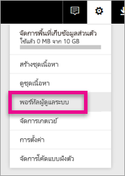

# <a name="understanding-the-power-bi-admin-role"></a>ทำความเข้าใจเกี่ยวกับบทบาทผู้ดูแลระบบ Power BI
เรียนรู้ว่าคุณสามารถใช้บทบาทผู้ดูแล Power BI ภายในองค์กรของคุณได้อย่างไร

<iframe width="640" height="360" src="https://www.youtube.com/embed/PQRbdJgEm3k?showinfo=0" frameborder="0" allowfullscreen></iframe>

บทบาทผู้ดูแลระบบบริการ Power BI สามารถกำหนดให้กับผู้ใช้ ที่ควรมีสิทธิ์เข้าถึง พอร์ทัลผู้ดูแล Power BI โดยไม่ต้องให้สิทธิ์การให้เข้าถึงการดูแลอื่น ๆ ของ Office 365 ตัวอย่างเช่น บทบาทผู้ดูแลระบบส่วนกลาง ซึ่งมีไว้สำหรับผู้ที่รับหน้าที่ดูแล Power BI สำหรับองค์กรของพวกเขา

ผู้ดูแลระบบผู้ใช้ Office 365 สามารถกำหนดให้ผู้ใช้เป็น ผู้ดูแลระบบ Power BI ภายใน ศูนย์การจัดการ Office 365 หรือผ่านทางสคริปต์ PowerShell ทันทีที่ผู้ใช้ถูกกำหนดสิทธิ์ พวกเขาจะสามารถเข้าถึง[พอร์ทัลผู้ดูแล Power BI](service-admin-portal.md) ที่นั้น พวกเขาสามารถเข้าถึงการวัดปริมาณการใช้งานของทั้งผู้เช่า และสามารถควบคุมการใช้งานคุณลักษณะ Power BI ของผู้เช่าอีกด้วย



## <a name="using-the-office-365-admin-center-to-assign-a-role"></a>การใช้ศูนย์การจัดการ Office 365 เพื่อกำหนดบทบาท
เพื่อกำหนดผู้ใช้ให้มีในบทบาทเป็นผู้ดูแลระบบ Power BI ภายในศูนย์การจัดการ Office 365 คุณสามารถทำต่อไปนี้

1. เรียกดูศูนย์การจัดการ Office 365 และเลือก**ผู้ใช้** > **ผู้ใช้ที่ใช้งานอยู่**
   
    
2. เลือกผู้ใช้ที่คุณต้องการกำหนดบทบาทให้
3. เลือก**แก้ไข**สำหรับบทบาท
   
    
4. เลือก**ผู้ดูแลระบบที่กำหนดเอง** > **ผู้ดูแลบริการของ Power BI**
   
    
5. เลือก**บันทึก**

คุณควรเห็น**ผู้ดูแลบริการของ Power BI** อยู่ในรายการบทบาทของผู้ใช้รายนั้น พวกเขาจะมีสิทธิ์การเข้าถึง[พอร์ทัลผู้ดูแล Power BI](service-admin-portal.md)


## <a name="using-powershell-to-assign-a-role"></a>ใช้ PowerShell เพื่อกำหนดบทบาท
เพื่อจะเรียกใช้คำสั่ง PowerShell คุณต้องมีโมดูล Azure Active Directory PowerShell ติดตั้งอยู่ก่อนแล้ว

### <a name="download-azure-ad-powershell-module"></a>ดาวน์โหลดโมดูล Azure AD PowerShell
[ดาวน์โหลด PowerShell Azure Active Directory เวอร์ชัน 2](https://github.com/Azure/azure-docs-powershell-azuread/blob/master/Azure%20AD%20Cmdlets/AzureAD/index.md)

[ดาวน์โหลด Azure Active Directory PowerShell เวอร์ชัน 1.1.166.0 GA](http://connect.microsoft.com/site1164/Downloads/DownloadDetails.aspx?DownloadID=59185)

### <a name="command-to-add-role-to-member"></a>คำสั่งเพื่อเพิ่มบทบาทให้กับสมาชิก
**คำสั่ง Azure AD PowerShell v2**

คุณจะต้องได้รับ **ObjectId** สำหรับบทบาท**ผู้ดูแลบริการของ Power BI** คุณสามารถเรียกใช้ [Get-AzureADDirectoryRole](https://docs.microsoft.com/powershell/azuread/v2/get-azureaddirectoryrole) เพื่อรับ **ObjectId**

```
PS C:\Windows\system32> Get-AzureADDirectoryRole

ObjectId                             DisplayName                        Description
--------                             -----------                        -----------
00f79122-c45d-436d-8d4a-2c0c6ca246bf Power BI Service Administrator     Full access in the Power BI Service.
250d1222-4bc0-4b4b-8466-5d5765d14af9 Helpdesk Administrator             Helpdesk Administrator has access to perform..
3ddec257-efdc-423d-9d24-b7cf29e0c86b Directory Synchronization Accounts Directory Synchronization Accounts
50daa576-896c-4bf3-a84e-1d9d1875c7a7 Company Administrator              Company Administrator role has full access t..
6a452384-6eb9-4793-8782-f4e7313b4dfd Device Administrators              Device Administrators
9900b7db-35d9-4e56-a8e3-c5026cac3a11 AdHoc License Administrator        Allows access manage AdHoc license.
a3631cce-16ce-47a3-bbe1-79b9774a0570 Directory Readers                  Allows access to various read only tasks in ..
f727e2f3-0829-41a7-8c5c-5af83c37f57b Email Verified User Creator        Allows creation of new email verified users.
```

ในกรณีนี้ objectid ของบทบาทคือ 00f79122-c45d-436d-8d4a-2c0c6ca246bf

คุณยังจำเป็นต้องทราบ **ObjectID** ของผู้ใช้ คุณสามารถหาได้ด้วย [Get-AzureADUser](https://docs.microsoft.com/powershell/azuread/v2/get-azureaduser)

```
PS C:\Windows\system32> Get-AzureADUser -SearchString 'tim@contoso.com'

ObjectId                             DisplayName UserPrincipalName      UserType
--------                             ----------- -----------------      --------
6a2bfca2-98ba-413a-be61-6e4bbb8b8a4c Tim         tim@contoso.com        Member
```

เพื่อเพิ่มสมาชิกลงในบทบาท เรียกใช้ [AzureADDirectoryRoleMember](https://docs.microsoft.com/powershell/azuread/v2/add-azureaddirectoryrolemember)

| พารามิเตอร์ | คำอธิบาย |
| --- | --- |
| ObjectId |ObjectId ของบทบาท |
| RefObjectId |ObjectId ของสมาชิก |

```
Add-AzureADDirectoryRoleMember -ObjectId 00f79122-c45d-436d-8d4a-2c0c6ca246bf -RefObjectId 6a2bfca2-98ba-413a-be61-6e4bbb8b8a4c
```

**คำสั่ง Azure AD PowerShell v1**

เพื่อเพิ่มสมาชิกให้กับบทบาทโดยใช้ cmdlet ของ Azure AD v1 คุณเรียกใช้คำสั่ง [Add-MsolRoleMember](https://docs.microsoft.com/powershell/msonline/v1/add-msolrolemember)

```
Add-MsolRoleMember -RoleMemberEmailAddress "tim@contoso.com" -RoleName "Power BI Service Administrator"
```

## <a name="limitations-and-considerations"></a>ข้อจำกัดและข้อควรพิจารณา
บทบาทผู้ดูแลบริการของ Power BI ไม่ได้ให้การเข้าถึงต่อไปนี้

* ความสามารถในการปรับเปลี่ยนผู้ใช้และสิทธิ์การใช้งานภายในศูนย์การจัดการ Office 365
* การเข้าถึงบันทึกการตรวจสอบ สำหรับข้อมูลเพิ่มเติม ดู[การตรวจสอบภายในองค์กรของคุณ](service-admin-auditing.md)

## <a name="next-steps"></a>ขั้นตอนถัดไป
[พอร์ทัลผู้ดูแล power BI](service-admin-portal.md)  
[Add-AzureADDirectoryRoleMember](https://docs.microsoft.com/powershell/azuread/v2/add-azureaddirectoryrolemember)  
[Add-MsolRoleMember](https://docs.microsoft.com/powershell/msonline/v1/add-msolrolemember)  
[การตรวจสอบ Power BI ในองค์กรของคุณ](service-admin-auditing.md)  
[การดูแล Power BI ในองค์กรของคุณ](service-admin-administering-power-bi-in-your-organization.md)  

มีคำถามเพิ่มเติมหรือไม่? [ลองถามชุมชน Power BI](http://community.powerbi.com/)

