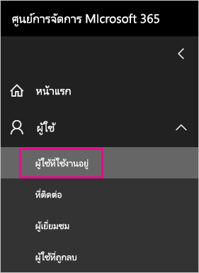
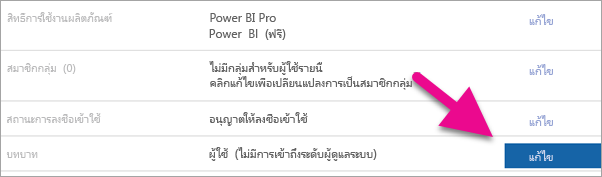
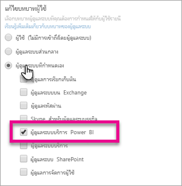

# <a name="understanding-the-power-bi-service-administrator-role"></a>ทำความเข้าใจเกี่ยวกับบทบาทผู้ดูแลระบบบริการของ Power BI

เรียนรู้วิธีการใช้บทบาทผู้ดูแลระบบบริการของ Power BI ในองค์กรของคุณ ผู้ใช้ที่ได้รับบทบาทนี้สามารถควบคุมผู้เช่า และคุณลักษณะการจัดการผู้เช่าใน Power BI แบบเต็มรูปแบบ ยกเว้นสิทธิ์การใช้งาน

บทบาทผู้ดูแลระบบบริการของ Power BI สามารถกำหนดให้แก่ผู้ใช้ ที่จำเป็นต้องเข้าถึงพอร์ทัลผู้ดูแล Power BI ได้โดยไม่ต้องให้สิทธิ์เข้าถึงการจัดการทั้งหมดของ Office 365

ผู้ดูแลระบบการจัดการผู้ใช้ office 365 กำหนดผู้ใช้ไปยังบทบาทผู้ดูแลระบบบริการของ Power BI ในศูนย์การจัดการ Microsoft 365 หรือโดยใช้สคริปต์ PowerShell ทันทีที่ผู้ใช้ถูกกำหนดสิทธิ์ ผู้ใช้จะสามารถเข้าถึง [พอร์ทัลผู้ดูแล Power BI](service-admin-portal.md) ได้ ในส่วนนั้น ผู้ใช้จะสามารถเข้าถึงการวัดปริมาณการใช้งานของผู้เช่า และสามารถควบคุมการใช้งานคุณลักษณะ Power BI ของผู้เช่าอีกได้ด้วย

## <a name="limitations-and-considerations"></a>ข้อจำกัดและข้อควรพิจารณา

บทบาทผู้ดูแลบริการของ Power BI ไม่มีความสามารถดังต่อไปนี้:

* ความสามารถในการปรับเปลี่ยนผู้ใช้และสิทธิ์การใช้งานภายในศูนย์การจัดการ Microsoft 365

* การเข้าถึงบันทึกการตรวจสอบ สำหรับข้อมูลเพิ่มเติม ดู[การตรวจสอบภายในองค์กรของคุณ](service-admin-auditing.md)

## <a name="assign-users-to-the-admin-role-in-office-365"></a>กำหนดบทบาทผู้ดูแลระบบแก่ผู้ใช้ใน Office 365

หากต้องการกำหนดผู้ใช้ลงในบทบาทผู้ดูแลระบบ Power BI ในศูนย์การจัดการ Microsoft 365 ให้ปฏิบัติตามขั้นตอนเหล่านี้

1. ใน[ศูนย์การจัดการ Microsoft 365](https://portal.office.com/adminportal/home#/homepage) **ให้เลือก** >  **ผู้ใช้ผู้ใช้ที่ใช้งานอยู่**

    

1. เลือกผู้ใช้ที่คุณต้องการกำหนดบทบาทให้

1. ใต้ **บทบาท** เลือก **แก้ไข**

    

1. เลือก **ผู้ดูแลระบบที่กำหนดเอง** > **ผู้ดูแลบริการของ Power BI**

    

1. เลือก **บันทึก** จากนั้น **ปิด**

คุณควรเห็น**ผู้ดูแลบริการของ Power BI** อยู่ในรายการบทบาทของผู้ใช้รายนั้น


## <a name="assign-users-to-the-admin-role-with-powershell"></a>กำหนดบทบาทผู้ดูแลระบบแก่ผู้ใช้ด้วย PowerShell

นอกจากนี้คุณยังสามารถกำหนดบทบาทแก่ผู้ใช้โดยใช้ PowerShell ได้เช่นกัน จัดการผู้ใช้ใน Azure Active Directory (Azure AD) หากคุณยังไม่มีโมดูล Azure AD PowerShell ให้ [ดาวน์โหลด และติดตั้งเวอร์ชันล่าสุด](https://www.powershellgallery.com/packages/AzureAD/)

1. ขั้นแรก เชื่อมต่อกับ Azure AD:
   ```
   PS C:\Windows\system32> Connect-AzureAD
   ```

1. ขั้นต่อไปคุณจะต้องได้รับ **ObjectId** สำหรับบทบาท **ผู้ดูแลบริการของ Power BI** คุณสามารถเรียกใช้ [Get-AzureADDirectoryRole](/powershell/module/azuread/get-azureaddirectoryrole) เพื่อรับ **ObjectId**

    ```
    PS C:\Windows\system32> Get-AzureADDirectoryRole

    ObjectId                             DisplayName                        Description
    --------                             -----------                        -----------
    00f79122-c45d-436d-8d4a-2c0c6ca246bf Power BI Service Administrator     Full access in the Power BI Service.
    250d1222-4bc0-4b4b-8466-5d5765d14af9 Helpdesk Administrator             Helpdesk Administrator has access to perform..
    3ddec257-efdc-423d-9d24-b7cf29e0c86b Directory Synchronization Accounts Directory Synchronization Accounts
    50daa576-896c-4bf3-a84e-1d9d1875c7a7 Company Administrator              Company Administrator role has full access t..
    6a452384-6eb9-4793-8782-f4e7313b4dfd Device Administrators              Device Administrators
    9900b7db-35d9-4e56-a8e3-c5026cac3a11 AdHoc License Administrator        Allows access manage AdHoc license.
    a3631cce-16ce-47a3-bbe1-79b9774a0570 Directory Readers                  Allows access to various read only tasks in ..
    f727e2f3-0829-41a7-8c5c-5af83c37f57b Email Verified User Creator        Allows creation of new email verified users.
    ```

    ในกรณีนี้ **ObjectId** ของบทบาทคือ 00f79122-c45d-436d-8d4a-2c0c6ca246bf

1. ถัดไป รับ **ObjectId** ของผู้ใช้ คุณสามารถหาได้ด้วย [Get-AzureADUser](/powershell/module/azuread/get-azureaduser)

    ```
    PS C:\Windows\system32> Get-AzureADUser -ObjectId 'tim@contoso.com'

    ObjectId                             DisplayName UserPrincipalName      UserType
    --------                             ----------- -----------------      --------
    6a2bfca2-98ba-413a-be61-6e4bbb8b8a4c Tim         tim@contoso.com        Member
    ```

1. เพื่อเพิ่มสมาชิกลงในบทบาท เรียกใช้ [AzureADDirectoryRoleMember](/powershell/module/azuread/add-azureaddirectoryrolemember)

    | พารามิเตอร์ | คำอธิบาย |
    | --- | --- |
    | ObjectId |ObjectId ของบทบาท |
    | RefObjectId |ObjectId ของสมาชิก |

    ```powershell
    Add-AzureADDirectoryRoleMember -ObjectId 00f79122-c45d-436d-8d4a-2c0c6ca246bf -RefObjectId 6a2bfca2-98ba-413a-be61-6e4bbb8b8a4c
    ```

## <a name="next-steps"></a>ขั้นตอนถัดไป

[การดูแล Power BI ในองค์กรของคุณ](service-admin-administering-power-bi-in-your-organization.md)  
[พอร์ทัลผู้ดูแล Power BI](service-admin-portal.md)  

มีคำถามเพิ่มเติมหรือไม่? [ลองถามชุมชน Power BI](https://community.powerbi.com/)