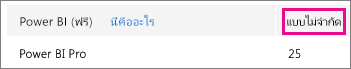
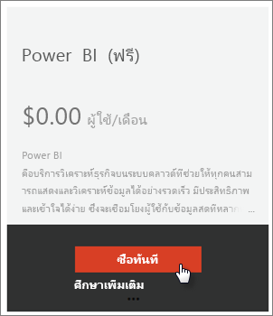
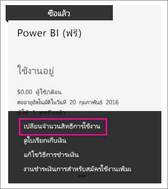

# Power BI (ฟรี) ในองค์กรของคุณ
บทความนี้จะกล่าวถึงวิธีใช้งานข้อเสนอ Power BI (ฟรี) ภายในองค์กรของคุณ องค์กรหมายถึงการที่คุณมีผู้เช่าและสามารถจัดการผู้ใช้และบริการภายในผู้เช่านั้น ในฐานะผู้ดูแล คุณสามารถควบคุมการกำหนดสิทธิ์การใช้งานหรือคุณสามารถอนุญาตให้ผู้ใช้สามารถลงชื่อสมัครใช้้เป็นรายบุคคล เราจะมาดูที่สิทธิ์การใช้งาน Power BI (ฟรี) และวิธีที่คุณสามารถควบคุมการลงชื่อสมัครใช้้เป็นรายบุคคลได้

## การลงชื่อสมัครใช้้เป็นรายบุคคลเทียบกับการกำหนดสิทธิ์การใช้งาน
ผู้ใช้ภายในองค์กรของคุณสามารถเข้าถึง Power BI ด้วยวิธีที่แตกต่างกันสองวิธี ผู้ใช้สามารถลงชื่อสมัครใช้ Power BI เป็นรายบุคคลได้หรือคุณสามารถกำหนดสิทธิ์การใช้งาน Power BI ให้แก่ผู้ใช้ภายในพอร์ทัลผู้ดูแลระบบ Office 365

การอนุญาตให้ลงชื่อสมัครใช้เป็นรายบุคคลจะช่วยลดภาระของผู้ดูแลระบบองค์กรของคุณได้โดยอนุญาตให้ผู้ใช้ที่สนใจ Power BI ลงชื่อสมัครใช้ฟรี

สำหรับการควบคุมเพิ่มเติม คุณสามารถบล็อกลงชื่อสมัครใช้เป็นรายบุคคลและกำหนดสิทธิ์การใช้งาน Power BI ได้ด้วยตัวคุณเองภายในศูนย์การจัดการ Office 365 การทำเช่นนี้จะช่วยให้คุณสามารถให้ข้อมูลที่เจาะจงเกี่ยวกับบุคคลที่สามารถเข้าถึงบริการใดภายในองค์กรของคุณ นี่คือตัวเลือกที่ดีมากถ้าคุณจำเป็นต้องจัดการกับการตรวจสอบและจำเป็นต้องทราบแน่นอนว่าใครสามารถใช้อะไรได้บ่าง

## วิธีการได้รับสิทธิ์การใช้งานแบบไม่จำกัด
ภายในศูนย์การจัดการ Office 365 ภายใต้ **การเรียกเก็บเงิน** > **สิทธิ์การใช้งาน** คุณอาจเห็นหรือไม่เห็น Power BI (ฟรี) ที่ให้สิทธิ์การใช้งานแบบไม่จำกัด

การบล็อกสิทธิ์การใช้งานนี้จะปรากฏขึ้นหลังจากที่มีคนลงชื่อสมัครใช้ Power BI เป็นรายบุคคลครั้งแรก ในระหว่างขั้นตอนนั้น การบล็อกสิทธิ์การใช้งานนี้จะเชื่อมต่ออยู่กับองค์กรของคุณ และสิทธิ์การใช้งานจะถูกกำหนดให้กับผู้ใช้ที่ลงชื่อสมัครใช้อยู่

ถ้าคุณกำลังบล็อกการที่ผู้ใช้่ลงชื่อสมัครใช้เป็นรายบุคคลและยังไม่มีใครได้ลงชื่อสมัครใช้ คุณจะไม่เห็นการบล็อกสิทธิ์การใช้งานนี้ คุณสามารถอนุญาตผู้ใช้ลงชื่อสมัครใช้เป็นรายบุคคลและมีผู้ใช้หนึ่งรายที่่ลงชื่อสมัครใช้แล้วหรือไม่ก็คุณสามารถได้รับสิทธิ์การใช้งานฟรีผ่านขั้นตอนการสมัครใช้งาน Office 365 เพิ่มซึ่งจะกล่าวถึงถัดไป

หลังจากการบล็อกสิทธิ์การใช้งาน Power BI (ฟรี) พร้อมใช้งาน คุณก็จะสามารถกำหนดสิทธิ์การใช้งานเหล่านั้นให้แก่ผู้ใช้ของคุณ สำหรับข้อมูลเพิ่มเติมเกี่ยวกับวิธีการกำหนดสิทธิ์การใช้งาน ดู [กำหนดสิทธิ์การใช้งานให้ผู้ใช้ใน Office 365 ](https://support.office.com/article/Assign-or-unassign-licenses-for-Office-365-for-business-997596b5-4173-4627-b915-36abac6786dc)

## การได้รับสิทธิ์การใช้งานฟรีผ่านการเพิ่มการสมัครใช้งานภายใน Office 365
1. นำทางไปยัง [ศูนย์การจัดการ Office 365](https://portal.office.com/admin/default.aspx)
2. ในบานหน้าต่างนำทางด้านซ้าย เลือก **การเรียกเก็บเงิน** > **การสมัครใช้งาน**
3. เลือก **เพิ่มการสมัครใช้งาน +** ทางด้านขวา
4. ภายใต้แผนอื่น ๆ โฮเวอร์บน **ไข่ปลา (...)**  สำหรับ Power BI (ฟรี) แล้วเลือก **ซื้อตอนนี้**
   
    
5. ใส่จำนวนสิทธิ์การใช้งานที่คุณต้องการเพิ่ม และเลือก **ซื้อสินค้าตอนนี้** หรือ **เพิ่มลงในรถเข็น**
   
   > [!NOTE]
   > คุณสามารถเพิ่มเติมได้ในภายหลังถ้าจำเป็น
   > 
   > 
6. ใส่ข้อมูลที่จำเป็นในโฟลว์ซื้อสินค้า

จะไม่มีการซื้อเมื่อใช้วิธีนี้ แม้ว่าคุณจะต้องใส่ข้อมูลบัตรเครดิตของคุณสำหรับเรียกเก็บเงินหรือไม่ก็เลือกที่จะออกใบแจ้งหนี้ก็ตาม

ถ้าคุณตัดสินใจในภายหลังว่า คุณต้องการเพิ่มสิทธิ์การใช้งานเพิ่มเติม ก็สามารถกลับไปยัง **เพิ่มการสมัครใช้งาน** และเลือก **เปลี่ยนจำนวนสิทธิ์การใช้งาน** สำหรับ Power BI (ฟรี) ได้

ในตอนนี้ คุณสามารถกำหนดสิทธิ์การใช้งานเหล่านั้นให้กับผู้ใช้ของคุณ สำหรับข้อมูลเพิ่มเติมเกี่ยวกับวิธีการกำหนดสิทธิ์การใช้งาน ดู [กำหนดสิทธิ์การใช้งานให้ผู้ใช้ใน Office 365 ](https://support.office.com/article/Assign-or-unassign-licenses-for-Office-365-for-business-997596b5-4173-4627-b915-36abac6786dc)

## เปิดใช้งานหรือปิดใช้งานการลงชื่อสมัครใช้โดยผู้ใช้เป็นรายบุคคลใน Azure Active Directory
ในฐานะผู้ดูแล คุณสามารถเลือกเปิดใช้งานหรือปิดใช้งานการลงชื่อสมัครใช้โดยผู้ใช้เป็นรายบุคคลได้โดยเป็นส่วนหนึ่งของ Azure Active Directory (AAD) ถ้าคุณทราบวิธีการใช้ประโยชน์จากคำสั่ง AAD PowerShell ก็สามารถเปิดใช้งานหรือปิดใช้งานการสมัครใช้งานแบบเฉพาะกิจได้ด้วยตัวคุณเอง [เรียนรู้เพิ่มเติม](https://technet.microsoft.com/library/jj151815.aspx)

การตั้งค่า AAD ซึ่งควบคุมสิ่งนี้คือ **AllowAdHocSubscriptions** ผู้เช่าส่วนใหญ่จะมีการตั้งค่านี้ให้เป็นจริงซึ่งหมายความว่า ถูกเปิดใช้งาน ถ้าคุณซื้อ Power BI ผ่านคู่ค้า อาจมีการตั้งค่าเป็นเท็จตามค่าเริ่มต้น ซึ่งหมายความว่า ถูกปิดใช้งาน

1. ก่อนอื่น คุณจำเป็นต้องลงชื่อเข้าใช้ Azure Active Directory โดยใช้ข้อมูลประจำตัว Office 365 ของคุณ บรรทัดแรกจะถามข้อมูลประจำตัวของคุณ บรรทัดสองจะเชื่อมต่อกับ Azure Active Directory
   
     $msolcred = get-credential   connect-msolservice -credential $msolcred
   
   
2. ในทันทีที่ลงชื่อเข้าใช้ คุณสามารถออกคำสั่งต่อไปนี้เพื่อดูสิ่งที่ผู้เช่าของคุณกำหนดค่าไว้ในขณะนี้
   
     Get-MsolCompanyInformation | fl AllowAdHocSubscriptions
3. คุณสามารถทำให้คำสั่งนี้เปิดใช้งาน ($true) หรือปิดใช้งาน AllowAdHocSubscriptions ($false)
   
     Set-MsolCompanySettings -AllowAdHocSubscriptions $true

> [!NOTE]
> การบล็อกนี้ป้องกันไม่ให้ผู้ใช้ใหม่ในองค์กรของคุณลงชื่อสมัครใช้ Power BI ผู้ใช้ที่ลงชื่อสมัครใช้ Power BI ก่อนปิดใช้งานการลงชื่อสมัครใช้ใหม่สำหรับองค์กรของคุณจะยังคงรักษาสิทธิ์การใช้งานของพวกเขาไว้อยู่
> 
> 

## ขั้นตอนถัดไป
[ลงชื่อสมัครใช้ Power BI แบบบริการตนเอง](service-self-service-signup-for-power-bi.md)  
[ซื้อ Power BI Pro](service-admin-purchasing-power-bi-pro.md)  
[ลงชื่อสมัครใช้ Power BI (ฟรี) กับผู้เช่า Azure Active Directory แบบกำหนดเอง](developer/create-an-azure-active-directory-tenant.md)  
[Power BI Premium คืออะไร](service-premium.md)  
[เอกสารทางเทคนิคของ Power BI Premium](https://aka.ms/pbipremiumwhitepaper)  

มีคำถามเพิ่มเติมหรือไม่ [ลองถามชุมชน Power BI](http://community.powerbi.com/)

