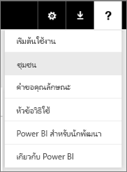

# ข้อผิดพลาด: เราไม่พบข้อมูลใด ๆ ในสมุดงาน Excel ของคุณ

>[!NOTE]
>บทความนี้นำไปใช้กับ Excel 2007 และเวอร์ชันที่ใหม่กว่า

เมื่อคุณนำเข้าสมุดงาน Excel ไปใน Power BI คุณอาจเห็นข้อผิดพลาดต่อไปนี้:

*ข้อผิดพลาด: เราไม่พบข้อมูลใด ๆ ในสมุดงาน Excel ของคุณ ข้อมูลของคุณอาจไม่ถูกจัดรูปแบบอย่างถูกต้อง คุณจำเป็นต้องแก้ไขสมุดงานของคุณใน Excel จากนั้นนำเข้าอีกครั้ง*

## แก้ไขปัญหาอย่างรวดเร็ว
1. แก้ไขมุดงานใน Excel
2. เลือกช่วงของเซลล์ที่มีข้อมูลของคุณ แถวแรกควรประกอบด้วยส่วนหัวของคอลัมน์ (ชื่อคอลัมน์)
3. กด**Ctrl + T**เพื่อสร้างตาราง
4. บันทึกสมุดงานของคุณ
5. กลับไปยัง Power BI และนำเข้าสมุดงานของคุณอีกครั้ง หรือถ้าคุณกำลังทำงานใน Excel 2016 และคุณได้บันทึกสมุดงานของคุณไปยัง OneDrive for Business ใน Excel ให้คลิกไฟล์ > เผยแพร่

## รายละเอียด
### สาเหตุ
ใน Excel คุณสามารถสร้า**ตาราง**นอกช่วงของเซลล์ได้ ซึ่งทำให้ง่ายขึ้นเมื่อต้องการเรียงลำดับ กรอง และจัดรูปแบบข้อมูล

เมื่อคุณนำเข้าสมุดงาน Excel, Power BI จะค้นหาตารางเหล่านี้และนำเข้าในชุดข้อมูลหนึ่ง ถ้าไม่พบตารางใด คุณจะเห็นข้อความข้อผิดพลาดนี้

### วิธีแก้
1. เปิดสมุดงานของคุณใน Excel 
    >[!NOTE]
    >รูปภาพต่อไปนี้เป็นภาพของ Excel 2013 ถ้าคุณกำลังใช้เวอร์ชันอื่น องค์ประกอบต่าง ๆ อาจแตกต่างกันเล็กน้อย แต่ขั้นตอนต่าง ๆ จะเหมือนกัน
    
    
2. เลือกช่วงของเซลล์ที่มีข้อมูลของคุณ แถวแรกควรประกอบด้วยส่วนหัวของคอลัมน์ (ชื่อคอลัมน์)
   
    
3. ใน Ribbon บนแถบ**แทรก** คลิก**ตาราง** (หรือโดยการใช้ทางลัด กด**Ctrl + T**)
   
    
4. คุณจะเห็นกล่องโต้ตอบต่อไปนี้ ตรวจสอบให้แน่ใจว่าได้เลือก**ตารางของฉันมีส่วนหัว** และเลือก**ตกลง**:
   
    
5. ในตอนนี้ ข้อมูลของคุณถูกจัดรูปแบบเป็นตาราง:
   
    
6. บันทึกสมุดงานของคุณ
7. กลับไปยัง Power BI เลือกรับข้อมูลที่ด้านล่างของพื้นที่นำทางด้านซ้ายมือ
   
    
8. ในกล่อง**ไฟล์** เลือก**รับ**
   
    
9. นำเข้าสมุดงาน Excel ของคุณอีกครั้ง ขณะนี้ การนำเข้าควรพบตารางและดำเนินการสำเร็จ
   
    ถ้าการนำเข้ายังคงล้มเหลว แจ้งให้เราทราบโดยการคลิก ** ชุมชน ** ในเมนูช่วยเหลือ:
   
    
