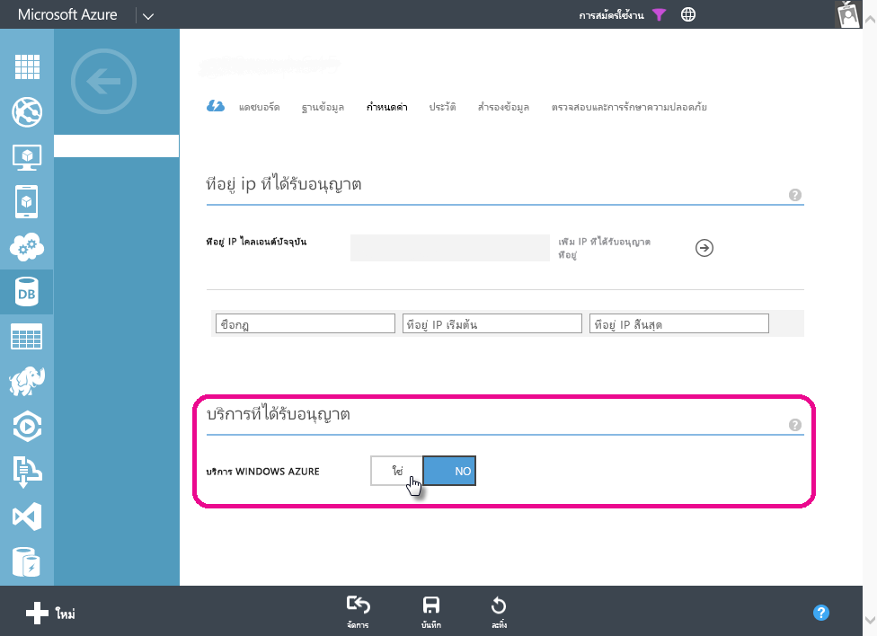

# แก้ไขปัญหาการรีเฟรชตามกำหนดการสำหรับ Azure SQL Database ใน Power BI
โปรดดูที่[รีเฟรชข้อมูลใน Power BI](refresh-data.md)สำหรับขั้นตอนโดยละเอียดเกี่ยวกับการตั้งค่าการรีเฟรชตามกำหนดการ

ขณะที่กำลังตั้งค่าการรีเฟรชตามกำหนดการสำหรับฐานข้อมูล Azure SQL หากคุณได้รับข้อผิดพลาดที่มีรหัสข้อผิดพลาด 400 ระหว่างการแก้ไขข้อมูลประจำตัว กรุณาลองทำตามขึ้นตอนต่อไปนี้เพื่อตั้งค่ากฎไฟร์วอลล์ที่เหมาะสม

1. ลงชื่อเข้าใช้ในพอร์ทัลการจัดการ Azure ของคุณ
2. ไปที่เซิร์ฟเวอร์ Azure SQL ที่คุณกำลังกำหนดค่าการรีเฟรช
3. เปิดใช้งาน 'Windows Azure Services' ในส่วนบริการที่ได้รับอนุญาต

  

มีคำถามเพิ่มเติมหรือไม่ [ลองไปที่ชุมชน Power BI](http://community.powerbi.com/)

