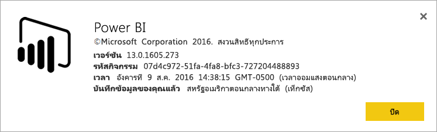
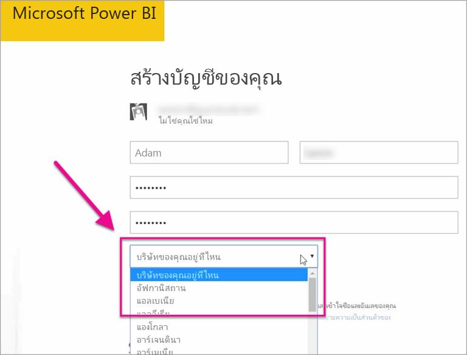

# ผู้เช่า Power BI ของฉันอยู่ที่ไหน

<iframe width="560" height="315" src="https://www.youtube.com/embed/0fOxaHJPvdM?showinfo=0" frameborder="0" allowfullscreen></iframe>

เรียนรู้ตำแหน่งที่ผู้เช่า Power BI ของคุณอยู่และวิธีเลือกตำแหน่งที่ตั้ง การทำความเข้าใจตำแหน่งที่ตั้งถือเป็นสิ่งสำคัญเนื่องจากสามารถส่งผลต่อการโต้ตอบที่คุณมีกับบริการได้

## วิธีการตรวจสอบตำแหน่งที่ผู้เช่า Power BI ของคุณอยู่

หากต้องการค้นหาภูมิภาคที่ผู้เช่าของคุณอยู่ ให้ปฏิบัติตามขั้นตอนเหล่านี้

1. ในบริการของ Power BI ที่เมนูด้านบน เลือกความช่วยเหลือ (**?**) จากนั้นเลือก **เกี่ยวกับ Power BI**

1. ค้นหาค่าที่อยู่ถัดจาก **ข้อมูลของคุณถูกเก็บไว้ใน** นี่คือภูมิภาคที่ผู้เช่าของคุณอยู่

    

## วิธีเลือกขอบเขตข้อมูล

ขอบเขตข้อมูลจะยึดตามประเทศที่คุณเลือกเมื่อคุณสร้างผู้เช่า ข้อมูลนี้นำไปใช้เพื่อลงทะเบียน Office 365 นอกเหนือจาก Power BI เนื่องจากข้อมูลนี้ถูกใช้ร่วมกัน หากเป็นผู้เช่าใหม่ ให้เลือกประเทศที่เหมาะสมจากรายการเมื่อคุณลงทะเบียน

Power BI จะเลือกขอบเขตข้อมูลที่ใกล้เคียงการเลือกนี้มากที่สุด ซึ่งจะกำหนดตำแหน่งที่เก็บข้อมูลสำหรับผู้เช่าของคุณ

> [!IMPORTANT]
> คุณไม่สามารถเปลี่ยนการเลือกนี้หลังจากที่สร้างผู้เช่า

มีคำถามเพิ่มเติมหรือไม่? [ลองไปที่ชุมชน Power BI](http://community.powerbi.com/)

