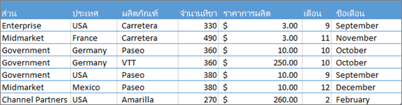
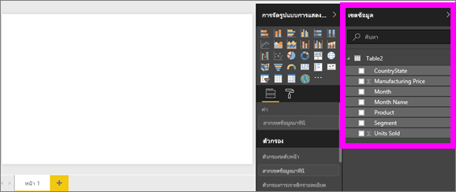
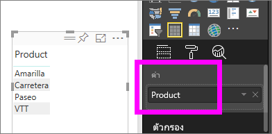
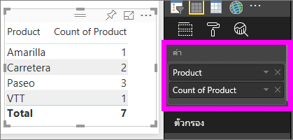

# ทำงานกับการรวม (ผลรวม ค่าเฉลี่ย และอื่นๆ) ในบริการของ Power BI

## การรวมคืออะไร?

ในบางครั้งคุณต้องการรวมค่าต่าง ๆ ทางคณิตศาสตร์ในข้อมูลของคุณ การดำเนินการทางคณิตศาสตร์อาจเป็น การบวก การเฉลี่ย ค่าสูงสุด การนับจำนวน และอื่นๆ เมื่อคุณรวมค่าในข้อมูลของคุณ นั่นเรียกว่า*การรวม* ส่วนผลลัพธ์ของการดำเนินการทางคณิตศาสตร์คือ *การรวม หรือ ค่ารวม*

เมื่อบริการของ Power BI และ Power BI Desktop สร้างการแสดงผล อาจมีการรวมข้อมูลของคุณ การรวมมักจะเป็นสิ่งที่คุณต้องการ แต่บางครั้งคุณอาจต้องการรวมค่าในวิธีอื่น  ตัวอย่างเช่น การบวก กับ การหาค่าเฉลี่ย มีหลายวิธีที่จะจัดการ และเปลี่ยนการรวมที่ Power BI ใช้ในการแสดงผลข้อมูลด้วยภาพ

ก่อนอื่น มาดูที่*ชนิด*ของข้อมูล เนื่องจากชนิดของข้อมูลกำหนดวิธีการและ Power BI สามารถรวมได้หรือไม่

## ชนิดของข้อมูล

ชุดข้อมูลส่วนใหญ่มีชนิดของข้อมูลมากกว่าหนึ่งชนิด ในระดับพื้นฐานสุด ข้อมูลเป็นตัวเลขหรือไม่เป็น Power BI สามารถรวบรวมข้อมูลตัวเลขโดยใช้การบวก การหาค่าเฉลี่ย การนับจำนวน ค่าต่ำสุด ค่าความแปรปรวน และอีกมากมาย นอกจากนี้ บริการยังสามารถรวมข้อมูลที่เป็นข้อความ ซึ่งมักเรียกว่าข้อมูล*แบบจัดกลุ่ม*ได้อีกด้วย หากคุณพยายามที่จะรวมเขตข้อมูลแบบจัดกลุ่มโดยการใส่ไว้ในบักเก็ตที่เป็นตัวเลขเท่านั้น เช่น **ค่า** หรือ **คำแนะนำเครื่องมือ** Power BI จะนับจำนวนครั้งของแต่ละประเภท หรือนับจำนวนครั้งที่ไม่ซ้ำกันสำหรับแต่ละประเภท ข้อมูลชนิดพิเศษ เช่น วันที่ ก็มีตัวเลือกการรวมของตัวเอง เช่น: ก่อนสุด, หลังสุด, แรกสุด และสุดท้าย

ในตัวอย่างด้านล่าง:

- **หน่วยที่ขาย** และ **ราคาผลิต** เป็นคอลัมน์ที่ประกอบด้วยข้อมูลตัวเลข

- **เซกเมนต์**, **ประเทศ**, **ผลิตภัณฑ์**, **เดือน** และ**ชื่อเดือน** เป็นข้อมูลตามประเภท

   

เมื่อสร้างการแสดงผลข้อมูลด้วยภาพใน บริการจะรวมเขตข้อมูลตัวเลข (ค่าเริ่มต้นคือ*การบวก*) ตามเขตข้อมูลแบบจัดกลุ่มบางตัว  ตัวอย่างเช่น "หน่วยที่ขาย***ตามผลิตภัณฑ์***", “หน่วยที่ขาย***ตามเดือน***”, และ "ราคาผลิต***ตามเซ็กเมนต์***" Power BI อ้างอิงถึงเขตข้อมูลตัวเลขบางตัวเป็น**หน่วยวัด** ซึ่งง่ายต่อการระบุหน่วยวัดในตัวแก้ไขรายงาน Power BI - รายการ **เขตข้อมูล** แสดงหน่วยวัดที่มีสัญลักษณ์ ∑ ถัดจากรายการเขตข้อมูล โปรดดูหัวข้อ [ตัวแก้ไขรายงาน...ลองสำรวจดู](service-the-report-editor-take-a-tour.md) สำหรับข้อมูลเพิ่มเติม

## ทำไมการรวมไม่ทำอย่างที่ฉันต้องการ?

การทำงานกับการรวมในบริการของ Power BI สามารถทำให้เกิดความสับสนได้ บางทีคุณอาจมีเขตข้อมูลตัวเลขและ Power BI จะไม่อนุญาตให้คุณเปลี่ยนแปลงการรวม หรือบางทีคุณมีเขตข้อมูล เช่น ปี และคุณไม่ต้องการรวม คุณเพียงแค่ต้องการนับจำนวนครั้งที่ปรากฏ

โดยทั่วไปแล้ว ปัญหาเบื้องต้นคือการกำหนดเขตข้อมูลในชุดข้อมูล บางทีเจ้าของชุดข้อมูลได้กำหนดเขตข้อมูลเป็นข้อความและนั่นเป็นเหตุผลว่าทำไม Power BI จึงไม่สามารถหาผลรวมหรือหาค่าเฉลี่ยได้ ขออภัยที่ [เฉพาะเจ้าของชุดข้อมูลเท่านั้น ที่สามารถเปลี่ยนการจัดประเภทของเขตข้อมูลได้](desktop-measures.md) ดังนั้น หากคุณมีสิทธิ์ระดับเจ้าของชุดข้อมูล คุณจะสามารถแก้ไขปัญหานี้ได้ ทั้งในเดสก์ท็อปหรือโปรแกรมที่ใช้สร้างชุดข้อมูล (เช่น Excel) มิฉะนั้น คุณจะต้องติดต่อเจ้าของชุดข้อมูลเพื่อขอความช่วยเหลือ  

เรามีส่วนพิเศษที่ท้ายของบทความนี้ ที่เรียกว่า [**ข้อควรพิจารณาและการแก้ไขปัญหา**](#considerations-and-troubleshooting) ซึ่งมีคำแนะนำและแนวทาง ถ้าคุณไม่พบคำตอบของคุณที่นั่น กรุณาโพสต์คำถามของคุณบน[ฟอรั่มชุมชน Power BI](https://community.powerbi.com) คุณจะได้รับคำตอบอย่างรวดเร็วจากทีมงาน Power BI โดยตรง

## เปลี่ยนวิธีการรวมเขตข้อมูลตัวเลข

สมมุติว่าคุณมีแผนภูมิที่หาผลรวม จำนวนหน่วยที่ขายได้สำหรับผลิตภัณฑ์ต่าง ๆ แต่คุณอยากได้ค่าเฉลี่ยแทน

1. สร้าง**แผนภูมิคอลัมน์แบบคลัสเตอร์**ที่ใช้หน่วยวัดและประเภท ในตัวอย่างนี้ เรากำลังใช้หน่วยที่ขายเป็นผลิตภัณฑ์  ตามค่าเริ่มต้น Power BI สร้างแผนภูมิที่หาผลรวมหน่วยที่ขายได้ (ลากหน่วยวัดไปยังช่อง **ค่า**) สำหรับแต่ละผลิตภัณฑ์ (ลากประเภทไปยังช่อง **แกน**)

   

1. ในบานหน้าต่าง**การแสดงผลข้อมูลด้วยภาพ** ให้คลิกขวาที่หน่วยวัด แล้วเลือกชนิดการรวมที่คุณต้องการ ในกรณีนี้ เรากำลังเลือก**ค่าเฉลี่ย** ถ้าคุณไม่เห็นการรวมที่คุณต้องการ โปรดดูส่วน [**ข้อควรพิจารณาและการแก้ไขปัญหา**](#considerations-and-troubleshooting)

   

   > [!NOTE]
   > ตัวเลือกที่มีอยู่ในรายการแบบหล่นลงจะแตกต่างกันไปขึ้นอยู่กับ 1) เขตข้อมูลที่เลือกและ 2) วิธีที่เจ้าของชุดข้อมูลจัดประเภทเขตข้อมูลนั้น

1. การแสดงภาพของคุณ ตอนนี้รวมโดยการเฉลี่ย

   

## วิธีการรวมข้อมูลของคุณ

บางตัวเลือกที่อาจมีให้สำหรับการรวมเขตข้อมูล:

- **ไม่ต้องทำการสรุป** เมื่อเลือกตัวเลือกนี้ Power BI จะปฏิบัติต่อแต่ละค่าในเขตข้อมูลนั้นแยกกันและไม่ได้สรุปค่า ใช้ตัวเลือกนี้ถ้าคุณมีคอลัมน์ตัวเลข ID ที่บริการไม่ควรนำมารวมผล

- **ผลรวม** บวกค่าทั้งหมดในเขตข้อมูลนั้น

- **ค่าเฉลี่ย** คำนวนค่าเฉลี่ยเลขคณิตของค่าทั้งหมด

- **ต่ำสุด** แสดงค่าที่น้อยที่สุด

- **สูงสุด** แสดงค่าที่มากที่สุด

- **นับจำนวน (ไม่เว้นว่าง)** นับจำนวนของค่าในเขตข้อมูลนั้นที่ไม่ว่างเปล่า

- **นับจำนวน (ค่าที่แตกต่างกัน)** นับจำนวนค่าที่แตกต่างกันในเขตข้อมูลนั้น

- **ค่าเบี่ยงเบนมาตรฐาน**

- **ผลต่าง**

- **ค่ากลาง**  แสดงค่ามัธยฐาน (ค่าตรงกลาง) ค่านี้มีจำนวนรายการด้านบนและด้านล่างเท่ากัน  หากมีค่ากลางสองค่า Power BI จะหาค่าเฉลี่ย

ตัวอย่างเช่น ข้อมูลนี้:

| ประเทศ | ยอดเงิน |
|:--- |:--- |
| สหรัฐอเมริกา |100 |
| สหราชอาณาจักร |150 |
| แคนาดา |100 |
| เยอรมนี |125 |
| ฝรั่งเศส | |
| ญี่ปุ่น |125 |
| ออสเตรเลีย |150 |

จะให้ผลลัพธ์ดังต่อไปนี้:

- **ไม่ต้องสรุป**: จะแสดงค่าแต่ละรายการแยกต่างหาก

- **ผลรวม**: 750

- **ค่าเฉลี่ย**: 125

- **สูงสุด**:  150

- **ต่ำสุด**: 100

- **นับจำนวน (ไม่เว้นว่าง):** 6

- **จำนวน (เขต):** 4

- **ค่าเบี่ยงเบนมาตรฐาน:** 20.4124145...

- **ผลต่าง:** 416.666...

- **ค่ากลาง:** 125

## สร้างการรวมโดยใช้เขตข้อมูลประเภท (ข้อความ)

คุณยังสามารถรวมเขตข้อมูลที่ไม่ใช่ตัวเลข ตัวอย่างเช่น ถ้าคุณมีเขตข้อมูลชื่อผลิตภัณฑ์ คุณสามารถเพิ่มเป็นค่า และตั้งค่าเป็น**นับจำนวน**, **นับจำนวนที่แตกต่างกัน**, **แรก**หรือ**สุดท้าย**ได้

1. ลากเขตข้อมูล **ผลิตภัณฑ์** ลงในช่อง **ค่า** โดยทั่วไป ช่อง**ค่า**มักใช้กับเขตข้อมูลตัวเลข Power BI รู้ว่าเขตข้อมูลนี้เป็นเขตข้อมูลข้อความ ตั้งค่าการรวมเป็น**ไม่ต้องทำการสรุป** และแสดงตารางที่มีหนึ่งคอลัมน์ให้คุณ

   

1. ถ้าคุณเปลี่ยนการรวมจากค่าเริ่มต้น**ไม่ต้องทำการสรุป** ไปเป็น **นับจำนวน (ค่าที่แตกต่างกัน)** Power BI จะนับจำนวนของผลิตภัณฑ์ที่แตกต่างกัน ในกรณีนี้ มีค่าเป็นสี่
  
   

1. และ ถ้าคุณเปลี่ยนการรวมเป็น**นับจำนวน** Power BI จะนับจำนวนทั้งหมด ในกรณีนี้ มี**ผลิตภัณฑ์**เจ็ดรายการ

   

1. Power BI จะแบ่งการนับจำนวนตามผลิตภัณฑ์โดยการลากเขตข้อมูลเดียวกัน (ในกรณีนี้คือ**ผลิตภัณฑ์**) ลงในช่อง**ค่า** และปล่อยให้เป็นการรวมค่าเริ่มต้น**ไม่ต้องทำการสรุป**

   

## ข้อควรพิจารณาและการแก้ไขปัญหา

คำถาม:  เหตุใดฉันจึงไม่มีตัวเลือกให้**ไม่ต้องทำการสรุป**?

คำตอบ:  เขตข้อมูลที่คุณเลือกน่าจะเป็น หน่วยวัดจากการคำนวณหรือหน่วยวัดขั้นสูงที่สร้างขึ้นใน Excel หรือ [Power BI Desktop](desktop-measures.md) แต่ละหน่วยวัดจากการคำนวณ มีสูตรคำนวนที่ตายตัว คุณไม่สามารถเปลี่ยนการรวมที่ Power BI ใช้ได้ ตัวอย่างเช่น ถ้าใช้ผลรวม จะต้องเป็นผลรวมเท่านั้น รายการ **เขตข้อมูล** จะแสดง *หน่วยวัดที่คำนวณแล้ว* พร้อมสัญลักษณ์เครื่องคิดเลข

Q:  เขตข้อมูลฉัน**เป็น**ตัวเลข ทำไมฉันมีตัวเลือกแค่**นับจำนวน**และ**นับจำนวนที่แตกต่างกัน**?

คำตอบที่ 1:  เหตุผลที่เป็นไปได้คือ เจ้าชุดข้อมูล*ไม่*จัดประเภทเขตข้อมูลเป็นตัวเลข ตัวอย่างเช่น ถ้าชุดข้อมูลมีเขตข้อมูล**ปี** เจ้าของชุดข้อมูลอาจจัดประเภทค่าเป็นข้อความ ซึ่งอาจเป็นไปได้ว่า Power BI จะนับเขตข้อมูล**ปี** (ตัวอย่างเช่น จำนวนคนที่เกิดในปี 1974) ซึ่งมีโอกาสน้อยที่ Power BI จะหาผลรวมหรือเฉลี่ย ถ้าคุณเป็นเจ้าของ คุณสามารถเปิดชุดข้อมูลใน Power BI Desktop และใช้แท็บ**การสร้างแบบจำลอง** เพื่อเปลี่ยนชนิดข้อมูลได้

คำตอบที่ 2: ถ้าเขตข้อมูลมีไอคอนเครื่องคิดเลข นั่นหมายความว่าเขตข้อมูลนั้นเป็น*หน่วยวัดที่คำนวณแล้ว* แต่ละหน่วยวัดที่คำนวณแล้วจะมีสูตรคำนวณที่ตายตัวของตนเองที่มีเพียงเจ้าของชุดข้อมูลเท่านั้นที่สามารถเปลี่ยนแปลงได้ การคำนวณที่ Power BI ใช้อาจเป็นการรวมอย่างง่าย เช่น ค่าเฉลี่ย หรือผลรวม ซึ่งยังอาจเป็นการคำนวณที่ซับซ้อนขึ้น เช่น "เปอร์เซ็นต์ของผลกระทบต่อประเภทหลัก" หรือ "ผลรวมสะสมตั้งแต่ต้นปี" Power BI จะไม่หาผลรวมหรือค่าเฉลี่ยของผลลัพธ์ แต่จะคำนวณใหม่ (โดยใช้สูตรคำนวณที่ตายตัว) สำหรับแต่ละจุดข้อมูล

คำตอบที่ 3:  อีกความเป็นไปได้คือ คุณได้ปล่อยเขตข้อมูลลงใน*บักเก็ต* ที่อนุญาตให้ใส่ค่าที่เป็นประเภทเท่านั้น  ในกรณีนั้น ตัวเลือกของคุณจะมีแค่ นับจำนวนและนับจำนวนที่แตกต่างกันเท่านั้น

คำตอบที่ 4:  และความเป็นไปได้ที่สี่คือ คุณกำลังใช้เขตข้อมูลสำหรับแกน ตัวอย่างเช่น บนแกนแผนภูมิแท่ง Power BI แสดงหนึ่งแท่งสำหรับแต่ละค่าที่ไม่ซ้ำกัน จะไม่มีรวมค่าของเขตข้อมูลเลย

>[!NOTE]
>ข้อยกเว้นของกฎนี้คือ แผนภูมิกระจาย ซึ่ง*จำเป็นต้องมี*การรวมค่าสำหรับแกน X และ Y

Q:  เหตุใดฉันจึงไม่สามารถรวมเขตข้อมูลข้อความสำหรับแหล่งข้อมูล SQL Server Analysis Services (SSAS) ได้?

A:  การเชื่อมต่อแบบสดไปยังโมเดลหลายมิติของ SSAS ไม่อนุญาตให้มีการรวมฝั่งไคลเอ็นต์ใด ๆ รวมถึงครั้งแรก ครั้งสุดท้าย เฉลี่ย ต่ำสุด สูงสุดและผลรวม

Q:  ฉันมีแผนภูมิกระจาย และฉันต้องการให้เขตข้อมูลของฉัน*ไม่*รวม  อย่างไร?

A:  เพิ่มเขตข้อมูลไปยังบักเก็ต**รายละเอียด** และไม่ใส่ในบักเก็ตแกน X หรือ Y

คำถาม:  เมื่อฉันเพิ่มเขตข้อมูลตัวเลขลงในการแสดงภาพ ส่วนใหญ่ค่าเริ่มต้นคือผลรวม แต่บางทีค่าเริ่มต้นเป็นค่าเฉลี่ย บางทีเป็นการนับจำนวน หรือการรวมอื่น ๆ  เหตุใดค่าเริ่มต้นจึงไม่ได้เหมือนกันตลอด?

A:  เจ้าของชุดข้อมูลสามารถตั้งค่าการสรุปเริ่มต้นสำหรับแต่ละเขตข้อมูลได้ หากคุณเป็นเจ้าของชุดข้อมูล ให้เปลี่ยนการสรุปเริ่มต้นในแท็บ **การสร้างแบบจำลอง** ของ Power BI Desktop

Q:  ฉันเป็นเจ้าของชุดข้อมูล และฉันต้องการให้แน่ใจว่า เขตข้อมูลหนึ่งจะไม่มีการรวมเลย

คำตอบ:  ใน Power BI Desktop ในแท็บ**การวางรูปแบบ** ตั้งค่า**ชนิดข้อมูล**ให้เป็น**ข้อความ**

Q:  ฉันไม่เห็น**ไม่ต้องทำการสรุป** เป็นตัวเลือกในรายการแบบหล่นของฉัน

A:  ลองเอาเขตข้อมูลออก และเพิ่มกลับเข้าไปอีกครั้ง

มีคำถามเพิ่มเติมหรือไม่? [ลองไปที่ชุมชน Power BI](https://community.powerbi.com/)