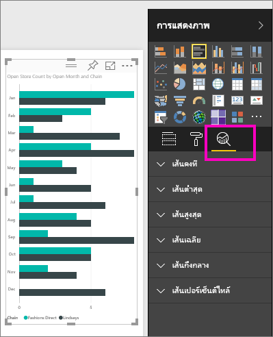
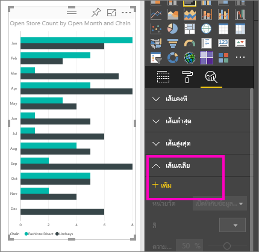
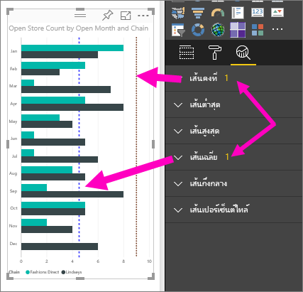

# บานหน้าต่างการวิเคราะห์ในบริการของ Power BI
ด้วยบานหน้าต่าง**การวิเคราะห์**ใน**บริการของ Power BI** คุณสามารถเพิ่ม*สายการอ้างอิง*แบบไดนามิก ให้กับการแสดงภาพ และเน้นไปที่แนวโน้มสำคัญหรือข้อมูลเชิงลึกได้

> [!NOTE]
> บานหน้าต่าง**การวิเคราะห์** จะปรากฏเฉพาะเมื่อคุณเลือกวิชวลบนพื้นที่รายงาน
> 
> 

## การใช้บานหน้าต่างการวิเคราะห์
ด้วยบานหน้าต่าง**การวิเคราะห์** คุณสามารถสร้างสายการอ้างอิงแบบไดนามิกชนิดต่าง ๆ ต่อไปนี้ (สายการอ้างอิงที่มีให้เลือก ขึ้นอยู่กับชนิดของวิชวล):

* เส้นคงที่แกน X
* เส้นคงที่แกน Y
* เส้นต่ำสุด
* เส้นสูงสุด
* เส้นเฉลี่ย
* เส้นกึ่งกลาง
* เส้นเปอร์เซ็นต์ไทล์

เพื่อดูรายการ สายการอ้างอิงแบบไดนามิก ที่มีสำหรับแต่ละวิชาล ทำตามขั้นตอนต่อไปนี้:

1. เลือกหรือสร้างวิชวล จากนั้นเลือกไอคอน**การวิเคราะห์**  จากบานหน้าต่าง**การจัดรูปแบบการแสดงข้อมูล**

2. เลือกลูกศรลงสำหรับชนิดของเส้นที่คุณต้องการสร้าง เพื่อขยายตัวเลือก ในกรณีนี้ เราจะเลือก**เส้นเฉลี่ย**
   
   

3. เพื่อสร้างเส้นใหม่ เลือก **+ เพิ่ม** และพิจารณาหน่วยวัดที่จะใช้เพื่อสร้างเส้น  ดรอปดาวน์**หน่วยวัด** จะถูกเติมด้วยข้อมูลจากวิชวลที่เลือกโดยอัตโนมัติ เรามา**นับจำนวนร้านค้าที่เปิด**กัน

5. คุณมีตัวเลือกมากมายสำหรับเส้นของคุณ เช่น สี, ความโปร่งใส, ลักษณะ และตำแหน่ง (เทียบกับองค์ประกอบของวิชวล) ถ้าคุณต้องการใส่ป้ายชื่อสำหรับเส้น พิมพ์ชื่อลงไป จากนั้นเลื่อนแถบเลื่อน**ป้ายชื่อข้อมูล**ไปยัง**เปิด**  ในกรณีนี้ เราจะตั้งชื่อเส้นเป็น*จำนวนเฉลี่ยของร้านค้าที่เปิด* และกำหนดค่าสองสามตัวเลือกอื่น ๆ ตามที่แสดงด้านล่างนี้
   
   

1. สังเกตว่ามีตัวเลขปรากฏถัดจากรายการ**เส้นเฉลี่ย**ในบานหน้าต่าง**การวิเคราะห์** ซึ่งบอกคุณว่ามีเส้นแบบไดนามิกแล้วกี่เส้นในวิชวลของคุณ และเป็นชนิดใดบ้าง ถ้าเราเพิ่ม**เส้นคงที่** เป้าหมายจำนวนร้านเป็น 9 คุณสามารถเห็นที่บานหน้าต่าง**การวิเคราะห์**ว่า ตอนนี้เรายังมี**เส้นคงที่**แบบไดนามิกอีกหนึ่งเส้น ที่ใช้ในวิชวลนี้
   
   
   

มีข้อมูลเชิงลึกหลากหลายที่น่าสนใจ ที่คุณสามารถเน้นได้โดยการสร้างสายการอ้างอิงแบบไดนามิก ด้วยบานหน้าต่าง**การวิเคราะห์**

## ข้อควรพิจารณาและการแก้ไขปัญหา

ถ้าวิชวลที่คุณเลือกไม่สามารถมีสายการการอ้างอิงแบบไดนามิก (ในกรณีนี้ วิชวล**แผนที่**) คุณจะเห็นต่อไปนี้เมื่อคุณเลือกบานหน้าต่าง**การวิเคราะห์**
   

ความสามารถในการใช้สายการอ้างอิงแบบไดนามิก จะขึ้นกับชนิดของวิชวลที่ใช้ รายการต่อไปนี้แสดงว่า สายการอ้างอิงแบบไดนามิกแบบไหนที่มีสำหรับวิชวลชนิดใด:

สายการอ้างอิงแบบไดนามิก สามารถใช้กับวิชวลต่อไปนี้ได้เต็มรูปแบบ:

* แผนภูมิพื้นที่
* แผนภูมิเส้น
* แผนภูมิกระจาย
* แผนภูมิกลุ่มคอลัมน์
* แผนภูมิแท่งแบบกลุ่ม

วิชวลต่อไปนี้สามารถใช้เฉพาะ*เส้นคงที่*จากบานหน้าต่าง**การวิเคราะห์**:

* แผนภูมิพื้นที่แบบเรียงซ้อน
* แผนภูมิแท่งแบบเรียงซ้อน
* แผนภูมิคอลัมน์แบบเรียงซ้อน
* แผนภูมิแท่งแบบเรียงซ้อน 100%
* แผนภูมิคอลัมน์แบบเรียงซ้อน 100%

สำหรับวิชวลต่อไปนี้ *เส้นแนวโน้ม*เป็นตัวเลือกเดียวในขณะนี้:

* แผนภูมิเส้นแบบไม่เรียงซ้อน
* แผนภูมิกลุ่มคอลัมน์

สุดท้าย วิชวลที่ไม่ใช่คาร์ทีเซียน ไม่สามารถใช้เส้นแบบไดนามิกจากในบานหน้าต่าง**การวิเคราะห์**ในขณะนี้ เช่น:

* เมทริกซ์
* แผนภูมิวงกลม
* แผนภูมิโดนัท
* ตาราง

## ขั้นตอนถัดไป
[บานหน้าต่างการวิเคราะห์ใน Power BI Desktop](desktop-analytics-pane.md)

มีคำถามเพิ่มเติมหรือไม่? [ลองไปที่ชุมชน Power BI](http://community.powerbi.com/)

