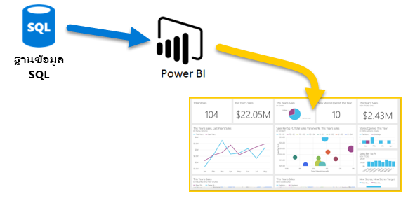
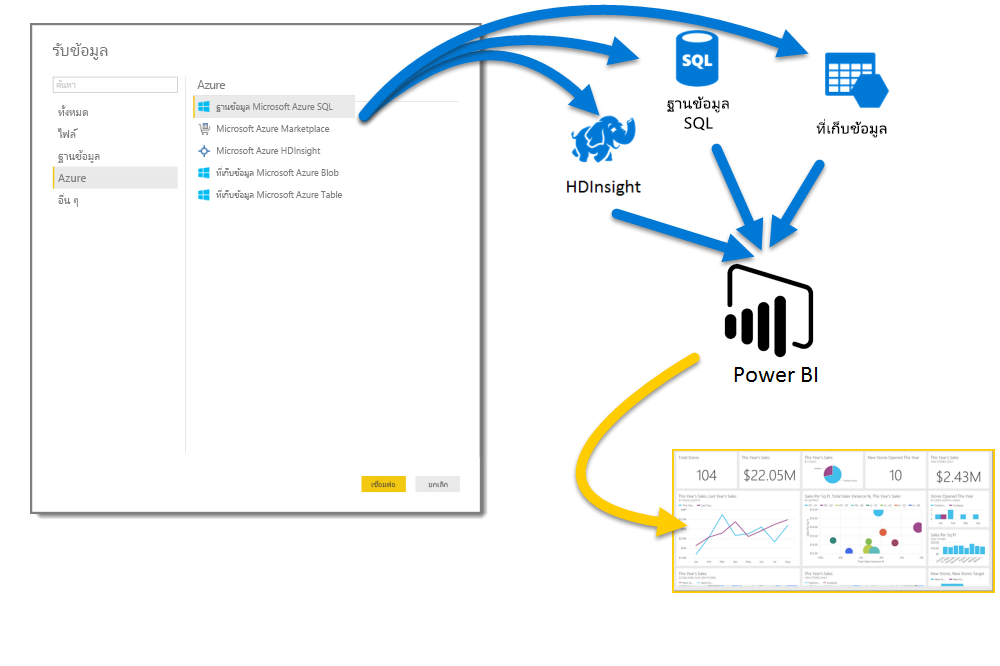
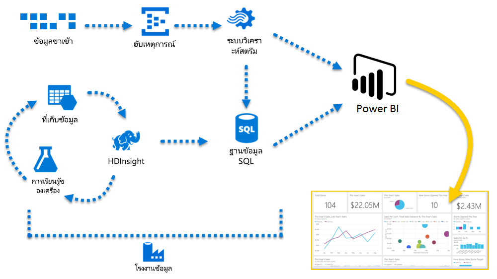

# Azure และ Power BI
ด้วยบริการ**Azure** และ**Power BI** คุณสามารถเปิดใช้การประมวลผลข้อมูลของคุณลงในการวิเคราะห์และรายงานที่ให้ข้อมูลเชิงลึกแบบเรียลไทม์ในธุรกิจของคุณได้ ไม่ว่าการประมวลผลข้อมูลของคุณอยู่บนระบบคลาวด์หรือภายในองค์กร เป็นการประมวลผลที่ตรงไปตรงมาหรือซับซ้อน มีแหล่งที่มาทางเดียว หรือมีมาตราส่วนขนาดใหญ่ เป็นแบบจัดเก็บในคลังหรือแบบเรียลไทม์ก็ตาม Azure และ Power BI มีการเชื่อมต่อและการผสานรวมที่มีอยู่ภายในเพื่อนำความพยายามให้ได้ข่าวกรองทางธุรกิจของคุณมาให้สามารถใช้งานได้

Power BI มีการเชื่อมต่อ Azure ที่พร้อมใช้งานที่หลากหลาย และโซลูชันข่าวกรองทางธุรกิจที่คุณสามารถสร้างได้ด้วยบริการเหล่านั้น จะมีความเป็นเอกลักษณ์เช่นเดียวกับธุรกิจของคุณ คุณสามารถเชื่อมต่อในปริมานน้อยได้ เช่น หนึ่งแหล่งข้อมูล Azure หรือจำนวนไม่กี่แหล่ง จาก นั้นจัดรูปร่างและปรับปรุงข้อมูลของคุณเพื่อสร้างรายงานแบบกำหนดเอง

### ฐานข้อมูล Azure SQL และ Power BI
คุณสามารถเริ่มต้นด้วยการเชื่อมต่อตรงไปยังฐานข้อมูล SQL Azure และสร้างรายงานเพื่อตรวจติดตามความคืบหน้าของธุรกิจของคุณได้ การใช้[Power BI Desktop](desktop-getting-started.md) คุณสามารถสร้างรายงานที่ระบุแนวโน้มและตัวบ่งชี้ประสิทธิภาพที่สำคัญที่ขับเคลื่อนธุรกิจของคุณให้มุ่งไปข้างหน้า

มีข้อมูลเพิ่มเติมจำนวนมากที่ให้คุณเรียนรู้เกี่ยวกับ[ฐานข้อมูล Azure SQL](http://azure.microsoft.com/services/sql-database/) ได้

### แปลง ปรับรูปร่าง และผสานข้อมูลในระบบคลาวด์ของคุณ
คุณมีข้อมูลที่ซับซ้อนกว่าและมีทุกประเภทของแหล่งที่มาของข้อมูลหรือไม่? ไม่มีปัญหา ด้วย **Power BI Desktop** และบริการของ Azure คุณสามารถเชื่อมต่อได้ง่าย ๆ โดยการแตะกล่องโต้ตอบ**รับข้อมูล** ภายในแบบสอบถามเดียวกัน คุณสามารถเชื่อมต่อ**ฐานข้อมูล SQL Azure**ของคุณ แหล่งข้อมูล**Azure HDInsight**ของคุณ และ**การเก็บข้อมูล Azure Blob** ของคุณได้ (หรือ**ตารางเก็บข้อมูล Azure**) จากนั้นเลือกเฉพาะชุดย่อยภายในแต่ละรายการที่คุณต้องการและปรับปรุงเอกสารจากตรงนั้น

คุณสามารถสร้างรายงานอื่นสำหรับผู้ชมกลุ่มอื่นโดยใช้การเชื่อมต่อข้อมูลเดียวกันและแม้แต่การสอบถามเดียวกันได้เช่นกัน เพียงแค่สร้างหน้ารายงานใหม่ ปรับปรุงการแสดงภาพของคุณสำหรับแต่ละผู้ชม และดูการติดตามความก้าวหน้าธุรกิจของคุณ

สำหรับข้อมูลเพิ่มเติม โปรดดูที่แหล่งทรัพยากรต่อไปนี้:

* [ฐานข้อมูล Azure SQL](http://azure.microsoft.com/services/sql-database/)
* [Azure HDInsight (HDFS)](http://azure.microsoft.com/services/hdinsight/)
* [พื้นที่จัดเก็บ Azure](http://azure.microsoft.com/services/storage/) (พื้นที่จัดเก็บ Blob และพื้นที่จัดเก็บตาราง)

### รับรายงานที่ซับซ้อน (และทำล่วงหน้า) โดยใช้ Azure Services และ Power BI
คุณสามารถขยายได้มากเท่าที่คุณต้องการสำหรับ Azure และ Power BI ควบคุมการประมวลผลข้อมูลหลายแหล่ง ใช้ระบบแบบเรียลไทม์ขนาดใหญ่ ใช้[Stream Analytics](http://azure.microsoft.com/services/stream-analytics/)และ[Event Hubs](http://azure.microsoft.com/services/event-hubs/)และรวมบริการ SaaS ต่าง ๆ ของคุณเข้ากับรายงานข่าวกรองทางธุรกิจที่ให้ข้อมูลทางธุรกิจที่ล้ำสมัยกับคุณ

### เชื่อมต่อข้อมูลของคุณโดยใช้ Power BI API
คุณสามารถใช้ Power BI เพื่อรับข้อมูลเชิงลึกบนแอปฯของคุณที่มีอยู่ได้เช่นกัน ด้วย Power BI API นักพัฒนาแอปพลิเคชันสามารถส่งชุดข้อมูลทั้งหมดไปยัง Power BI ได้ด้วยการตั้งโปรแกรม ต้องการข้อมูลที่อัปเดตอย่างต่อเนื่องหรือไม่? ด้วย Power BI API นักพัฒนาสามารถส่งอัปเดตข้อมูลแบบเรียลไทม์เพื่อเริ่มต้นใช้งานได้อย่างรวดเร็ว จากนั้นเพิ่มการใช้ Azure Stream Analytics เมื่่อข้อกำหนดอัตราส่วนที่เหมาะสมดำเนินการดังกล่าว

มีข้อมูลจำนวนมากเกี่ยวกับ Power BI API ใน[พอร์ทัลนักพัฒนา Power BI](http://dev.powerbi.com) นอกจากนี้ คุณยังสามารถเรียนรู้เกี่ยวกับสิ่งที่ผู้อื่นกำลังทำด้วยการเขียนโปรแกรมด้วย Power BI ใน[บล็อกนักพัฒนา Power BI](http://blogs.msdn.com/powerbidev)ได้ และยังมีหน้าเพจเฉพาะสำหรับ[เริ่มต้นใช้งานด้วยการพัฒนา Power BI](https://msdn.microsoft.com/library/dn889824.aspx)

### คุณสามารถทำอะไรได้บ้างกับ Azure และ Power BI?
มีหลากหลายสถานการณ์มากทีี่เราสามารถใช้งาน **Azure**ร่วมกับ**Power BI**ได้ ความเป็นไปได้และโอกาสต่าง ๆ จะมีความเป็นเอกลักษณ์เฉกเช่นธุรกิจของคุณ สำหรับข้อมูลเพิ่มเติมเกี่ยวกับ**บริการ Azure** สามารถดูได้ที่[เพจภาพรวม](http://go.microsoft.com/fwlink/?LinkId=535031&clcid=0x409)ซึ่งอธิบายเกี่ยวกับ**สถานการณ์สมมติการวิเคราะห์ข้อมูลโดยใช้ Azure** และเรียนรู้วิธีการเปลี่ยนแปลงแหล่งข้อมูลเป็นข่าวกรองที่ขับเคลื่อนธุรกิจของคุณให้ก้าวไปข้างหน้า

