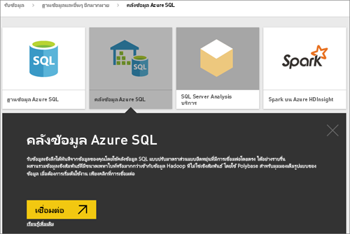
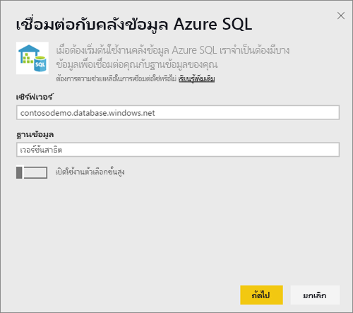
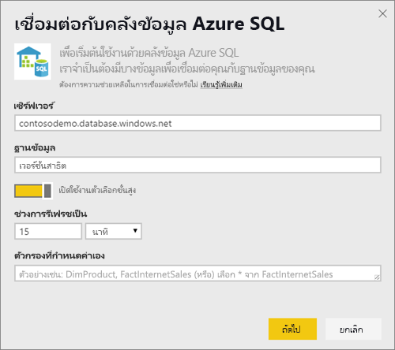
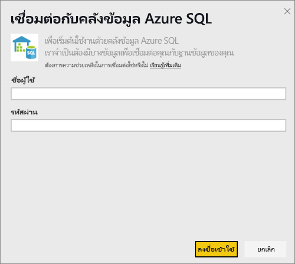
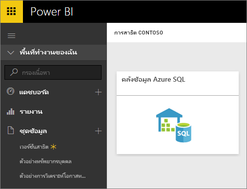
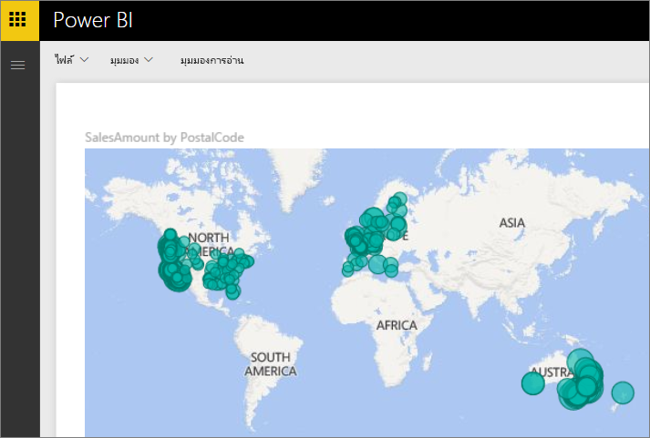
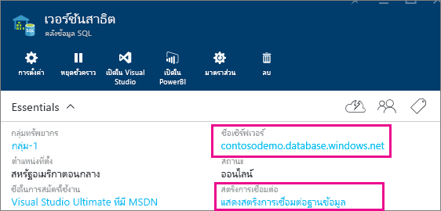

# Azure SQL Data Warehouse พร้อม DirectQuery
Azure SQL Data Warehouse พร้อม DirectQuery ช่วยให้คุณสามารถสร้างรายงานแบบไดนามิกที่ยึดตามข้อมูลและเมทริกซ์ที่คุณมีอยู่แล้วใน Azure SQL Data Warehouse ด้วย DirectQuery แบบสอบถามจะถูกส่งกลับไปยัง Azure SQL Data Warehouse ของคุณในแบบเรียลไทม์ ตามที่คุณสำรวจข้อมูล โดยแบบสอบถามแบบเรียลไทม์นั้นมีการรวมเข้ากับ SQL Data Warehouse ส่วนหนึ่ง เพื่อให้ผู้ใช้งานสามารถสร้างรายงานแบบไดนามิกได้ในเวลาเพียงไม่นาน แม้จะมีข้อมูลเยอะระดับเทราไบต์ นอกจากนี้ คำนำของปุ่ม**เปิดใน Power BI**อนุญาตให้ผู้ใช้เชื่อมต่อ Power BI กับ SQL Data Warehouse ได้โดยตรงโดยไม่ต้องระบุข้อมูลดัวกล่าวด้วยตนเอง

เมื่อใช้ตัวเชื่อมต่อ SQL Data Warehouse:

* ระบุชื่อเซิร์ฟเวอร์ที่มีคุณสมบัติครบถ้วนเมื่อเชื่อมต่อ (ดูด้านล่างสำหรับรายละเอียด)
* ตรวจสอบให้แน่ใจว่ามีการกำหนดค่ากฎไฟร์วอลล์สำหรับเซิร์ฟเวอร์เพื่อ "อนุญาตการเข้าถึงบริการ Azure"
* ทุกการดำเนินการ เช่น การเลือกคอลัมน์ หรือเพิ่มตัวกรองจะสอบถามคลังข้อมูลโดยตรง
* ไทล์จะถูกตั้งค่าการรีเฟรชทุก 15 นาทีโดยประมาณ และรีเฟรชไม่จำเป็นต้องมีการทำกำหนดการ  ซึ่งคุณอาจปรับการรีเฟรชในส่วนการตั้งค่าขั้นสูงได้เมื่อทำการเชื่อมต่อ
* การถามตอบสำหรับชุดข้อมูล DirectQuery ไม่พร้อมใช้งาน
* ไม่มีการเลือกการเปลี่ยนแปลง Schema โดยอัตโนมัติ

ข้อจำกัดและบันทึกย่อเหล่านี้อาจเปลี่ยนแปลงขณะที่เราปรับปรุงประสบการณ์การใช้งานขึ้นเรื่อย ๆ ขั้นตอนในการเชื่อมต่อจะมีรายละเอียดดังด้านล่าง

## ใช้ปุ่ม 'เปิดใน Power BI'

> [!Important]
> เรากำลังปรับปรุงการเชื่อมต่อของเรากับคลังข้อมูล SQL ของ Azure  สำหรับประสบการณ์ดีที่สุดในการเชื่อมต่อกับแหล่งคลังข้อมูล SQL ของ Azure ของคุณ ใช้ Power BI Desktop  เมื่อคุณได้สร้างรูปแบบข้อมูลและรายงานของคุณแล้ว คุณสามารถเผยแพร่สิ่งดังกล่าวไปยังบริการ Power BI  ตัวเชื่อมต่อโดยตรงสำหรับคลังข้อมูล SQL ของ Azure ในบริการ Power BI ในขณะนี้ไม่ได้รับการสนับสนุน
>

การเคลื่อนย้ายข้อมูลระหว่าง SQL Data Warehouse กับ Power BI ด้วยวิธีที่ง่ายที่สุดคือการใช้ปุ่ม **เปิดใน Power BI**ภายในพอร์ทัล Microsoft Azure ปุ่มนี้ช่วยให้คุณสามารถเริ่มสร้างแดชบอร์ดใหม่ใน Power BI ได้อย่างราบรื่น

1. เมื่อต้องการเริ่มใช้งาน ให้ไปยังอินสแตนซ์ SQL Data Warehouse ในพอร์ทัล Microsoft Azure โปรดสังเกตว่ามีเฉพาะ SQL Data Warehouse เท่านั้นที่ปรากฏในพอร์ทัล Azure Preview ในขณะนี้
2. คลิกที่ปุ่ม**เปิดใน Power BI**
   
    
3. คุณต้องลงชื่อเข้าใช้เองหากเราไม่สามารถลงชื่อเข้าใช้โดยตรงให้คุณได้ หรือหากคุณไม่มีบัญชี Power BI
4. จากนั้นระบบจะพาคุณไปยังหน้าการเชื่อมต่อกับ SQL Data Warehouse โดยใช้ข้อมูลที่สร้างไว้ก่อนหน้าแล้วใน SQL Data Warehouse ใส่ข้อมูลประจำตัวของคุณและกดที่การเชื่อมต่อเพื่อสร้างการเชื่อมต่อ

## เชื่อมต่อผ่านทาง Power BI
นอกจากนี้ SQL Data Warehouse ยังอยู่ในรายการบนหน้า Power BI Get Data ด้วย 

1. เลือก**รับข้อมูล**ที่ด้านล่างของพื้นที่นำทางด้านซ้ายมือ  
   
    
2. ภายใน**ฐานข้อมูล** เลือก**รับ**
   
    
3. เลือก**SQL Data Warehouse** \> **เชื่อมต่อ**
   
    
4. ใส่ข้อมูลที่จำเป็นเพื่อเชื่อมต่อ ส่วน**ค้นหาพารามิเตอร์**ที่ด้านล่างแสดงให้เห็นว่าข้อมูลนี้ที่อยู่ในพอร์ทัล Azure ของคุณอยู่ที่ตำแหน่งใด
   
    
   
    
   
    
   
   > [!NOTE]
   > ชื่อผู้ใช้จะเป็นผู้ใช้ที่กำหนดไว้ในตัวอย่าง Azure SQL Data Warehouse ของคุณ
   > 
   > 
5. เจาะลึกลงในชุดข้อมูลโดยการเลือกไทล์ใหม่หรือชุดข้อมูลที่สร้างขึ้นใหม่ที่บ่งชี้ ด้วยเครื่องหมายดอกจัน ชุดข้อมูลนี้จะมีชื่อเดียวกับฐานข้อมูลของคุณ
   
    
6. คุณสามารถสำรวจตารางและคอลัมน์ทั้งหมดได้ การเลือกคอลัมน์จะเป็นการส่งแบบสอบถามกลับไปยังแหล่งข้อมูล และสร้างภาพของคุณแบบไดนามิก นอกจากนี้จะมีการแปลตัวกรองเป็นแบบสอบถามกลับไปยังคลังข้อมูลของคุณด้วย ภาพเหล่านี้สามารถถูกบันทึกไว้ในรายงานใหม่และปักหมุดกลับไปยังแดชบอร์ดของคุณได้
   
    

## ค้นหาค่าพารามิเตอร์
สามารถค้นหาชื่อเซิร์ฟเวอร์และชื่อฐานข้อมูลแบบเต็มของคุณได้ในพอร์ทัล Microsoft Azure โปรดสังเกตว่ามีเฉพาะ SQL Data Warehouse เท่านั้นที่ปรากฏในพอร์ทัล Azure Preview ในขณะนี้

> [!NOTE]
> ถ้าผู้เช่า Power BI ของคุณอยู่ในภูมิภาคเดียวกันกับ Azure SQL Data Warehouse จะไม่มีค่าธรรมเนียมขาออก คุณสามารถค้นหาตำแหน่งที่ผู้เช่า Power BI ของคุณอยู่โดยใช้[คำแนะนำเหล่านี้](https://docs.microsoft.com/power-bi/service-admin-where-is-my-tenant-located)ได้
>

## ขั้นตอนถัดไป
[Power BI คืออะไร](power-bi-overview.md)  
[รับข้อมูลสำหรับ Power BI](service-get-data.md)  
[คลังข้อมูล Azure SQL](/azure/sql-data-warehouse/sql-data-warehouse-overview-what-is/)

มีคำถามเพิ่มเติมหรือไม่? [ลองไปที่ชุมชน Power BI](http://community.powerbi.com/)