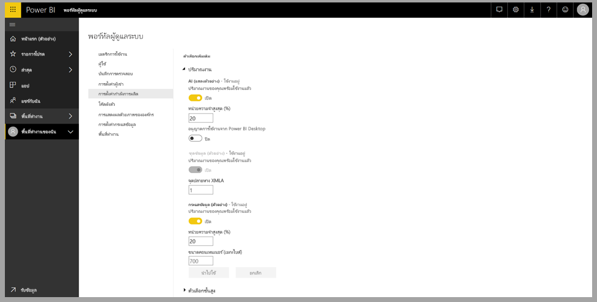
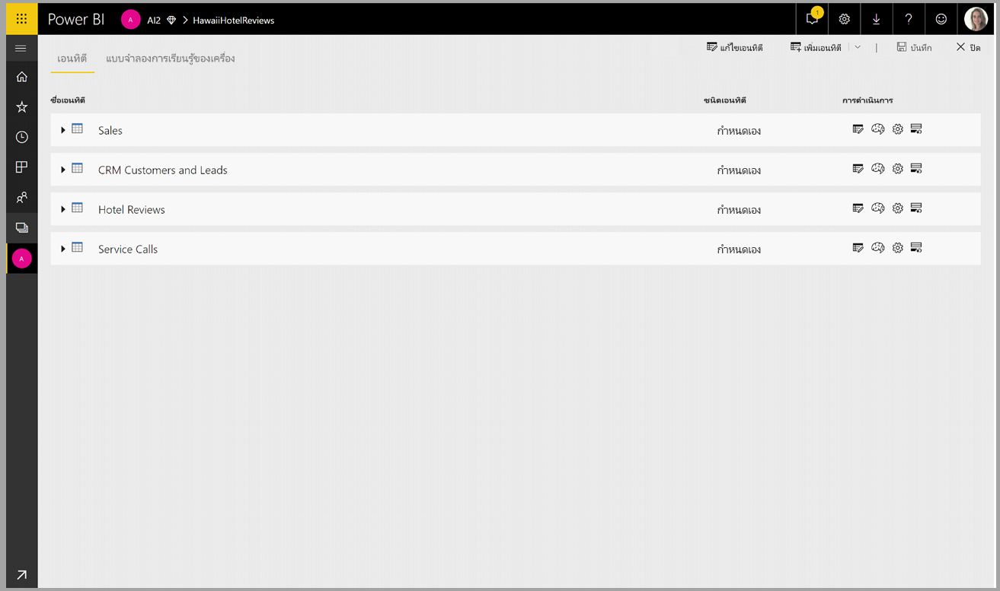
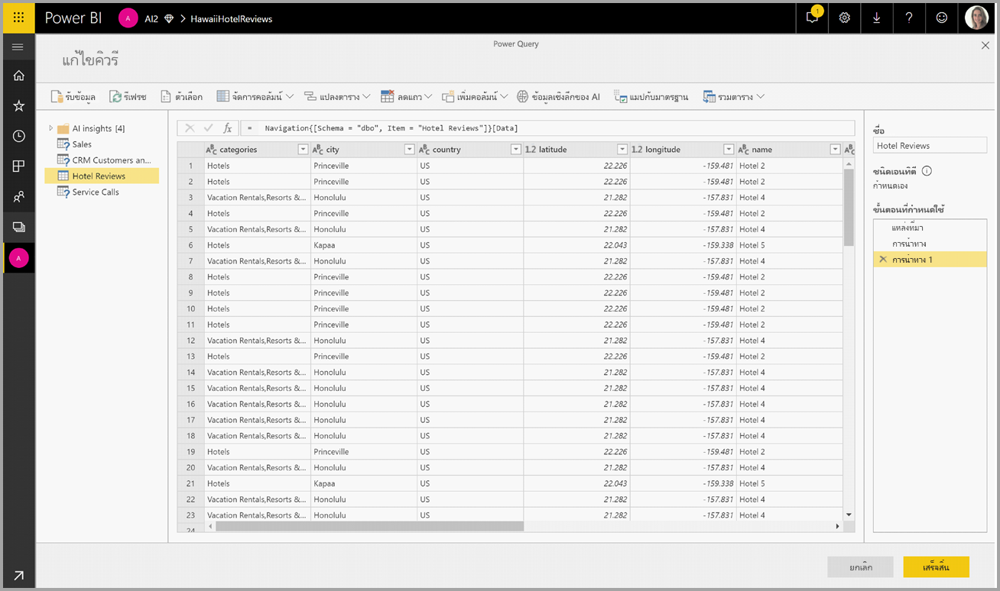
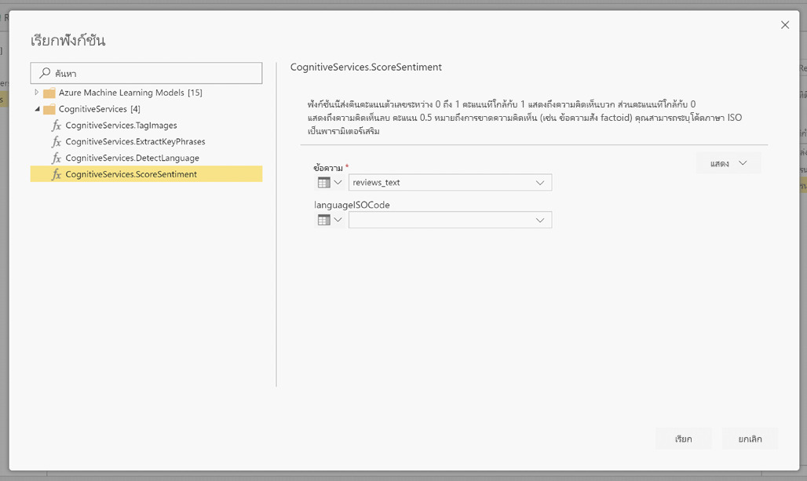
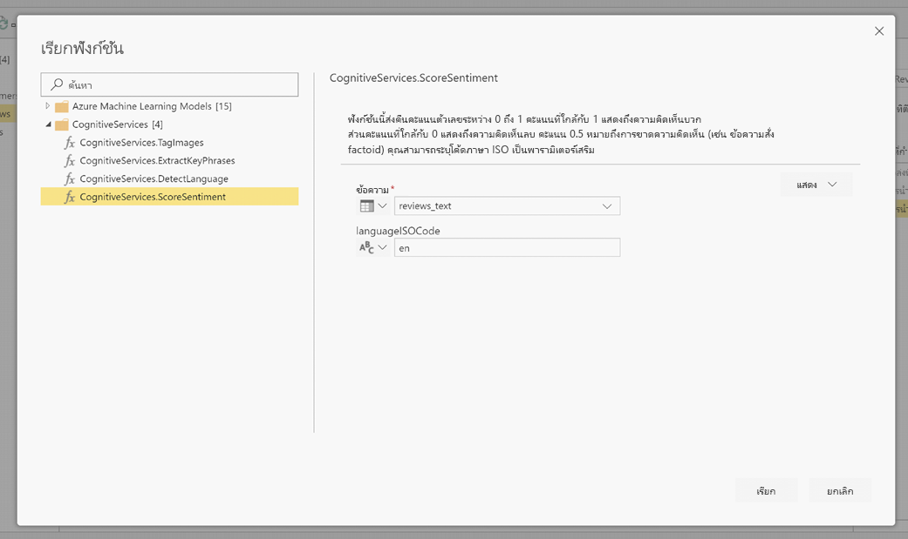
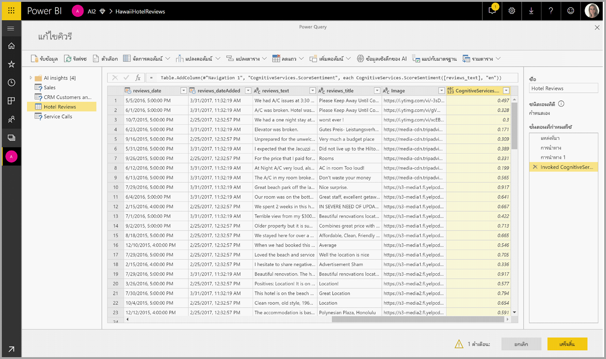
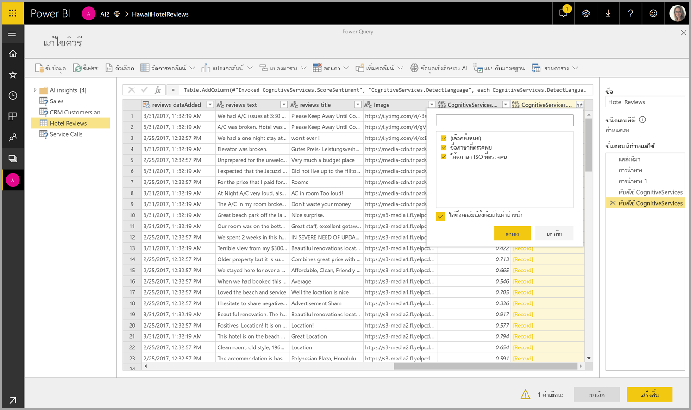

# Cognitive Services ใน Power BI (ตัวอย่าง)

ด้วย Cognitive Services ใน Power BI คุณสามารถใช้อัลกอริทึมต่างๆ ได้จาก [Azure Cognitive Services](https://azure.microsoft.com/services/cognitive-services/) เพื่อเติมแต่งข้อมูลของคุณในการเตรียมข้อมูลด้วยตนเองสำหรับกระแสข้อมูล

บริการที่ได้รับการรองรับประจำวันนี้ได้แก่ [การวิเคราะห์ความคิดเห็น](https://docs.microsoft.com/azure/cognitive-services/text-analytics/how-tos/text-analytics-how-to-sentiment-analysis) [การแยกวลีหลัก](https://docs.microsoft.com/azure/cognitive-services/text-analytics/how-tos/text-analytics-how-to-keyword-extraction) [การตรวจหาภาษา](https://docs.microsoft.com/azure/cognitive-services/text-analytics/how-tos/text-analytics-how-to-language-detection) และ [การแท็กรูปภาพ](https://docs.microsoft.com/azure/cognitive-services/computer-vision/concept-tagging-images). การแปลงข้อมูลจะดำเนินการบนบริการของ Power BI และไม่จำเป็นต้องสมัครใช้งาน Azure Cognitive Services คุณลักษณะนี้ต้องใช้ Power BI Premium

## **เปิดการใช้งานคุณลักษณะ AI**

Cognitive Services ได้รับการรองรับโดยโหนดความจุพรีเมียม EM2, A2 หรือ P1 และสูงกว่านั้น โดยจะใช้ปริมาณงาน AI ที่แยกต่างหากบนความจุเพื่อเรียกใช้ Cognitive Services ในระหว่างการแสดงตัวอย่างสาธารณะ ค่าเริ่มต้นจะปิดการใช้งานปริมาณงาน ก่อนที่จะใช้ Cognitive Services ใน Power BI จำเป็นต้องเปิดการใช้งานปริมาณงาน AI ในการตั้งค่าความจุของพอร์ทัลผู้ดูแลระบบ คุณสามารถเปิดการใช้งานปริมาณงาน AI ในส่วนของปริมาณงาน และกำหนดจำนวนสูงสุดของหน่วยความจำที่คุณต้องการให้ปริมาณงานนี้ใช้ได้ ขีดจำกัดหน่วยความจำที่แนะนำคือ 20% หากเกินขีดจำกัดนี้จะทำให้คิวรีช้าลง

## **เริ่มต้นใช้งานด้วย Cognitive Services ใน Power BI**

การแปลงข้อมูล Cognitive Services เป็นส่วนหนึ่งของ [การเตรียมข้อมูลด้วยตนเองสำหรับกระแสข้อมูล](https://powerbi.microsoft.com/blog/introducing-power-bi-data-prep-wtih-dataflows/) เพื่อเติมแต่งข้อมูลของคุณด้วย Cognitive Services โปรดเริ่มต้น โดยแก้ไขกระแสข้อมูล

เลือกปุ่ม **ข้อมูลเชิงลึก AI** ใน Ribbon ด้านบนของตัวแก้ไข Power Query

ในหน้าต่างป็อปอัพ เลือกฟังก์ชันที่คุณต้องการใช้และข้อมูลที่ต้องการแปลง ในตัวอย่างนี้ ฉันกำลังให้คะแนนความคิดเห็นของคอลัมน์ที่มีข้อความรีวิว

**Cultureinfo** เป็นข้อมูลป้อนเข้าเพิ่มเติมเพื่อระบุภาษาของข้อความ เขตข้อมูลนี้คาดหวังรหัส ISO คุณสามารถใช้คอลัมน์เป็นข้อมูลป้อนเข้าสำหรับ Cultureinfo หรือเขตข้อมูลแบบคงที่ได้ ในตัวอย่างนี้ ภาษาที่ระบุสำหรับทั้งคอลัมน์คือภาษาอังกฤษ (en) หากคุณปล่อยให้เขตข้อมูลนี้ว่าง Power BI จะตรวจหาภาษาโดยอัตโนมัติก่อนที่จะใช้ฟังก์ชัน จากนั้นเลือก **การเรียก**

หลังจากการเรียกฟังก์ชัน ระบบจะเพิ่มผลลัพธ์เป็นคอลัมน์ใหม่ลงในตาราง และระบบจะเพิ่มการแปลงข้อมูลเป็นขั้นตอนที่นำไปใช้ในคิวรีด้วยเช่นกัน

หากฟังก์ชันส่งกลับเขตข้อมูลผลลัพธ์หลายรายการ การเรียกฟังก์ชันจะเพิ่มคอลัมน์ใหม่ที่ มีระเบียนของเขตข้อมูลผลลัพธ์หลายรายการ

ขยายคอลัมน์เพื่อใช้ตัวเลือกในการเพิ่มอย่างน้อยหนึ่งค่าเป็นคอลัมน์ในข้อมูลของคุณ

## **ฟังก์ชันที่พร้อมใช้งาน**

ส่วนนี้จะอธิบายฟังก์ชันที่พร้อมใช้งานใน Cognitive Services ใน Power BI

### **ตรวจหาภาษา**

ฟังก์ชันตรวจหาภาษาจะประเมินข้อมูลป้อนเข้าที่เป็นข้อความ โดยแต่ละเขตข้อมูลจะส่งกลับชื่อภาษาและตัวระบุ ISO ฟังก์ชันนี้เป็นประโยชน์ต่อคอลัมน์ข้อมูลที่รวบรวมข้อความที่กำหนดเองซึ่งไม่ทราบภาษา ฟังก์ชันคาดหวังข้อมูลในรูปแบบข้อความเป็นข้อมูลป้อนเข้า

การวิเคราะห์ข้อความสามารถตรวจหาได้มากถึง 120 ภาษา โปรดดู [ภาษาที่รองรับ](https://docs.microsoft.com/azure/cognitive-services/text-analytics/text-analytics-supported-languages) สำหรับข้อมูลเพิ่มเติม

### **แยกวลีหลัก**

ฟังก์ชัน **การแยกวลีหลัก** จะประเมินข้อความที่ไม่มีโครงสร้าง โดยแต่ละเขตข้อมูลข้อความจะส่งกลับรายการของวลีหลัก ฟังก์ชันดังกล่าวจำเป็นต้องมีเขตข้อมูลข้อความเป็นข้อมูลป้อนเข้า และยังยอมรับข้อมูลป้อนเข้าเพิ่มเติมสำหรับ **Cultureinfo** ด้วยเช่นกัน (โปรดดูส่วน **เริ่มต้นใช้งาน** ก่อนหน้าในบทความนี้)

การแยกวลีหลักเหมาะสำหรับก้อนข้อความที่ใหญ่กว่า ซึ่งตรงข้ามกับการวิเคราะห์ความคิดเห็นที่เหมาะสำหรับก้อนข้อความที่เล็กกว่า โปรดพิจารณาการปรับโครงสร้างของข้อมูลป้อนเข้าให้สอดคล้องเพื่อให้ได้ผลลัพธ์ที่ดีที่สุดจากการดำเนินการทั้งสองรูปแบบ

### **ให้คะแนนความคิดเห็น**

ฟังก์ชัน **ให้คะแนนความคิดเห็น** จะประเมินข้อมูลป้อนเข้าที่เป็นข้อความและส่งกลับคะแนนความคิดเห็นสำหรับแต่ละเอกสาร โดยคะแนนจะไล่เรียงจาก 0 (ลบ) ถึง 1 (บวก) ฟังก์ชันนี้เป็นประโยชน์สำหรับการตรวจจับความคิดเห็นที่เป็นบวก และลบในสื่อสังคม รีวิวจากลูกค้า และฟอรั่มการอภิปราย

การวิเคราะห์ข้อความจะใช้อัลกอริทึมการจัดประเภทการเรียนรู้เกี่ยวกับเครื่องเพื่อสร้างคะแนนความคิดเห็นระหว่าง 0 และ 1 คะแนนที่ใกล้กับ 1 แสดงถึงความคิดเห็นบวก ส่วนคะแนนที่ใกล้กับ 0 แสดงถึงความคิดเห็นลบ แบบจำลองจะได้รับการฝึกฝนด้วยเนื้อหาที่เกี่ยวข้องกับความคิดเห็นอย่างครอบคลุมไว้ล่วงหน้า ในปัจจุบัน ยังไม่สามารถให้ข้อมูลการฝึกของคุณเองได้ แบบจำลองจะใช้เทคนิคการผสมผสานระหว่างการวิเคราะห์ข้อความ รวมการประมวลผลข้อความ การวิเคราะห์ชนิดของคำ การวางตำแหน่งคำ และกลุ่มคำที่เกี่ยวข้องกัน โปรดดู [แนะนำการวิเคราะห์ข้อความ](https://blogs.technet.microsoft.com/machinelearning/2015/04/08/introducing-text-analytics-in-the-azure-ml-marketplace/) สำหรับข้อมูลเพิ่มเติมเกี่ยวกับอัลกอริทึม

การวิเคราะห์ความคิดเห็นจะดำเนินการบนเขตข้อมูลที่ป้อนเข้าทั้งหมดซึ่งตรงข้ามกับการแยกความคิดเห็นสำหรับเอนทิตีเฉพาะในข้อความ ในทางปฏิบัติ จะมีแนวโน้มสำหรับการให้คะแนนความแม่นยำเพื่อปรับปรุงเมื่อเอกสารมีหนึ่งหรือสองประโยคมากกว่าเป็นก้อนข้อความขนาดใหญ่ ระหว่างขั้นตอนการประเมินปรวิสัย แบบจำลองจะตัดสินว่า เขตข้อมูลที่ป้อนเข้าโดยรวมเป็นข้อเท็จจริงหรือความคิดเห็น ระบบจะไม่นำเขตข้อมูลที่ป้อนเข้าที่โดยส่วนใหญ่เป็นข้อเท็จจริงไปดำเนินการต่อในขั้นตอนการตรวจหาความคิดเห็น ดังนั้นระบบจะแสดงผลคะแนน .50 โดยไม่มีการประมวลผลต่อ ส่วนเขตข้อมูลที่ป้อนเข้าที่ดำเนินการต่อในไปป์ไลน์ ขั้นตอนถัดไปจะสร้างคะแนนที่สูงหรือต่ำกว่า .50 โดยขึ้นอยู่กับระดับระดับความคิดเห็นที่ตรวจพบในเขตข้อมูลที่ป้อนเข้า

ในปัจจุบัน การวิเคราะห์ความคิดเห็นรองรับภาษาอังกฤษ ภาษาเยอรมัน ภาษาสเปน และภาษาฝรั่งเศส ส่วนภาษาอื่นๆ ยังอยู่ในช่วงตัวอย่าง โปรดดู [ภาษาที่รองรับ](https://docs.microsoft.com/azure/cognitive-services/text-analytics/text-analytics-supported-languages) สำหรับข้อมูลเพิ่มเติม

### **แท็กรูปภาพ**

ฟังก์ชัน **แท็กรูปภาพ** จะส่งกลับแท็กโดยยึดตามวัตถุ สิ่งมีชีวิต ทิวทัศน์ และการเคลื่อนไหวที่รู้จักมากกว่า 2,000 รายการ เมื่อแท็กไม่ชัดเจนหรือไม่ใช่ความรู้ทั่วไป ผลลัพธ์จะให้ 'ข้อมูล' เพื่ออธิบายความหมายของแท็กในบริบทของการตั้งค่าที่รู้จัก แท็กจะไม่ถูกจัดระเบียบเป็นการจัดหมวดหมู่ และจะไม่มีลำดับชั้นการสืบทอด คอลเลกชันของเนื้อหาแท็กจะสร้างพื้นฐานสำหรับ 'คำอธิบาย' รูปภาพที่แสดงเป็นภาษาที่อ่านได้ของมนุษย์ซึ่งมีรูปแบบเป็นประโยคสมบูรณ์

หลังจากอัปโหลดรูปภาพหรือระบุ URL รูปภาพแล้ว ผลลัพธ์อัลกอริทึมคอมพิวเตอร์วิทัศน์จะแท็กโดยยึดตามวัตถุ สิ่งมีชีวิต และการเคลื่อนไหวที่ระบุในรูปภาพ แท็กไม่จำกัดเฉพาะเรื่องหลักๆ เช่น บุคคลในพื้นหน้า เท่านั้นแต่ยังรวมถึง ฉาก (ในร่มหรือกลางแจ้ง) เครื่องเรือน เครื่องมือ พืช สัตว์ เครื่องประดับ เครื่องมือเบ็ดเตล็ด และอื่นๆ

ฟังก์ชันนี้ต้องเป็น URL รูปภาพหรือเขตข้อมูล abase-64 ที่เป็นข้อมูลป้อนเข้า ในขณะนี้ การแท็กรูปภาพรองรับภาษาอังกฤษ ภาษาสเปน ภาษาญี่ปุ่น ภาษาโปรตุเกส และภาษาจีนแบบย่อ โปรดดู [ภาษาที่รองรับ](https://docs.microsoft.com/rest/api/cognitiveservices/computervision/tagimage/tagimage#uri-parameters) สำหรับข้อมูลเพิ่มเติม

## ขั้นตอนถัดไป

บทความนี้จะให้ภาพรวมของการใช้ Cognitive Services กับบริการของ Power BI บทความต่อไปนี้อาจน่าสนใจและเป็นประโยชน์สำหรับคุณ 

* [บทช่วยสอน: เรียกใช้แบบจำลอง Machine Learning Studio ใน Power BI (ตัวอย่าง)](service-tutorial-invoke-machine-learning-model.md)
* [การรวม Azure Machine Learning ใน Power BI (ตัวอย่าง)](service-machine-learning-integration.md)
* [บทช่วยสอน: การใช้ Cognitive Services ใน Power BI](service-tutorial-use-cognitive-services.md)

คุณสามารถอ่านบทความเหล่านี้สำหรับข้อมูลเพิ่มเติมเกี่ยวกับกระแสข้อมูลได้:
* [การสร้างและใช้กระแสข้อมูลใน Power BI](service-dataflows-create-use.md)
* [ใช้เอนทิตีที่มีการคำนวณใน Power BI Premium](service-dataflows-computed-entities-premium.md)
* [ใช้ dataflows กับแหล่งข้อมูลภายในองค์กร](service-dataflows-on-premises-gateways.md)
* [ทรัพยากรสำหรับนักพัฒนาสำหรับ dataflows Power BI](service-dataflows-developer-resources.md)
* [ การรวมกระแสข้อมูลและ Azure Data Lake (ตัวอย่าง)](service-dataflows-azure-data-lake-integration.md)