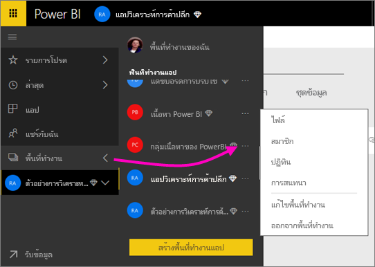

# ร่วมมือทำงานในพื้นที่ทำงานดั้งเดิม
พื้นที่ทำงาน Power BI คือตำแหน่งที่ยอดเยี่ยมเพื่อทำงานร่วมกับเพื่อนร่วมงานของคุณบนแดชบอร์ด รายงาน และชุดข้อมูลเพื่อสร้าง*แอป* บทความนี้เกี่ยวกับพื้นที่ทำงานดั้งเดิมแบบ*ดั้งเดิม*  

ทำงานร่วมกันไม่ได้จบด้วยพื้นที่ทำงานใน Power BI เมื่อคุณสร้างพื้นที่ทำงานแบบดั้งเดิมหนึ่งรายการใน Power BI คุณจะสร้างกลุ่ม Office 365 ในพื้นหลังโดยอัตโนมัติ Office 365 เสนอกลุ่มอื่นๆบริการ เช่นแชร์ไฟล์บน OneDrive สำหรับธุรกิจ การสนทนาใน Exchange ปฏิทินที่ใช้ร่วมกัน และ tasks และอื่น ๆ อ่านเพิ่มเติมเกี่ยวกับ[กลุ่มใน Office 365](https://support.office.com/article/Create-a-group-in-Office-365-7124dc4c-1de9-40d4-b096-e8add19209e9)

> [!NOTE]
> ประสบการณ์พื้นที่ทำงานใหม่จะเปลี่ยนความสัมพันธ์ระหว่างพื้นที่ทำงาน Power BI และกลุ่ม Office 365 เมื่อคุณสร้างพื้นที่ทำงานแบบใหม่หนึ่งรายการใน Power BI คุณจะไม่สร้างกลุ่ม Office 365 ในพื้นหลังโดยอัตโนมัติอีกต่อไป สำหรับข้อมูลเพิ่มเติม ดู [สร้างพื้นที่ทำงานใหม่ใน Power BI](service-create-the-new-workspaces.md)

คุณต้องมี[สิทธิ์การใช้งาน Power BI Pro](service-features-license-type.md) เพื่อสร้างพื้นที่ทำงาน

## ทำงานร่วมกันบนไฟล์ Power BI Desktop ในพื้นที่ทำงาน
หลังจากที่คุณสร้างไฟล์ Power BI Desktop คุณสามารถเผยแพร่ไปยังพื้นที่ทำงาน เพื่อให้ทุกคนในพื้นที่ทำงานของคุณจะสามารถทำงานร่วมกันได้

1. ใน Power BI Desktop ให้เลือก **เผยแพร่** บนริบบอน **หน้าแรก** จากนั้นเลือกพื้นที่ทำงานในกล่อง**เลือกปลายทาง**
   
    
2. ใน Power BI service เลือกลูกศรที่อยู่ถัดจาก**พื้นที่ทำงาน** > เลือกพื้นที่ทำงาน
   
    
3. เลือกแท็บ**รายงาน** จากนั้นเลือกรายงานของคุณ
   
    
   
    จากที่นี่ มันเหมือนกับรายงานอื่นๆ ใน Power BI คุณและผู้อื่นในพื้นที่ทำงานสามารถปรับเปลี่ยนรายงาน และบันทึกไทล์ไปยังแดชบอร์ดที่คุณเลือกได้

## ทำงานร่วมกันใน Office 365
ทำงานร่วมกันใน Office 365 เริ่มต้นจากพื้นที่ทำงานแบบดั้งเดิมใน Power BI

1. ในบริการของ Power BI เลือกลูกศรอยู่ถัดจาก**พื้นที่ทำงาน** > เลือก **ตัวเลือกเพิ่มเติม** (... ) ถัดจากชื่อพื้นที่ทำงานของคุณ 
   
   
2. จากเมนูนี้ คุณสามารถทำงานร่วมกันกับกลุ่มของคุณในสองสามวิธี 
   
   * มี[กลุ่มการสนทนาใน Office 365](#have-a-group-conversation-in-office-365)
   * [กำหนดเหตุการณ์](#schedule-an-event-on-the-group-workspace-calendar)บนปฏิทินของพื้นที่ทำงานของกลุ่ม
   
   ครั้งแรกที่คุณไปยังพื้นที่ทำงานของกลุ่มคุณใน Office 365 ซึ่งอาจใช้เวลาสักครู่ รอ 15 ถึง 30 นาที จากนั้นรีเฟรชเบราว์เซอร์ของคุณ

## มีกลุ่มการสนทนาใน Office 365
1. เลือก**ตัวเลือกเพิ่มเติม** (...) ที่อยู่ถัดจากชื่อพื้นที่ทำงานของคุณ \>**การสนทนา** 
   
    
   
   เว็บไซต์อีเมลและการสนทนาสำหรับพื้นที่ทำงานของกลุ่มคุณเปิดขึ้นใน Outlook สำหรับ Office 365
   
   
2. อ่านเพิ่มเติมเกี่ยวกับ[กลุ่มการสนทนาใน Outlook สำหรับ Office 365](https://support.office.com/Article/Have-a-group-conversation-a0482e24-a769-4e39-a5ba-a7c56e828b22)

## กำหนดเหตุการณ์บนปฏิทินของพื้นที่ทำงานของกลุ่ม
1. เลือก**ตัวเลือกเพิ่มเติม** (...) ที่อยู่ถัดจากชื่อพื้นที่ทำงาน \>**ปฏิทิน** 
   
   
   
   ปฏิทินสำหรับพื้นที่ทำงานกลุ่มของคุณจะเปิดขึ้นใน Outlook สำหรับ Office 365
   
   
2. อ่านเพิ่มเติมเกี่ยวกับ[กลุ่มปฏิทินใน Outlook ใน Office 365](https://support.office.com/Article/Add-edit-and-subscribe-to-group-events-0cf1ad68-1034-4306-b367-d75e9818376a)

## จัดการพื้นที่ทำงานแบบดั้งเดิม
ถ้าคุณเป็นเจ้าของหรือผู้ดูแลระบบของพื้นที่ทำงาน คุณสามารถเพิ่มหรือลบสมาชิกในพื้นที่ทำงานได้ อ่านเพิ่มเติมเกี่ยวกับ [การจัดการพื้นที่ทำงานของ Power BI](service-manage-app-workspace-in-power-bi-and-office-365.md)

## ขั้นตอนถัดไป
* [เผยแพร่แอปใน Power BI](service-create-distribute-apps.md)
* มีคำถามเพิ่มเติมหรือไม่? [ลองไปที่ชุมชน Power BI](https://community.powerbi.com/)
* มีคำติชมหรือไม่ เยี่ยมชม[แนวคิด Power BI](https://ideas.powerbi.com/forums/265200-power-bi)

