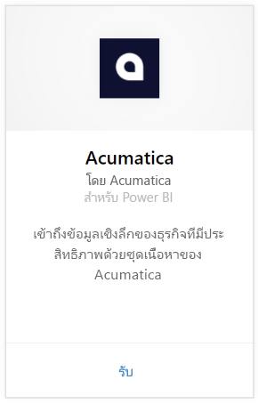
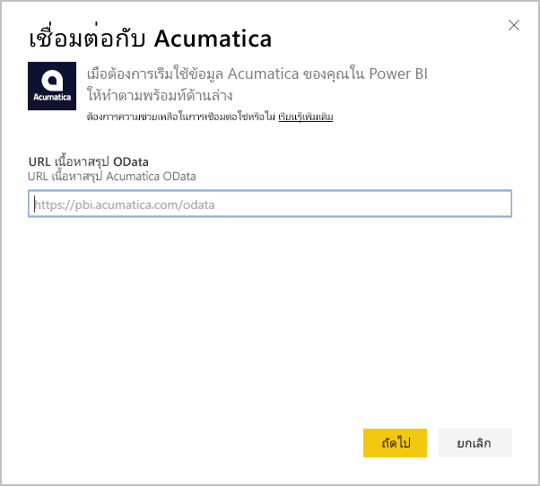
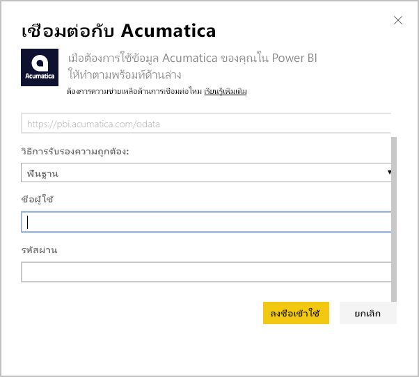
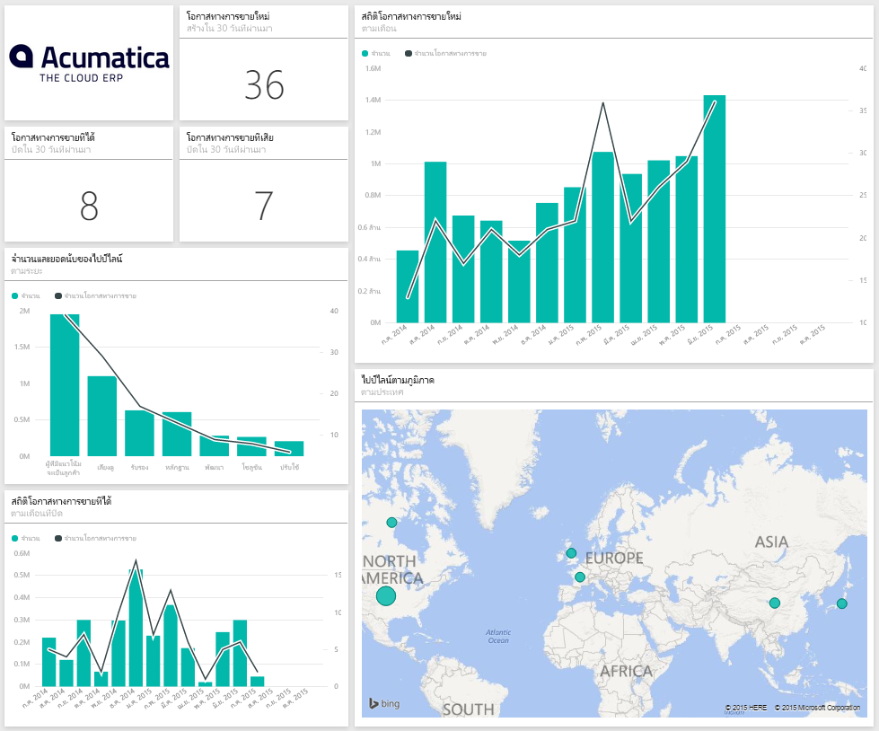
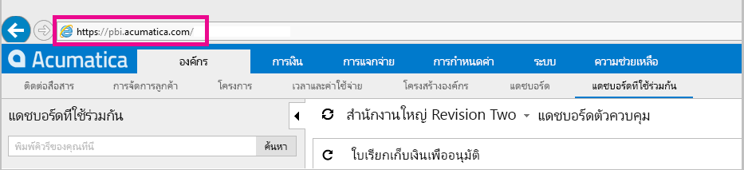

# เชื่อมต่อไปยัง Acumatica ด้วย Power BI
ชุดเนื้อหา Acumatica BI Power ช่วยให้คุณรับข้อมูลเชิงลึกลงในข้อมูลโอกาสการขายของคุณได้อย่างรวดเร็ว Power BI ดึงข้อมูลของคุณ รวมถึงโอกาส บัญชีผู้ใช้ และ ลูกค้า จากรุ่นแดชบอร์ดเริ่มต้นและรายงานที่เกี่ยวข้องที่ยึดตามข้อมูลที่เกี่ยวข้อง

เชื่อมต่อไปยัง[ชุดเนื้อหา Acumatica ](https://app.powerbi.com/getdata/services/acumatica)หรืออ่านเพิ่มเติมเกี่ยวกับการ[รวม Acumatica ](https://powerbi.microsoft.com/integrations/acumatica)กับ Power BI

>[!NOTE]
>ชุดเนื้อหานี้จำเป็นต้องใช้ Acumatica v5.2 หรือใหม่กว่า

## วิธีการเชื่อมต่อ
1. เลือกปุ่ม**รับข้อมูล**ที่ด้านล่างของพื้นที่นำทางด้านซ้ายมือ
   
   
2. ในกล่อง**บริการ** เลือก**รับ**
   
   
3. เลือก**Acumatica** \> **รับ**
   
   
4. ใส่จุดสิ้นสุด Acumatica OData ของคุณ จุดสิ้นสุด OData ให้ระบบภายนอกสามารถร้องขอข้อมูลจาก Acumatica ได้ จุดสิ้นสุด Acumatica OData ถูกจัดรูปแบบดังนี้ และควรใช้ HTTPS:
   
     https://[sitedomain]/odata/[companyname]
   
   ชื่อบริษัทคือจำเป็นถ้าคุณใช้หลายบริษัท ข้อมูลเพิ่มเติมเกี่ยวกับการค้นหาพารามิเตอร์นี้ในบัญชี Acumatica ของคุณอยู่ด้านล่าง
   
   
5. สำหรับวิธีการรับรองตัวตน ให้เลือก**พื้นฐาน** ใส่ชื่อผู้ใช้และรหัสผ่านของคุณจากบัญชี Acumatica ของคุณ จากนั้นคลิก**ลงชื่อเข้าใช้**
   
    
6. หลังจากที่ Power BI นำเข้าข้อมูลแล้ว คุณจะเห็นแดชบอร์ด รายงาน และชุดข้อมูลใหม่ ในบานหน้าต่างนำทางด้านซ้ายมือ รายการใหม่ถูกทำเครื่องหมาย ด้วยเครื่องหมายดอกจันสีเหลือง\*ซึ่งหายไปเมื่อถูกเลือก ตอนเลือกแดชบอร์ดที่จะแสดงเค้าโครงคล้ายกับด้านล่างนี้
   
    

**ฉันต้องทำอะไรตอนนี้**

* ลอง[ถามคำถามในกล่อง Q&A](power-bi-q-and-a.md)ที่ด้านบนของแดชบอร์ด
* [เปลี่ยนไทล์](service-dashboard-edit-tile.md)ในแดชบอร์ด
* [เลือกไทล์](service-dashboard-tiles.md)เพื่อเปิดรายงานด้านใน
* ถึงแม้ว่าชุดข้อมูลของคุณถูกกำหนดให้รีเฟรซรายวัน คุณสามารถเปลี่ยนแปลงกำหนดเวลารีเฟรช หรือลองรีเฟรชตามความต้องการ โดยใช้**รีเฟรชทันที**

## ความต้องการของระบบ
ชุดเนื้อหานี้จำเป็นต้องใช้ Acumatica v5.2 หรือสูงกว่า โปรดยืนยันเวอร์ชัน กับผู้ดูแลระบบ Acumatica ของคุณ

## การค้นหาพารามิเตอร์
**จุดสิ้นสุด OData Acumatica**

จุดสิ้นสุด Acumatica OData ถูกจัดรูปแบบดังนี้ และควรใช้ HTTPS:

    https://[sitedomain]/odata/[companyname]

โดเมนไซต์แอปพลิเคชันสามารถพบได้ในแถบที่อยู่ของเบราว์เซอร์ของคุณเมื่อคุณกำลังลงชื่อเข้า Acumatica ในตัวอย่างด้านล่าง โดเมนไซต์คือ "https://pbi.acumatica.com" ดังนั้นปลายทาง OData ที่จะให้มีจะเป็น "https://pbi.acumatica.com/odata"

 

ชื่อบริษัทคือจำเป็นถ้าคุณใช้หลายบริษัท คุณสามารถค้นหาข้อมูลนี้จากการลงทะเบียน Acumatica ในหน้า

## การแก้ไขปัญหา
ถ้าคุณไม่สามารถเข้าสู่ระบบ ตรวจสอบปลายทาง Acumatica OData ที่คุณให้ไว้ถูกจัดรูปแบบว่าถูกต้องหรือไม่

    https://<application site domain>/odata/<company name>

ถ้าคุณกำลังมีปัญหาในการเชื่อมต่อ โปรดยืนยันเวอร์ชัน Acumatica ของคุณกับผู้ดูแลระบบของคุณ ชุดเนื้อหานี้จำเป็นต้องใช้เวอร์ชัน 5.2 หรือใหม่กว่า

## ขั้นตอนถัดไป
[เริ่มต้นใช้งานใน Power BI](service-get-started.md)

[รับข้อมูลใน Power BI](service-get-data.md)

