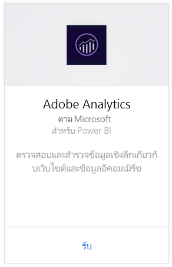
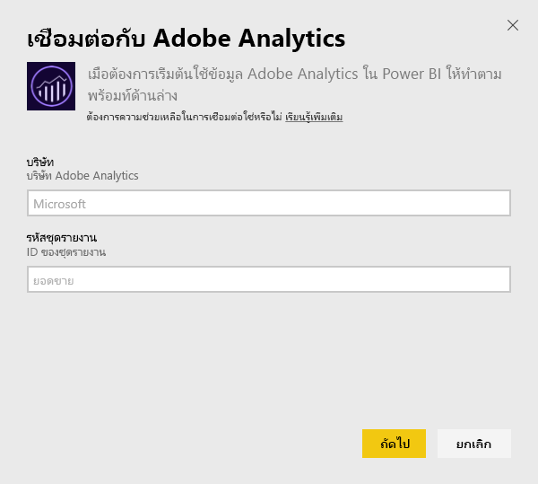
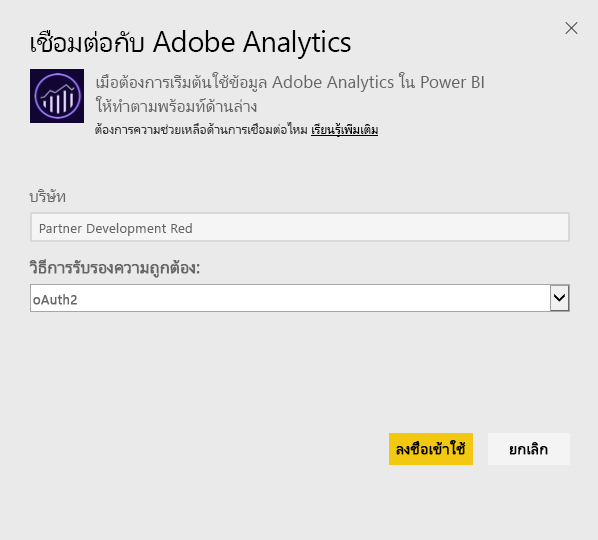
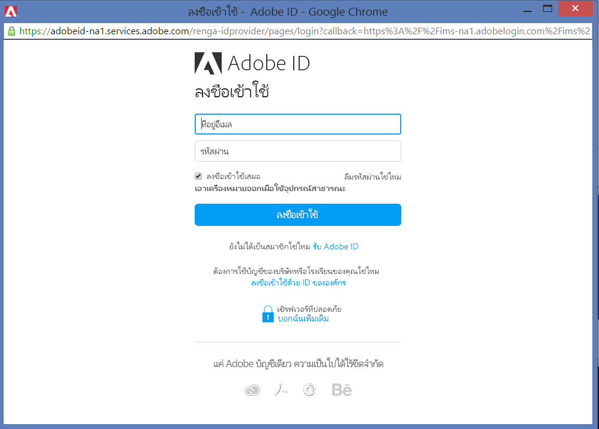
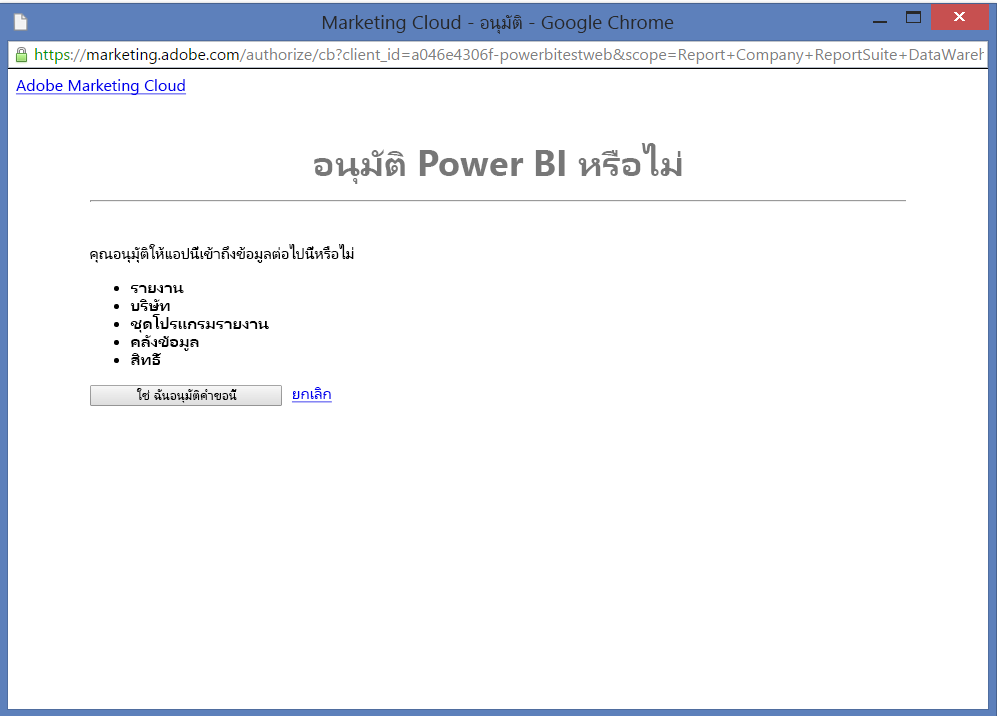
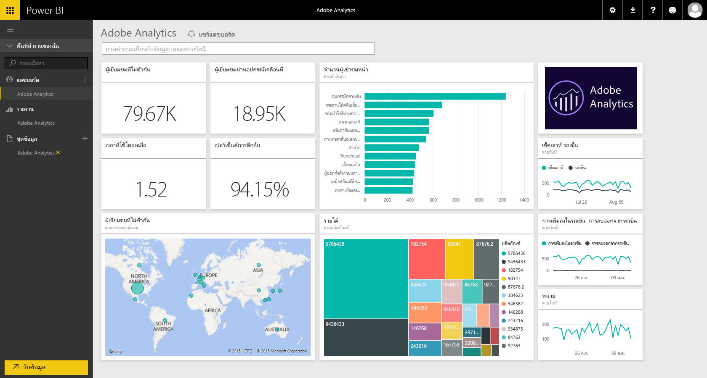
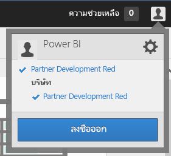
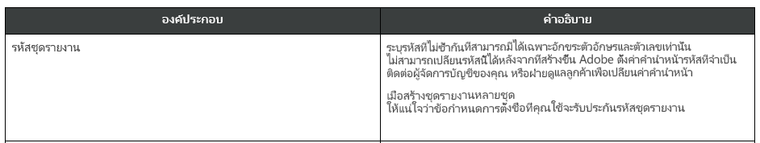

# เชื่อมต่อกับ Adobe Analytics ด้วย Power BI
การเชื่อมต่อกับ Adobe Analytics ผ่านทาง Power BI เริ่มจากการเชื่อมต่อไปยังบัญชี Adobe Analytics Marketing Cloud ของคุณ คุณจะได้แอปที่มีแดชบอร์ด Power BI และชุดของรายงาน Power BI ซึ่งให้ข้อมูลเชิงลึกเกี่ยวกับ ปริมาณการใช้งาน และมิติของผู้ใช้ ของไซต์คุณ ข้อมูลจะถูกรีเฟรชโดยอัตโนมัติวันละครั้ง คุณสามารถโต้ตอบกับแดชบอร์ดและรายงาน แต่คุณไม่สามารถบันทึกการเปลี่ยนแปลงได้

เชื่อมต่อกับ [Adobe Analytics](https://app.powerbi.com/getdata/services/adobe-analytics) หรืออ่านเพิ่มเติมเกี่ยวกับการ[รวม Adobe Analytics](https://powerbi.microsoft.com/integrations/adobe-analytics) ด้วย Power BI

## วิธีการเชื่อมต่อ
[!INCLUDE [powerbi-service-apps-get-more-apps](./includes/powerbi-service-apps-get-more-apps.md)]

1. เลือก **Adobe Analytics** \> **รับ**
   
   
2. Power BI เชื่อมต่อกับ Adobe Analytics Company และ Report Suite ID (ไม่ใช่ชื่อ Report Suite) ที่ระบุ ดูรายละเอียดที่ [การค้นหาพารามิเตอร์เหล่านั้น](#FindingParams) ที่ด้านล่าง
   
   
3. สำหรับ**วิธีการรับรองความถูกต้อง** ให้เลือก **oAuth2** \> **ลงชื่อเข้าใช้** เมื่อได้รับพร้อมท์ ใส่ข้อมูลประจำตัว Adobe Analytics ของคุณ 
   
    
   
    
4. คลิก**ยอมรับ**เพื่ออนุญาตให้ Power BI เข้าถึงข้อมูล Adobe Analytics ของคุณ
   
   
5. หลังจากที่คุณอนุมัติ กระบวนการนำเข้าจะเริ่มต้นโดยอัตโนมัติ 

## ดูแดชบอร์ดและรายงาน Adobe Analytics
[!INCLUDE [powerbi-service-apps-open-app](./includes/powerbi-service-apps-open-app.md)]

      

[!INCLUDE [powerbi-service-apps-open-app](./includes/powerbi-service-apps-what-now.md)]

## มีอะไรรวมอยู่บ้าง
Power BI ใช้ Adobe Analytics Report API เพื่อกำหนด และเรียกใช้รายงานสำหรับตารางต่อไปนี้:

| **ชื่อตาราง** | **รายละเอียดของคอลัมน์** |
| --- | --- |
| ผลิตภัณฑ์ |elements=  "product" (top 25)   metrics="cartadditions", "cartremovals", "carts", "cartviews", "checkouts", "revenue", "units" |
| เบราว์เซอร์ |elements= "browser" (top 25)   metrics="bounces", "bouncerate", "visitors", "visits", "uniquevisitors", "totaltimespent", "pageviews" |
| หน้า |elements= "page" (top 25)   metrics="cartadditions", "cartremovals", "carts", "cartviews", "checkouts", "revenue", "units", "visits", "uniquevisitors", "pageviews", "bounces", "bouncerate", "totaltimespent" |
| การเปิดใช้งาน JavaScript |elements=  "javascriptenabled”, “browser” (top 25) |
| ระบบปฏิบัติการมือถือ |elements= "mobileos"(top 25)  metrics="bounces", "bouncerate", "visitors", "visits", "uniquevisitors", "totaltimespent", "cartadditions", "cartremovals", "checkouts", "revenue", "units", "pageviews" |
| คำสำคัญสำหรับโปรแกรมค้นหา |elements= "searchengine" "searchenginekeyword"   metrics="bounces", "bouncerate", "visitors", "visits", "entries", "uniquevisitors", "totaltimespent", "cartadditions", "cartremovals", "carts", "cartviews", "checkouts", "revenue", "units", "pageviews" |
| โปรแกรมค้นหา ไปยังผลิตภัณฑ์ |elements= "searchengine", "product"   metrics="bounces", "bouncerate", "visitors", "visits", "entries", "uniquevisitors", "totaltimespent", "cartadditions", "cartremovals", "carts", "cartviews", "checkouts", "revenue", "units", "pageviews" |
| หน้าที่อ้างอิง |elements= "referrer" (top 15), “page" (top 10)   metrics="bounces", "bouncerate", "visitors", "visits", "entries", "uniquevisitors", "totaltimespent", "cartadditions", "cartremovals", "carts", "cartviews", "checkouts", "revenue", "units", "pageviews" |
| หน้าตามรหัสประเทศ |elements= "geocountry" (Top 20), "page"   metrics="bounces", "bouncerate", "visitors", "visits", "entries", "uniquevisitors", "totaltimespent", "cartadditions", "cartremovals", "carts", "cartviews", "checkouts", "revenue", "units", "pageviews" |
| ผลิตภัณฑ์ตามรหัสประเทศ |elements= "geocountry" (Top 20), "product"  metrics="bounces", "bouncerate", "visitors", "visits", "entries", "uniquevisitors", "totaltimespent", "cartadditions", "cartremovals", "carts", "cartviews", "checkouts", "revenue", "units" |
| ค้นหาประเทศและภูมิภาค |elements= "geocountry" (Top 200)   metrics="bounces", "bouncerate", "visitors", "visits", "entries", "uniquevisitors", "totaltimespent", "cartadditions", "cartremovals", "carts", "cartviews", "checkouts", "revenue", "units" |
| ภาษา |elements= "language", "browser" (Top 25)   metrics="bounces", "bouncerate", "visitors", "visits", "uniquevisitors", "totaltimespent", "pageviews", "cartadditions", "cartremovals", "checkouts", "carts", "cartviews" |
| ค้นหาโปรแกรมค้นหา |elements= "searchengine" (top 100)   metrics="bounces", "bouncerate", "visitors", "visits", "entries", "uniquevisitors", "totaltimespent", "cartadditions", "cartremovals", "carts", "cartviews", "checkouts", "revenue", "units" |
| ค้นหาเบราว์เซอร์ |elements= "browser" (top 25) |

## ข้อกำหนดของระบบ
จำเป็นต้องมีการเข้าถึง [Adobe Analytics](http://www.adobe.com/marketing-cloud/web-analytics.html) รวมถึงการเข้าถึงพารามิเตอร์ที่ถูกต้องตามที่อธิบายไว้ด้านล่างนี้

## การค้นหาพารามิเตอร์
**Company**

สามารถพบค่า Company ที่ด้านบนขวาของบัญชีคุณ เมื่อคุณลงชื่อเข้าใช้แล้ว ค่าจะต้องตรงตามตัวพิมพ์ใหญ่-เล็ก และช่องว่าง ป้อนค่าให้ตรงกับที่คุณเห็นในบัญชีของคุณ

**Report Suite ID**

Suite ID จะสร้างขึ้นเมื่อสร้าง Report Suite คุณสามารถติดต่อผู้ดูแลระบบของคุณเพื่อหาค่า ID สังเกตว่านี่ไม่ใช่ชื่อ Report Suite

จาก [คู่มือ](https://marketing.adobe.com/resources/help/en_US/reference/new_report_suite.html) Adobe:

## การแก้ไขปัญหา
ถ้าคุณเห็นข้อผิดพลาดหลังจากใส่ข้อมูลประจำตัวของคุณว่า คุณไม่มีสิทธิ์ โปรดยืนยันกับผู้ดูแลระบบของคุณว่า คุณสามารถเข้าถึง Adobe Analytics API นอกจากนี้ ยืนยัน Adobe ID ที่ให้ไว้ ว่าเชื่อมโยงกับ Marketing Cloud Organization ของคุณ (เชื่อมโยงกับบริษัท Adobe Analytics)

ถ้าคุณผ่านหน้าจอข้อมูลประจำตัวได้สำเร็จ ก่อนจะพบข้อผิดพลาด เป็นไปได้ที่รายงานใช้เวลานานเกินไปกว่าจะเสร็จ ข้อผิดพลาดที่พบบ่อยจะอยู่ในรูปแบบ *"ไม่สามารถรับข้อมูลจากรายงาน Adobe Analytics เนื้อหารวม &quot;หน้าอ้างอิง, หน้า&quot;, ระยะเวลาโดยประมาณคือ xx วินาที"* โปรดตรวจทานส่วน "ที่รวมอยู่ข้างใน" และเปรียบเทียบกับขนาดอินสแตนซ์ Adobe ของคุณ ขออภัยที่ยังไม่มีวิธีหลีกเลี่ยงปัญหาการหมดเวลานี้ แต่เรากำลังพิจารณาปรับปรุงเพื่อสนับสนุนอินสแตนซ์ที่มีขนาดใหญ่ขึ้น โปรดส่งคำติชมไปยังทีม Power BI ที่ https://ideas.powerbi.com

## ขั้นตอนถัดไป
* [แอป Power BI คืออะไร](service-install-use-apps.md)
* [รับข้อมูลใน Power BI](service-get-data.md)
* มีคำถามเพิ่มเติมหรือไม่ [ลองถามชุมชน Power BI](http://community.powerbi.com/)

