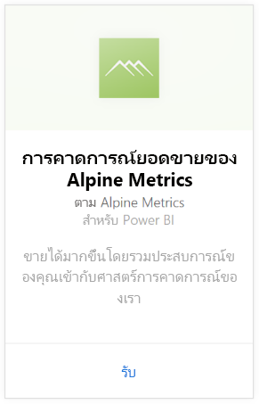
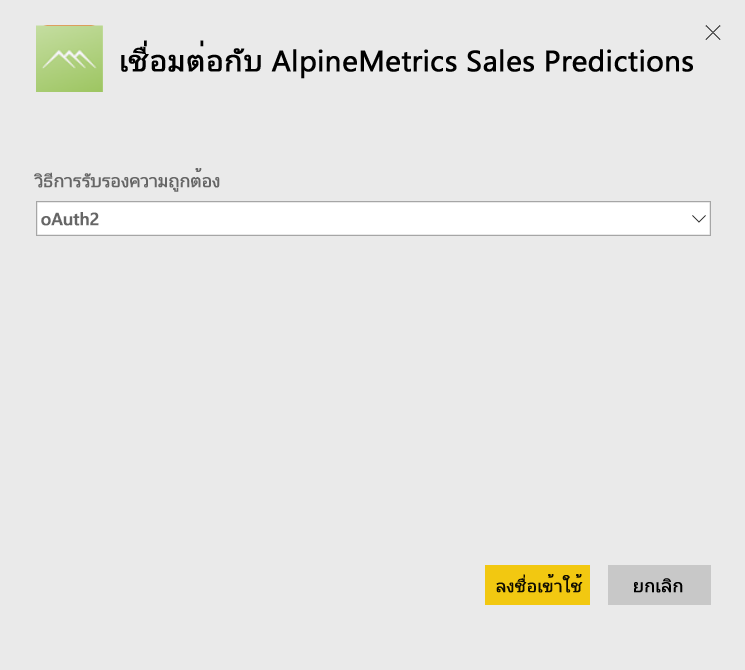
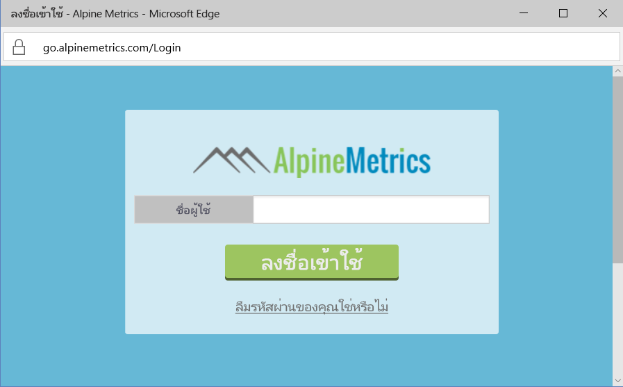
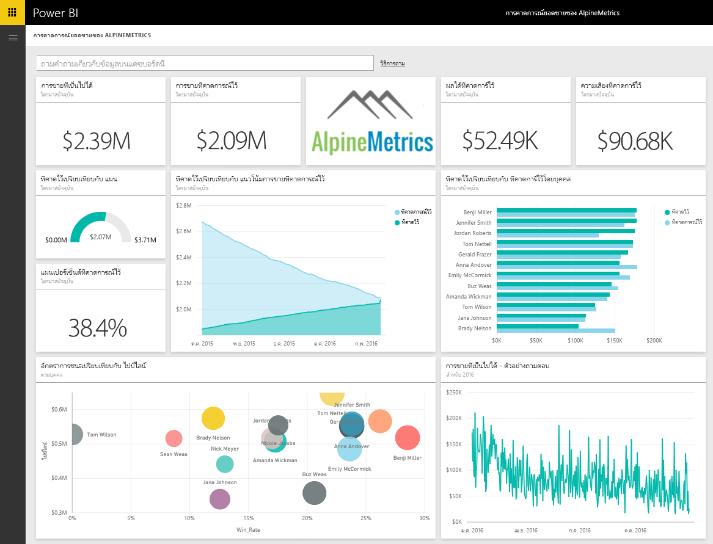

# เชื่อมต่อกับ Alpine Metrics Sales Predictions ด้วย Power BI
Alpine Metrics ช่วยให้กระบวนการคาดการณ์การขายในคลาวด์มีประสิทธิภาพสูงสุด และพร้อมใช้งานสำหรับการจัดการขายทั้งขนาดใหญ่และขนาดเล็ก ชุดเนื้อหาคาดการณ์ยอดขาย Alpine Metrics สำหรับ Power BI มีเมตริก เช่นยอดขายที่เป็นไปได้และความเสี่ยงที่คาดการณ์ ช่วยให้คุณได้ข้อมูลเชิงลึกสำหรับอนาคตธุรกิจของคุณ 

เชื่อมต่อไปยัง[ชุดเนื้อหาการคาดการณ์ยอดขายอัลไพน์ เมทริกซ์](https://app.powerbi.com/getdata/services/alpine-metrics)สำหรับ Power BI

## วิธีการเชื่อมต่อ
1. เลือกรับข้อมูลที่ด้านล่างของพื้นที่นำทางด้านซ้ายมือ  
   
    
2. ในกล่อง**บริการ** เลือก**รับ**  
   
    
3. เลือก**คาดการณ์ยอดขาย AlpineMetrics**แล้วเลือก**รับ**  
   
    
4. เลือก**OAuth 2**แล้วเลือก**ลงชื่อเข้าใช้** เมื่อได้รับข้อความปรากฏ ให้ใส่ข้อมูลประจำตัว AlpineMetrics ของคุณ
   
    
   
    
5. เมื่อเชื่อมต่อแล้ว แดชบอร์ด รายงาน และชุดข้อมูลจะโหลดโดยอัตโนมัติสามารถ เมื่อเสร็จสมบูรณแล้ว์ ไทล์จะอัปเดตด้วยข้อมูลจากบัญชีของคุณ
   
    

**ฉันต้องทำอะไรตอนนี้**

* ลอง[ถามคำถามในกล่อง Q&A](power-bi-q-and-a.md)ที่ด้านบนของแดชบอร์ด
* [เปลี่ยนไทล์](service-dashboard-edit-tile.md)ในแดชบอร์ด
* [เลือกไทล์](service-dashboard-tiles.md)เพื่อเปิดรายงานด้านใน
* ถึงแม้ว่าชุดข้อมูลของคุณถูกกำหนดให้รีเฟรซรายวัน คุณสามารถเปลี่ยนแปลงกำหนดเวลารีเฟรช หรือลองรีเฟรชตามความต้องการ โดยใช้**รีเฟรชทันที**

## มีอะไรรวมอยู่บ้าง
ชุดเนื้อหานี้ประกอบด้วยข้อมูลจากตารางต่อไปนี้:  

    - บัญชี    
    - พื้นที่ธุรกิจ    
    - ประเทศ    
    - อุตสาหกรรม    
    - โอกาสทางการขาย  
    - บุคคล  
    - การคาดการณ์    
    - ประวัติการคาดการณ์    
    - ผลิตภัณฑ์  
    - ภูมิภาค    

## ความต้องการของระบบ
จำเป็นต้องมีบัญชี Alpine Metrics ที่มีสิทธิ์การใช้งานตารางข้างต้นเพื่อเริ่มสร้างตัวอย่างชุดเนื้อหานี้

## ขั้นตอนถัดไป
[Power BI คืออะไร](power-bi-overview.md)

[Power BI แนวคิดพื้นฐาน](service-basic-concepts.md)

