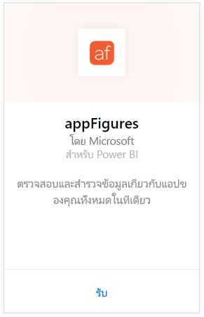
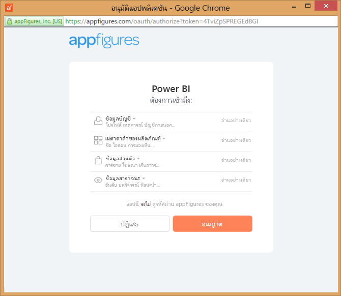
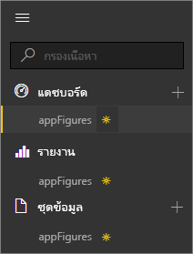
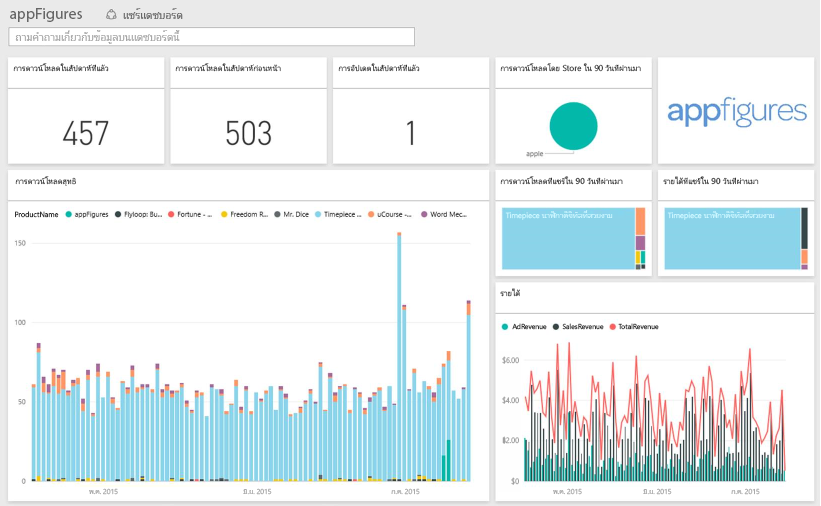
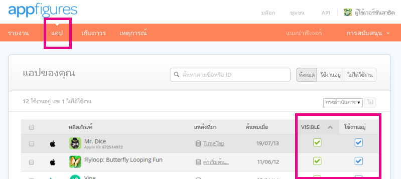

# เชื่อมต่อกับ appFigures ด้วย Power BI
การติดตามสถิติที่สำคัญเกี่ยวกับแอปฯของคุณใช้งานได้ง่าย ด้วย Power BI และชุดเนื้อหา appFigures Power BI เรียกคืนข้อมูลของคุณ รวมถึงแอปฯการขาย ดาวน์โหลด และสถิติโฆษณา จากนั้นสร้างแดชบอร์ดค่าเริ่มต้นและรายงานที่เกี่ยวข้องที่ยึดตามข้อมูลนั้น

เชื่อมต่อไปยัง[ชุดเนื้อหา appFigures](https://app.powerbi.com/getdata/services/appfigures)หรืออ่านเพิ่มเติมเกี่ยวกับการ[รวม appFigures](https://powerbi.microsoft.com/integrations/appfigures)กับ Power BI

## วิธีการเชื่อมต่อ
1. เลือกปุ่ม**รับข้อมูล**ที่ด้านล่างของพื้นที่นำทางด้านซ้ายมือ
   
   
2. ในกล่อง**บริการ** เลือก**รับ**
   
   
3. เลือก**appFigures** \> **รับ**
   
   
4. สำหรับ **วิธีการรับรองความถูกต้อง** ให้เลือก **oAuth2** \> **ลงชื่อเข้าใช้** เมื่อได้รับข้อความปรากฏขึ้น ให้ใส่ข้อมูลประจำตัวของ appFigures และทำตามกระบวนการรับรองความถูกต้องสำหรับ appFigures
   
   ในครั้งแรกที่คุณเชื่อมต่อ Power BI จะปรากฏข้อความให้คุณอนุญาตให้เข้าถึงแบบอ่านอย่างเดียวสำหรับบัญชีของคุณ เลือก**อนุญาต**เพื่อเริ่มกระบวนการนำเข้า ซึ่งอาจใช้เวลาสักครู่ โดยขึ้นอยู่กับปริมาณของข้อมูลในบัญชีของคุณ
   
   
5. หลังจาก Power BI นำเข้าข้อมูล คุณจะเห็นแดชบอร์ด รายงาน และชุดข้อมูลใหม่ในแผงนำทางด้านซ้าย รายการใหม่จะถูกทำเครื่องหมายด้วย เครื่องหมายดอกจันสีเหลือง\*:
   
    
6. เลือกแดชบอร์ appFigures นี่คือแดชบอร์ดตามเริ่มต้นที่ Power BI สร้างขึ้นเพื่อแสดงข้อมูลของคุณ คุณสามารถปรับเปลี่ยนแดชบอร์ดนี้เพื่อแสดงข้อมูลของคุณด้วยวิธีใดก็ตามที่คุณต้องการ
   
    

**ฉันต้องทำอะไรตอนนี้**

* ลอง[ถามคำถามในกล่อง Q&A](consumer/end-user-q-and-a.md)ที่ด้านบนของแดชบอร์ด
* [เปลี่ยนไทล์](service-dashboard-edit-tile.md)ในแดชบอร์ด
* [เลือกไทล์](consumer/end-user-tiles.md)เพื่อเปิดรายงานด้านใน
* แม้ว่าชุดข้อมูลของคุณจะถูกกำหนดให้รีเฟรชรายวัน แต่คุณสามารถเปลี่ยนกำหนดการรีเฟรช หรือลองรีเฟรชตามความต้องการได้โดยใช้**รีเฟรชเดี๋ยวนี้**

## มีอะไรรวมอยู่บ้าง
ข้อมูลต่อไปนี้จะพร้อมใช้งานจาก appFigures ใน Power BI

| **ชื่อตาราง** | **คำอธิบาย** |
| --- | --- |
| ประเทศ |ตารางนี้มีข้อมูลชื่อประเทศ |
| วันที่ |ตารางนี้ประกอบด้วยวันที่จากวันนี้ย้อนกลับไปยังวันที่เผยแพร่ (PublishDate) แรกสุดของแอปฯที่กำลังใช้งานอยู่และมองเห็นได้ในบัญชี appFigures ของคุณ |
| เหตุการณ์ |ตารางนี้ประกอบด้วยข้อมูลการดาวน์โหลด การขาย และการโฆษณาสำหรับแต่ละแอปฯแยกตามประเทศในแบบประจำวัน โปรดทราบว่าทั้งข้อมูลแอปฯและการซื้อในแอปฯจะอยู่ในตารางนี้ตารางเดียว คุณสามารถใช้คอลัมน์<strong>ชนิด</strong>เพื่อแยกความแตกต่างได้ |
| ในแอปฯ |ตารางนี้ประกอบด้วยข้อมูลเกี่ยวกับการซื้อภายในแอปฯชนิดต่าง ๆ ที่เกี่ยวข้องกับแอปฯที่ใช้งานอยู่และมองเห็นได้บนบัญชี appFigures ของคุณ |
| ผลิตภัณฑ์ |ตารางนี้ประกอบด้วยข้อมูลเกี่ยวกับแอปฯอื่นที่จะใช้งานอยู่และมองเห็นได้บนบัญชี appFigures ของคุณ |

## การแก้ไขปัญหา
ถ้าระบบไม่แสดงข้อมูลจากบางแอปฯของคุณใน Power BI ตรวจสอบให้แน่ใจว่าแอปฯเหล่านั้นมองเห็นได้และใช้งานอยู่บนแท็บ**Apps**ของไซต์ appFigures

## ขั้นตอนถัดไป
* [เริ่มต้นใช้งานใน Power BI](service-get-started.md)
* [รับข้อมูลใน Power BI](service-get-data.md)

