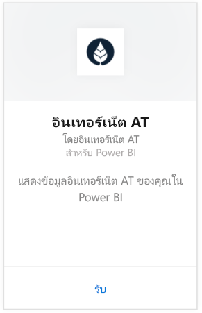
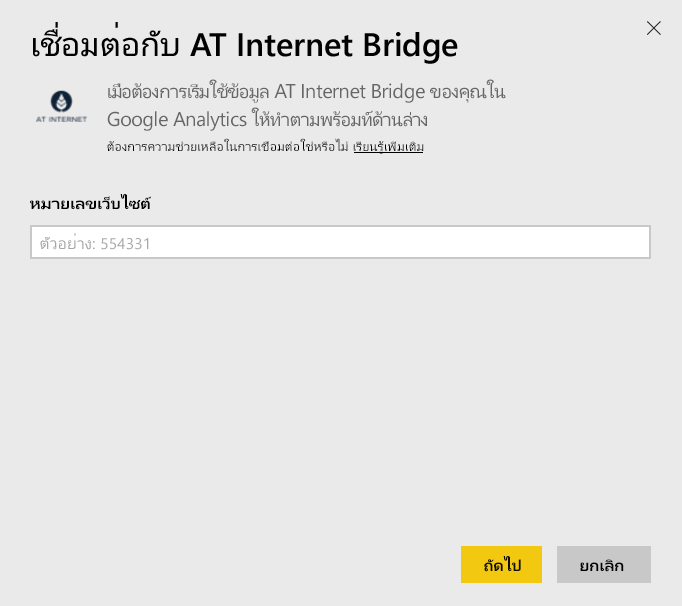
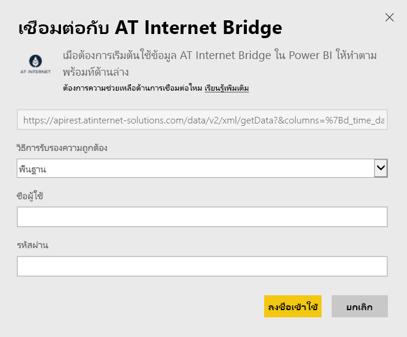

# เชื่อมต่อกับ AT Internet Bridge ด้วย Power BI
AT Internet ช่วยให้คุณสามารถแยกค่าใช้ทันทีจากข้อมูลของคุณโดยใช้แพลตฟอร์มการวิเคราะห์ดิจิทัลแบบครบวงจร นั่นคือ ชุดโปรแกรมวิเคราะห์ (Analytics Suit) ชุดเนื้อหา AT Internet Bridge สำหรับ Power BI มีข้อมูลสำหรับการเยี่ยมชม แหล่งที่มา การแปลเป็นภาษาท้องถิ่น และอุปกรณ์สำหรับไซต์ของคุณ

เชื่อมต่อไปยัง[ชุดเนื้อหา AT Internet Bridge](https://app.powerbi.com/getdata/services/at-internet-bridge)สำหรับ Power BI

## วิธีการเชื่อมต่อ
1. เลือกปุ่ม**รับข้อมูล**ที่ด้านล่างของพื้นที่นำทางด้านซ้ายมือ
   
    
2. ในกล่อง**บริการ** เลือก**รับ**
   
    
3. เลือก**AT Internet Bridge** \> **รับ**
   
   
4. ระบจำนวนเว็บไซต์ AT Internet ที่คุณต้องการเชื่อมต่อ
   
   
5. เลือก**พื้นฐาน**เป็น กลไกการรับรองความถูกต้อง ใส่ชื่อผู้ใช้และรหัสผ่าน AT Internet ของคุณ จากนั้นคลิก**ลงชื่อเข้าใช้**
   
   
6. คลิก **เชื่อมต่อ** เพื่อเริ่มกระบวนการนำเข้า เมื่อเสร็จสิ้น แดชบอร์ดใหม่ รายงาน และแบบจำลองจะปรากฏในบานหน้าต่างนำทาง เลือกแดชบอร์ดเพื่อดูข้อมูลที่นำเข้าของคุณ
   
    

**ฉันต้องทำอะไรตอนนี้**

* ลอง[ถามคำถามในกล่อง Q&A](consumer/end-user-q-and-a.md)ที่ด้านบนของแดชบอร์ด
* [เปลี่ยนไทล์](service-dashboard-edit-tile.md)ในแดชบอร์ด
* [เลือกไทล์](consumer/end-user-tiles.md)เพื่อเปิดรายงานด้านใน
* แม้ว่าชุดข้อมูลของคุณจะถูกกำหนดให้รีเฟรชรายวัน แต่คุณสามารถเปลี่ยนกำหนดการรีเฟรช หรือลองรีเฟรชตามความต้องการได้โดยใช้**รีเฟรชเดี๋ยวนี้**

## มีอะไรรวมอยู่บ้าง
ชุดเนื้อหานี้ประกอบด้วยข้อมูลของ 45 วันสุดท้ายในตารางต่อไปนี้:  

    - การแปลง  
    - อุปกรณ์  
    - การแปลเป็นภาษาท้องถิ่น  
    - แหล่งข้อมูล  
    - การเยี่ยมชมสากล  

## ขั้นตอนถัดไป
[Power BI คืออะไร](power-bi-overview.md)

[แนวคิดพื้นฐานสำหรับนักออกแบบในบริการของ Power BI](service-basic-concepts.md)

