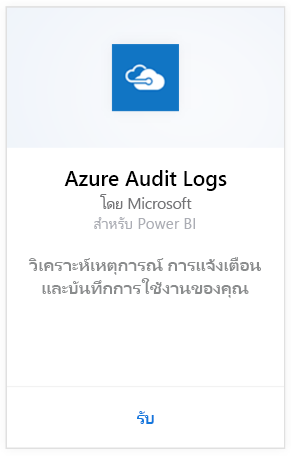
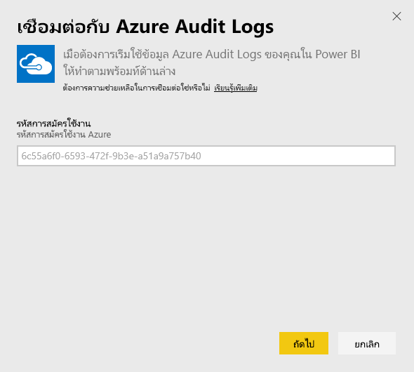
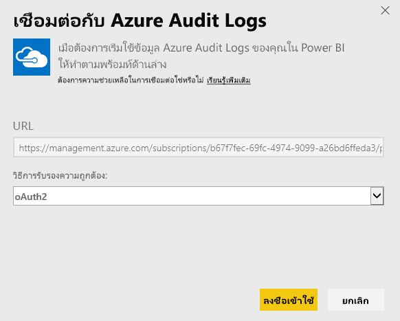
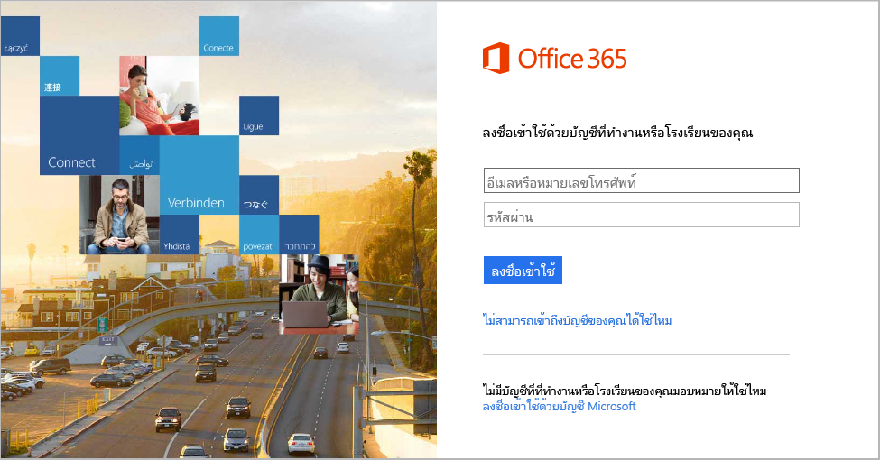
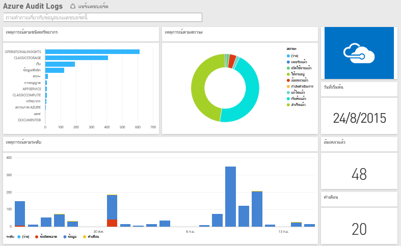

# เชื่อมต่อกับ Azure Audit Logs ด้วย Power BI
ด้วยชุดเนื้อหาของบันทึกการตรวจสอบ Azure คุณสามารถวิเคราะห์และแสดงผลข้อมูลที่จัดเก็บไว้ในบันทึกการตรวจสอบได้ Power BI ดึงข้อมูลของคุณ สร้างแดชบอร์ดที่ใช้งานทันที และสร้างรายงานที่ยึดตามข้อมูลนั้น

เชื่อมต่อไปยัง[ชุดเนื้อหา Azure Audit Logs](https://app.powerbi.com/getdata/services/azure-audit-logs)หรืออ่านเพิ่มเติมเกี่ยวกับการ[รวม Azure Audit Logs](https://powerbi.microsoft.com/integrations/azure-audit-logs)กับ Power BI

## วิธีการเชื่อมต่อ
1. เลือกปุ่ม**รับข้อมูล**ที่ด้านล่างของพื้นที่นำทางด้านซ้ายมือ  
   
    
2. ในกล่อง**บริการ** เลือก**รับ**  
   
     
3. เลือก**Azure Audit Logs** > **รับ**  
   
   
4. เมื่อถูกถาม ให้ป้อน**ID การสมัครใช้งาน Azure** ดูรายละเอียดในการค้นหา[ID การสมัครใช้งาน](#FindingParams)ของคุณที่ด้านล่าง   
   
    
5. สำหรับ **วิธีการรับรองความถูกต้อง** ให้เลือก **oAuth2** \> **ลงชื่อเข้าใช้**
   
    
6. ใส่ข้อมูลประจำตัวของบัญชีผู้ใช้ เพื่อให้กระบวนการลงชื่อเข้าใช้เสร็จสิ้น
   
    
7. Power BI จะดึงข้อมูลบันทึกการตรวจสอบ Azure ของคุณและสร้างแดชบอร์ดและรายงานแบบพร้อมใช้งานขึ้น 
   
    

**ฉันต้องทำอะไรต่อ?**

* ลอง[ถามคำถามในกล่อง Q&A](consumer/end-user-q-and-a.md)ที่ด้านบนของแดชบอร์ด
* [เปลี่ยนไทล์](service-dashboard-edit-tile.md)ในแดชบอร์ด
* [เลือกไทล์](consumer/end-user-tiles.md)เพื่อเปิดรายงานด้านใน
* แม้ว่าชุดข้อมูลของคุณจะถูกกำหนดให้รีเฟรชรายวัน แต่คุณสามารถเปลี่ยนกำหนดการรีเฟรช หรือลองรีเฟรชตามความต้องการได้โดยใช้**รีเฟรชเดี๋ยวนี้**

## ความต้องการของระบบ
ชุดเนื้อหาบันทึกการตรวจสอบของ Azure กำหนดให้มีการเข้าถึง บันทึกการตรวจสอบ ในพอร์ทัล Microsoft Azure รายละเอียดเพิ่มเติม[ที่นี่](/azure/azure-resource-manager/resource-group-audit/)

## การค้นหาพารามิเตอร์
มีสองวิธีที่ง่ายในการค้นหา ID การสมัครใช้งานของคุณ

1. จาก https://portal.azure.com -&gt;เรียกดู -&gt; การสมัคร -&gt; รหัสการสมัครใช้งาน
2. จาก https://manage.windowsazure.com -&gt;การตั้งค่า -&gt; รหัสการสมัครใช้งาน

ID การสมัครใช้งานจะเป็นชุดของตัวเลขและตัวอักษร คล้ายกับตัวอย่างในขั้นตอนที่ \#4 ข้างต้น 

## การแก้ไขปัญหา
ถ้าคุณเห็นข้อผิดพลาดของข้อมูลประจำตัว หรือมีข้อผิดพลาดในการพยายามรีเฟรชเนื่องจากข้อมูลประจำตัวไม่ถูกต้อง โปรดลองลบอินสแตนซ์ทั้งหมดของชุดเนื้อหาบันทึกการตรวจสอบ Azure และเชื่อมต่ออีกครั้ง

## ขั้นตอนถัดไป
[Power BI คืออะไร](power-bi-overview.md)  
[Power BI แนวคิดพื้นฐาน](consumer/end-user-basic-concepts.md)  

