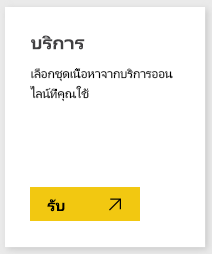
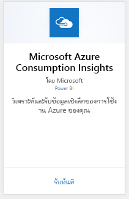
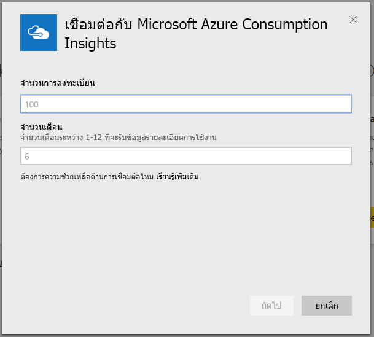
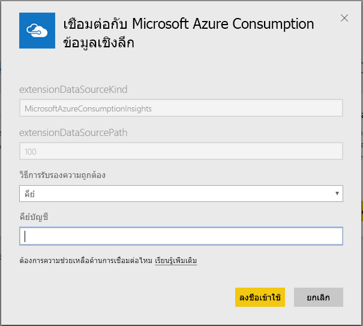
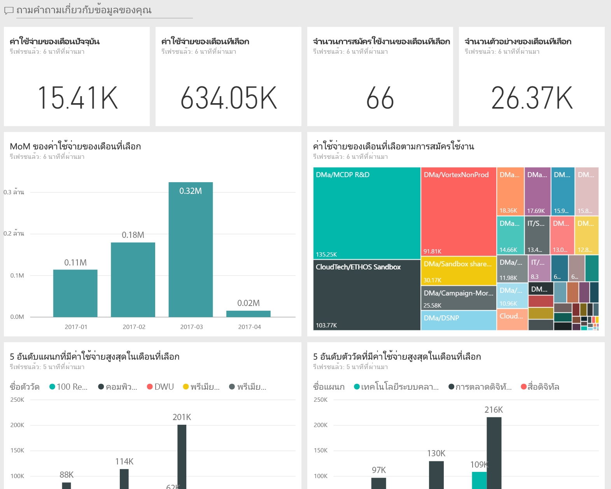
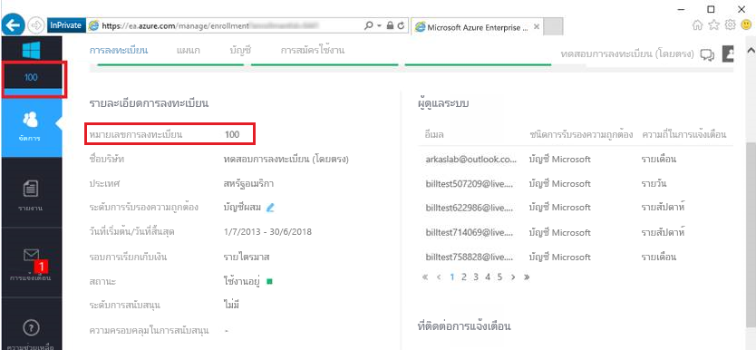
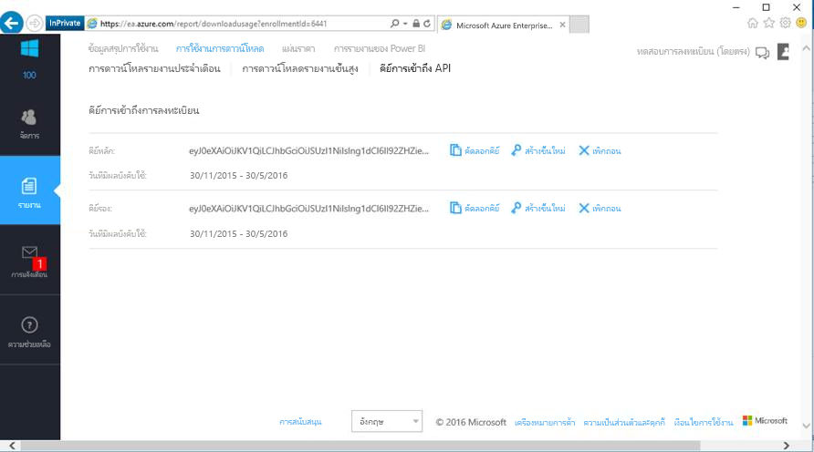

# เชื่อมต่อกับข้อมูลรายจ่ายเชิงลึกของ Microsoft Azure ด้วย Power BI
สำรวจ และตรวจสอบข้อมูลรายจ่าย Microsoft Azure ใน Power BI ด้วยชุดเนื้อหา Power BI ข้อมูลจะถูกรีเฟรชโดยอัตโนมัติวันละครั้ง

เชื่อมต่อไปยัง[ชุดเนื้อหาข้อมูลรายจ่ายเชิงลึกของ Azure Microsoft](https://app.powerbi.com/getdata/services/azureconsumption) สำหรับ Power BI

## วิธีการเชื่อมต่อ
1. เลือก**รับข้อมูล**ที่ด้านล่างของบานหน้าต่างนำทางด้านซ้าย
   
    
2. ในกล่อง**บริการ** เลือก**รับ**
   
   
3. เลือก**ข้อมูลรายจ่ายเชิงลึกของ Microsoft Azure** \> **รับ** 
   
   
4. ใส่จำนวนเดือนของข้อมูลที่คุณต้องการนำเข้า และหมายเลขการลงทะเบียน Azure Enterprise ของคุณ ดูรายละเอียดที่ [การค้นหาพารามิเตอร์เหล่านี้](#FindingParams) ด้านล่าง
   
    
5. ใส่คีย์การเข้าถึงเพื่อเชื่อมต่อ สามารถพบคีย์สำหรับการลงทะเบียนของคุณ ได้ในพอร์ทัล Azure EA ของคุณ 
   
    
6. กระบวนการนำเข้าจะเริ่มโดยอัตโนมัติ เมื่อเสร็จ แดชบอร์ดใหม่ รายงาน และรูปแบบ จะปรากฏในบานหน้าต่างนำทาง เลือกแดชบอร์ดเพื่อดูข้อมูลที่นำเข้าของคุณ
   
   

**ฉันต้องทำอะไรต่อ?**

* ลอง[ถามคำถามในกล่องถามตอบ](power-bi-q-and-a.md)ที่ด้านบนของแดชบอร์ด
* [เปลี่ยนไทล์](service-dashboard-edit-tile.md)ในแดชบอร์ด
* [เลือกไทล์](service-dashboard-tiles.md)เพื่อเปิดรายงานพื้นฐาน
* ถึงแม้ว่าชุดข้อมูลของคุณถูกกำหนดให้รีเฟรซรายวัน คุณสามารถเปลี่ยนแปลงกำหนดเวลารีเฟรช หรือลองรีเฟรชตามความต้องการ โดยใช้**รีเฟรชทันที**

## มีอะไรรวมอยู่บ้าง
ชุดเนื้อหาข้อมูลรายจ่ายเชิงลึกของ Azure Microsoft รวมข้อมูลรายงานรายเดือน สำหรับช่วงของเดือนที่คุณระบุระหว่างขั้นตอนการเชื่อมต่อ ช่วงของเดือนเป็นหน้าต่างเคลื่อนที่ได้ ดังนั้นวันที่ที่รวมอยู่ จะถูกอัปเดตตามการรีเฟรชชุดข้อมูล

## ความต้องการของระบบ
ชุดเนื้อหานี้จำเป็นต้องเข้าถึงคุณลักษณะ Enterprise ภายในพอร์ทัล Azure 

## การค้นหาพารามิเตอร์
การรายงาน Power BI มีสำหรับ EA Direct, คู่ค้า และลูกค้าทางอ้อม ผู้ที่สามารถดูข้อมูลการเรียกเก็บเงินได้ โปรดอ่านรายละเอียดด้านล่าง เพื่อค้นหาค่าแต่ละค่าที่ต้องใช้ในตอนเชื่อมต่อ

**จำนวนเดือน**

* ควรเป็นตัวเลขระหว่าง 1-36 แทนจำนวนเดือนของข้อมูล (นับจากวันนี้) ที่คุณต้องการนำเข้า

**หมายเลขการลงทะเบียน**

* คือหมายเลขการลงทะเบียน Azure Enterprise ของคุณ ซึ่งจะพบได้บนหน้าจอหลักของ [พอร์ทัล Azure Enterprise](https://ea.azure.com/) ภายใต้ "รายละเอียดการลงทะเบียน"
  
    

**คีย์การเข้าถึง**

* สามารถพบคีย์ของคุณในพอร์ทัล Azure Enterprise ภายใต้ "ดาวน์โหลดการใช้งาน" > "คีย์การเข้าถึง API"
  
    

**ความช่วยเหลือเพิ่มเติม**

* สำหรับความช่วยเหลือเพิ่มเติมในการตั้งค่า Azure Enterprise Power BI Pack เข้าสู่ระบบพอร์ทัล Enterprise Azure เพื่อดูไฟล์ช่วยเหลือ API (API Help File) ภายใต้ "ความช่วยเหลือ" และคำแนะนำเพิ่มเติมภายใต้ รายงาน -> ดาวน์โหลดการใช้งาน -> คีย์การเข้าถึง API 

## ขั้นตอนถัดไป
[เริ่มต้นใช้งานใน Power BI](service-get-started.md)

[รับข้อมูลใน Power BI](service-get-data.md)

