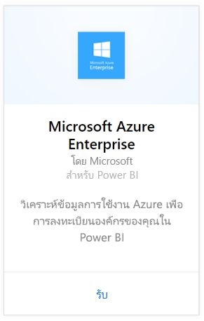
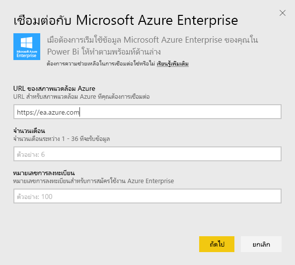
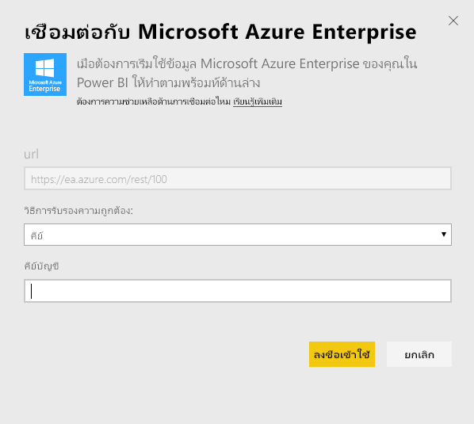
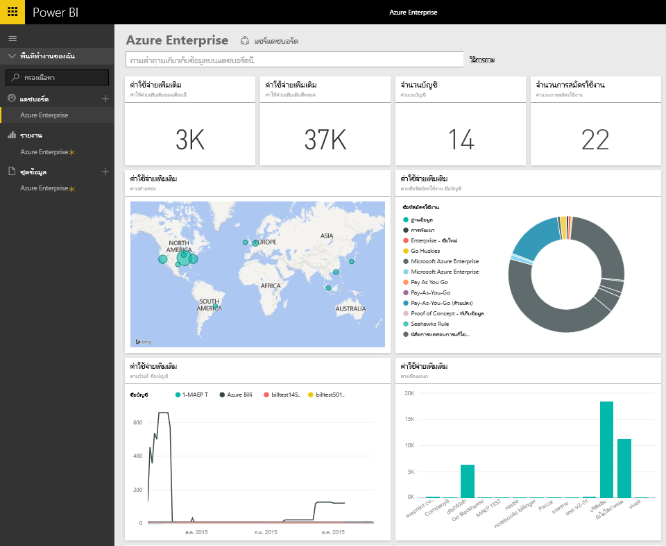
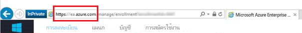
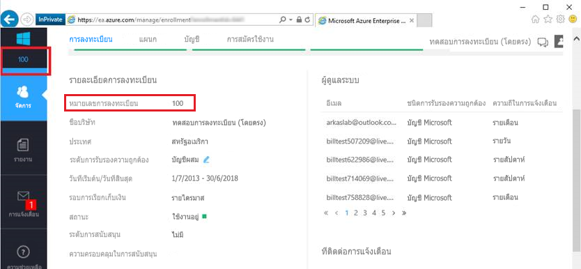
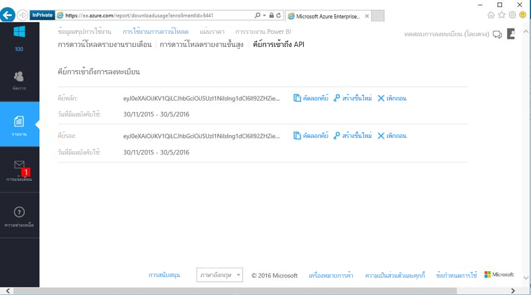

# เชื่อมต่อกับ Microsoft Azure Enterprise ด้วย Power BI
สำรวจและตรวจติดตามข้อมูล Microsoft Azure Enterprise ของคุณใน Power BI ด้วยชุดเนื้อหา Power BI ข้อมูลจะรีเฟรชโดยอัตโนมัติหนึ่งครั้งต่อวัน

เชื่อมต่อไปยัง[ชุดเนื้อหา Microsoft Azure Enterprise](https://app.powerbi.com/getdata/services/azure-enterprise)สำหรับ Power BI

## วิธีการเชื่อมต่อ
1. เลือกปุ่ม**รับข้อมูล**ที่ด้านล่างของพื้นที่นำทางด้านซ้ายมือ
   
    
2. ในกล่อง**บริการ** เลือก**รับ**
   
   
3. เลือก**Microsoft Azure Enterprise** \> **รับ**
   
   
4. ระบุ URL ของสภาพแวดล้อม Azure จำนวนเดือนของข้อมูลที่คุณต้องการนำเข้าและจำนวนการลงทะเบียน Azure Enterprise ของคุณ URL สำหรับสภาพแวดล้อม Azure ของคุณจะเป็น `https://ea.azure.com`หรือ`https://ea.windowsazure.cn` ดูรายละเอียด [ค้นหาพารามิเตอร์เหล่านี้](#FindingParams) ที่ด้านล่าง
   
    
5. ใส่คีย์การเข้าถึงเพื่อเชื่อมต่อ สามารถพบคีย์สำหรับการลงทะเบียนของคุณ ได้ในพอร์ทัล Azure EA ของคุณ
   
    
6. กระบวนการนำเข้าจะเริ่มโดยอัตโนมัติ เมื่อเสร็จสิ้น แดชบอร์ดใหม่ รายงาน และแบบจำลองจะปรากฏในบานหน้าต่างนำทาง เลือกแดชบอร์ดเพื่อดูข้อมูลที่นำเข้าของคุณ
   
   

**ฉันต้องทำอะไรตอนนี้**

* ลอง[ถามคำถามในกล่อง Q&A](power-bi-q-and-a.md)ที่ด้านบนของแดชบอร์ด
* [เปลี่ยนไทล์](service-dashboard-edit-tile.md)ในแดชบอร์ด
* [เลือกไทล์](service-dashboard-tiles.md)เพื่อเปิดรายงานด้านใน
* ถึงแม้ว่าชุดข้อมูลของคุณถูกกำหนดให้รีเฟรซรายวัน คุณสามารถเปลี่ยนแปลงกำหนดเวลารีเฟรช หรือลองรีเฟรชตามความต้องการ โดยใช้**รีเฟรชทันที**

## มีอะไรรวมอยู่บ้าง
ชุดเนื้อหา Azure Enterprise รวมข้อมูลรายงานรายเดือนสำหรับช่วงของเดือนที่คุณระบุในระหว่างขั้นตอนการเชื่อมต่อ ช่วงวันที่จะเป็นหน้าต่างเคลื่อนที่ได้ ดังนั้นวันที่รวมอยู่จะถูกอัปเดตเมื่อรีเฟรชชุดข้อมูล

## ข้อกำหนดของระบบ
ชุดเนื้อหานี้จำเป็นต้องเข้าถึงคุณลักษณะ Enterprise ภายในพอร์ทัล Azure

## การค้นหาพารามิเตอร์
การรายงาน Power BI มีสำหรับ EA Direct, คู่ค้า และลูกค้าทางอ้อม ผู้ที่สามารถดูข้อมูลการเรียกเก็บเงินได้ โปรดอ่านข้อมูลด้านล่างนี้สำหรับรายละเอียดการค้นหาแต่ละค่าที่คาดหมายสำหรับขั้นตอนการเชื่อมต่อ

**URL ของสภาพแวดล้อม Azure**

* โดยทั่วไปแล้วค่านี้คือ https://ea.azure.com อย่างไรก็ตามคุณสามารถตรวจสอบ URL ได้เมื่อคุณลงชื่อเข้าใช้เพื่อยืนยัน
  
    

**จำนวนเดือน**

* ควรเป็นตัวเลขระหว่าง 1-36 แทนจำนวนเดือนของข้อมูล (นับจากวันนี้) ที่คุณต้องการนำเข้า

**หมายเลขการลงทะเบียน**

* คือหมายเลขการลงทะเบียน Azure Enterprise ของคุณ ซึ่งจะพบได้บนหน้าจอหลักของ [พอร์ทัล Azure Enterprise](https://ea.azure.com/) ภายใต้ "รายละเอียดการลงทะเบียน"
  
    

**คีย์การเข้าถึง**

* สามารถพบคีย์ของคุณในพอร์ทัล Azure Enterprise ภายใต้ "ดาวน์โหลดการใช้งาน" > "คีย์การเข้าถึง API"
  
    

**ความช่วยเหลือเพิ่มเติม**

* สำหรับความช่วยเหลือเพิ่มเติมในการตั้งค่า Azure Enterprise Power BI Pack เข้าสู่ระบบพอร์ทัล Enterprise Azure เพื่อดูไฟล์ช่วยเหลือ API (API Help File) ภายใต้ "ความช่วยเหลือ" และคำแนะนำเพิ่มเติมภายใต้ รายงาน -> ดาวน์โหลดการใช้งาน -> คีย์การเข้าถึง API

## ขั้นตอนถัดไป
[เริ่มต้นใช้งานใน Power BI](service-get-started.md)

[รับข้อมูลใน Power BI](service-get-data.md)

