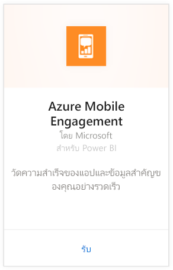
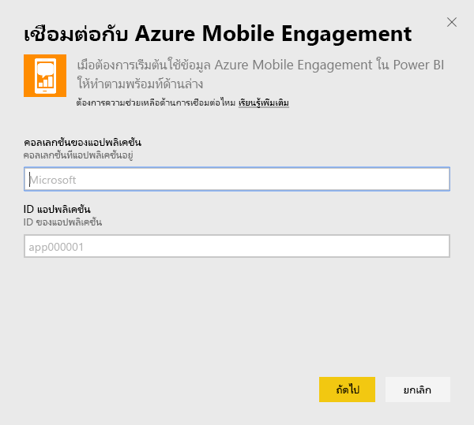
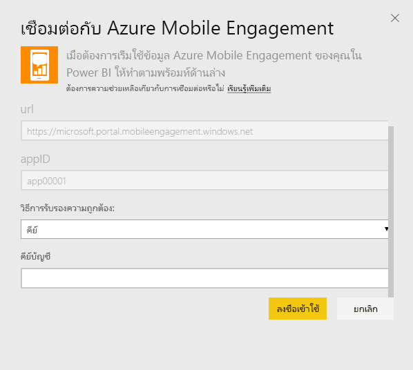
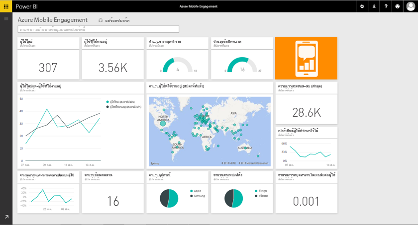

# เชื่อมต่อกับ Azure Mobile Engagement ด้วย Power BI
ในชุดเนื้อหา Power BI Azure Mobile Engagement ช่วยให้คุณรับข้อมูลเชิงลึกลงในข้อมูลแอปฯของคุณได้อย่างรวดเร็ว

เชื่อมต่อไปยัง[ชุดเนื้อหา Azure Mobile Engagement](https://app.powerbi.com/groups/me/getdata/services/azme)สำหรับ Power BI

## วิธีการเชื่อมต่อ
1. เลือกปุ่ม**รับข้อมูล**ที่ด้านล่างของพื้นที่นำทางด้านซ้ายมือ
   
    
2. ในกล่อง**บริการ** เลือก**รับ**
   
    
3. เลือก**Azure Mobile Engagement** \> **รับ**
   
     
4. ระบุคอลเลกชันแอปฯและชื่อแอปฯของคุณ สามารถพบข้อมูลนี้ได้ในบัญชี Azure Mobile Engagement ของคุณ
   
     
5. สำหรับวิธีการรับรองความถูกต้อง ใส่คีย์ของคุณ แล้วคลิกลงชื่อเข้าใช้
   
    
6. หลังจาก Power BI นำเข้าข้อมูล คุณจะเห็นแดชบอร์ด รายงาน และชุดข้อมูลใหม่ในแผงนำทางด้านซ้าย รายการใหม่จะถูกทำเครื่องหมายด้วยเครื่องหมายดอกจันสีเหลือง\*ซึ่งจะหายไปเมื่อคุณเลือก:
   
    

## ฉันต้องทำอะไรต่อ?

* ลอง[ถามคำถามในกล่อง Q&A](consumer/end-user-q-and-a.md)ที่ด้านบนของแดชบอร์ด
* [เปลี่ยนไทล์](service-dashboard-edit-tile.md)ในแดชบอร์ด
* [เลือกไทล์](consumer/end-user-tiles.md)เพื่อเปิดรายงานด้านใน
* แม้ว่าชุดข้อมูลของคุณจะถูกกำหนดให้รีเฟรชรายวัน แต่คุณสามารถเปลี่ยนกำหนดการรีเฟรช หรือลองรีเฟรชตามความต้องการได้โดยใช้**รีเฟรชเดี๋ยวนี้**

## ขั้นตอนถัดไป
[เริ่มต้นใช้งานใน Power BI](service-get-started.md)

[รับข้อมูลใน Power BI](service-get-data.md)

