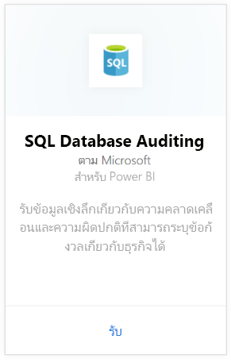
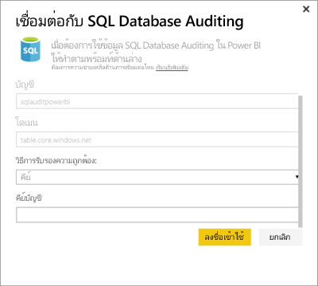
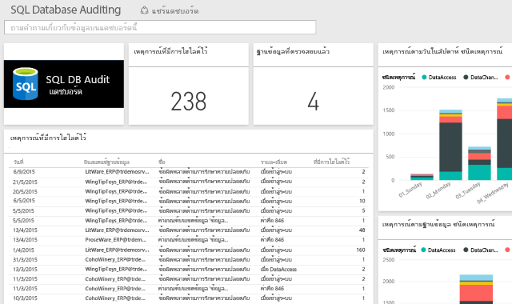

# ชุดเนื้อหาการตรวจสอบฐานข้อมูล SQL สำหรับ Power BI
ชุดเนื้อหา Power BI สำหรับ Azure [การตรวจสอบฐานข้อมูล SQL](http://azure.microsoft.com/documentation/articles/sql-database-auditing-get-started/) ช่วยให้คุณเข้าใจกิจกรรมเกี่ยวกับฐานข้อมูลของคุณและรับข้อมูลเชิงลึกในความขัดแย้งและความผิดปกติที่อาจสามารถระบุถึงปัญหาทางธุรกิจ หรือการละเมิดความปลอดภัยที่สงสัย 

เชื่อมต่อไปยังชุดเนื้อหา[การตรวจสอบฐานข้อมูล SQL](https://app.powerbi.com/getdata/services/sql-db-auditing) สำหรับ Power BI

>[!NOTE]
>ชุดเนื้อหานี้จะนำเข้าข้อมูลจากตารางทั้งหมดที่มี "บันทึกการตรวจสอบ (AuditLogs)" แสดงไว้ในชื่อ และเพิ่มเข้าในตารางโมเดลข้อมูลเดี่ยว โดยตั้งชื่อเป็น "บันทึกการตรวจสอบ (AuditLogs)" เหตุการณ์ K 250 ล่าสุดจะรวมเข้าไว้ด้วย และจะรีเฟรชข้อมูลรายวัน

## วิธีการเชื่อมต่อ
1. เลือก**รับข้อมูล**ที่ด้านล่างของแผงนำทางด้านซ้ายมือ
   
    
2. ในกล่องบริการ เลือกรับ
   
    
3. เลือก**การตรวจสอบฐานข้อมูล SQL** \> **รับ**
   
   
4. ในการเชื่อมต่อกับหน้าต่างการตรวจสอบฐานข้อมูล SQL:
   
   - ใส่ชื่อบัญชี Azure Table Storage หรือ URL ซึ่งเป็นที่จัดเก็บบันทึกของคุณ
   
   - ใส่ชื่อของเซิร์ฟเวอร์ SQL ที่คุณสนใจ ใส่ "\*" เพื่อโหลดบันทึกการตรวจสอบสำหรับเซิร์ฟเวอร์ทั้งหมด
   
   - ใส่ชื่อของฐานข้อมูล SQL ที่คุณสนใจ ใส่ "\*" เพื่อโหลดบันทึกการตรวจสอบสำหรับฐานข้อมูลทั้งหมด
   
   - ใส่ชื่อของตาราง Azure ที่ประกอบด้วยบันทึกที่คุณสนใจ ใส่ "\*" เพื่อโหลดบันทึกการตรวจสอบจากตารางทั้งหมดที่ประกอบด้วย "บันทึกการตรวจสอบ" ในชื่อของตารางนั้น
   
   >[!IMPORTANT]
   >เพื่อเหตุผลด้านประสิทธิภาพการทำงาน เราแนะนำให้คุณระบุชื่อตารางที่ชัดเจนด้วยเสมอ แม้ว่าบันทึกการตรวจสอบทั้งหมดจัดเก็บอยู่ในตารางเดียวก็ตาม
   
   - ใส่วันที่เริ่มต้นของบันทึกการตรวจสอบที่คุณสนใจ ใส่ "\*" เพื่อโหลดบันทึกการตรวจสอบโดยไม่มีขีดจำกัดเวลาต่ำสุด หรือ “1 วัน” เพื่อทำการโหลดบันทึกการตรวจสอบจากวันที่สุดท้าย
   
   - ใส่วันที่สิ้นสุดของบันทึกการตรวจสอบที่คุณสนใจ ใส่ "\*"เพื่อโหลดบันทึกการตรวจสอบ โดยไม่มีขีดจำกัดเวลาสูงสุด
   
   
5. สำหรับวิธีการรับรองความถูกต้อง เลือก**คีย์** ใส่**คีย์บัญชี**ของคุณ \> **ลงชื่อเข้าใช้**
   
   
6. หลังจาก Power BI นำเข้าข้อมูล คุณเห็นแดชบอร์ด รายงาน และชุดข้อมูลใหม่ในแผงนำทางด้านซ้าย รายการใหม่จะถูกทำเครื่องหมายด้วย เครื่องหมายดอกจันสีเหลือง\*
   
   

**ฉันต้องทำอะไรต่อ?**

* ลอง[ถามคำถามในกล่องถามตอบ](power-bi-q-and-a.md)ที่ด้านบนของแดชบอร์ด
* [เปลี่ยนไทล์](service-dashboard-edit-tile.md)ในแดชบอร์ด
* [เลือกไทล์](service-dashboard-tiles.md)เพื่อเปิดรายงานพื้นฐาน
* ถึงแม้ว่าชุดข้อมูลของคุณถูกกำหนดให้รีเฟรซรายวัน คุณสามารถเปลี่ยนแปลงกำหนดเวลารีเฟรช หรือลองรีเฟรชตามความต้องการ โดยใช้**รีเฟรชทันที**

## ขั้นตอนถัดไป
[รับข้อมูลสำหรับ Power BI](service-get-data.md)
[เริ่มต้นใช้งาน Power BI](service-get-started.md)
