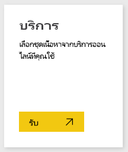
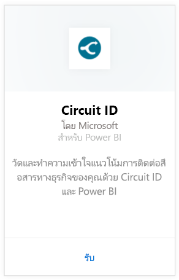
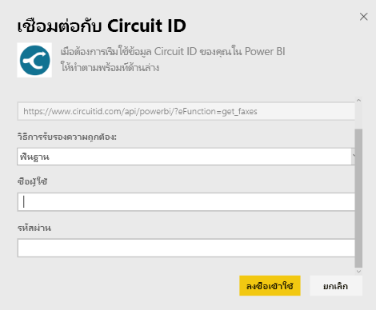
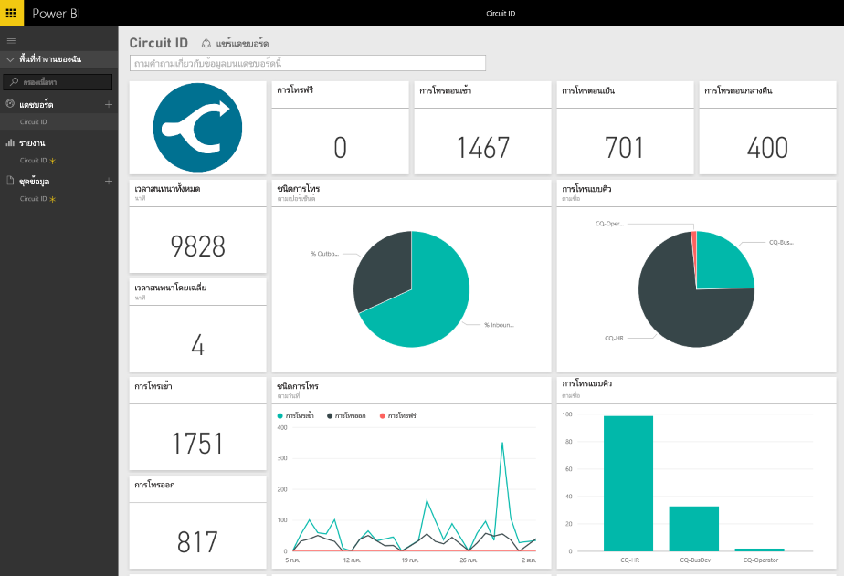

# เชื่อมต่อกับ Circuit ID ด้วย Power BI
การวิเคราะห์ข้อมูลติดต่อสื่อสารของคุณจาก Circuit ID ทำได้ง่ายขึ้นด้วย Power BI Power BI เรียกคืนข้อมูลของคุณ จากนั้นสร้างแดชบอร์ดค่าเริ่มต้นและรายงานที่เกี่ยวข้องที่ยึดตามข้อมูลนั้น หลังจากที่คุณได้สร้างการเชื่อมต่อแล้ว คุณสามารถสำรวจข้อมูลของคุณและปรับแต่งแดชบอร์ดตามความต้องการของคุณได้ ข้อมูลจะถูกรีเฟรชทุกวันโดยอัตโนมัติ

[!INCLUDE [include-short-name](./includes/service-deprecate-content-packs.md)]

เชื่อมต่อไปยัง[ชุดเนื้อหา Circuit ID](https://app.powerbi.com/getdata/services/circuitid)สำหรับ Power BI

## วิธีการเชื่อมต่อ
1. เลือกปุ่ม**รับข้อมูล**ที่ด้านล่างของพื้นที่นำทางด้านซ้ายมือ
   
    
2. ในกล่อง**บริการ** เลือก**รับ**
   
    
3. เลือก**Circuit ID** \> **รับ**
   
    
4. สำหรับวิธีการรับรองความถูกต้อง เลือก Basic (พื้นฐาน) และใส่ชื่อผู้ใช้และรหัสผ่านของคุณ จากนั้นคลิก ลงชื่อเข้าใช้
   
    
5. หลังจาก Power BI นำเข้าข้อมูล คุณจะเห็นแดชบอร์ด รายงาน และชุดข้อมูลใหม่ในแผงนำทางด้านซ้าย รายการใหม่จะถูกทำเครื่องหมายด้วย เครื่องหมายดอกจันสีเหลือง
   
    

**ฉันต้องทำอะไรต่อ?**

* ลอง[ถามคำถามในกล่อง Q&A](consumer/end-user-q-and-a.md)ที่ด้านบนของแดชบอร์ด
* [เปลี่ยนไทล์](service-dashboard-edit-tile.md)ในแดชบอร์ด
* [เลือกไทล์](consumer/end-user-tiles.md)เพื่อเปิดรายงานด้านใน
* แม้ว่าชุดข้อมูลของคุณจะถูกกำหนดให้รีเฟรชรายวัน แต่คุณสามารถเปลี่ยนกำหนดการรีเฟรช หรือลองรีเฟรชตามความต้องการได้โดยใช้**รีเฟรชเดี๋ยวนี้**

## ขั้นตอนถัดไป
[Power BI คืออะไร](power-bi-overview.md)

[รับข้อมูลสำหรับ Power BI](service-get-data.md)

