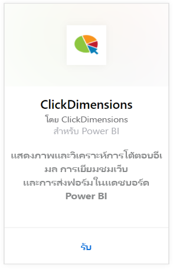
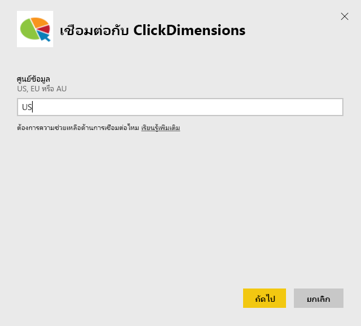
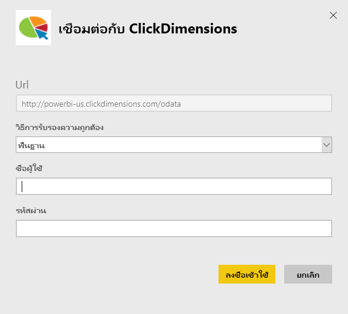
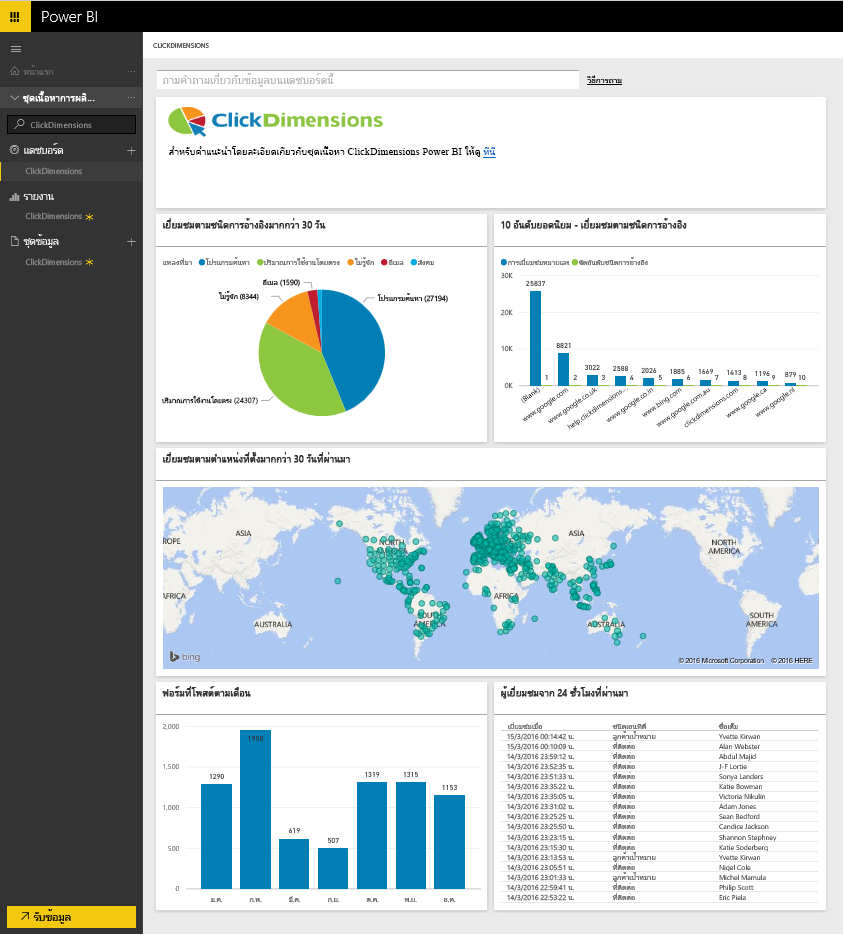
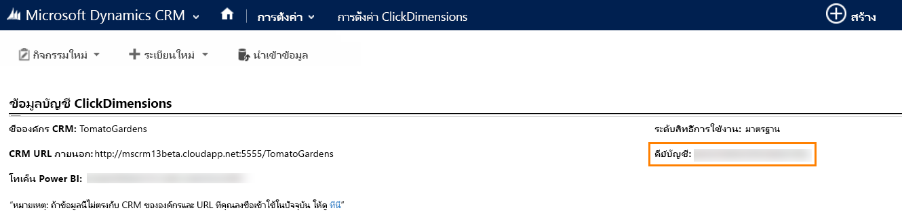
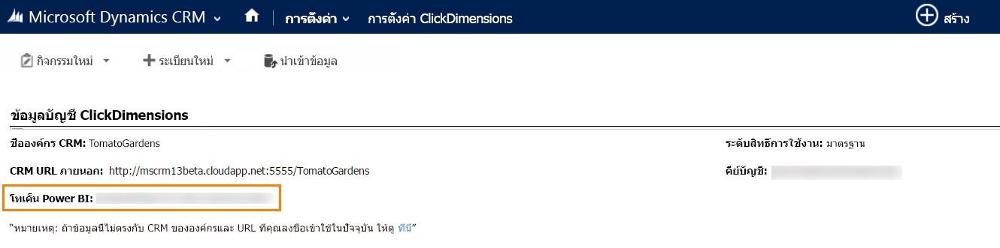

# เชื่อมต่อกับ ClickDimensions ด้วย Power BI
แพคข้อมูล ClickDimensions สำหรับ Power BI ช่วยให้ผู้ใช้สามารถใช้ประโยชน์จากตลาดข้อมูล ClickDimensions ใน Power BI โดยให้ข้อมูลเชิงลึกแก่ทีมบริหาร เพื่อประสบความสำเร็จในการขายและการตลาด แสดงภาพและวิเคราะห์การโต้ตอบอีเมล การเยี่ยมชมเว็บ และการส่งฟอร์มในแดชบอร์ดและรายงาน Power BI

เชื่อมต่อกับ[แพคเนื้อหา ClickDimensions](https://app.powerbi.com/getdata/services/click-dimensions) สำหรับ Power BI

## วิธีการเชื่อมต่อ
1. เลือกปุ่ม**รับข้อมูล**ที่ด้านล่างของพื้นที่นำทางด้านซ้ายมือ
   
   
2. ในกล่อง**บริการ** เลือก**รับ**
   
   
3. เลือก**ClickDimensions** \> **รับ**
   
   
4. ระบุตำแหน่งที่ตั้งของศูนย์ข้อมูลของคุณ (US EU หรือ AU) และเลือก**ถัดไป**
   
   
5. สำหรับ**วิธีการรับรองตัวตน**ให้เลือก**พื้นฐาน** \> **ลงชื่อเข้าใช้** เมื่อได้ถูกถาม ให้ใส่ข้อมูลประจำตัว ClickDimensions ของคุณ ดูรายละเอียดที่ [การค้นหาพารามิเตอร์เหล่านั้น](#FindingParams) ที่ด้านล่าง
   
    
6. หลังจากอนุมัติ กระบวนการนำเข้าจะเริ่มโดยอัตโนมัติ เมื่อเสร็จสิ้น แดชบอร์ดใหม่ รายงาน และแบบจำลองจะปรากฏในบานหน้าต่างนำทาง เลือกแดชบอร์ดเพื่อดูข้อมูลที่นำเข้าของคุณ
   
     

**ฉันต้องทำอะไรตอนนี้**

* ลอง[ถามคำถามในกล่อง Q&A](power-bi-q-and-a.md)ที่ด้านบนของแดชบอร์ด
* [เปลี่ยนไทล์](service-dashboard-edit-tile.md)ในแดชบอร์ด
* [เลือกไทล์](service-dashboard-tiles.md)เพื่อเปิดรายงานด้านใน
* ถึงแม้ว่าชุดข้อมูลของคุณถูกกำหนดให้รีเฟรซรายวัน คุณสามารถเปลี่ยนแปลงกำหนดเวลารีเฟรช หรือลองรีเฟรชตามความต้องการ โดยใช้**รีเฟรชทันที**

## ความต้องการของระบบ
เพื่อเชื่อมต่อกับชุดเนื้อหา Power BI คุณต้องให้ข้อมูลกับศูนย์ข้อมูลที่สอดคล้องกับบัญชีของคุณ และเข้าสู่ระบบ ด้วยบัญชี ClickDimensions ของคุณ ถ้าคุณไม่แน่ใจว่าข้อมูลใดบ้างทีศูนย์ข้อมูลให้ โปรดตรวจสอบกับผู้ดูแลระบบของคุณ

## การค้นหาพารามิเตอร์
Account Key ที่เจอในการตั้งค่า CRM \> การตั้งค่า ClickDimensions คัดลอก Account Key จากภายในการตั้งค่า ClickDimensions และวางลงในเขตข้อมูลชื่อ User  

  

คัดลอกโทเค็น Power BI จากภายในการตั้งค่า ClickDimensions และวางลงในเขตข้อมูล Password โทเค็น Power BI ที่เจอในการตั้งค่า CRM \> การตั้งค่า ClickDimensions  

  

## ขั้นตอนถัดไป
[เริ่มต้นใช้งานใน Power BI](service-get-started.md)

[รับข้อมูลใน Power BI](service-get-data.md)

