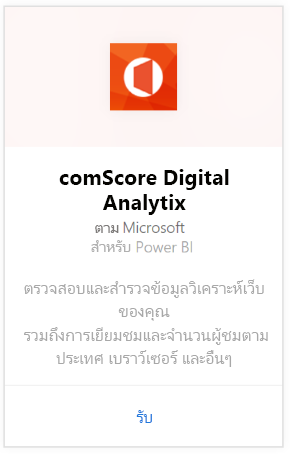
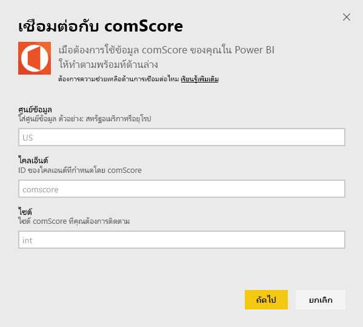
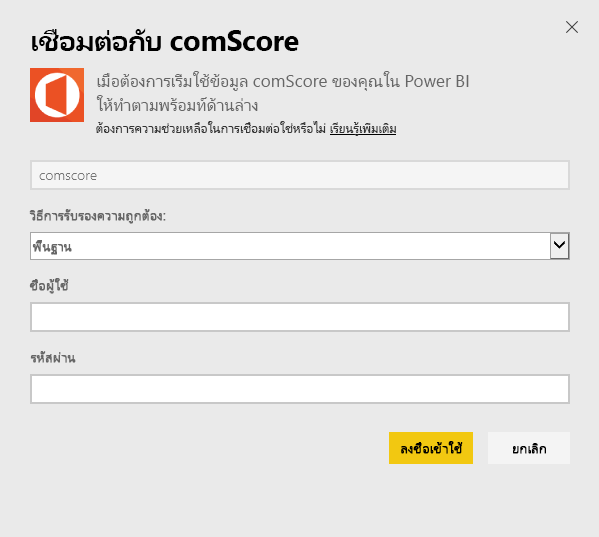
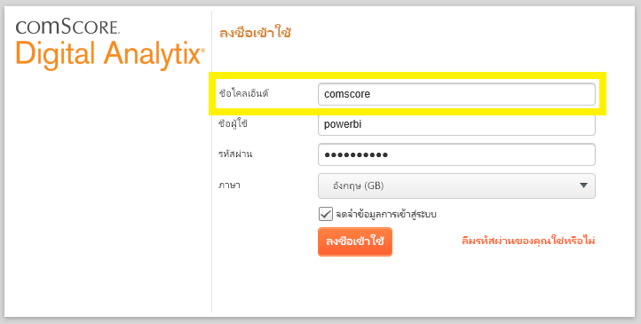
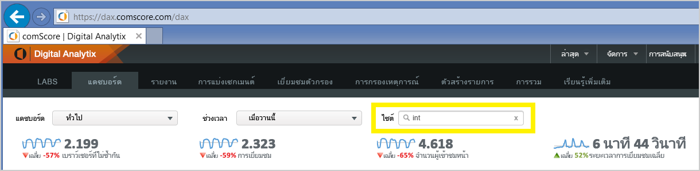

# เชื่อมต่อกับ comScore Digital Analytix ด้วย Power BI
ดูภาพและสำรวจข้อมูล comScore Digital Analytix ของคุณใน Power BI ด้วยชุดเนื้อหา Power BI ข้อมูลจะรีเฟรชโดยอัตโนมัติหนึ่งครั้งต่อวัน

เชื่อมต่อกับ[ชุดเนื้อหา comScore สำหรับ Power BI](https://app.powerbi.com/getdata/services/comscore)

>[!NOTE]
>เมื่อต้องการเชื่อมต่อกับชุดเนื้อหา คุณต้องมีบัญชีผู้ใช้ comScore DAx และสามารถเข้าถึง comScore API ได้ [รายละเอียด](#Requirements)เพิ่มเติมที่ด้านล่าง

## วิธีการเชื่อมต่อ
1. เลือกรับข้อมูลที่ด้านล่างของพื้นที่นำทางด้านซ้ายมือ
   
   
2. ในกล่อง**บริการ** เลือก**รับ**
   
   
3. เลือก**comScore Digital Analytix** \> **รับ**
   
   
4. ระบุศูนย์ข้อมูล comScore Client ID และไซต์ที่คุณต้องการเชื่อมต่อ สำหรับรายละเอียดเพิ่มเติมเกี่ยวกับวิธีการค้นหาค่าเหล่านี้ โปรดดู[ค้นหาพารามิเตอร์ comScore ของคุณ](#FindingParams)ที่ด้านล่าง
   
   
5. ใส่ชื่อผู้ใช้และรหัสผ่าน comScore ของคุณเพื่อเชื่อมต่อ ดูรายละเอียดการค้นพบนี้ที่ค่าด้านล่างนี้
   
   
6. กระบวนการนำเข้าจะเริ่มโดยอัตโนมัติ เมื่อเสร็จสิ้น แดชบอร์ดใหม่ รายงาน และแบบจำลองจะปรากฏในบานหน้าต่างนำทาง เลือกแดชบอร์ดเพื่อดูข้อมูลที่นำเข้าของคุณ

**ฉันต้องทำอะไรต่อ?**

* ลอง[ถามคำถามในกล่องถามตอบ](power-bi-q-and-a.md)ที่ด้านบนของแดชบอร์ด
* [เปลี่ยนไทล์](service-dashboard-edit-tile.md)ในแดชบอร์ด
* [เลือกไทล์](service-dashboard-tiles.md)เพื่อเปิดรายงานพื้นฐาน
* ถึงแม้ว่าชุดข้อมูลของคุณถูกกำหนดให้รีเฟรซรายวัน คุณสามารถเปลี่ยนแปลงกำหนดเวลารีเฟรช หรือลองรีเฟรชตามความต้องการ โดยใช้**รีเฟรชทันที**

## ข้อกำหนดของระบบ
ในการเชื่อมต่อ จำเป็นต้องมีบัญชีผู้ใช้ของ DAx comScore และการเข้าใช้งาน comScore DAx API โปรดติดต่อผู้ดูแลระบบ DAx comScore ของคุณเพื่อยืนยันบัญชีของคุณ

## การค้นหาพารามิเตอร์
รายละเอียดเกี่ยวกับวิธีการค้นหาแต่ละพารามิเตอร์ comScore มีอยู่ที่ด้านล่าง

**ศูนย์ข้อมูล**

ในศูนย์ข้อมูลที่คุณเชื่อมต่อจะกำหนด โดย URL ที่คุณนำทางไปใน comScore

ถ้าคุณใช้ https://dax.comscore.com ใส่ "สหรัฐอเมริกา" ถ้าคุณใช้ https://dax.comscore.eu ใส่ "EU"

 

**ไคลเอ็นต์**

ไคลเอ็นต์จะเหมือนกันกับที่คุณกรอกเมื่อลงชื่อเข้าใช้ comScore DAx

 

**ไซต์**

ไซต์ comScore จะกำหนดว่าไซต์ใดที่คุณต้องการดูข้อมูล คุณสามารถค้นหารายการของไซต์จากบัญชี comScore ของคุณ

## ขั้นตอนถัดไป
[เริ่มต้นใช้งานใน Power BI](service-get-started.md)

[รับข้อมูลใน Power BI](service-get-data.md)

