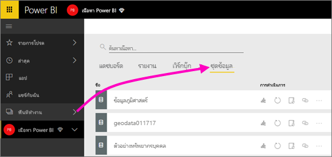

# เชื่อมต่อกับไฟล์ที่จัดเก็บใน OneDrive สำหรับพื้นที่ทำงานของแอป Power BI
หลังจากที่คุณได้[สร้างพื้นที่ทำงานของแอปใน Power BI](service-create-distribute-apps.md)คุณสามารถจัดเก็บ Excel, CSV และไฟล์ Power BI Desktop ของคุณบน OneDrive for Business สำหรับพื้นที่ทำงานแอป Power BI ของคุณ คุณสามารถปรับปรุงแฟ้มที่คุณเก็บไว้ใน OneDrive การอัปเดตเหล่านั้นมีผลในรายงาน Power BI และแดชบอร์ดที่ยึดตามไฟล์เหล่านั้นโดยอัตโนมัติ 

> [!NOTE]
> ประสบการณ์พื้นที่ทำงานใหม่จะเปลี่ยนความสัมพันธ์ระหว่างพื้นที่ทำงาน Power BI และกลุ่ม Office 365 คุณจะไม่สามารถสร้างกลุ่ม Office 365 โดยอัตโนมัติทุกครั้งที่คุณสร้างพื้นที่ทำงานใหม่ อ่านเกี่ยวกับ [สร้างพื้นที่ทำงานใหม่](service-create-the-new-workspaces.md)

เพิ่มไฟล์ลงในพื้นที่ทำงานของแอปเป็นกระบวนการสองขั้นตอน 

1. ก่อนอื่นคุณ[อัปโหลดไฟล์ไปยัง OneDrive for Business](service-connect-to-files-in-app-workspace-onedrive-for-business.md#1-upload-files-to-the-onedrive-for-business-for-your-app-workspace)สำหรับพื้นที่ทำงานของแอป
2. แล้วคุณ[เชื่อมต่อกับไฟล์เหล่านั้นจาก Power BI](service-connect-to-files-in-app-workspace-onedrive-for-business.md#2-import-excel-files-as-datasets-or-as-excel-online-workbooks)

> [!NOTE]
> พื้นที่ทำงานของแอปใช้ได้กับ[Power BI Pro](service-features-license-type.md)
> 

## อัปโหลดไฟล์ไปยัง OneDrive for Business สำหรับพื้นที่ทำงานของแอป
1. ใน Power BI service เลือกลูกศรอยู่ถัดจากพื้นที่ทำงาน > เลือกจุดไข่ปลา ( **...** ) ถัดจากชื่อพื้นที่ทำงานของคุณ 
   
   
2. เลือก**ไฟล์**เพื่อเปิด OneDrive for Business สำหรับพื้นที่ทำงานของแอปบน Office 365
   
   > [!NOTE]
   > ถ้าคุณไม่เห็น**ไฟล์**บนเมนูพื้นที่ทำงานแอป ให้เลือก**สมาชิก**เพื่อเปิด OneDrive for Business สำหรับพื้นที่ทำงานของแอป ที่นั่น เลือก**ไฟล์** Office 365 ตั้งค่าตำแหน่งที่เก็บข้อมูล OneDrive สำหรับไฟล์พื้นที่ทำงานของกลุ่มของแอปของคุณ กระบวนการนี้อาจใช้เวลาสักครู่ 
   > 
   > 
3. ที่นี่ คุณอัปโหลดไฟล์ไปยัง OneDrive for Businessสำหรับพื้นที่ทำงานของแอป เลือก**อัปโหลด**และนำทางไปยังไฟล์ของคุณ
   
   

## 2 นำเข้าไฟล์ Excel ในฐานะชุดข้อมูลหรือในฐานะสมุดงาน Excel Online
ขณะนี้ไฟล์ของคุณอยู่ใน OneDrive for Business สำหรับพื้นที่ทำงานของแอป คุณมีตัวเลือก คุณสามารถ 

* [นำเข้าข้อมูลจากเวิร์กบุ๊ก Excel เป็นชุดข้อมูล](service-get-data-from-files.md) จากนั้นใช้ข้อมูลเพื่อสร้างรายงานและแดชบอร์ดที่คุณสามารถดูในเว็บเบราว์เซอร์ และบนอุปกรณ์มือถือ
* หรือ[เชื่อมต่อกับเวิร์กบุ๊ก Excel เต็มใน Power BI](service-excel-workbook-files.md)และแสดงไว้เหมือนกับที่จะปรากฏขึ้นใน Excel Online

### นำเข้า หรือเชื่อมต่อกับไฟล์ในพื้นที่ทำงานของแอป
1. ใน Power BI สลับไปยังพื้นที่ทำงานของแอป ดังนั้นชื่อพื้นที่ทำงานแอปที่อยู่ตรงมุมบนซ้าย 
2. เลือกปุ่ม**รับข้อมูล**ที่ด้านล่างของพื้นที่นำทางด้านซ้ายมือ 
   
   
3. ในกล่อง**ไฟล์** เลือก**รับ**
   
   
4. เลือก**OneDrive** - *ชื่อพื้นที่ทำงานของแอปของคุณ*
   
    
5. เลือกไฟล์คุณต้อง > **เชื่อมต่อ**
   
    ในจุดนี้คุณตัดสินใจว่า จะ[นำเข้าข้อมูลจากสมุดงาน Excel](service-get-data-from-files.md)หรือ[เชื่อมต่อไปยังเวิร์กบุ๊ก Excel ทั้งหมด](service-excel-workbook-files.md)
6. เลือก**นำเข้า**หรือ**เชื่อมต่อ**
   
    
7. ถ้าคุณเลือก**นำเข้า** แล้วเวิร์กบุ๊กปรากฏขึ้นบนแท็บ**ชุดข้อมูล** 
   
    
   
    ถ้าคุณเลือก**เชื่อมต่อ**แล้วเวิร์กบุ๊กอยู่บนแท็บ**สมุดงาน**
   
    

## ขั้นตอนถัดไป
* [สร้างแอปและพื้นที่ทำงานแอปใน Power BI](service-create-distribute-apps.md)
* [นำเข้าข้อมูลจากเวิร์กบุ๊ก Excel](service-get-data-from-files.md)
* [เชื่อมต่อไปยังเวิร์กบุ๊ก Excel ทั้งหมด](service-excel-workbook-files.md)
* มีคำถามเพิ่มเติมหรือไม่ [ลองไปที่ชุมชน Power BI](http://community.powerbi.com/)
* มีคำติชมหรือไม่ เยี่ยมชม[แนวคิด Power BI](https://ideas.powerbi.com/forums/265200-power-bi)

