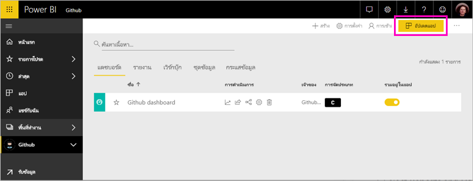

# เชื่อมต่อกับ GitHub ด้วย Power BI
บทความนี้จะแนะนำคุณในการดึงข้อมูลของคุณจากบัญชี GitHub ของคุณด้วยแอปเทมเพลตของ Power BI template แอปเทมเพลตจะสร้างพื้นที่ทำงานที่มีแดชบอร์ด ชุดรายงาน และชุดข้อมูลที่จะช่วยให้คุณสามารถสำรวจข้อมูลบน GitHub ของคุณได้ แอป GitHub สำหรับ Power BI แสดงข้อมูลเชิงลึกในที่ข้อมูลจัดเก็บของ GitHub หรือที่เรียกว่า repo กับข้อมูล การจัดสรร ปัญหา คำขอการดึง และผู้ใช้ที่ใช้งานอยู่

หลังจากที่คุณได้ติดตั้งแอปแบบเทมเพลตแล้ว คุณสามารถเปลี่ยนแดชบอร์ดและรายงานได้ จากนั้นคุณสามารถเผยแพร่เป็นแอปไปยังเพื่อนร่วมงานในองค์กรของคุณได้

เชื่อมต่อไปยัง[แอปเทมเพลต GitHub ](https://app.powerbi.com/groups/me/getapps/services/pbi-contentpacks.pbiapps-github)หรืออ่านเพิ่มเติมเกี่ยวกับการ[รวม GitHub ](https://powerbi.microsoft.com/integrations/github)กับ Power BI

คุณยังสามารถลองใช้[บทช่วยสอน GitHub](service-tutorial-connect-to-github.md) ได้ ซึ่งติดตั้งข้อมูล GitHub ที่แท้จริงเกี่ยวกับ repo สาธารณะสำหรับเอกสาร Power BI

>[!NOTE]
>แอปเทมเพลตนี้จำเป็นต้องมีบัญชีผู้ใช้ GitHub ที่สามารถเข้าถึง repo ได้ รายละเอียดเพิ่มเติมเกี่ยวกับข้อกำหนดด้านล่าง

## วิธีการเชื่อมต่อ
[!INCLUDE [powerbi-service-apps-get-more-apps](./includes/powerbi-service-apps-get-more-apps.md)]
   
3. เลือก **GitHub** \> **รับทันที**
4. ใน **ติดตั้งแอป Power BI นี้หรือไม่** เลือก **ติดตั้ง**
4. ในบานหน้าต่าง **แอป** เลือกไทล์ **GitHub**

    

6. ใน**เริ่มต้นใช้งานแอปใหม่ของคุณ** ให้เลือก**เชื่อมต่อข้อมูล**

    

5. ป้อนชื่อที่เก็บและเจ้าของที่เก็บ Repo ดูรายละเอียดที่ [การค้นหาพารามิเตอร์เหล่านี้](#FindingParams) ด้านล่าง
   
    

5. ใส่ข้อมูลประจำตัว GitHub ของคุณ (คุณอาจข้ามขั้นตอนนี้ ถ้าคุณได้ลงชื่อเข้าใช้ด้วยเบราว์เซอร์ของคุณอยู่แล้ว) 
6. สำหรับ **วิธีการรับรองความถูกต้อง** ให้เลือก **oAuth2** \> **ลงชื่อเข้าใช้** 
7. ทำตามหน้าจอการรับรองความถูกต้องของ GitHub ให้สิทธิ์ GitHub เพื่อขออนุญาตจากแอปเทมเพลต Power BI ไปยังข้อมูล GitHub
   
   
   
    Power BI เชื่อมต่อกับ GitHub และข้อมูลของคุณ  ข้อมูลจะถูกรีเฟรชวันละหนึ่งครั้ง หลังจากที่ Power BI นำเข้าข้อมูลแล้ว คุณจะเห็นเนื้อหาของพื้นที่ทำงาน GitHub ใหม่ของคุณ

## ปรับเปลี่ยนและเผยแพร่แอปของคุณ

คุณได้ติดตั้งแอปเทมเพลต GitHub ซึ่งหมายความว่าคุณยังได้สร้างพื้นที่ทำงานของแอป GitHub อีกด้วย ในพื้นที่ทำงาน คุณสามารถเปลี่ยนรายงานและแดชบอร์ด จากนั้นเผยแพร่เป็น*แอป*ไปยังเพื่อนร่วมงานในองค์กรของคุณได้ 

1. เลือกลูกศรที่อยู่ถัดจากชื่อพื้นที่ทำงานในแถบนำทางด้านซ้าย คุณเห็นพื้นที่ทำงานประกอบด้วยแดชบอร์ดและรายงาน

    

8. เลือก[แดชบอร์ด GitHub ](https://powerbi.microsoft.com/integrations/github)ใหม่    
    

3. หากต้องการดูเนื้อหาทั้งหมดของพื้นที่ทำงาน GitHub ใหม่ของคุณในแถบการนำทางด้านซ้าย เลือก **พื้นที่ทำงาน** > **GitHub**
 
   

    มุมมองนี้เป็นรายการเนื้อหาสำหรับพื้นที่ทำงาน ที่มุมบนขวา คุณจะเห็น **อัปเดตแอป** เมื่อคุณพร้อมที่จะเผยแพร่แอปของคุณไปยังเพื่อนร่วมงานของคุณ นั่นคือที่ที่คุณจะเริ่มต้น 

    

2. เลือก **รายงาน** และ **ชุดข้อมูล** เพื่อดูองค์ประกอบอื่น ๆ ในพื้นที่ทำงาน

    อ่านเกี่ยวกับ [การเผยแพร่แอป](service-create-distribute-apps.md) ให้เพื่อนร่วมงานของคุณ

## มีอะไรรวมอยู่ในแอปบ้าง
ข้อมูลต่อไปนี้จะพร้อมใช้งานจาก GitHub ใน Power BI     

| ชื่อตาราง | คำอธิบาย |
| --- | --- |
| การสนับสนุน |ตารางจัดสรรให้ ผลรวม การเพิ่มเติม การลบและการกระทำที่อนุญาตโดยผู้ให้การสนับสนุนที่เพิ่มแต่ละสัปดาห์ ผู้สนับสนุน 100 อันดับแรกถูกรวมไว้ |
| ปัญหา |รายการปัญหาทั้งหมดสำหรับ repo ที่เลือก และประกอบด้วยการคำนวณเช่นเวลาเฉลี่ยและเวลารวมเพื่อปิดข้อปัญหา รวมปัญหาที่เปิด รวมปัญหาที่ปิด ตารางนี้จะว่างเปล่าเมื่อไม่มีปัญหาใน repo |
| คำขอดึงข้อมูล |ตารางนี้ประกอบด้วย Pull Requests ทั้งหมดดึงของ repo และบุคคลที่ขอดึง ซึ่งยังประกอบด้วยคำนวณ จำนวน Pull Requests เปิด ปิด และจำนวนรวม ระยะเวลาของ Pull Requests และระยะเวลาค่าเฉลี่ยของ Pull Requests ตารางนี้จะว่างเปล่าเมื่อไม่มีปัญหาใน repo |
| ผู้ใช้ |ตารางนี้แสดงรายการของผู้ใช้ GitHub หรือผู้ให้การสนับสนุนที่ได้ทำการจัดสรร ที่เก็บข้อมูลปัญหา หรือได้รับการแก้ไข Pull Requests ของ repo ที่เลือก |
| หลักเป้าหมาย |มีเหตุการณ์สำคัญทั้งหมดสำหรับ repo ที่เลือก |
| DateTable |ตารางนี้ประกอบด้วยวันที่จากวันนี้ และปีในอดีตที่ช่วยให้คุณสามารถวิเคราะห์ข้อมูล GitHub ของคุณตามวัน |
| ContributionPunchCard |ตารางนี้สามารถใช้เป็นการ์ดความสามารถจัดสรรสำหรับ repo ที่เลือก ซึ่งแสดงยอมรับ โดยวันของสัปดาห์และชั่วโมงของวัน ตารางนี้ไม่ได้รับการเชื่อมต่อกับตารางอื่นในแบบจำลอง |
| RepoDetails |ตารางนี้มีรายละเอียดสำหรับ repo ที่เลือก |

## ความต้องการของระบบ
* บัญชีผู้ใช้ GitHub ที่มีสิทธิ์เข้าถึง repo  
* สิทธิ์ที่มอบให้กับ Power BI สำหรับแอป GitHub ในระหว่างการเข้าสู่ระบบครั้งแรก ดูรายละเอียดด้านล่างในการยกเลิกการเข้าถึง  
* มีการเรียกใช้ API เพียงพอที่สามารถดึงและรีเฟรชข้อมูล  

### ยกเลิกอนุญาต Power BI
เมื่อต้องการยกเลิกอนุญาต Power BI เนื่องจากได้เชื่อมต่อกับ GitHub repo ของคุณ คุณสามารถยกเลิกการเข้าถึงใน GitHub ดูหัวข้อ[ความช่วยเหลือ GitHub](https://help.github.com/articles/keeping-your-ssh-keys-and-application-access-tokens-safe/#reviewing-your-authorized-applications-oauth) สำหรับรายละเอียด

## การค้นหาพารามิเตอร์
คุณสามารถกำหนดเจ้าของและที่เก็บ โดยด repo ใน GitHub เอง

ส่วนแรกของ "Azure" คือเจ้าของ และส่วนสอง "azure-sdk-for-php" เป็นส่วนเก็บข้อมูล  คุณเห็นสิ่งเหล่านี้เหมือนกันสองรายการใน URL repo

    <https://github.com/Azure/azure-sdk-for-php> .

## การแก้ไขปัญหา
ถ้าจำเป็น คุณสามารถตรวจสอบข้อมูลประจำตัว GitHub ของคุณ  

1. ในหน้าต่างเบราว์เซอร์อื่น ไปที่เว็บไซต์ GitHub และเข้าสู่ระบบ GitHub คุณสามารถเห็นว่าคุณกำลังเข้าสู่ระบบ ที่มุมขวาบนของไซต์ GitHub    
2. ใน GitHub นำทางไปยัง URL ของ repo ที่คุณวางแผนที่จะเข้าถึงใน Power BI ตัวอย่างเช่น: https://github.com/dotnet/corefx  
3. กลับไปที่ Power BI ลองเชื่อมต่อกับ GitHub ในกล่องโต้ตอบการกำหนดค่า GitHub ให้ใช้ชื่อของ repo และเจ้าของ repo สำหรับ repo ที่เดียวกัน  

## ขั้นตอนถัดไป

* [บทช่วยสอน: เชื่อมต่อกับ GitHub repo ด้วย Power BI](service-tutorial-connect-to-github.md)
* [สร้างพื้นที่ทำงานใหม่ใน Power BI](service-create-the-new-workspaces.md)
* [ติดตั้งและใช้แอปฯใน Power BI](consumer/end-user-apps.md)
* [เชื่อมต่อกับแอป Power BI สำหรับบริการภายนอก](service-connect-to-services.md)
* มีคำถามหรือไม่ [ลองถามชุมชน Power BI](http://community.powerbi.com/)

