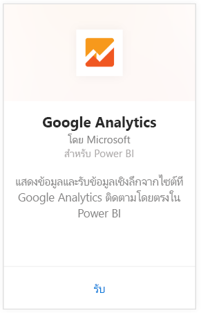
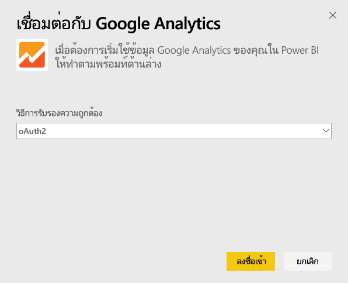
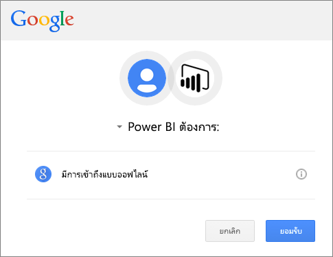
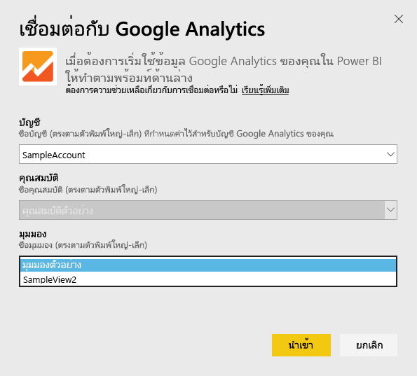
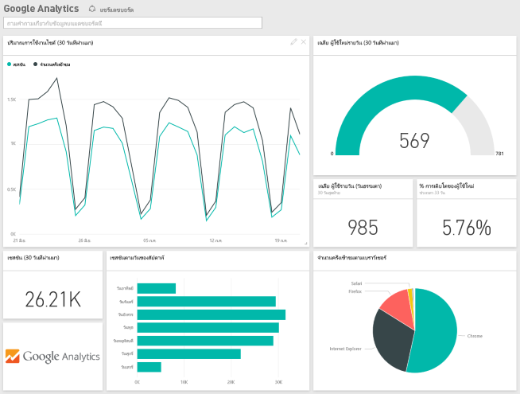
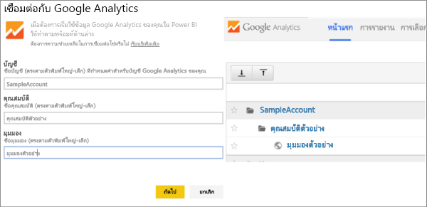

# เชื่อมต่อกับ Google Analytics ด้วย Power BI
การเชื่อมต่อกับ Google Analytics ผ่าน Power BI เริ่มต้นโดยการเชื่อมต่อกับบัญชี Google Analytics ของคุณ คุณจะได้รับแดชบอร์ด Power BI และชุดของรายงาน Power BI ซึ่งจะให้ข้อมูลเชิงลึกเกี่ยวกับปริมาณการรับส่งข้อมูลและขนาดของผู้ใช้ในไซต์ของคุณ คุณสามารถโต้ตอบกับแดชบอร์ดและรายงานได้ แต่คุณไม่สามารถบันทึกการเปลี่ยนแปลงได้ ข้อมูลจะรีเฟรชโดยอัตโนมัติหนึ่งครั้งต่อวัน

เชื่อมต่อกับ [Google Analytics](https://app.powerbi.com/getdata/services/google-analytics) ด้วย Power BI อ่านเพิ่มเติมเกี่ยวกับ[การรวม Google Analytics](https://powerbi.microsoft.com/integrations/google-analytics)ด้วย Power BI

คุณสามารถสร้างแดชบอร์ดและรายงานแบบกำหนดเองได้ โดยเริ่มต้นจาก[ตัวเชื่อมต่อ Google Analytics](service-google-analytics-connector.md)ใน Power BI Desktop เพียงเชื่อมต่อกับบัญชี Google Analytics ของคุณและสร้างรายงานแบบกำหนดเอง ซึ่งคุณสามารถเผยแพร่ไปยังบริการ Power BI ได้

## วิธีการเชื่อมต่อ
[!INCLUDE [powerbi-service-apps-get-more-apps](./includes/powerbi-service-apps-get-more-apps.md)]

3. เลือก**Google Analytics** \> **รับ**
   
   
4. เมื่อได้รับข้อความปรากฏ ให้ใส่ข้อมูลประจำตัว Google Analytics ของคุณ เลือก**oAuth 2**เป็นกลไกการรับรองความถูกต้อง แล้วคลิก**ลงชื่อเข้าใช้** ทำตามขั้นตอนการรับรองความถูกต้อง Google ซึ่งอาจรวมถึงการรับรองความถูกต้อง 2 ปัจจัยถ้าคุณได้กำหนดค่าไว้
   
   
5. คลิก**ยอมรับ**เพื่ออนุญาตให้ Power BI เข้าถึงข้อมูล Google Analytics ของคุณ
   
   
6. Power BI เชื่อมต่อไปยังมุมมองการวิเคราะห์ Google ที่เฉพาะเจาะจง เลือกชื่อบัญชี ชื่อคุณสมบัติ และชื่อมุมมองที่คุณต้องการเชื่อมต่อ ข้อมูลนี้สามารถพบได้ในบัญชี Google Analytics ของคุณที่ด้านบนซ้าย หรือที่แท็บ**หน้าหลัก** ดูรายละเอียดด้านล่าง 
   
   
5. คลิก **เชื่อมต่อ** เพื่อเริ่มกระบวนการนำเข้า 

## ดูแดชบอร์ดและรายงาน Google Analytics
[!INCLUDE [powerbi-service-apps-open-app](./includes/powerbi-service-apps-open-app.md)]

   

[!INCLUDE [powerbi-service-apps-open-app](./includes/powerbi-service-apps-what-now.md)]

## ข้อกำหนดของระบบ
ในการเชื่อมต่อจาก Power BI คุณจำเป็นต้องมีบัญชี[Google Analytics](https://www.google.com/analytics/) หากใช้บัญชีผู้ใช้ Google อื่น ๆ ที่ไม่มีการเชื่อมต่อกับบัญชี Google Analytics คุณจะเห็นข้อผิดพลาดการรับรองความถูกต้อง

## การแก้ไขปัญหา
**ข้อมูลประจำตัว** ถ้าคุณมีบัญชี Google หลายบัญชี โปรดใช้หน้าต่างเบราเซอร์ที่ไม่เผยร่องรอยหรือเบราเซอร์ส่วนตัวในระหว่างการเชื่อมต่อ เพื่อให้แน่ใจว่าใช้บัญชีที่ถูกต้อง

ถ้าคุณได้รับข้อผิดพลาดที่ระบุว่าข้อมูลประจำตัวของคุณไม่ถูกต้อง แต่คุณสามารถลงชื่อเข้าใช้ลงใน Google ได้ โปรดยืนยันว่าคุณมีบัญชี[Google Analytics](https://www.google.com/analytics/)

**พารามิเตอร์**ปัจจุบันต้องมีชื่อที่ไม่ซ้ำกันสำหรับพารามิเตอร์ ถ้าคุณเห็นข้อผิดพลาดที่ระบุว่าค่าที่คุณเลือกนั้นเป็นค่าซ้ำ กรุณาเลือกค่าอื่น หรือเปลี่ยนชื่อใน Google Analytics เพื่อทำให้ไม่ซ้ำกัน เราได้ทำงานอย่างหนักเพื่อปรับปรุงส่วนนี้

>[!NOTE]
>พารามิเตอร์ไวต่ออักษรตัวใหญ่-ตัวเล็ก ให้ใส่พารามิเตอร์อย่างถูกต้องดังที่ปรากฏในบัญชี Google Analytics ของคุณ

ยังพบปัญหาอยู่ใช่หรือไม่? เปิดตั๋วการสนับสนุนเพื่อติดต่อทีม Power BI:

* ขณะที่อยู่ในแอปฯ Power BI เลือกเครื่องหมายคำถาม\> **ติดต่อฝ่ายสนับสนุน**
* จากไซต์ Power BI สนับสนุน (ตำแหน่งที่คุณกำลังอ่านบทความนี้), เลือก**ติดต่อฝ่ายสนับสนุน**ทางด้านขวาของหน้า

## ขั้นตอนถัดไป
* [แอป Power BI คืออะไร](service-create-distribute-apps.md)
* [รับข้อมูลใน Power BI](service-get-data.md)
* มีคำถามเพิ่มเติมหรือไม่ [ลองถามชุมชน Power BI](http://community.powerbi.com/)

