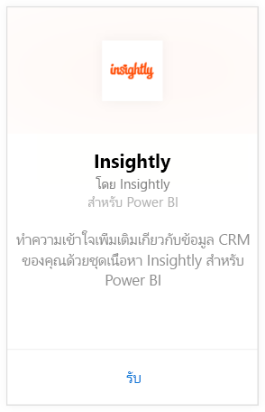
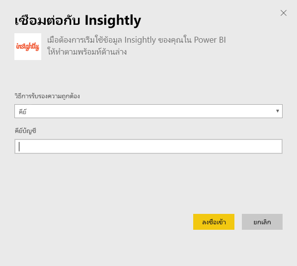
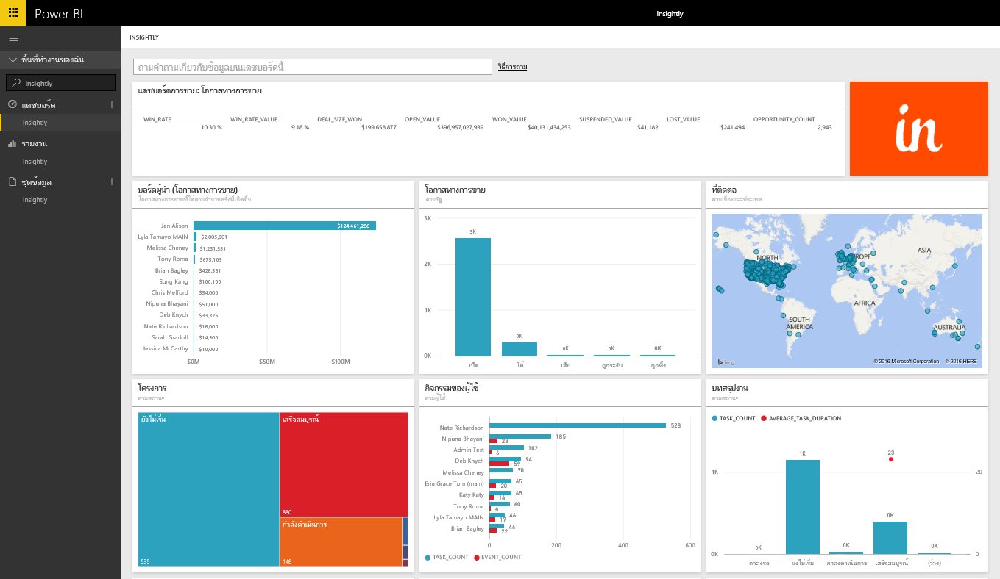
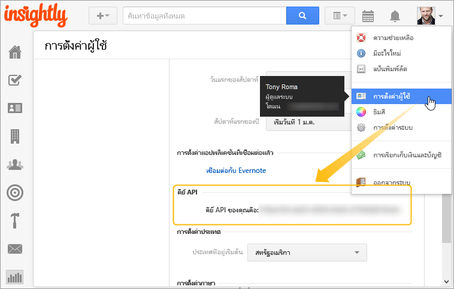

# เชื่อมต่อกับ Insightly ด้วย Power BI
แสดงข้อมูลเป็นภาพและแชร์ข้อมูล Insightly CRM ของคุณใน Power BI ด้วยชุดเนื้อหา Insightly เชื่อมต่อกับ Power BI โดยใช้คีย์ Insightly API ของคุณเพื่อดูและสร้างรายงานและแดชบอร์ดจากข้อมูล CRM ของคุณ ด้วย Power BI คุณสามารถวิเคราะห์ข้อมูลของคุณในรูปแบบใหม่ สร้างแผนภูมิและกราฟอันทรงพลัง และแสดงรายชื่อผู้ติดต่อ ลูกค้าเป้าหมาย และองค์กรต่าง ๆ บนแผนที่ได้

[!INCLUDE [include-short-name](./includes/service-deprecate-content-packs.md)]

เชื่อมต่อไปยัง[ชุดเนื้อหา Insightly](https://app.powerbi.com/getdata/services/insightly)สำหรับ Power BI

## วิธีการเชื่อมต่อ
1. เลือกปุ่ม**รับข้อมูล**ที่ด้านล่างของพื้นที่นำทางด้านซ้ายมือ
   
   
2. ในกล่อง**บริการ** เลือก**รับ**
   
   
3. เลือก**Insightly** \> **รับ**
   
   
4. เลือก**คีย์**เป็นประเภทการรับรองความถูกต้อง และใส่คีย์ Insight API ของคุณ จากนั้นเลือก**ลงชื่อเข้าใช้** ดูรายละเอียดที่[การค้นหานี้](#FindingParams)ที่ด้านล่าง
   
   
5. หลังจากอนุมัติ กระบวนการนำเข้าจะเริ่มโดยอัตโนมัติ เมื่อเสร็จสิ้น แดชบอร์ดใหม่ รายงาน และแบบจำลองจะปรากฏในบานหน้าต่างนำทาง เลือกแดชบอร์ดเพื่อดูข้อมูลที่นำเข้าของคุณ
   
     

**ฉันต้องทำอะไรตอนนี้**

* ลอง[ถามคำถามในกล่อง Q&A](consumer/end-user-q-and-a.md)ที่ด้านบนของแดชบอร์ด
* [เปลี่ยนไทล์](service-dashboard-edit-tile.md)ในแดชบอร์ด
* [เลือกไทล์](consumer/end-user-tiles.md)เพื่อเปิดรายงานด้านใน
* แม้ว่าชุดข้อมูลของคุณจะถูกกำหนดให้รีเฟรชรายวัน แต่คุณสามารถเปลี่ยนกำหนดการรีเฟรช หรือลองรีเฟรชตามความต้องการได้โดยใช้**รีเฟรชเดี๋ยวนี้**

## มีอะไรรวมอยู่บ้าง
ชุดเนื้อหานี้ประกอบด้วยตารางต่อไปนี้ ที่มีเขตข้อมูลจากบันทึกที่สอดคล้องกัน:

| ตาราง |  |  |  |
| --- | --- | --- | --- |
| รายชื่อติดต่อ |โอกาสทางการขาย |ขั้นตอนไปป์ไลน์ |วันที่งานเสร็จสมบูรณ์ |
| เขตข้อมูลแบบกำหนดเอง |วันปิดโอกาสทางการขาย |วันที่โครงการเสร็จสมบูรณ์ |งาน |
| เหตุการณ์ |วันคาดการณ์โอกาสทางการขาย |โครงการ |ทีม/สมาชิก |
| ลูกค้าเป้าหมาย |องค์กร |แท็ก |ผู้ใช้ |

นอกจากนี้ ตารางและรายงานจำนวนมากยังรวมถึงเขตข้อมูลจากการคำนวณที่ไม่ซ้ำกัน เช่น:  

* ตารางที่มีวันที่ปิดการคาดการณ์โอกาส "แบบรวมกลุ่ม" วันที่ปิดโอกาสการขายจริง วันที่เสร็จสิ้นโครงการ และวันที่งานเสร็จสิ้นสำหรับการวิเคราะห์แยกตามเดือน ไตรมาส หรือปี  
* เขตข้อมูลค่าถ่วงน้ำหนักสำหรับโอกาสทางการขาย (ค่าโอกาส * ความน่าเป็นในการชนะการขาย)  
* เขตข้อมูลระยะเวลาเฉลี่ยและระยะเวลารวมสำหรับงาน ยึดเริ่มต้นวันที่เริ่มต้นและและวันที่งานเสร็จสมบูรณ์  
* รายงานที่มีเขตข้อมูลที่คำนวณสำหรับอัตราโอกาสชนะ (จำนวนการชนะ/จำนวนโอกาสทางการขายรวม) และค่าอัตราชนะ (ค่าของการชนะ/ค่าของโอกาสทางการขายรวม)  

## ข้อกำหนดของระบบ
จำเป็นต้องมีบัญชีผู้ใช้ Insightly พร้อมการเข้าถึง Insightly API ความสามารถในการมองเห็นสิทธิ์การใช้งานจะยึดตามคีย์ API ที่ใช้ในการสร้างการเชื่อมต่อกับ Power BI คุณจะสามารถมองเห็นบันทึก Insightly ได้ในรายงานและแดชบอร์ด Power BI ที่คุณแชร์กับผู้อื่น

## การค้นหาพารามิเตอร์
**คีย์ API**

เมื่อต้องการคัดลอกคีย์ API ของคุณจาก Insightly เลือกตั้งค่าผู้ใช้จากเมนูโปรไฟล์ Insightly แล้วเลื่อนลง สตริงนี้ของอักขระจะถูกใช้เพื่อเชื่อมต่อข้อมูลของคุณไปยัง Power BI

## การแก้ไขปัญหา
ระบบนำเข้าข้อมูลของคุณผ่านทาง Insightly API ซึ่งรวมถึงขีดจำกัดประจำวันโดยยึดตามระดับแผนการสมัครใช้งาน Insightly ของคุณ ขีดจำกัดจะแสดงอยู่ในส่วน ขีดจำกัดอัตรา/การควบคุมปริมาณคำขอ ของเอกสาร API ของเรา: https://api.insight.ly/v2.2/Help#!/Overview/Introduction#ratelimit

รายงานที่ให้ไว้ใช้เขตข้อมูลค่าเริ่มต้นจาก Insightly และอาจไม่รวมค่าที่กำหนดเองของคุณ แก้ไขรายงานเพื่อดูเขตข้อมูลที่พร้อมใช้งานทั้งหมด

## ขั้นตอนถัดไป
[เริ่มต้นใช้งานใน Power BI](service-get-started.md)

[รับข้อมูลใน Power BI](service-get-data.md)

