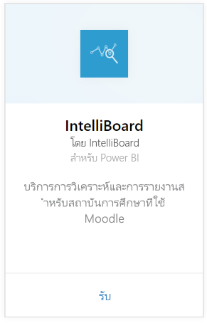
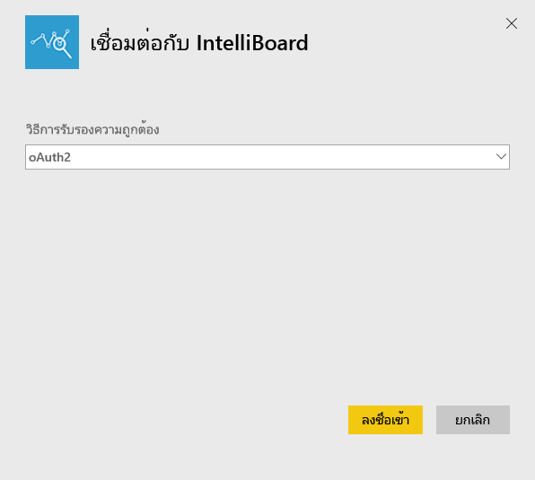
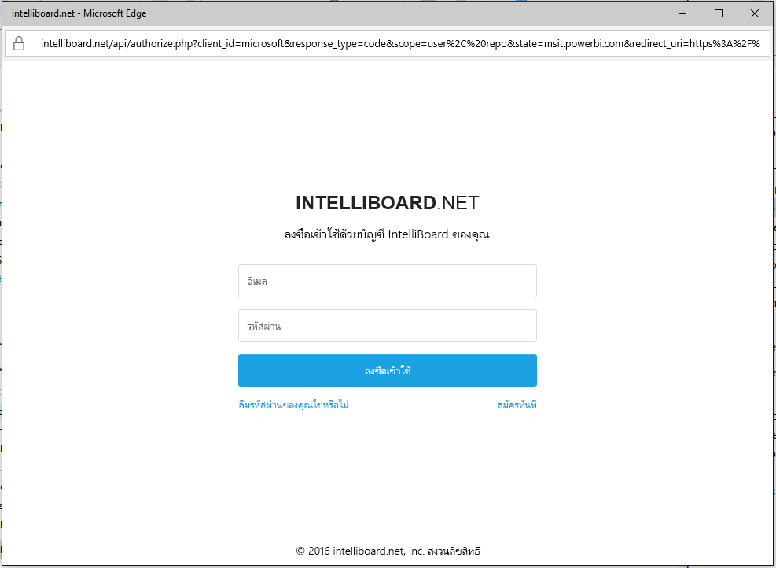
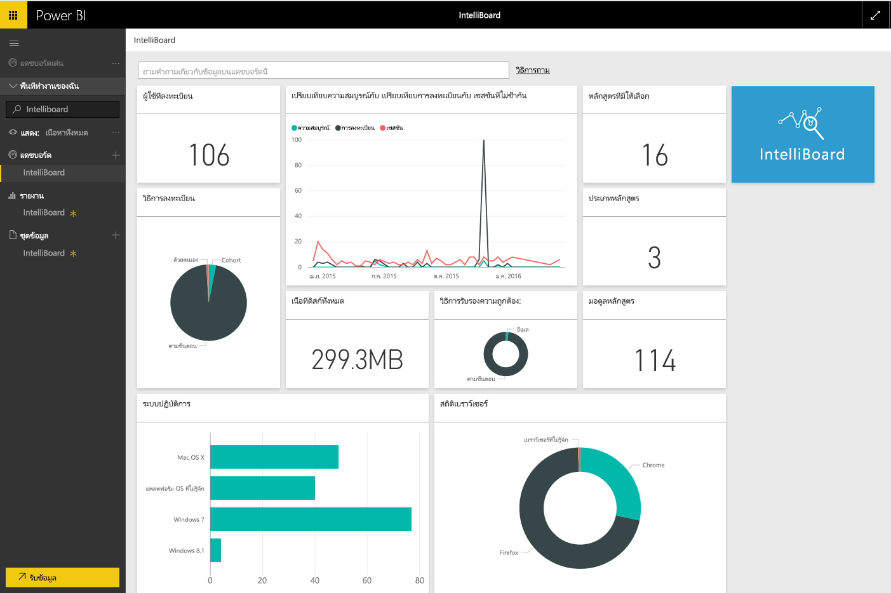

# เชื่อมต่อกับ IntelliBoard ด้วย Power BI
IntelliBoard เสนอการเข้าใช้งานข้อมูลระบบการจัดการการเรียนรู้ Moodle ที่ใช้งานง่ายผ่านบริการการรายงาน ชุดเนื้อหา IntelliBoard สำหรับ Power BI นำเสนอการวิเคราะห์เพิ่มเติม รวมถึงการวัดในหลักสูตรของคุณ ผู้ใช้ที่ลงทะเบียน ประสิทธิภาพการทำงานโดยรวม และกิจกรรม LMS ของคุณ

เชื่อมต่อไปยัง[ชุดเนื้อหา IntelliBoard](https://app.powerbi.com/getdata/services/intelliboard) สำหรับ Power BI

## วิธีการเชื่อมต่อ
1. เลือก**รับข้อมูล**ที่ด้านล่างของแผงนำทางด้านซ้ายมือ  
   
    
2. ในกล่อง**บริการ** เลือก**รับ**  
   
    
3. เลือก**IntelliBoard** จากนั้นเลือก**รับ**  
   
    
4. เลือก**OAuth 2**แล้วเลือก**ลงชื่อเข้าใช้** เมื่อได้รับข้อความปรากฏ ใส่ข้อมูลประจำตัว IntelliBoard ของคุณ
   
    
   
    
5. เมื่อเชื่อมต่อแล้ว แดชบอร์ด รายงาน และชุดข้อมูลจะโหลดโดยอัตโนมัติสามารถ เมื่อเสร็จสมบูรณ์ ไทล์ที่จะอัปเดตด้วยข้อมูลจากบัญชี IntelliBoard ของคุณ
   
    

**ฉันต้องทำอะไรต่อ?**

* ลอง[ถามคำถามในกล่องถามตอบ](power-bi-q-and-a.md)ที่ด้านบนของแดชบอร์ด
* [เปลี่ยนไทล์](service-dashboard-edit-tile.md)ในแดชบอร์ด
* [เลือกไทล์](service-dashboard-tiles.md)เพื่อเปิดรายงานพื้นฐาน
* ถึงแม้ว่าชุดข้อมูลของคุณถูกกำหนดให้รีเฟรซรายวัน คุณสามารถเปลี่ยนแปลงกำหนดเวลารีเฟรช หรือลองรีเฟรชตามความต้องการ โดยใช้**รีเฟรชทันที**

## มีอะไรรวมอยู่บ้าง
ชุดเนื้อหานี้ประกอบด้วยข้อมูลจากตารางต่อไปนี้:  

    - กิจกรรม  
    - ตัวแทน  
    - รับรอง  
    - ประเทศ  
    - CoursesProgress  
    - การลงทะเบียน
    - ภาษา  
    - แพลตฟอร์ม  
    - ผลรวม  
    - UsersProgress    

## ข้อกำหนดของระบบ
จำเป็นต้องมีบัญชี IntelliBoard ที่มีสิทธิ์การใช้งานตารางข้างต้นเพื่อสร้างตัวอย่างประกอบชุดเนื้อหานี้

## ขั้นตอนถัดไป
[เริ่มต้นใช้งาน Power BI](service-get-started.md)

[Power BI - แนวคิดพื้นฐาน](service-basic-concepts.md)

