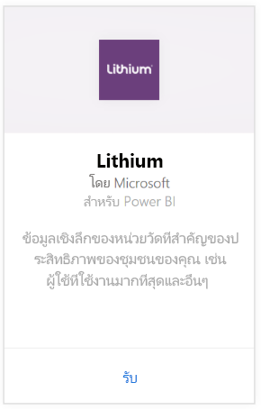
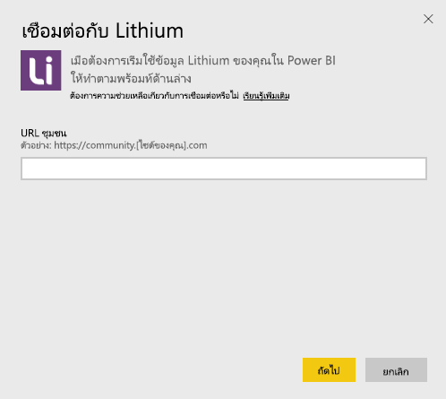
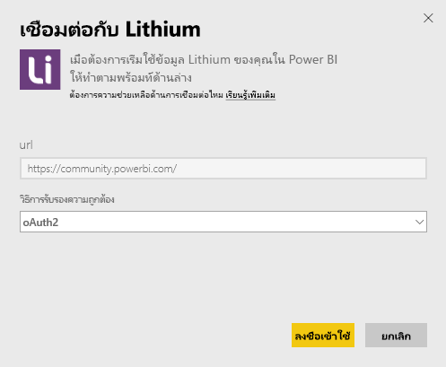
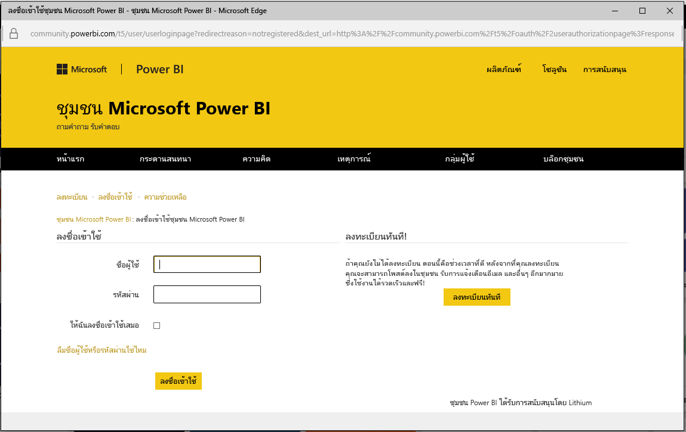
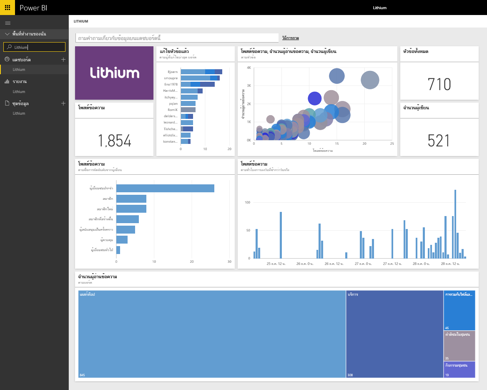

# เชื่อมต่อกับ Lithium ด้วย Power BI

Lithium สร้างความสัมพันธ์ที่น่าเชื่อถือระหว่างแบรนด์ที่ดีที่สุดในโลกกับลูกค้าของตน ช่วยให้ผู้คนได้รับคำตอบสำหรับคำถามและแชร์ประสบการณ์การใช้งานของตน ด้วยการเชื่อมต่อชุดเนื้อหา Lithium ไปยัง Power BI คุณสามารถวัดหน่วยวัดหลักเกี่ยวกับชุมชนออนไลน์ของคุณได้ เพื่อช่วยขับเคลื่อนการขาย ลดต้นทุนการบริการ และเพิ่มความซื่อสัตย์ต่อแบรนด์ 

[!INCLUDE [include-short-name](./includes/service-deprecate-content-packs.md)]

เชื่อมต่อไปยัง[ชุดเนื้อหา Lithium](https://app.powerbi.com/getdata/services/lithium) สำหรับ Power BI

>[!NOTE]
>ชุดเนื้อหา Power BI ใช้ Lithium API การเรียกใช้ API มากเกินไปอาจมีค่าธรรมเนียมเพิ่มเติมจาก Lithium โปรดตรวจสอบกับผู้ดูแลระบบ Lithium ของคุณ

## วิธีการเชื่อมต่อ
1. เลือกปุ่ม**รับข้อมูล**ที่ด้านล่างของพื้นที่นำทางด้านซ้ายมือ
   
    
2. ในกล่อง**บริการ** เลือก**รับ**
   
    
3. เลือก**Lithium** \> **รับ**
   
   
4. ใส่ URL ของชุมชน Lithium ของคุณ ซึ่งจะอยู่ในรูปแบบ *https://community.yoursite.com*
   
   
5. เมื่อมีข้อความปรากฏ ใส่ข้อมูลประจำตัวของ Lithium เลือก**oAuth 2**เป็นกลไกการรับรองความถูกต้อง แล้วคลิก**ลงชื่อเข้าใช้**และทำตามขั้นตอนการรับรองความถูกต้อง Lithium
   
   
   
   
6. เมื่อขั้นตอนการเข้าสู่ระบบเสร็จสมบูรณ์ ระบบจะเริ่มกระบวนการนำเข้า เมื่อเสร็จสิ้น แดชบอร์ดใหม่ รายงาน และแบบจำลองจะปรากฏในบานหน้าต่างนำทาง เลือกแดชบอร์ดเพื่อดูข้อมูลที่นำเข้าของคุณ
   
    

**ฉันต้องทำอะไรตอนนี้**

* ลอง[ถามคำถามในกล่อง Q&A](consumer/end-user-q-and-a.md)ที่ด้านบนของแดชบอร์ด
* [เปลี่ยนไทล์](service-dashboard-edit-tile.md)ในแดชบอร์ด
* [เลือกไทล์](consumer/end-user-tiles.md)เพื่อเปิดรายงานด้านใน
* แม้ว่าชุดข้อมูลของคุณจะถูกกำหนดให้รีเฟรชรายวัน แต่คุณสามารถเปลี่ยนกำหนดการรีเฟรช หรือลองรีเฟรชตามความต้องการได้โดยใช้**รีเฟรชเดี๋ยวนี้**

## ความต้องการของระบบ
ชุดเนื้อหา Lithium ต้องมีชุมชน Lithium v15.9 หรือเวอร์ชันสูงกว่า โปรดตรวจสอบกับผู้ดูแลระบบ Lithium ของคุณเพื่อยืนยัน

## ขั้นตอนถัดไป
[Power BI คืออะไร](power-bi-overview.md)

[แนวคิดพื้นฐานสำหรับนักออกแบบในบริการ Power BI](service-basic-concepts.md)

