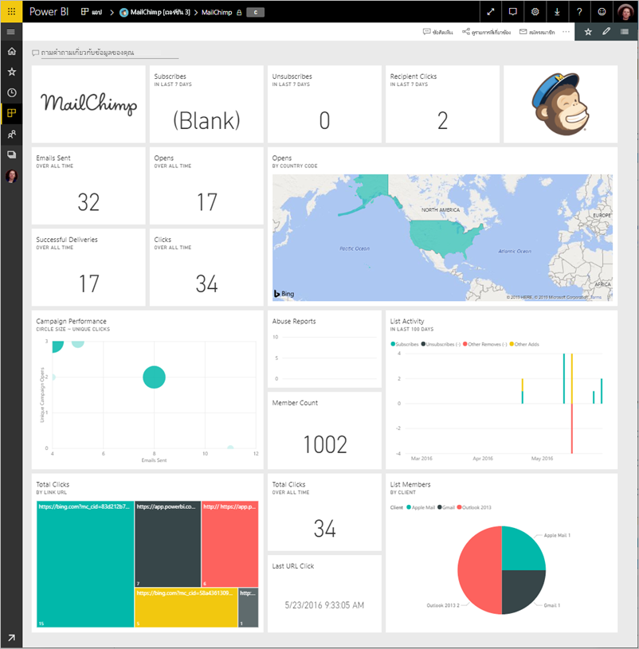
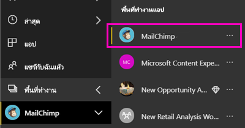
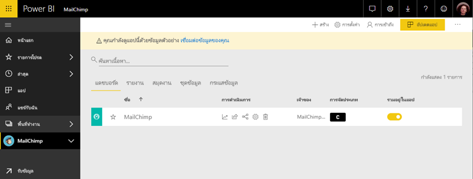

# เชื่อมต่อกับ MailChimp ด้วย Power BI
บทความนี้แนะนำคุณเกี่ยวกับการดึงข้อมูลของคุณจากบัญชี MailChimp ของคุณด้วยแอเทมเพลต Power BI แอปเทมเพลสร้างพื้นที่ทำงานกับแดชบอร์ด ชุดของรายงาน และชุดข้อมูลเพื่อให้คุณสามารถสำรวจข้อมูล MailChimp ของคุณ ดึงการวิเคราะห์เพื่อสร้าง[แดชบอร์ด MailChimp](https://powerbi.microsoft.com/integrations/mailchimp)และระบุแนวโน้มภายในของการส่งเสริมการขาย รายงาน และผู้สมัครใช้งานแต่ละรายการของคุณได้อย่างรวดเร็ว การรีเฟรชข้อมูลรายวัน แน่ใจว่า คุณกำลังตรวจสอบข้อมูลอยู่เสมอ

หลังจากที่คุณติดตั้งแอปเทมเพล คุณสามารถเปลี่ยนแดชบอร์ดและรายงาน จากนั้น คุณสามารถแจกจ่ายเป็นแอปให้เพื่อนร่วมงานในองค์กรของคุณ

เชื่อมต่อไปยัง[MailChimp เทมเพลแอ](https://app.powerbi.com/getdata/services/mailchimp)สำหรับ Power BI

## วิธีการเชื่อมต่อ

[!INCLUDE [powerbi-service-apps-get-more-apps](./includes/powerbi-service-apps-get-more-apps.md)]

3. เลือก**MailChimp** \> **รับทันที**
4. ใน**ติดตั้งแอป Power BI นี้ใช่ไหม**เลือก**ติดตั้ง**
4. ในการ**แอ**บานหน้าต่าง เลือกแบบ**MailChimp**ไทล์

    

6. ใน**เริ่มต้นใช้งานแอปของคุณใหม่**เลือก**เชื่อมต่อข้อมูล**

    

1. สำหรับวิธีการรับรองความถูกต้อง ให้เลือก **oAuth2** \> **ลงชื่อเข้าใช้**
   
    เมื่อถูกถาม ให้ใส่ข้อมูลประจำตัว MailChimp ของคุณและทำตามกระบวนการรับรองตัวตน
   
    ในครั้งแรกที่คุณเชื่อมต่อ Power BI จะปรากฏข้อความให้คุณอนุญาตให้เข้าถึงแบบอ่านอย่างเดียวสำหรับบัญชีของคุณ เลือก**อนุญาต**เพื่อเริ่มกระบวนการนำเข้า อาจใช้เวลาสักครู่ ขึ้นอยู่กับปริมาณของข้อมูลในบัญชีของคุณ
   
    

5. หลังจาก Power BI นำเข้าข้อมูล แดชบอร์ด MailChimp เปิดขึ้น
   
    

## ปรับเปลี่ยน และแจกจ่ายแอปของคุณ

คุณได้ติดตั้งแอปเทมเพล MailChimp ซึ่งหมายความว่า คุณจะสร้างพื้นที่ทำงานแอ MailChimp ในพื้นที่ทำงาน คุณสามารถเปลี่ยนรายงานและแดชบอร์ด และแจกจ่ายเป็นแอ*แอ*ให้เพื่อนร่วมงานในองค์กรของคุณได้ 

1. เมื่อต้องดูเนื้อหาทั้งหมดของ MailChimp พื้นที่ทำงานใหม่ ในแถบนำทางด้านซ้าย เลือก**พื้นที่ทำงาน** > **MailChimp** 

    

    มุมมองนี้คือ รายการเนื้อหาสำหรับพื้นที่ทำงาน ในมุมขวาบน คุณเห็น**อัปเดตแอปฯ** เมื่อคุณพร้อมที่จะแจกจ่ายแอปของคุณให้เพื่อนร่วมงานของคุณ ที่อยู่ที่คุณจะเริ่มต้น

    

2. เลือก**รายงาน**และ**ชุดข้อมูล**เพื่อดูองค์ประกอบอื่น ๆ ในพื้นที่ทำงาน 

    อ่านเกี่ยวกับ[แจกจ่ายแอ](service-create-distribute-apps.md)ให้เพื่อนร่วมงานของคุณ

## ขั้นตอนถัดไป

* [สร้างพื้นที่ทำงานใหม่ใน Power BI](service-create-the-new-workspaces.md)
* [ติดตั้งและใช้แอปฯใน Power BI](consumer/end-user-apps.md)
* [แอป Power BI สำหรับบริการภายนอก](service-connect-to-services.md)
* มีคำถามหรือไม่ [ลองถามชุมชน Power BI](http://community.powerbi.com/)

