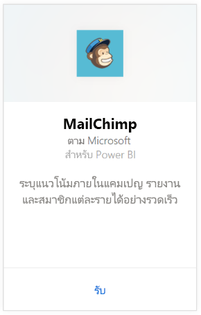
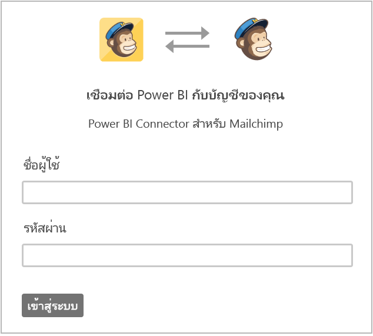
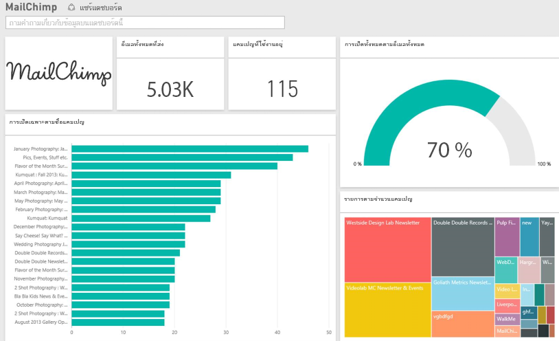

# เชื่อมต่อกับ MailChimp ด้วย Power BI
ชุดเนื้อหา Power BI จะดึงข้อมูลจากบัญชี MailChimp ของคุณและสร้างแดชบอร์ด ชุดรายงาน และชุดข้อมูล เพื่อให้คุณสามารถสำรวจข้อมูลของคุณได้ ดึงการวิเคราะห์เพื่อสร้าง[แดชบอร์ด MailChimp](https://powerbi.microsoft.com/integrations/mailchimp)และระบุแนวโน้มภายในของการส่งเสริมการขาย รายงาน และผู้สมัครใช้งานแต่ละรายการของคุณได้อย่างรวดเร็ว ข้อมูลจะถูกตั้งค่าการรีเฟรชเป็นรีเฟรชทุกวัน เพื่อแน่ใจว่าข้อมูลที่คุณกำลังตรวจติดตามอัปเดตแล้ว

เชื่อมต่อกับ[ชุดเนื้อหา MailChimp ](https://app.powerbi.com/getdata/services/mailchimp)สำหรับ Power BI

## วิธีการเชื่อมต่อ
1. เลือกปุ่ม**รับข้อมูล**ที่ด้านล่างของพื้นที่นำทางด้านซ้ายมือ
   
    
2. ในกล่อง**บริการ** เลือก**รับ**
   
   
3. เลือก**MailChimp** \> **รับ**
   
   
4. สำหรับวิธีการรับรองความถูกต้อง ให้เลือก **oAuth2** \> **ลงชื่อเข้าใช้**
   
    เมื่อถูกถาม ให้ใส่ข้อมูลประจำตัว MailChimp ของคุณและทำตามกระบวนการรับรองตัวตน
   
    ในครั้งแรกที่คุณเชื่อมต่อ จะปรากฏข้อความให้คุณอนุญาต Power BI ให้เข้าถึงบัญชีของคุณแบบอ่านอย่างเดียว เลือก**อนุญาต**เพื่อเริ่มกระบวนการนำเข้า ซึ่งอาจใช้เวลาสักครู่ทั้งนี้ขึ้นอยู่กับปริมาณของข้อมูลในบัญชีของคุณ
   
    
5. หลังจากที่ Power BI นำเข้าข้อมูลแล้ว คุณจะเห็นแดชบอร์ด รายงาน และชุดข้อมูลใหม่ ในบานหน้าต่างนำทางด้านซ้ายมือ นี่คือแดชบอร์ดตามเริ่มต้นที่ Power BI สร้างขึ้นเพื่อแสดงข้อมูลของคุณ คุณสามารถปรับเปลี่ยนแดชบอร์ดนี้เพื่อแสดงข้อมูลของคุณด้วยวิธีใดก็ตามที่คุณต้องการ
   
   

**ฉันต้องทำอะไรตอนนี้**

* ลอง[ถามคำถามในกล่อง Q&A](power-bi-q-and-a.md)ที่ด้านบนของแดชบอร์ด
* [เปลี่ยนไทล์](service-dashboard-edit-tile.md)ในแดชบอร์ด
* [เลือกไทล์](service-dashboard-tiles.md)เพื่อเปิดรายงานด้านใน
* ถึงแม้ว่าชุดข้อมูลของคุณถูกกำหนดให้รีเฟรซรายวัน คุณสามารถเปลี่ยนแปลงกำหนดเวลารีเฟรช หรือลองรีเฟรชตามความต้องการ โดยใช้**รีเฟรชทันที**

## ขั้นตอนถัดไป
[เริ่มต้นใช้งาน Power BI](service-get-started.md)

[Power BI แนวคิดพื้นฐาน](service-basic-concepts.md)

