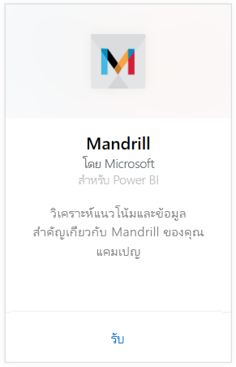
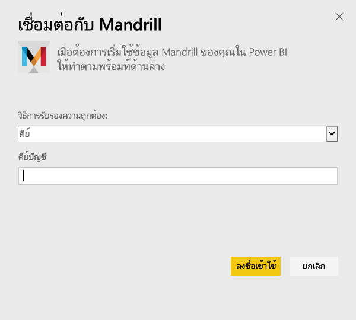
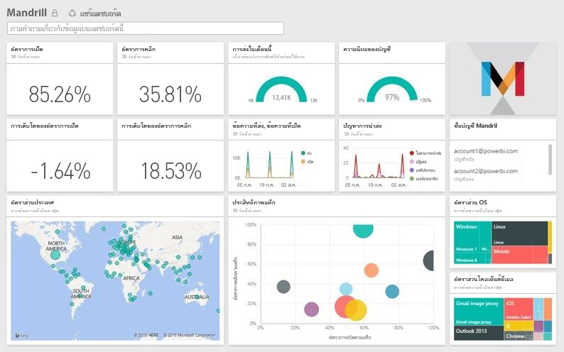

# เชื่อมต่อกับ Mandrill ด้วย Power BI
ชุดเนื้อหา Power BI จะดึงข้อมูลจากบัญชี Mandrill ของคุณและสร้างแดชบอร์ด ชุดรายงาน และชุดข้อมูล เพื่อให้คุณสามารถสำรวจข้อมูลของคุณได้ ใช้การวิเคราะห์ของ Mandrill เพื่อรับข้อมูลเชิงลึกลงในจดหมายข่าวหรือแคมเปญการตลาดของคุณได้อย่างรวดเร็ว ข้อมูลจะถูกตั้งค่าการรีเฟรชเป็นรีเฟรชทุกวัน เพื่อแน่ใจว่าข้อมูลที่คุณกำลังตรวจติดตามอัปเดตแล้ว

เชื่อมต่อไปยัง[ชุดเนื้อหา Mandrill](http://app.powerbi.com/getdata/services/mandrill) สำหรับ Power BI

## วิธีการเชื่อมต่อ
1. เลือก**รับข้อมูล**ที่ด้านล่างของแผงนำทางด้านซ้ายมือ
   
    
2. ในกล่อง**บริการ** เลือก**รับ**
   
    
3. เลือก**Mandrill** > **รับ**
   
    
4. สำหรับ**วิธีการรับรองความถูกต้อง**เลือก**คีย์**และใส่คีย์ API ของคุณ คุณสามารถค้นหาคีย์บนแท็บ**ตั้งค่า**ของแดชบอร์ด Mandrill ได้ เลือก**ลงชื่อเข้าใช้**เพื่อเริ่มกระบวนการนำเข้า ซึ่งอาจใช้เวลาสักครู่ทั้งนี้ขึ้นอยู่กับปริมาณของข้อมูลในบัญชีของคุณ
   
    
5. หลังจาก Power BI นำเข้าข้อมูล คุณจะเห็นแดชบอร์ด รายงาน และชุดข้อมูลใหม่ในแผงนำทางด้านซ้าย นี่คือแดชบอร์ดตามเริ่มต้นที่ Power BI สร้างขึ้นเพื่อแสดงข้อมูลของคุณ
   
    

**ฉันต้องทำอะไรต่อ?**

* ลอง[ถามคำถามในกล่องถามตอบ](power-bi-q-and-a.md)ที่ด้านบนของแดชบอร์ด
* [เปลี่ยนไทล์](service-dashboard-edit-tile.md)ในแดชบอร์ด
* [เลือกไทล์](service-dashboard-tiles.md)เพื่อเปิดรายงานพื้นฐาน
* ถึงแม้ว่าชุดข้อมูลของคุณถูกกำหนดให้รีเฟรซรายวัน คุณสามารถเปลี่ยนแปลงกำหนดเวลารีเฟรช หรือลองรีเฟรชตามความต้องการ โดยใช้**รีเฟรชทันที**

## ขั้นตอนถัดไป
[เริ่มต้นใช้งาน Power BI](service-get-started.md)

[Power BI - แนวคิดพื้นฐาน](service-basic-concepts.md)

