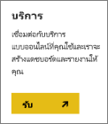
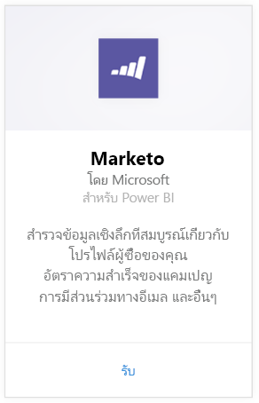
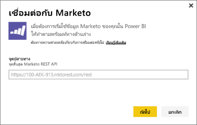
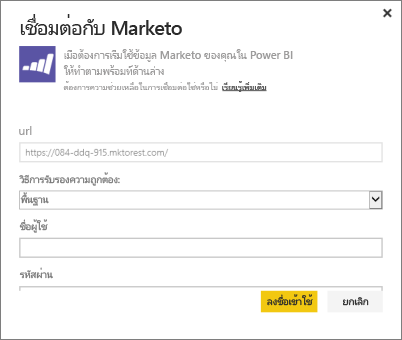
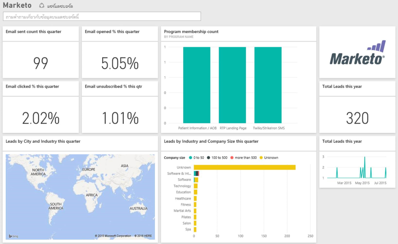

# เชื่อมต่อกับ Marketo ด้วย Power BI
ชุดเนื้อหา Power BI สำหรับ Marketo ช่วยคุณรับข้อมูลเชิงลึกลงในบัญชี Marketo ของคุณได้ด้วยข้อมูลสำหรับลูกค้าเป้าหมายและกิจกรรมของพวกลูกค้าเป้าหมายเหล่านี้ การสร้างการเชื่อมต่อนี้จะดึงข้อมูลของคุณและให้แดชบอร์ดและรายงานที่เกี่ยวข้องที่ยึดตามข้อมูลนั้นโดยอัตโนมัติ

เชื่อมต่อไปยัง[ชุดเนื้อหา Marketo](https://app.powerbi.com/getdata/services/marketo)สำหรับ Power BI

## วิธีการเชื่อมต่อ
1. เลือก**รับข้อมูล**ที่ด้านล่างของแผงนำทางด้านซ้ายมือ
   
   
2. ในกล่อง**บริการ** เลือก**รับ**
   
    
3. เลือก**Marketo** \> **รับ**
   
   
4. ใส่จุดสิ้นสุด Marketo REST ที่กำหนดให้กับคุณโดย Marketo หรือผู้ดูแลระบบ Marketo ของคุณ และเลือกถัดไป
   
   
   
   อ่านเพิ่มเติมเกี่ยวกับจุดสิ้นสุด Marketo REST: [http://developers.marketo.com/documentation/rest/endpoint-url/ ](http://developers.marketo.com/documentation/rest/endpoint-url/)
5. การใช้วิธีการรับรองความถูก**พื้นฐาน** ให้ป้อน Client ID (รหัสไคลเอ็นต์) เป็น**ชื่อผู้ใช้**และ Client Secret (ความลับของไคลเอ็นต์) เป็น**รหัสผ่าน** Client ID และ Client Secret จะพร้อมใช้งานใน Marketo หรือจากผู้ดูแลระบบ Marketo ของคุณ ([http://developers.marketo.com/documentation/rest/custom-service/](http://developers.marketo.com/documentation/rest/custom-service/)) 
   
   
   
   ซึ่งนี่ช่วยให้ชุดเนื้อหา *Marketo สำหรับ Power BI*เข้าถึงข้อมูล[การวิเคราะห์ Marketo](https://powerbi.microsoft.com/integrations/marketo)ของคุณ และช่วยให้คุณสามารถวิเคราะห์ข้อมูลใน Power BI ข้อมูลจะถูกรีเฟรชวันละหนึ่งครั้ง
6. เมื่อเชื่อมต่อกับบัญชี Marketo ของคุณระบบจะโหลดแดชบอร์ดพร้อมข้อมูลทั้งหมดของคุณ:
   
   

**ฉันต้องทำอะไรต่อ?**

* ลอง[ถามคำถามในกล่องถามตอบ](power-bi-q-and-a.md)ที่ด้านบนของแดชบอร์ด
* [เปลี่ยนไทล์](service-dashboard-edit-tile.md)ในแดชบอร์ด
* [เลือกไทล์](service-dashboard-tiles.md)เพื่อเปิดรายงานพื้นฐาน
* ถึงแม้ว่าชุดข้อมูลของคุณถูกกำหนดให้รีเฟรซรายวัน คุณสามารถเปลี่ยนแปลงกำหนดเวลารีเฟรช หรือลองรีเฟรชตามความต้องการ โดยใช้**รีเฟรชทันที**

## มีอะไรรวมอยู่บ้าง
ข้อมูลต่อไปนี้จะพร้อมใช้งานจาก Marketo ใน Power BI ที่มีกิจกรรมที่เกิดขึ้นระหว่างวันนี้และหนึ่งปีที่ผ่านมา:

| ชื่อตาราง | คำอธิบาย |
| --- | --- |
| EmailActivities |ข้อมูลเกี่ยวกับอีเมลที่ส่งไปยังลูกค้าเป้าหมาย/รายชื่อติดต่ ที่มีรายละเอียดเกี่ยวกับอุปกรณ์ ประเภท เครื่องมือนับอีเมลย้อนกลับและเปอร์เซ็นต์ จำนวนที่คลิกและเปอร์เซ็นต์ จำนวนที่เปิดและเปอร์เซ็นต์ และชื่อโปรแกรม กิจกรรมอีเมลดังที่แสดงใน Power BI คือ ความสามารถสัมบูรณ์ในการส่งรายงาน ซึ่งไม่ได้ใช้ตรรกะเพิ่มเติมใดไปยังข้อมูล ด้วยเหตุนี้ คุณจึงอาจเห็นบางผลลัพธ์ที่แตกต่างระหว่างไคลเอ็นต์ Marketo และ Power BI |
| ProgramActivites |ข้อมูลในโปรแกรมที่มีการเปลี่ยนแปลงสถานะ ซึ่งรวมถึงรายละเอียดเช่น เหตุผล ความสำเร็จ จำนวนโปรแกรมที่ได้มาและเปอร์เซ็นต์ และจำนวนความสำเร็จโปรแกรมและเปอร์เซ็นต์ |
| WebPageActivities |ข้อมูลจากการที่ผู้ใช้เยี่ยมชมหน้าเว็บ รวมถึงตัวแทนการค้นหา ตัวแทนผู้ใช้ เว็บเพจ และจำนวนชั่วโมงของวัน |
| Datetable |วันที่จากวันนี้และปีที่ผ่านมา  ช่วยให้คุณสามารถวิเคราะห์ข้อมูล Marketo ของคุณแยกตามวัน |
| ลูกค้าเป้าหมาย |ข้อมูลลูกค้าเป้าหมาย เช่น บริษัท ขนาดรายได้ จำนวนพนักงาน ประเทศ อุตสาหกรรม คะแนนลูกค้าเป้าหมาย และสถานะลูกค้าเป้าหมาย ลูกค้าเป้าหมายจะถูกดึงขึ้นมาตามการปรากฏของลูกค้าในข้อมูลกิจกรรมอีเมล โปรแกรม และเว็บเพจ |

วันที่ทั้งหมดอยู่ใน UTC วันเปลี่ยนอาจเปลี่ยนแปลง (คล้ายกับที่เห็นในไคลเอ็นต์ Marketo) โดยขึ้นอยู่กับโซนเวลาที่บัญชีของคุณอยู่

## ข้อกำหนดของระบบ
* บัญชี Marketo ที่คุณใช้สำหรับการเชื่อมต่อมีสิทธิ์การเข้าถึงลูกค้าเป้าหมายและกิจกรรมต่าง ๆ
* การเรียกใช้ API ที่เพียงพอมีใช้งานในการเชื่อมต่อกับข้อมูล  Marketo มี API สำหรับแต่ละบัญชี  เมื่อถึงขีดจำกัด คุณจะไม่สามารถโหลดข้อมูลลงใน Power BI ได้อีกต่อไป 

**รายละเอียดขีดจำกัด API**

นำเข้าข้อมูลจาก Marketo โดยใช้ Marketo API ลูกค้าทุกคนของ Marketo มีขีดจำกัดรวมของการเรียกใช้ API ที่ 10,000 ต่อวัน ซึ่งเป็นการเรียกใช้ที่ใช้ร่วมกันระหว่างแอปพลิเคชันทั้งหมดที่ใช้ Marketo API คุณอาจใช้ API สำหรับการรวมกันอื่น ๆ ได้ เช่นเดียวกับการรวม Power BI สำหรับข้อมูลเพิ่มเติมเกี่ยวกับการ API ดูที่: <http://developers.marketo.com/documentation/rest/>

จำนวนการเรียกใช้ API Power BI ทำการ Marketo ขึ้นอยู่กับจำนวนข้อมูลในบัญชี Marketo ของคุณ Power BI นำเข้าลูกค้าเป้าหมายและกิจกรรมทั้งหมดสำหรับปีที่แล้ว นี่คือตัวอย่างของข้อมูลจาก Marketo และจำนวนการเรียกใช้ API ที่ใช้โดย Power BI เมื่อนำเข้า:  

| ชนิดข้อมูล | จำนวนแถว | เรียกใช้ API |
| --- | --- | --- |
| ข้อมูลลูกค้าเป้าหมาย |15,000 |50 |
| กิจกรรมการส่งอีเมล |150,000 |1,000 |
| กิจกรรมของโปรแกรม |15,000 |100 |
| กิจกรรมบนเว็บ |150,000 |1,000 |
| การเปลี่ยนแปลงโปรแกรม |7,500 |50 |
| **เรียกใช้ API ทั้งหมด** | |**2,200** |

## ขั้นตอนถัดไป
[เริ่มต้นใช้งาน Power BI](service-get-started.md)

[รับข้อมูลสำหรับ Power BI](service-get-data.md)

[บล็อก Power BI: ตรวจติดตามและวิเคราะห์ข้อมูล Marketo ของคุณด้วย Power BI](http://blogs.msdn.com/b/powerbi/archive/2015/03/19/monitor-and-analyze-your-marketo-data-with-power-bi.aspx)

