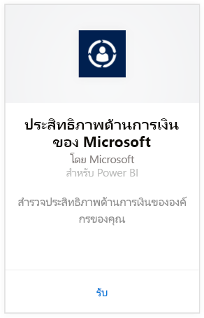
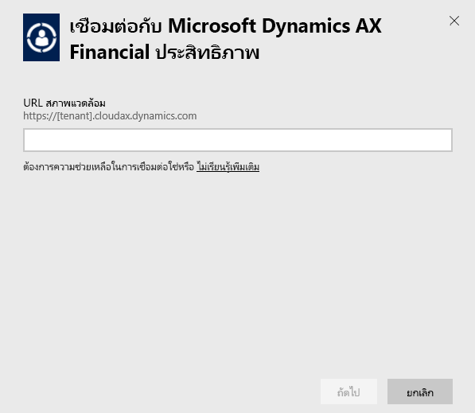
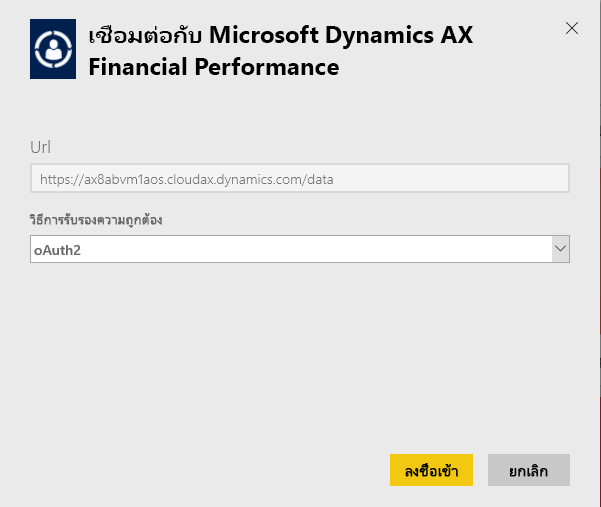
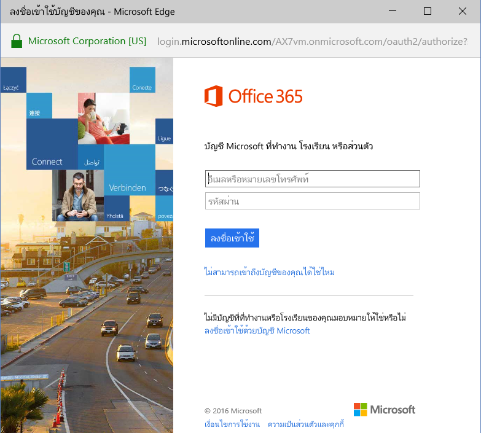
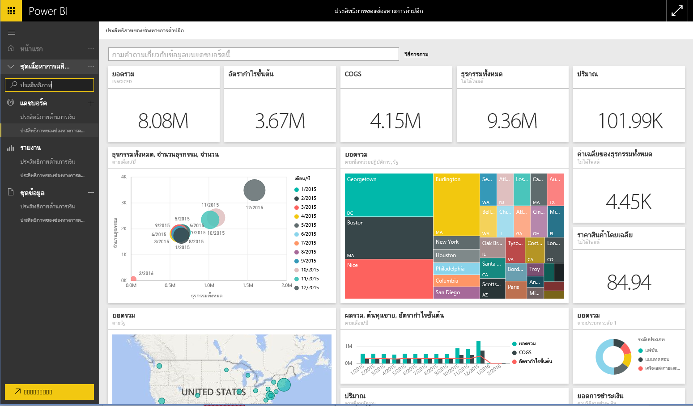

# เชื่อมต่อกับชุดเนื้อหา Microsoft Dynamics AX ด้วย Power BI
Microsoft Dynamics AX มีสามชุดเนื้อหา Power BI ที่วางเป้าหมายสำหรับผู้ใช้ทางธุรกิจที่แตกต่างกัน ชุดเนื้อหาสำหรับประสิทธิภาพการทำงานด้านการเงินออกแบบมาสำหรับ CFOs โดยเฉพาะ ส่งมอบเข้าใช้งานข้อมูลเชิงลึกเกี่ยวกับประสิทธิภาพการทำงานด้านการเงินขององค์กรของคุณ ชุดเนื้อหาประสิทธิภาพการทำงานแชนเนลร้านค้าปลีก มีเป้าหมายสำหรับผู้จัดการแชนเนลให้มุ่งเน้นที่ประสิทธิภาพการขายเพื่อพยากรณ์แนวโน้มและเปิดเผยข้อมูลเชิงลึก โดยวาดภาพได้โดยตรงจากข้อมูลร้านค้าปลีกและธุรกิจการค้า การจัดการต้นทุนได้รับการออกแบบมาสำหรับ COOs และ CFOs และให้รายละเอียดเกี่ยวกับประสิทธิภาพการดำเนินงาน

เชื่อมต่อกับชุดเนื้อหา Microsoft Dynamics AX [ประสิทธิภาพแชนเนลร้านค้าปลีก](https://app.powerbi.com/getdata/services/dynamics-ax-retail-channel-performance) [ประสิทธิภาพด้านการเงิน](https://app.powerbi.com/getdata/services/dynamics-ax-financial-performance)หรือ[การจัดการต้นทุน](https://app.powerbi.com/getdata/services/dynamics-ax-cost-management)สำหรับ Power BI

## วิธีการเชื่อมต่อ
1. เลือกปุ่ม**รับข้อมูล**ที่ด้านล่างของพื้นที่นำทางด้านซ้ายมือ
   
   
2. ในกล่อง**บริการ** เลือก**รับ**
   
   
3. เลือกหนึ่งในชุดเนื้อหา Dynamics AX แล้วเลือก**รับ**
   
   
4. ระบุ URL ของสภาพแวดล้อม Dynamics AX 7 ของคุณ ดูรายละเอียดที่ [การค้นหาพารามิเตอร์เหล่านั้น](#FindingParams) ที่ด้านล่าง
   
   
5. สำหรับ **วิธีการรับรองความถูกต้อง** ให้เลือก **oAuth2** \> **ลงชื่อเข้าใช้** เมื่อมีข้อความปรากฏ ใส่ข้อมูลประจำตัวของ Dynamics AX
   
    
   
    
6. หลังจากอนุมัติ กระบวนการนำเข้าจะเริ่มโดยอัตโนมัติ เมื่อเสร็จสิ้น แดชบอร์ดใหม่ รายงาน และแบบจำลองจะปรากฏในบานหน้าต่างนำทาง เลือกแดชบอร์ดเพื่อดูข้อมูลที่นำเข้าของคุณ
   
     

**ฉันต้องทำอะไรตอนนี้**

* ลอง[ถามคำถามในกล่อง Q&A](consumer/end-user-q-and-a.md)ที่ด้านบนของแดชบอร์ด
* [เปลี่ยนไทล์](service-dashboard-edit-tile.md)ในแดชบอร์ด
* [เลือกไทล์](consumer/end-user-tiles.md)เพื่อเปิดรายงานด้านใน
* แม้ว่าชุดข้อมูลของคุณจะถูกกำหนดให้รีเฟรชรายวัน แต่คุณสามารถเปลี่ยนกำหนดการรีเฟรช หรือลองรีเฟรชตามความต้องการได้โดยใช้**รีเฟรชเดี๋ยวนี้**

## มีอะไรรวมอยู่บ้าง
ชุดเนื้อหานี้ใช้ตัวดึงข้อมูล OData ของ Dynamics AX 7 เพื่อนำเข้าข้อมูลที่เกี่ยวข้องกับประสิทธิภาพแชนเนลร้านค้าปลีก การเงิน และการจัดการต้นทุน ตามลำดับ

## ข้อกำหนดของระบบ
ชุดเนื้อหานี้จำเป็นต้องใช้ URL ของสภาพแวดล้อม Dynamics AX 7 และผู้ใช้ควรมีสิทธิ์การเข้าถึงตัวดึงข้อมูล OData

## การค้นหาพารามิเตอร์

คุณสามารถพบ URL สภาพแวดล้อม Dynamics AX 7 ได้ในเบราว์เซอร์เมื่อผู้ใช้ลงชื่อเข้าใช้ เพียงแค่คัดลอก URL ของรากฐานสภาพแวดล้อม Dynamics AX ลงในกล่องโต้ตอบ Power BI

## การแก้ไขปัญหา
อาจใช้เวลาสักครู่ในการโหลดข้อมูล โดยขึ้นอยู่กับขนาดตัวอย่างของคุณ ถ้าคุณเห็นรายงานว่างเปล่าภายใน Power BI โปรดยืนยันว่าคุณมีสิทธิ์ในการเข้าใช้งานตาราง OData ที่จำเป็นสำหรับรายงาน

## ขั้นตอนถัดไป
[เริ่มต้นใช้งานใน Power BI](service-get-started.md)

[รับข้อมูลใน Power BI](service-get-data.md)

